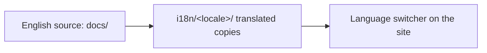

<LevelBadge level="intermediate" />

AILmanac es primero en inglés, pero **está construido para ser traducido** — así es como llega a "todo el mundo". Si quieres llevarlo a tu idioma, este es el camino.

## Cómo funciona la i18n aquí

El sitio usa la internacionalización integrada de Docusaurus. **El inglés es la fuente canónica.** Un idioma es un conjunto paralelo de archivos traducidos; Docusaurus muestra un selector de idioma una vez que se habilita un idioma.

## La regla de oro: hazte responsable antes de que lo publiquemos

:::warning Nada de traducciones a medias en producción
Un idioma solo se **habilita en producción una vez que alguien se compromete a mantenerlo.** Un idioma traducido al 30 % y desactualizado desde hace meses daña más la credibilidad que la ausencia de traducción. Es mejor traducir bien una *sección completa* que dispersar páginas parciales.
:::

## Cómo contribuir con una traducción

1. **Abre una incidencia** (usa la plantilla de *translation*) indicando qué idioma y qué sección vas a asumir.
2. **Traduce primero un bloque coherente** — por ejemplo, todo *Start Here* — no páginas al azar.
3. **Mantén sin cambios el código, los comandos y las fuentes de `VerifyNote`**; traduce la prosa, los encabezados y el texto de las admoniciones.
4. **No traduzcas los IDs de modelos ni los enlaces**; conserva las rutas `/docs/...` tal cual.
5. **Abre un PR.** Un responsable lo revisa y, una vez que un idioma tiene una persona responsable + una primera sección completa, lo habilitamos.

## Consejos

- **Usa Claude para hacer un borrador**, y luego que una persona con fluidez lo revise — la traducción por IA es un gran primer pase, no una autoridad final ([Alucinaciones](/docs/foundations/hallucinations) también aplican a la traducción).
- **Ajusta el nivel/tono** de la página en inglés.
- **Señala los términos intraducibles** (mantén "prompt", "token", etc. donde esa sea la norma en la comunidad técnica de tu idioma).

## Siguiente

- [Contribuye en 10 minutos](/docs/contribute/contribute-in-10-minutes)
- [Guía de estilo de contenido](/docs/contribute/style-guide)
- [Código de conducta y gobernanza](/docs/contribute/governance)
