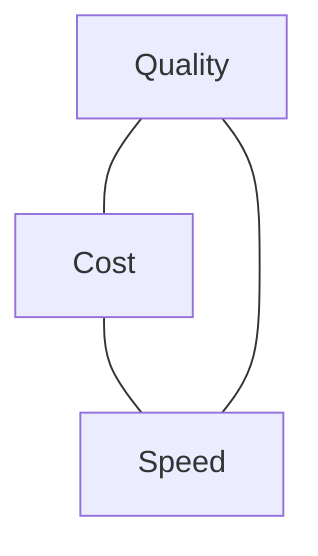

<LevelBadge level="intermediate" />

La calidad, el coste y la velocidad tiran unos contra otros. No puedes maximizar los tres a la vez — pero *sí puedes* gastar cada uno donde importa y ahorrar en todo lo demás.

## El triángulo

Un modelo más grande es más inteligente pero más lento y caro; uno más pequeño es rápido y barato pero menos capaz. La buena ingeniería consiste en **enrutar cada tarea al punto correcto** de este triángulo.

## Las mayores palancas (más o menos en orden)

1. **Ajusta el tamaño del modelo.** No ejecutes Opus para clasificación. Empieza con Sonnet, baja a Haiku para pasos simples/de alto volumen, reserva Opus para las partes difíciles — [Elegir un modelo](/docs/api/choosing-a-model).
2. **Escalación de modelos / cascadas.** Usa primero un modelo barato; escala a uno más fuerte solo cuando sea necesario (p. ej., casos de baja confianza).
3. **[Cacheo de prompts](/docs/api/prompt-caching).** Reutiliza un prefijo de prompt estable entre llamadas — grandes ahorros para prompts de sistema repetidos, contexto de RAG o catálogos de herramientas de agentes.
4. **Recorta los tokens de entrada.** Envía solo lo que importa; [RAG](/docs/foundations/rag) supera a meter toda la base de conocimiento. Entradas más cortas = más baratas *y* a menudo mejores.
5. **Limita la salida** con un `max_tokens` sensato e instrucciones de formato ajustadas.
6. **Procesa por lotes** el trabajo sin conexión donde la latencia no importa.

## Victorias específicas de latencia

- **Transmite (stream)** las respuestas para que los usuarios vean la salida de inmediato — enorme para la velocidad *percibida* incluso cuando el tiempo total no cambia ([Streaming](/docs/api/streaming)).
- **Paraleliza** las subllamadas independientes.
- **Cachea** el trabajo repetido; precalcula donde puedas.
- Elige un **modelo más pequeño** para la ruta interactiva; haz el trabajo pesado de forma asíncrona.

## No optimices a ciegas

Mide primero: ¿a dónde van realmente los tokens y los segundos? Luego optimiza la partida más grande. Y vuelve a comprobar la calidad con [evals](/docs/foundations/evals) después de cualquier recorte de coste — una configuración más barata que es incorrecta no es más barata.

## Siguiente

- [Elegir un modelo Claude](/docs/api/choosing-a-model)
- [Cacheo de prompts y optimización de costes](/docs/api/prompt-caching)
- [Tokens, contexto y precios](/docs/api/tokens-and-pricing)
