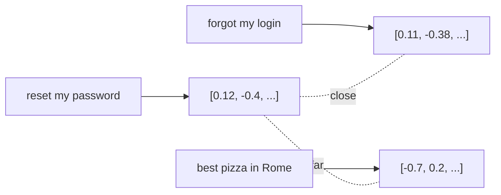

<LevelBadge level="intermediate" />

Un **embedding** convierte un fragmento de texto en una lista de números (un **vector**) que captura su *significado*. Los textos con significado similar obtienen vectores que quedan cerca unos de otros — aunque no compartan ninguna palabra. Ese es el truco detrás de la **búsqueda semántica** y de [RAG](/docs/foundations/rag).

## La intuición

Imagina cada frase colocada como un punto en un enorme espacio multidimensional, dispuesto de modo que **los significados similares queden cerca unos de otros**. "¿Cómo restablezco mi contraseña?" cae cerca de "Olvidé mi inicio de sesión", lejos de "la mejor pizza de Roma".

## Búsqueda semántica vs. por palabras clave

- **La búsqueda por palabras clave** coincide con palabras literales ("contraseña" encuentra "contraseña").
- **La búsqueda semántica** coincide con el *significado* — "no puedo iniciar sesión" encuentra el documento de restablecimiento de contraseña incluso sin la palabra "contraseña".

Los mejores resultados a menudo **combinan** ambas (búsqueda híbrida).

## Cómo funciona una búsqueda vectorial

1. **Embebe** tus documentos (normalmente divididos en **fragmentos**) y almacena los vectores en una **base de datos vectorial**.
2. En el momento de la consulta, **embebe la consulta**.
3. Encuentra los vectores **más cercanos** (por similitud / distancia del coseno).
4. Devuelve esos fragmentos — normalmente para alimentar [RAG](/docs/foundations/rag).

## Notas prácticas

- **El fragmentado importa.** Demasiado grande = coincidencias ruidosas; demasiado pequeño = contexto perdido. Ajústalo.
- **Usa un mismo modelo de embeddings de forma consistente** — los vectores de modelos distintos no son comparables.
- **Los metadatos + filtros** (fecha, fuente, tipo) hacen que la recuperación sea mucho más precisa.
- Una base de datos vectorial no siempre es necesaria — para corpus pequeños, una simple búsqueda en memoria es suficiente.

## Siguiente

- [Generación aumentada por recuperación (RAG)](/docs/foundations/rag)
- [Fine-tuning vs prompting vs RAG](/docs/foundations/finetune-vs-prompt-vs-rag)
- [Alucinaciones y cómo reducirlas](/docs/foundations/hallucinations)
