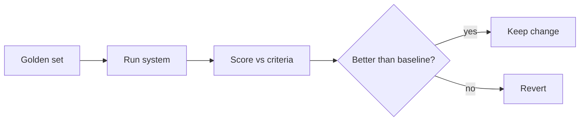

<LevelBadge level="advanced" />

Si lanzas algo construido sobre IA, las **evals** son la forma de saber que funciona — y de saber que un cambio lo mejoró, no lo empeoró. Sin ellas vuelas a ciegas: un ajuste de prompt que ayuda en un caso puede romper diez otros en silencio.

## La eval mínima viable

No necesitas un framework para empezar:

1. **Reúne un conjunto de referencia.** De 20 a 100 entradas reales con las salidas *correctas* o *aceptables* (o criterios claros). Cubre los casos fáciles, los complicados y los casos límite que te han mordido.
2. **Define qué significa "bueno"** por tarea — coincidencia exacta, contiene los hechos clave, esquema JSON válido, sin números alucinados, tono, etc.
3. **Ejecuta y puntúa** tu configuración actual frente al conjunto.
4. **Cambia una sola cosa** (prompt, modelo, recuperación), vuelve a ejecutar, **compara**. Conserva el cambio solo si la puntuación mejora.

## Elegir métricas

- **Comprobaciones deterministas** siempre que sea posible: ¿esquema válido? ¿contiene el valor correcto? ¿el código pasa las pruebas? Son baratas y fiables.
- **LLM como juez** para la calidad difusa (utilidad, tono): haz que un modelo califique las salidas frente a una rúbrica. Útil, pero **calíbralo** — los jueces tienen sesgos (longitud, posición). Valida al juez frente a calificaciones humanas en una muestra.
- **Revisión humana** para la porción de mayor riesgo.

## Cuándo ejecutarlas

- **Antes/después de cualquier cambio de prompt o de modelo.**
- **En una migración de modelo** — un modelo nuevo puede cambiar el comportamiento ([Errores y migración](/docs/api/errors-and-rate-limits)).
- **En CI** para sistemas en producción, como una compuerta.

:::tip Separa las etapas
Para [RAG](/docs/foundations/rag) y [agentes](/docs/api/building-agents), evalúa cada etapa (¿la recuperación encontró el documento correcto? ¿se llamó a la herramienta correctamente?) — no solo la respuesta final. Localiza los fallos.
:::

## Siguiente

- [Alucinaciones y cómo reducirlas](/docs/foundations/hallucinations)
- [Construir agentes sobre la API](/docs/api/building-agents)
- [Elegir un modelo y proveedor](/docs/foundations/choosing-a-model-provider)
