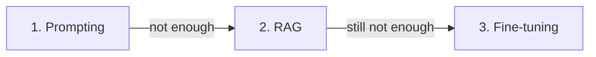

<LevelBadge level="intermediate" />

Cuando el modelo no hace lo que quieres, hay tres palancas — y la gente recurre primero a la cara. Aquí está el orden que de verdad funciona.

## Prueba en este orden

### 1. Prompting — empieza aquí, siempre
Instrucciones más claras, ejemplos, un rol, restricciones de salida ([Fundamentos del prompting](/docs/prompting/basics)). Soluciona la **mayoría** de los problemas, no cuesta nada extra y es instantáneo de iterar. La mayoría de los "el modelo es malo en X" resultan ser "el prompt era vago".

### 2. RAG — cuando necesita *tu* conocimiento
Si la brecha es **información faltante o reciente** (tus documentos, tus datos, hechos actuales), añade [RAG](/docs/foundations/rag). Mantiene el conocimiento actualizable y citable sin tocar el modelo.

### 3. Fine-tuning — último recurso, para *comportamiento/formato* a escala
El fine-tuning sigue entrenando un modelo con tus ejemplos. Recurre a él solo cuando prompting + RAG no logren un **estilo, formato o comportamiento de tarea** consistentes y tengas **muchos ejemplos de alta calidad** y el volumen que lo justifique.

## La tabla de decisión

| Tu problema | Recurre a |
|---|---|
| Salidas vagas/incorrectas, formato erróneo | **Prompting** |
| No conoce tus datos / necesita información actual | **RAG** |
| Necesita un estilo/comportamiento muy específico, de forma consistente, a escala | **Fine-tuning** |
| Necesita realizar acciones | (Ninguna de estas — eso es [uso de herramientas/agentes](/docs/api/tool-use)) |

## Por qué la gente lo confunde

El fine-tuning *suena* como "enseñarle al modelo", así que parece la solución de verdad. Pero es la opción más lenta, más cara y menos flexible, **no añade conocimiento fresco** bien (RAG hace eso) y es fácil hacerlo mal. Agota primero el prompting y RAG — normalmente no necesitarás el paso 3.

:::tip Se combinan
Un sistema sólido suele ser un buen **prompt** + **RAG** para el conocimiento, con el fine-tuning reservado para una necesidad de comportamiento concreta. No son mutuamente excluyentes.
:::

## Siguiente

- [Generación aumentada por recuperación (RAG)](/docs/foundations/rag)
- [Fundamentos del prompting](/docs/prompting/basics)
- [Evaluar la calidad de la IA (Evals)](/docs/foundations/evals)
