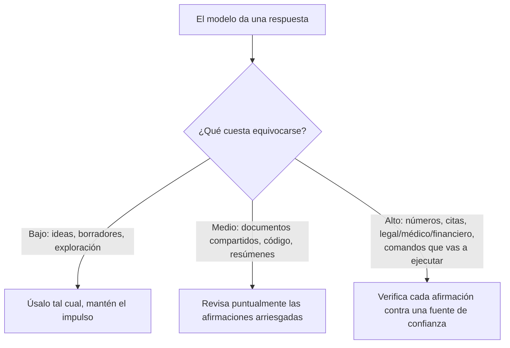

<LevelBadge level="intermediate" />

Una **alucinación** ocurre cuando un modelo afirma algo falso con total seguridad. No está mintiendo ni está roto — es la otra cara de cómo funcionan los LLM: generan texto *plausible*, y lo plausible no siempre es cierto (consulta [¿Qué es un LLM?](/docs/foundations/what-is-an-llm)). No puedes eliminarlo del todo con prompts, pero puedes reducirlo drásticamente y atrapar el resto.

## Por qué sucede

El modelo predice una continuación probable. Cuando no "sabe" algo, la continuación *que parece más probable* suele ser una respuesta segura, bien formada — y errónea. No hay una señal incorporada de "no estoy seguro" a menos que crees espacio para una.

## Las zonas de alto riesgo

Sé más escéptico cuando la salida implique:

- **Citas, referencias y atribuciones** — artículos fabricados, URLs falsas, citas mal atribuidas.
- **Números, fechas y estadísticas específicas** — cifras plausibles pero inventadas.
- **Datos nicho o muy recientes** — más allá de lo que el modelo aprendió de forma fiable.
- **Detalles de APIs y librerías** — métodos o parámetros que no existen.
- **Personas y detalles legales/médicos** — alto riesgo, fáciles de equivocar sutilmente.

## El kit de reducción

Combínalos — cada uno ayuda:

1. **Fundaméntalo en fuentes.** Pega el texto de origen y di *"responde solo a partir del texto anterior; si no está ahí, dilo"*. Esta es la idea central detrás de [RAG](/docs/foundations/rag).
2. **Dale una salida.** Permite explícitamente *"Si no estás seguro, di 'no lo sé'"* — reduce drásticamente las conjeturas hechas con seguridad.
3. **Pide razonamiento y citas.** *"Cita la frase exacta que respalda cada afirmación."* Las afirmaciones sin respaldo se vuelven obvias.
4. **Baja la creatividad** para tareas factuales en las que el modelo expone un control de temperatura (consulta [Controles de muestreo](/docs/foundations/sampling-controls)).
5. **Usa herramientas.** Para matemáticas, datos actuales o consultas, dale al modelo una calculadora/búsqueda/[herramienta](/docs/api/tool-use) en lugar de confiar en su memoria.
6. **Verifica de forma cruzada.** Haz la misma pregunta de dos maneras, o haz que una segunda pasada critique la primera.

## Un prompt anti-alucinaciones para copiar y pegar

La mayor parte del kit anterior se condensa en un único envoltorio reutilizable. Pega tu fuente donde se indica y formula tu pregunta — fundamenta la respuesta, le da al modelo una salida y obliga a citar, todo de una sola vez:

```text
Respondes ÚNICAMENTE a partir de la FUENTE de abajo.
Reglas:
- Si la respuesta no está en la FUENTE, responde exactamente: "No consta en la fuente."
- Después de cada afirmación, cita la frase exacta de la FUENTE que la respalda.
- No añadas conocimiento externo, estimaciones ni suposiciones.

FUENTE:
"""
[pega aquí el documento, la transcripción o los datos]
"""

PREGUNTA: [tu pregunta]
```

Por qué funciona: la salida de emergencia "No consta en la fuente." elimina la presión de adivinar, y la regla de citar la frase hace imposible ocultar cualquier afirmación sin respaldo. Quita el bloque FUENTE cuando de verdad quieras el conocimiento propio del modelo — pero entonces la verificación vuelve a recaer en ti.

## La mentalidad que de verdad te protege

:::warning Verifica lo que importa — siempre
Ningún prompt hace que la salida sea 100% fiable. Para cualquier cosa de consecuencia — un número en un informe, una cita, un comando que vas a ejecutar, un detalle médico/legal/financiero — **compáralo con una fuente de confianza**. Trata a la IA como un primer borrador rápido, no como una autoridad final. Este es el corazón del [Uso responsable](/docs/security/responsible-use).
:::

Una regla simple: **el coste de equivocarse determina la cantidad de verificación.** ¿Lluvia de ideas? Confía libremente. ¿Publicar una estadística? Verifica siempre.



## Siguiente

- [Generación aumentada por recuperación (RAG)](/docs/foundations/rag)
- [Evaluar la calidad de la IA (Evals)](/docs/foundations/evals)
- [Uso responsable, ética y verificación](/docs/security/responsible-use)
