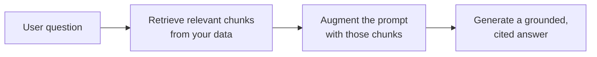

<LevelBadge level="intermediate" />

**RAG** hace que un modelo responda preguntas sobre **tus** datos — documentos, una base de conocimiento, una base de código — con los que nunca fue entrenado. La idea es simple: **recuperar** las piezas relevantes, **aumentar** el prompt con ellas y luego **generar** una respuesta fundamentada en esas piezas.

## El bucle

1. **Indexa** tus datos: divídelos en fragmentos, [embébelos](/docs/foundations/embeddings) y almacénalos en un índice vectorial (y/o de palabras clave).
2. **Recupera** los principales fragmentos más relevantes para la pregunta.
3. **Aumenta**: pon esos fragmentos en el prompt con una instrucción como *"Responde solo a partir del contexto siguiente; si no está ahí, dilo"*.
4. **Genera** — e idealmente **cita** de qué fragmento proviene cada afirmación.

## ¿Por qué RAG en lugar de fine-tuning?

RAG mantiene el conocimiento **fresco** (actualizas los datos, no el modelo), proporciona **citas** y es mucho más barato que reentrenar. Para la mayoría de las necesidades de "responder sobre mis documentos", es la herramienta correcta para empezar — consulta [Fine-tuning vs prompting vs RAG](/docs/foundations/finetune-vs-prompt-vs-rag).

## Los modos de fallo (donde muere la calidad de RAG)

- **Mala recuperación = mala respuesta.** Si el fragmento correcto no se recupera, el modelo no puede usarlo. La mayoría de los problemas de "RAG se equivoca" son problemas de *recuperación*.
- **Fragmentado demasiado grueso/fino** — arruina la relevancia ([embeddings](/docs/foundations/embeddings)).
- **Sin instrucción de fundamentación** — el modelo mezcla los hechos recuperados con sus propias conjeturas. Dile que responda *solo* a partir del contexto y que admita las lagunas.
- **Meter demasiado** — los fragmentos irrelevantes diluyen la señal y cuestan [tokens](/docs/foundations/tokens-and-context). Recupera pocos fragmentos, de alta calidad.
- **Sin citas** — no puedes verificar, así que no puedes confiar.

:::tip Evalúa la recuperación por separado
Mide "¿recuperamos el fragmento correcto?" aparte de "¿respondió bien el modelo?" Localiza el problema rápidamente. Consulta [Evals](/docs/foundations/evals).
:::

## Siguiente

- [Embeddings y búsqueda vectorial](/docs/foundations/embeddings)
- [Fine-tuning vs prompting vs RAG](/docs/foundations/finetune-vs-prompt-vs-rag)
- [Manual de investigación y síntesis](/docs/playbooks/research)
