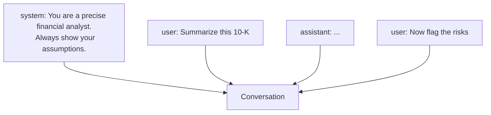

<LevelBadge level="beginner" />

Toda conversación con IA se construye a partir de **mensajes**, y cada mensaje tiene un **rol**. Entender los tres roles explica cómo dirigir el modelo — y por qué algunas instrucciones se mantienen mientras otras no.

## Los tres roles

- **Sistema** — la configuración de nivel superior para toda la conversación: quién debe ser el modelo, las reglas, el formato. Se establece una vez y se aplica en todo momento.
- **Usuario** — ese eres tú: tus preguntas y entradas, turno a turno.
- **Asistente** — las respuestas del modelo. (También puedes *poner palabras en boca del asistente* como ejemplos — consulta [few-shot](/docs/prompting/few-shot)).

## Por qué el prompt de sistema es tu palanca más poderosa

El mensaje de sistema enmarca **todo lo que sigue**. Es donde estableces el rol del modelo, los estándares, el tono y las reglas estrictas — y el modelo lo pondera con fuerza. Si quieres un comportamiento consistente a lo largo de toda una conversación (o aplicación), ponlo aquí, no enterrado en un turno de usuario.

En la práctica:
- **Aplicaciones de chat:** las [instrucciones personalizadas](/docs/claude-app/custom-instructions) de tu cuenta actúan como un prompt de sistema personal.
- **Claude Code:** el [CLAUDE.md](/docs/claude-code/claude-md) desempeña este papel para tu proyecto.
- **La API:** el [parámetro `system`](/docs/api/first-call).

La misma idea, tres superficies.

## Consejos prácticos

- **Sé específico en el prompt de sistema** sobre el rol, las reglas y el formato de salida — es el lugar de mayor impacto para hacerlo.
- **Mantén los turnos de usuario enfocados** en la tarea concreta; no repitas las reglas en cada turno.
- **¿Instrucciones en conflicto?** Una instrucción de usuario posterior y explícita puede anular una de sistema vaga — sé consistente para evitar sorpresas ([Solución de problemas](/docs/contribute/troubleshooting)).

## Siguiente

- [Fundamentos del prompting](/docs/prompting/basics)
- [Instrucciones personalizadas y estilos](/docs/claude-app/custom-instructions)
- [Tokens, contexto y memoria](/docs/foundations/tokens-and-context)
