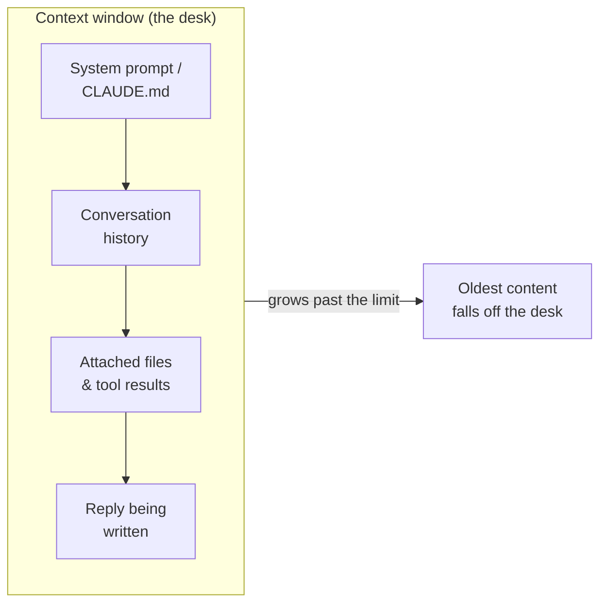

<LevelBadge level="beginner" />

Tres ideas resuelven muchos momentos de "¿por qué hizo eso?": los **tokens**, la **ventana de contexto** y la **memoria**. Si entiendes esto, dejarás de sorprenderte por la deriva, los olvidos y las facturas inesperadas.

<Callout
  type="objectives"
  items={[
    "Leer el texto como lo hace un modelo: en tokens, no en palabras ni caracteres",
    "Imaginar la ventana de contexto como un escritorio finito y predecir cuándo se caen las cosas de él",
    "Reconocer el 'deterioro de contexto': por qué los modelos pueden perder la parte central de una entrada larga",
    "Conocer las cuatro fuentes reales de 'memoria' y cómo proporcionarla a propósito"
  ]}
/>

## Tokens: la unidad en la que piensan los modelos

Los modelos no leen caracteres ni palabras: leen **tokens**, fragmentos de texto de aproximadamente ¾ de una palabra en inglés. "Unbelievable" podría ser de 3 a 4 tokens; las palabras comunes son uno cada una; un espacio, una coma o un fragmento de código también cuestan tokens. Tanto tu entrada *como* la salida del modelo se contabilizan, y los tokens son exactamente la unidad con la que se miden los [precios y límites](/docs/api/tokens-and-pricing).

No necesitas contarlos a mano, pero ayuda tener una idea aproximada: **~750 palabras ≈ ~1.000 tokens**. Escribe algo y observa:

<TokenEstimator />

:::tip Por qué cambia la proporción
El inglés común ronda los ¾ de palabra por token. El código, JSON, los alfabetos no latinos, las URL largas y las palabras raras se dividen en *más* tokens, así que un archivo de 500 líneas o un párrafo en chino cuestan más de lo que sugiere su recuento de palabras. Cuando una factura o un límite te sorprenden, esta suele ser la razón.
:::

## La ventana de contexto: memoria de trabajo

La **ventana de contexto** es el número máximo de tokens que el modelo puede considerar a la vez: *tu prompt de sistema, toda la conversación hasta ahora, los archivos adjuntos y la respuesta que está escribiendo,* todo junto. Imagínalo como el escritorio del modelo: grande, pero finito. Los tamaños de la ventana varían según el modelo y siguen creciendo; consulta [Modelos y precios](/docs/whats-new/models-and-pricing) para ver las cifras actuales en lugar de memorizar una.

Todo lo que el modelo "sabe" en el momento vive en ese escritorio:

Cuando una conversación crece más allá de la ventana, **el contenido más antiguo se cae**. Por eso un chat muy largo puede parecer "olvidar" cómo empezó, o desviarse de tu instrucción original.

## Deterioro de contexto: no es solo *lleno* vs *vacío*

Un problema más sutil: incluso cuando todo todavía cabe, los modelos tienden a usar el **principio y el final** de una entrada larga de forma más fiable que la **parte central**. Entierra la única frase que importa en el centro de un pegado de 50 páginas y puede que reciba poco peso, un modo de fallo a menudo llamado *"perdido en el medio"*.

<VerifyNote lastVerified="2026-06-29" source="https://arxiv.org/abs/2307.03172">El efecto "perdido en el medio" —el uso degradado de la información colocada en mitad del contexto— fue documentado por Liu et al. (2023). Los modelos más recientes de contexto largo lo manejan mejor, pero el hábito práctico de más abajo sigue mereciendo la pena.</VerifyNote>

<Steps
  items={[
    {title: "Empieza con la petición", body: "Pon la instrucción o pregunta real primero, antes de pegar un documento largo, no enterrada después de él."},
    {title: "Reitérala al final", body: "Repite la instrucción clave en una línea después del contenido largo. Las posiciones primera y última son las más fuertes."},
    {title: "Recorta antes de pegar", body: "Elimina las secciones irrelevantes. Menos ruido en el medio significa que la señal que queda recibe más atención."},
    {title: "Divide cuando sea enorme", body: "Para entradas muy grandes, resume o fragmenta en lugar de volcar todo, o inicia un chat nuevo para una nueva subtarea."}
  ]}
/>

Aquí está la misma petición, estructurada para que la instrucción quede en las posiciones fuertes:

<PromptCard title="Instrucción al principio, reiterada al final">{`Tarea: Encuentra cada lugar donde este contrato limite nuestra responsabilidad y cita la cláusula exacta.

[... pega aquí el contrato completo de 40 páginas ...]

Recordatorio de la tarea: enumera solo las cláusulas de límite de responsabilidad, con citas exactas y números de sección. Ignora todo lo demás.`}</PromptCard>

:::tip En Claude Code
Las sesiones largas de agente chocan con el mismo techo. Claude Code lo gestiona deliberadamente: compactando el historial y dejándote dirigir qué permanece a la vista. Consulta [Gestión del contexto](/docs/claude-code/context-management) e [Ingeniería de contexto](/docs/frontiers/context-engineering).
:::

## Memoria: no hay ninguna, a menos que la proporciones

Por defecto, cada conversación es una **hoja en blanco**. El modelo no recuerda tu último chat. Todo lo que parece memoria es una de cuatro cosas:

| Fuente | Qué es | Lo controlas mediante |
| --- | --- | --- |
| **Historial reenviado** | Las apps de chat reenvían la conversación en cada turno, hasta que la ventana se llena | Iniciar chats nuevos; mantener los hilos enfocados |
| **Funciones de memoria** | Algunas superficies de Claude transfieren datos entre chats | Ajustes de [Memoria entre chats](/docs/claude-app/memory) |
| **Archivos que proporcionas** | Contexto persistente que adjuntas a propósito | [Proyectos](/docs/claude-app/projects), [CLAUDE.md](/docs/claude-code/claude-md) |
| **Tu propio código** | La API es **sin estado**: tú reenvías los mensajes previos | [Primera llamada a la API](/docs/api/first-call) |

La idea central: *si quieres que el modelo recuerde algo, tienes que seguir poniéndolo sobre el escritorio.*

## Por qué esto importa

Casi todos los problemas de "ignoró mi instrucción anterior" o "perdió el hilo" se remontan a una de tres cosas: la ventana se llenó, una nueva sesión empezó en frío, o el detalle clave quedó en el medio muerto de un pegado largo. Sabiendo esto, estructurarás tus prompts y sesiones para mantener lo importante *a la vista*.

## Comprueba lo aprendido

<Quiz
  questions={[
    {
      q: "Aproximadamente, ¿cuántos tokens son 750 palabras de inglés común?",
      options: ["Unos 250", "Unos 1.000", "Unos 3.000", "Exactamente 750"],
      answer: 1,
      explain: "Una regla práctica útil es ~750 palabras ≈ ~1.000 tokens para inglés ordinario. El código y los alfabetos no latinos dan cifras más altas."
    },
    {
      q: "Un chat largo empieza a 'olvidar' cómo comenzó. La causa más probable es:",
      options: [
        "El modelo está roto",
        "El contenido más antiguo se cayó de la ventana de contexto a medida que la conversación crecía",
        "El modelo aprendió permanentemente tus mensajes anteriores",
        "Se reembolsaron tokens"
      ],
      answer: 1,
      explain: "La ventana de contexto es finita. A medida que una conversación la supera, los tokens más antiguos se caen del 'escritorio', así que las instrucciones iniciales pueden desaparecer de la vista."
    },
    {
      q: "Debes pegar un documento enorme más una instrucción clave. ¿La mejor ubicación?",
      options: [
        "La instrucción solo en el centro exacto del documento",
        "La instrucción al principio Y reiterada al final",
        "Sin instrucción: deja que el modelo adivine",
        "La instrucción en un chat aparte que el modelo no puede ver"
      ],
      answer: 1,
      explain: "Los modelos usan el principio y el final de una entrada larga de forma más fiable ('perdido en el medio'). Empieza con la petición y reitérala al final."
    }
  ]}
/>

## Términos clave

<Flashcards
  title="Fija el vocabulario"
  cards={[
    {front: "Token", back: "El fragmento de texto que un modelo procesa realmente, aproximadamente ¾ de una palabra en inglés. La entrada y la salida se contabilizan ambas, y el precio es por token."},
    {front: "Ventana de contexto", back: "El máximo de tokens que un modelo puede considerar a la vez: prompt de sistema + historial + archivos + la respuesta, todo junto. Finita: el contenido que supera el límite se cae."},
    {front: "Perdido en el medio", back: "La tendencia a usar el principio y el final de una entrada larga de forma más fiable que el medio. Coloca las instrucciones críticas en las posiciones fuertes."},
    {front: "Ausencia de estado", back: "La API no recuerda nada entre llamadas. Para continuar una conversación, reenvías tú mismo los mensajes previos."}
  ]}
/>

:::note Conclusiones
- Los **tokens** son la unidad tanto del pensamiento como de la facturación: ~1.000 por cada 750 palabras en inglés, más para código y otros alfabetos.
- La **ventana de contexto** es un escritorio finito; los chats largos olvidan porque el contenido antiguo se cae de él.
- Incluso dentro de la ventana, **empieza con tu instrucción y reitérala al final**: el medio se infrautiliza.
- **No hay memoria por defecto**. Proporciónala deliberadamente con archivos, Proyectos, CLAUDE.md o reenviando el historial.
:::

## Siguiente

- [¿Qué es un LLM?](/docs/foundations/what-is-an-llm)
- [Roles de sistema, usuario y asistente](/docs/foundations/roles)
- [Ingeniería de contexto](/docs/frontiers/context-engineering)
- [Tokens, contexto y precios (API)](/docs/api/tokens-and-pricing)
