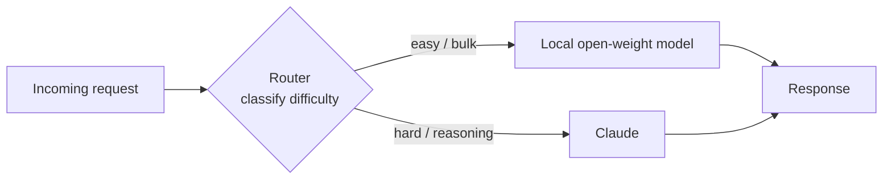

<LevelBadge level="advanced" />

El planteamiento "modelo de frontera **o** modelo local" es una falsa elección. Los sistemas más rentables, respetuosos con la privacidad y resilientes en producción usan **ambos** — un pequeño modelo de pesos abiertos corriendo en local para el trabajo fácil, de alto volumen o sensible, y un modelo de frontera como Claude como la **capa inteligente** que se encarga del razonamiento difícil. Esta página trata sobre los *patrones* duraderos que conectan a los dos para que cada uno haga aquello en lo que es mejor. Los patrones son neutrales respecto al proveedor — Claude simplemente encaja muy bien en el papel de "razonamiento" — y sobreviven a cualquier nombre de modelo concreto.

<Callout type="objectives" items={[
  "Entender POR QUÉ un híbrido (frontera + local) supera a cualquiera de los dos modelos por separado en coste, privacidad y resiliencia",
  "Aprender los cinco patrones híbridos duraderos: router/big-little, borrador-y-refinamiento, redacción para privacidad, pre/postprocesamiento masivo y respaldo sin conexión",
  "Para cada patrón: saber cuándo recurrir a él, la contrapartida que aceptas y un esbozo concreto",
  "Diseñar tu propio híbrido Claude+local con un método repetible de cuatro pasos",
  "Saber que estos patrones son neutrales respecto al proveedor — Claude encaja como la 'capa inteligente', no como un bloqueo de proveedor",
]} />

## Por qué híbrido, no lo uno o lo otro

Un modelo local de pesos abiertos (ver [Ejecutar modelos en local con Ollama](/docs/models/run-models-locally-ollama)) y un modelo de frontera son buenos en cosas *diferentes*:

- **Lo local** es privado (los datos nunca salen de tu máquina), barato a escala (sin factura por token), de baja latencia para modelos pequeños y funciona sin conexión. Pero tiene una **brecha de capacidad** real en las tareas de razonamiento más difíciles, de contexto largo y agénticas.
- **Claude (frontera)** lidera exactamente en esas tareas difíciles, pero cada llamada cuesta tokens y envía datos a una API en la nube.

La idea detrás de cada patrón de abajo: **la mayoría de las peticiones son fáciles, y las difíciles son la minoría.** Si un modelo local barato puede manejar el grueso y reservas el modelo de frontera para la porción genuinamente difícil, obtienes la mayor parte de la calidad de frontera a una fracción del coste — y puedes mantener los datos sensibles en local. El artículo *Hybrid LLM* de Microsoft formalizó esto: un router aprendido que envía las consultas fáciles a un modelo pequeño realizó **hasta un 40% menos de llamadas** al modelo grande sin caída en la calidad de la respuesta ([arXiv 2404.14618](https://arxiv.org/abs/2404.14618)). El framework de código abierto [RouteLLM](https://github.com/lm-sys/RouteLLM) reporta resultados similares — calidad cercana a la de frontera a aproximadamente **la mitad del coste** en benchmarks comunes, enrutando cerca de la mitad de las consultas al modelo más barato.

> Elige tu híbrido por **restricción**, no por moda. Si aún no sabes qué modelo encaja con qué tarea, empieza en [Elegir un modelo](/docs/models/choosing-a-model) — y luego vuelve y decide *dónde se sitúa la frontera* entre lo local y lo de frontera.

---

## Patrón 1 — Router / big-little

**La idea.** Pon un **clasificador** fino delante de cada petición. Mira la tarea y decide: fácil/masivo → modelo local; razonamiento difícil → Claude. Tomado del diseño de CPU "big.LITTLE", donde un teléfono ejecuta el trabajo en segundo plano en núcleos pequeños y eficientes y despierta el núcleo grande solo para cargas pesadas.

**Cuándo usarlo.** Tienes un flujo mixto de peticiones — muchas triviales, unas pocas genuinamente difíciles — y quieres pagar precios de frontera solo por las difíciles. Este es el híbrido de referencia.

**La contrapartida.** El router puede *equivocarse*. Enruta mal una tarea difícil al modelo local y la calidad cae; enruta mal una fácil a Claude y pagas de más. Ajustas un umbral para intercambiar coste por calidad, y deberías **medir** ese umbral con tus propios datos con una pequeña evaluación (ver [Evaluaciones](/docs/power-user/evals)).

**El esbozo.** El router puede ser tan simple como una capa de reglas (longitud, palabras clave, presencia de código) o tan rico como un pequeño modelo clasificador. Una opción barata y transparente es pedirle al propio modelo **local** que clasifique la dificultad, y luego despachar:

<PromptCard title="Prompt de clasificación del router (se ejecuta en el modelo local)">{`You are a request router. Classify the user request into exactly one tier.

Return ONLY a JSON object: {"tier": "...", "reason": "..."}

Tiers:
- "local"  → simple, mechanical, or high-volume: short rewrites, formatting,
             single-fact lookup, basic classification/extraction, boilerplate.
- "frontier" → hard reasoning, multi-step planning, long-context synthesis,
             ambiguous instructions, code that must be correct, anything where
             a wrong answer is costly.

Bias toward "local" when in doubt about a CHEAP, low-risk task,
and toward "frontier" when a mistake would be EXPENSIVE.

Request:
"""
{{REQUEST}}
"""`}</PromptCard>

La salida del router es una decisión de enrutamiento, no la respuesta final — mantenla diminuta y rápida. Para un enrutamiento más rico entre muchas herramientas o modelos, la misma lógica de clasificar-y-despachar se generaliza (y se parece a cómo los modelos eligen entre [herramientas](/docs/api/tool-use)).

---

## Patrón 2 — Borrador-y-refinamiento

**La idea.** El modelo local produce un **primer borrador barato**; Claude lo **pule, corrige o verifica**. Pagas tokens de frontera por el refinamiento, no por la generación desde cero — y un buen borrador hace que el trabajo de Claude sea más corto y fiable.

**Cuándo usarlo.** Generación abierta donde un borrador tosco es mucho más barato que uno perfecto pero la salida final debe ser de alta calidad: escritura de formato largo, código, documentos estructurados, resúmenes que deben ser exactamente correctos.

**La contrapartida.** Dos llamadas al modelo en lugar de una añade latencia, y un *mal* borrador puede anclar al refinador hacia sus errores. La ganancia aparece cuando redactar es la parte cara y refinar es comparativamente barato — verifica con tus datos que "borrador local + refinamiento de frontera" realmente supera a "la frontera lo hace todo" en coste por salida aceptable.

**El esbozo.** El modelo local redacta → pasa el borrador a Claude con una instrucción enfocada: *"Aquí tienes un borrador. Corrige errores, ajusta y verifica afirmaciones; devuelve la versión corregida."* Esta es la misma intuición que impulsa la **decodificación especulativa** a nivel de token — un pequeño redactor propone, el modelo grande verifica y conserva solo lo que resiste ([NVIDIA: decodificación especulativa](https://developer.nvidia.com/blog/an-introduction-to-speculative-decoding-for-reducing-latency-in-ai-inference/)). A nivel de tarea estás haciendo lo mismo a mano: propuesta barata, verificación cara.

---

## Patrón 3 — Redacción para privacidad

**La idea.** Un modelo local (o herramientas locales de PLN) **elimina la PII** del texto *antes* de que se envíe nada a una API en la nube. Claude razona sobre la versión redactada; reinsertas los valores reales en local en el camino de vuelta si es necesario.

**Cuándo usarlo.** Quieres razonamiento de frontera pero manejas datos regulados o sensibles (salud, finanzas, registros de clientes) y la PII en bruto **no debe** salir de tu entorno. La redacción te permite usar el modelo en la nube sobre la *forma* del problema sin exponer a las personas que hay en él.

**La contrapartida.** La redacción nunca es perfecta — una entidad no detectada es una fuga, y la sobre-redacción destruye el contexto que el modelo necesita para responder bien. Trata al redactor como un control de seguridad: prueba su exhaustividad (recall) y mantén el mapeo de des-redacción estrictamente en local.

**El esbozo.** Ejecuta un detector/anonimizador local sobre la entrada, reemplazando entidades con marcadores (`[PERSON_1]`, `[EMAIL_1]`), envía el texto redactado a Claude, y luego rehidrata los marcadores en local. El código abierto [Presidio](https://github.com/microsoft/presidio) de Microsoft es el bloque de construcción común aquí — detecta y anonimiza PII y puede usar un backend de PLN conectable, incluido un modelo local para una segunda pasada en los casos difíciles. Un detalle crucial y a menudo olvidado: redacta **todo** lo que llega al modelo, incluidos los documentos recuperados y los resultados de herramientas — no solo el último mensaje del usuario.

---

## Patrón 4 — Pre/postprocesamiento masivo

**La idea.** El modelo local se encarga del trabajo **de alto volumen y repetitivo** — extracción, clasificación, etiquetado, normalización a lo largo de miles de elementos — y Claude se encarga solo de los **pocos casos difíciles** que el modelo local marca como de baja confianza.

**Cuándo usarlo.** Cargas de trabajo de pipeline: clasificar 100k tickets de soporte, extraer campos de una montaña de documentos, etiquetar un torrente de contenido. Pasar cada elemento por una API de frontera sería lento y caro; la mayoría de los elementos son fáciles.

**La contrapartida.** Necesitas una **señal fiable de confianza / escalado** para que los elementos correctos se escalen. Demasiado ansioso y pagas de más; demasiado tímido y la calidad sufre en la cola difícil. La confianza autoinformada del modelo local es un punto de partida, pero valídala.

**El esbozo.** El modelo local procesa el lote completo y adjunta una puntuación de confianza; los elementos por debajo de un umbral (o que fallan una comprobación de esquema/validación) se escalan a Claude para la decisión difícil. Este es el Patrón 1 aplicado a un lote en lugar de a una petición en vivo — la misma economía de "lo barato maneja el grueso, la frontera maneja la cola" que explotan las cascadas, a menudo **entre un 40 y un 70% de ahorro de costes** con una pérdida mínima de calidad en la mayoría fácil.

---

## Patrón 5 — Respaldo sin conexión

**La idea.** El modelo local es la **red de seguridad**. Cuando la API en la nube está caída, limitada por tasa o inalcanzable, las peticiones *conmutan* al modelo local en lugar de fallar *por completo*. Respuestas degradadas superan a páginas de error.

**Cuándo usarlo.** Cualquier caso donde la disponibilidad importa más que estar siempre en la mejor calidad: herramientas internas que deben seguir funcionando, funciones en el dispositivo, productos que no pueden mostrar a los usuarios un error duro durante una caída del proveedor.

**La contrapartida.** Las respuestas de respaldo son **de menor calidad** por definición — estás cambiando el techo de frontera por "sigue funcionando". Haz la degradación explícita (etiquétala, reduce el conjunto de funciones) en lugar de servir silenciosamente respuestas más débiles como si fueran la real.

**El esbozo.** Envuelve las llamadas en una cadena ordenada: intenta Claude → ante un error de disponibilidad (timeout, 429/5xx), reintenta con backoff → si sigue fallando, enruta al modelo local. Las pasarelas de LLM como LiteLLM y OpenRouter implementan exactamente este patrón de cadena de respaldo, incluida la caché de prompts comunes para que una ruta sin conexión pueda seguir sirviendo algo útil. El principio duradero: **mantén un modelo local caliente como tu última línea**, para que una caída degrade la experiencia en lugar de romperla.

---

## Diseña tu propio híbrido Claude+local

<Steps items={[
  {title: "Mapea la distribución de tus peticiones", body: "Muestrea tráfico real y etiqueta qué fracción es genuinamente difícil vs fácil/masiva vs sensible. La forma de esta distribución te dice qué patrón rinde — una larga cola fácil favorece un router o preprocesamiento masivo; una pequeña porción sensible favorece la redacción."},
  {title: "Elige el patrón que encaja con la restricción", body: "Tráfico en vivo mixto → Patrón 1 (router). Generación de alta calidad con presupuesto ajustado → Patrón 2 (borrador-y-refinamiento). Datos regulados/sensibles → Patrón 3 (redacción). Volumen de pipeline / por lotes → Patrón 4 (masivo). La disponibilidad es crítica → Patrón 5 (respaldo). Muchos sistemas combinan dos o tres."},
  {title: "Fija la frontera, luego mídela", body: "Decide dónde para lo local y dónde empieza Claude (un umbral de router, un corte de confianza, una política de redacción). Ejecuta una pequeña evaluación con TUS datos para poner números a la contrapartida coste-vs-calidad. No confíes en un ranking o en el titular de un proveedor — mide con tu tarea. Ver la página de Evaluaciones."},
  {title: "Añade observabilidad y una válvula de seguridad", body: "Registra cada decisión de enrutamiento/escalado y su resultado para poder reajustar la frontera a medida que cambian los modelos y el tráfico. Mantén un respaldo explícito (Patrón 5) para que una caída del proveedor degrade con elegancia en lugar de romperse."},
]} />

<VerifyNote lastVerified="2026-06-28" source="https://platform.claude.com/docs/en/about-claude/models/overview">
Los nombres específicos de modelos, las ventanas de contexto, los precios por token y los límites de tasa cambian con frecuencia y **no** se reafirman aquí a propósito — son la parte volátil. Antes de fijar un umbral de coste o calidad para un router o una cascada, comprueba la línea actual de modelos Claude y los precios en la fuente de arriba, y los nombres actuales de modelos locales en la <a href="https://ollama.com/library">librería de Ollama</a>. Los patrones de esta página son duraderos; las cifras exactas detrás de la frontera no lo son.
</VerifyNote>

<Quiz title="Autoevaluación" questions={[
  {q: "¿Cuál es la idea económica central que hace funcionar a cada patrón híbrido?", options: ["Los modelos locales son siempre mejores que los de frontera", "La mayoría de las peticiones son fáciles; solo una minoría necesita de verdad el razonamiento de frontera", "Los modelos de frontera son más baratos por token que los modelos locales"], answer: 1, explain: "El grueso del tráfico real es fácil. Si un modelo local barato maneja la mayoría fácil y reservas el modelo de frontera para la minoría difícil, obtienes la mayor parte de la calidad a una fracción del coste. Esa asimetría es lo que explota cada patrón de aquí."},
  {q: "Debes usar un modelo de frontera para razonar sobre registros de clientes, pero la PII en bruto no puede salir de tu entorno. ¿Qué patrón encaja?", options: ["Router / big-little", "Redacción para privacidad", "Respaldo sin conexión"], answer: 1, explain: "La redacción para privacidad elimina la PII en local antes de que nada llegue a la API en la nube, de modo que Claude razona sobre una versión redactada y los valores reales se quedan en tu entorno. El router decide DÓNDE enviar el trabajo; no elimina datos sensibles."},
  {q: "¿Cuál es el riesgo principal específico del patrón router / big-little?", options: ["Solo puede usar un modelo alguna vez", "Una tarea mal enrutada cuesta calidad (difícil enviada a local) o dinero (fácil enviada a frontera)", "Requiere que la API en la nube esté en línea en todo momento"], answer: 1, explain: "El router es un clasificador y puede equivocarse. Enrutar mal una tarea difícil al modelo débil daña la calidad; enrutar mal una fácil a la frontera malgasta dinero. Por eso ajustas y mides el umbral de enrutamiento con tus propios datos."},
  {q: "¿Por qué borrador-y-refinamiento a veces NO merece la pena?", options: ["Siempre produce menor calidad que una sola llamada de frontera", "Dos llamadas añaden latencia, y un mal borrador local puede anclar al refinador hacia sus errores", "Los modelos de frontera no pueden editar texto que no escribieron"], answer: 1, explain: "Borrador-y-refinamiento gana solo cuando redactar es la parte cara y refinar es barato. Dos llamadas al modelo añaden latencia, y un borrador débil puede descarriar al refinador — así que verifica con tus datos que borrador-local + refinamiento-de-frontera realmente supera a que-la-frontera-lo-haga-todo."},
]} />

<Flashcards title="Los cinco patrones híbridos de un vistazo" cards={[
  {front: "Router / big-little", back: "Clasifica cada petición, luego despacha: fácil/masivo → local, razonamiento difícil → Claude. El híbrido de referencia. Contrapartida: el router puede enrutar mal — ajusta el umbral con tus propios datos."},
  {front: "Borrador-y-refinamiento", back: "El modelo local redacta barato; Claude pule/verifica. Paga tokens de frontera por el refinamiento, no por la generación. Contrapartida: latencia extra, y un mal borrador puede anclar al refinador."},
  {front: "Redacción para privacidad", back: "Un modelo local/herramienta de PLN elimina la PII antes de que nada llegue a la API en la nube; rehidrata en local. Te permite usar el razonamiento de frontera sobre datos sensibles. Contrapartida: una entidad no detectada es una fuga; redacta también los resultados de herramientas y los documentos recuperados, no solo el mensaje del usuario."},
  {front: "Pre/postprocesamiento masivo", back: "Lo local maneja la extracción/clasificación de alto volumen a lo largo de todo el lote; Claude maneja solo los escalados de baja confianza. El Patrón 1 aplicado a un lote. Necesita una señal fiable de confianza/escalado."},
  {front: "Respaldo sin conexión", back: "El modelo local es la red de seguridad: cuando la API en la nube está caída o limitada por tasa, CONMUTA a local en lugar de fallar por completo. Respuestas degradadas superan a errores. Haz la degradación explícita."},
]} />

<Callout type="takeaways" items={[
  "Frontera vs local es una falsa elección — los mejores sistemas usan ambos, con Claude como la 'capa inteligente' neutral respecto al proveedor para la minoría difícil del trabajo",
  "Los cinco patrones cabalgan sobre una idea: la mayoría de las peticiones son fáciles y baratas; reserva el gasto de frontera para la porción genuinamente difícil",
  "Router/big-little es el de referencia; borrador-y-refinamiento compra calidad con presupuesto ajustado; la redacción desbloquea datos sensibles; el preprocesamiento masivo escala pipelines; el respaldo sin conexión compra resiliencia — y se combinan",
  "Cada patrón tiene una frontera (un umbral, un corte de confianza, una política de redacción) — mídela con TUS datos con una pequeña evaluación, nunca con un ranking",
  "Mantén las cifras volátiles (nombres de modelos, precios, límites) detrás de un paso de verificación; los patrones son duraderos, los detalles específicos no",
]} />

## Fuentes y lecturas adicionales

- [Hybrid LLM: Cost-Efficient and Quality-Aware Query Routing (arXiv 2404.14618, ICLR 2024)](https://arxiv.org/abs/2404.14618)
- [RouteLLM — framework de código abierto para servir y evaluar routers de LLM (GitHub, LMSYS)](https://github.com/lm-sys/RouteLLM)
- [RouteLLM: An Open-Source Framework for Cost-Effective LLM Routing (blog de LMSYS)](https://www.lmsys.org/blog/2024-07-01-routellm/)
- [Microsoft Presidio — detecta, redacta y anonimiza PII (GitHub)](https://github.com/microsoft/presidio)
- [Enmascaramiento de PII con Presidio y LiteLLM — tutorial](https://docs.litellm.ai/docs/tutorials/presidio_pii_masking)
- [An Introduction to Speculative Decoding (blog técnico de NVIDIA)](https://developer.nvidia.com/blog/an-introduction-to-speculative-decoding-for-reducing-latency-in-ai-inference/)
- [Model fallbacks — IA fiable con conmutación automática por fallo (documentación de OpenRouter)](https://openrouter.ai/docs/guides/routing/model-fallbacks)
- [Anthropic — Resumen de los modelos Claude](https://platform.claude.com/docs/en/about-claude/models/overview)
