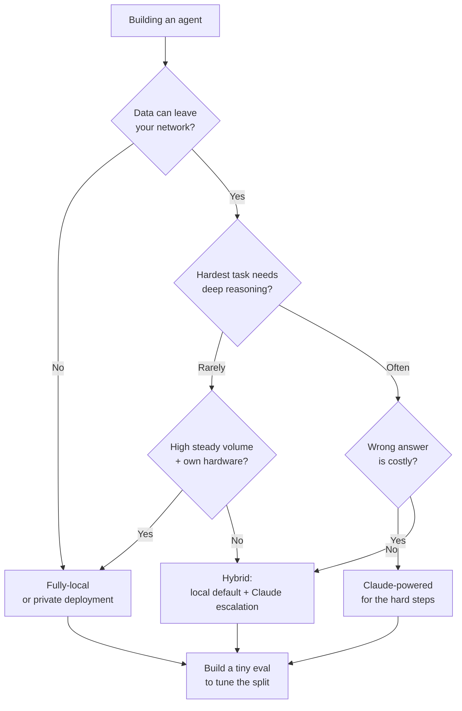

<LevelBadge level="intermediate" />

Estás construyendo un agente. La primera bifurcación real del camino: ¿funciona sobre un modelo de pesos abiertos **totalmente local** (privado, gratis de ejecutar, tuyo), sobre **Claude** (calidad de frontera, alojado), o sobre un **híbrido** de ambos? Esta página es un marco de decisión — los factores que realmente lo deciden, un flujo claro de "si X → inclínate por Y", y la realidad honesta de que **el híbrido suele ganar**: local para el 90% fácil/sensible, Claude para el 10% difícil.

<Callout type="objectives" items={[
  "Nombrar los factores que realmente deciden entre local, Claude e híbrido",
  "Recorrer un flujo de decisión claro de 'si X → inclínate por Y' para tu agente",
  "Entender por qué un híbrido (local por defecto + escalada a Claude) suele superar a cualquiera de los extremos",
  "Salir con una evaluación diminuta como desempate — no con una tabla de clasificación",
]} />

<VerifyNote lastVerified="2026-06-28" source="https://artificialanalysis.ai/">
Las afirmaciones duraderas aquí — *existe una brecha de capacidad entre los mejores modelos de pesos abiertos y los de frontera, pero se sigue estrechando*, y *el enrutamiento/cascada (modelo barato primero, escalar en lo difícil) ahorra coste manteniendo la calidad* — son estables. Pero las **cifras específicas** (cuán grande es la brecha este mes, qué modelo abierto lidera, precios de Claude por token, tokens/seg exactos en un hardware dado) cambian constantemente. Trata cualquier cifra específica como perecedera y consulta un rastreador en vivo como [Artificial Analysis](https://artificialanalysis.ai/) antes de apostar por ella.
</VerifyNote>

## Las tres opciones, en un suspiro

- **Agente totalmente local** — un modelo de pesos abiertos (Llama, Qwen, Mistral, DeepSeek, etc.) ejecutándose en tu propio hardware vía Ollama/LM Studio/vLLM. Los datos nunca salen de tu máquina; ningún coste por llamada; funciona sin conexión; limitado por tu hardware y el techo del modelo. → [Agentes de IA locales](/docs/models/local-ai-agents)
- **Agente con Claude** — llama a la API de Claude. Razonamiento y uso de herramientas de frontera, sin infraestructura que cuidar, escala al instante; pero los datos salen de tu red, pagas por llamada y necesitas conectividad.
- **Híbrido** — un modelo local gestiona el grueso rutinario/sensible; los pasos difíciles o de alto riesgo escalan a Claude. El patrón hacia el que convergen la mayoría de los agentes en producción. → [Claude + modelos locales](/docs/models/claude-plus-local-models)

## Los factores que realmente lo deciden

Pasa tu agente por estos. La mayoría de las decisiones se resuelven solo con los dos o tres primeros.

| Factor | Se inclina hacia **local** cuando… | Se inclina hacia **Claude** cuando… |
|---|---|---|
| **Sensibilidad de los datos / privacidad** | Los datos están regulados o no pueden salir de tu red | Los datos no son sensibles o tienes un acuerdo de datos conforme |
| **Dificultad de la tarea y profundidad de razonamiento** | Las tareas son acotadas, bien definidas, repetitivas | Las tareas requieren razonamiento profundo de varios pasos, contexto largo, uso complicado de herramientas |
| **Necesidades de fiabilidad** | Un reintento o una persona basta ante un fallo | Cada paso debe ser correcto; los fallos son costosos |
| **Latencia** | El hardware local responde con suficiente rapidez | Prefieres pagar por velocidad que aprovisionar GPUs |
| **Coste a tu volumen** | Volumen alto y constante — el hardware fijo se amortiza | Volumen bajo/irregular — el pago por llamada supera a las GPUs ociosas |
| **Requisito de funcionar sin conexión** | Debe funcionar aislado / sin conectividad | Estar siempre en línea está bien |
| **Hardware del que dispones** | Tienes GPU(s) capaces / memoria unificada | No lo tienes y no quieres comprarlo/alquilarlo |
| **Presupuesto de mantenimiento** | Puedes ajustar, cuantizar, evaluar y mantenerlo | Quieres que "simplemente funcione" sin operaciones |

**Los dos que suelen decidirlo:** si los datos *no pueden* salir de tu red, eso por sí solo te empuja hacia local (o hacia un despliegue privado) independientemente de todo lo demás. Si pueden, entonces la **dificultad de la tarea** es el siguiente factor determinante — el trabajo fácil es barato de hacer localmente; el razonamiento difícil es donde la [brecha de frontera](/docs/models/choosing-a-model) todavía muerde.

<Callout type="info" items={[
  "La brecha de capacidad entre pesos abiertos y frontera es real, pero se estrecha rápido — los mejores modelos abiertos son excelentes en tareas rutinarias y en muchas de programación, y todavía quedan por detrás de la mayoría en el trabajo agéntico más difícil, de horizonte largo y de razonamiento profundo.",
  "Esa asimetría es precisamente lo que hace potente al híbrido: envía la mayoría fácil/sensible a local y reserva Claude para la porción que genuinamente necesita razonamiento de frontera.",
]} />

## El flujo de decisión

<Steps items={[
  {title: "¿Pueden los datos salir de tu red?", body: "Si NO → local (o un despliegue privado/VPC) es tu punto de partida. La privacidad es una restricción dura, no una preferencia — domina a los demás factores. Si SÍ → continúa por el flujo."},
  {title: "¿Cuán difícil es lo más difícil que tu agente debe hacer?", body: "Si toda tarea es acotada y repetitiva → un buen modelo local probablemente supera el listón; inclínate por local. Si algunos pasos necesitan razonamiento profundo, contexto largo, o una orquestación delicada de varias herramientas → inclínate por Claude al menos para esos pasos."},
  {title: "¿Cuán costosa es una respuesta equivocada?", body: "Si un fallo solo significa un reintento o un vistazo humano → las tolerancias locales están bien. Si un único paso malo es caro o inseguro → favorece la fiabilidad de Claude donde importa."},
  {title: "¿Cuál es tu volumen y hardware?", body: "Volumen alto y constante sobre hardware que ya posees → local se amortiza de maravilla. Volumen bajo o irregular, sin GPUs → el pago por llamada de Claude evita el hierro ocioso."},
  {title: "¿Realmente quieres operar infraestructura?", body: "Dispuesto a cuantizar, servir, monitorizar y reevaluar modelos → local/híbrido es viable. Quieres cero operaciones → Claude, o un híbrido donde la parte local sea sencillísima."},
  {title: "Por defecto híbrido, y luego demuestra que no lo necesitas", body: "Modelo local como trabajador por defecto; Claude como vía de escalada para la porción difícil/de alto riesgo. Empieza aquí salvo que el paso 1 fuerce puro-local o la tarea sea uniformemente difícil (entonces puro-Claude)."},
]} />

## Por qué el híbrido suele ganar

La mayoría de las cargas de trabajo reales son **desequilibradas**: una gran mayoría de las peticiones son fáciles y/o sensibles, y una pequeña minoría son genuinamente difíciles. Un híbrido explota esa forma directamente.

- **Local gestiona el 90% fácil/sensible** — rápido, gratis al margen, privado, capaz de funcionar sin conexión. El grueso de tu tráfico nunca toca una API.
- **Claude gestiona el 10% difícil** — el razonamiento de varios pasos, los casos límite ambiguos, los pasos donde acertar importa. Pagas precios de frontera solo por la porción que necesita calidad de frontera.

Este es el patrón de **cascada / enrutamiento**: prueba primero el modelo barato (local); escala a Claude cuando una señal de calidad diga que la respuesta local no es lo bastante buena, o enruta de entrada mediante un clasificador de dificultad/sensibilidad. Es una forma bien establecida de conservar la mayor parte de la calidad pagando una fracción del coste de todo-frontera — y funciona además como frontera de privacidad, ya que los casos sensibles pueden fijarse a "solo local".

<PromptCard title="Autocomprobación antes de comprometerte con un extremo">{`Answer for YOUR agent:
1. Must any data stay on my machine?            (yes -> local baseline)
2. What % of tasks are genuinely HARD?          (high -> Claude leans heavier)
3. What's a wrong answer cost me?               (high -> Claude on those steps)
4. My volume + hardware?                        (high+own GPU -> local amortizes)
5. Can I babysit infra?                         (no -> Claude or simple hybrid)

If answers conflict -> you've just described a HYBRID.
Now build the tiny eval below and let DATA pick the split.`}</PromptCard>

La advertencia honesta: el híbrido tiene **más piezas móviles** — dos rutas de modelo, un enrutador y una señal de calidad que mantener. Si tu agente es uniformemente simple *o* uniformemente difícil, una configuración de un solo modelo es más sencilla y probablemente la correcta. Recurre al híbrido cuando tu carga de trabajo sea genuinamente desequilibrada.

<Flashcards title="Vocabulario de la guía de decisión" cards={[
  {front: "Agente totalmente local", back: "Agente impulsado por un modelo de pesos abiertos en tu propio hardware. Privado, sin coste por llamada, capaz de funcionar sin conexión; limitado por tu hardware y el techo del modelo."},
  {front: "Agente con Claude", back: "Agente que llama a la API de Claude. Razonamiento y uso de herramientas de frontera, sin infraestructura, escala instantánea; los datos salen de tu red y pagas por llamada."},
  {front: "Híbrido (cascada / enrutamiento)", back: "El modelo local gestiona la mayoría fácil/sensible; Claude gestiona la minoría difícil/de alto riesgo. Probar-barato-primero-y-luego-escalar, o enrutar de entrada por dificultad/sensibilidad."},
  {front: "El factor decisivo, normalmente", back: "Primero la sensibilidad de los datos (¿pueden salir de la red?), luego la dificultad de la tarea (¿cuán difícil es el paso más difícil?). El resto son desempates."},
  {front: "La brecha de capacidad", back: "Los mejores modelos de pesos abiertos quedan por detrás de los de frontera principalmente en las tareas de razonamiento/agénticas más difíciles. Real pero estrechándose — que es precisamente por lo que el híbrido es tan eficaz."},
]} />

<Quiz title="Ponte a prueba" questions={[
  {q: "Tu agente procesa datos que legalmente no pueden salir de tu red. ¿Qué implica eso primero?", options: ["Usar Claude — es de mayor calidad", "Un despliegue totalmente local o privado es el punto de partida, independientemente de otros factores", "Elegir el que sea más barato por token"], answer: 1, explain: "La privacidad es una restricción dura. Si los datos no pueden salir de la red, eso domina la decisión — local (o un despliegue privado/VPC) es tu punto de partida antes de sopesar cualquier otra cosa."},
  {q: "¿Por qué un agente híbrido suele ganar en una carga de trabajo típica y desequilibrada?", options: ["Los modelos de frontera siempre son más baratos a escala", "Local gestiona la mayoría fácil/sensible de forma barata y privada; Claude se reserva para la minoría difícil que necesita razonamiento de frontera", "Elimina la necesidad de cualquier evaluación"], answer: 1, explain: "La mayoría de las cargas de trabajo son desequilibradas. Enrutar el 90% fácil/sensible a un modelo local y el 10% difícil a Claude conserva la mayor parte de la calidad a una fracción del coste de todo-frontera — y fija los casos sensibles a local."},
  {q: "¿Cuándo es una configuración de un solo modelo (puro-local O puro-Claude) mejor opción que el híbrido?", options: ["Siempre — el híbrido nunca vale la pena", "Cuando la carga de trabajo es uniformemente simple o uniformemente difícil, de modo que la maquinaria extra de enrutador y señal de calidad no se gana su sustento", "Solo cuando no tienes GPUs"], answer: 1, explain: "El híbrido añade piezas móviles (dos rutas, un enrutador, una señal de calidad). Si tus tareas son todas fáciles o todas difíciles, un solo modelo es más sencillo y normalmente correcto. El híbrido rinde cuando la carga de trabajo es genuinamente desequilibrada."},
]} />

## Luego haz lo único que lo zanja: pruébalo

Cada factor anterior estrecha el campo; **una evaluación diminuta elige al ganador.** No elijas por intuición ni por una tabla de clasificación pública.

- Recopila **de 10 a 50 casos reales** de tu carga de trabajo real, con respuestas conocidas como buenas (incluye tus casos más difíciles y más sensibles).
- Ejecuta tu lista corta — un modelo local candidato, Claude y (si procede) un enrutador híbrido — sobre los mismos casos.
- Puntúa la calidad, luego sopesa **el coste y la latencia a tu volumen real**. Una mejora de calidad del 2% que cuesta 10× puede no valer la pena; una mejora del 2% en el paso que debe ser correcto puede ser innegociable.
- Para un híbrido, la evaluación también te dice **dónde trazar la línea** — qué se escala a Claude y qué se queda en local.

Conserva la evaluación. Cuando aparezca un nuevo modelo de pesos abiertos o cambien los precios, volver a ejecutarla convierte una migración angustiosa en una comprobación de cinco minutos. → [Evaluaciones](/docs/power-user/evals)

<Callout type="takeaways" items={[
  "Decide en orden: primero la sensibilidad de los datos (¿pueden salir de la red?), luego la dificultad de la tarea (¿cuán difícil es el paso más difícil?). El resto — latencia, volumen, hardware, presupuesto de mantenimiento — son desempates.",
  "Puro-local gana en privacidad, funcionamiento sin conexión y coste a volumen alto y constante; Claude gana en el razonamiento más difícil, la fiabilidad y la escala sin operaciones.",
  "El híbrido suele ganar en cargas de trabajo desequilibradas: local para el 90% fácil/sensible, Claude para el 10% difícil — en cascada/enrutando y pagando precios de frontera solo donde se los ganan.",
  "La brecha de los pesos abiertos es real pero se estrecha — que es precisamente lo que hace al híbrido tan eficaz hoy.",
  "No decidas por intuición: construye una evaluación diminuta sobre TUS datos, sopesa el coste y la latencia a TU volumen, y consérvala para el próximo lanzamiento de modelo.",
]} />

## Fuentes y lecturas adicionales

- [Artificial Analysis](https://artificialanalysis.ai/) — comparaciones independientes y actualizadas con frecuencia de capacidad/precio/velocidad entre modelos abiertos y de frontera (el lugar para volver a comprobar los detalles perecederos).
- [Anthropic — Resumen de modelos](https://docs.anthropic.com/en/docs/about-claude/models) — la gama actual de Claude, contexto y capacidades.
- [Anthropic — Precios de la API](https://www.anthropic.com/pricing) — costes actuales por token para dimensionar tus cálculos a volumen.
- [Ollama](https://ollama.com/) · [LM Studio](https://lmstudio.ai/) — ejecuta modelos de pesos abiertos localmente para la vía local/híbrida.
- [Meta — Llama](https://www.llama.com/) · [Mistral — Modelos](https://docs.mistral.ai/getting-started/models/) — familias de pesos abiertos usadas comúnmente en agentes locales.

## Siguiente

- Construye el lado local → [Agentes de IA locales](/docs/models/local-ai-agents)
- Conecta el híbrido → [Claude + modelos locales](/docs/models/claude-plus-local-models)
- Encuadra la elección de forma amplia → [Elegir un modelo](/docs/models/choosing-a-model)
- Haz la decisión medible → [Evaluaciones](/docs/power-user/evals)
