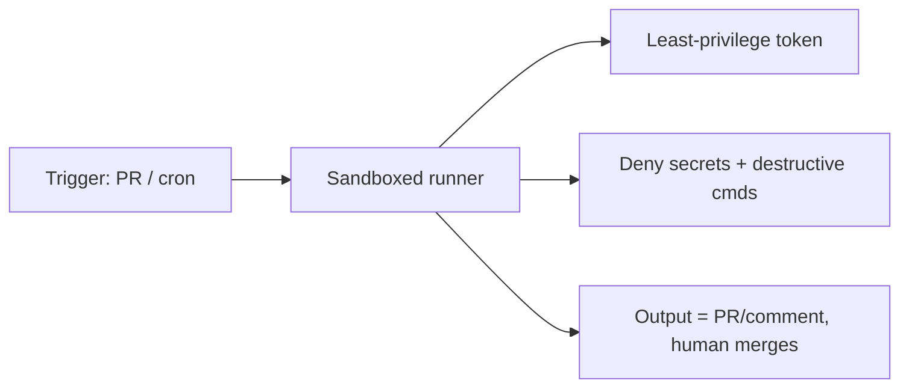

<LevelBadge level="advanced" />

Ejecutar Claude en modo [headless](/docs/claude-code/headless-and-agent-sdk) o de forma [programada](/docs/claude-code/background-tasks) — en CI, un cron job, un hook de pre-commit — elimina a la persona que normalmente detectaría una acción incorrecta. Esa comodidad es justamente la razón por la que estas ejecuciones necesitan las barreras de protección más estrictas.

## Los riesgos propios de las ejecuciones desatendidas

- **Nadie que diga "no"** a una llamada de herramienta arriesgada en el momento.
- **Credenciales ambientales.** CI suele tener tokens potentes (despliegue, registro de paquetes, nube). Un agente allí los hereda.
- **Entradas no confiables.** Una ejecución disparada por un PR o un issue puede procesar contenido escrito por un atacante ([inyección](/docs/security/prompt-injection)).

## Una lista de comprobación para el blindaje

- **Deniega los secretos explícitamente.** Bloquea la lectura de `.env`, archivos de claves y rutas de credenciales mediante [reglas de denegación de permisos](/docs/claude-code/permissions). No confíes en que el modelo los evite.
- **Nunca uses el modo bypass/yolo en una máquina con acceso real.** Reserva "saltar todas las confirmaciones" para sandboxes desechables.
- **Limita el alcance del token.** Dale a la ejecución un token con privilegios mínimos (de solo lectura cuando sea posible), no tus credenciales de acceso total.
- **Sandbox y efímero.** Ejecuta en un contenedor que se destruya después; sin acceso persistente a producción.
- **Usa listas de permitidos para comandos y dominios.** Permite tus comandos de test/lint/build; deniega los que usan red o son destructivos.
- **Pon límites.** Máximo de iteraciones, presupuesto de tiempo, presupuesto de tokens/coste — para que un bucle o un agente manipulado no se descontrole.
- **Haz que las salidas sean revisables, no aplicadas automáticamente.** Prefiere "abrir un PR / publicar un comentario" antes que "hacer push a main." Que un humano haga el merge.

## Ejemplo: un revisor de CI seguro

Un bot de revisión de PR debería: hacer checkout del código en modo solo lectura, **no** tener acceso a despliegue/secretos, ejecutarse en un contenedor y **comentar** sus hallazgos — nunca modificar ramas protegidas. Consulta el [tutorial de revisión de PR](/docs/walkthroughs/pr-review-action).

## Siguiente

- [Permisos y modos de permiso](/docs/claude-code/permissions)
- [Asegurar agentes y herramientas](/docs/security/securing-agents)
- [Modo headless y el Agent SDK](/docs/claude-code/headless-and-agent-sdk)
