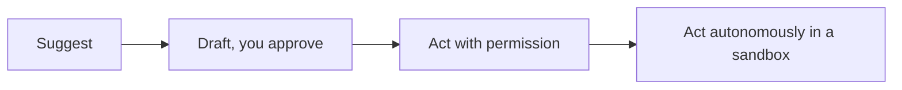

<LevelBadge level="all" />

Sacar el máximo provecho de la IA incluye usarla *de forma responsable*. Esta página es breve, práctica y aplica a todos — desde principiantes hasta quienes construyen.

## La mentalidad de verificación

El hábito más importante: **ajusta tu verificación a lo que está en juego.**

| Lo que está en juego | Ejemplo | Cuánto verificar |
|---|---|---|
| Bajo | Lluvia de ideas, borradores | Confía libremente, échale un vistazo |
| Medio | Un correo de trabajo, un resumen | Léelo, comprueba los datos con sentido común |
| Alto | Estadísticas publicadas, código que vas a ejecutar, asuntos legales/médicos/financieros | Verifica cada afirmación contra una fuente confiable |

La IA es un primer borrador rápido, nunca una autoridad final — consulta [Alucinaciones](/docs/foundations/hallucinations).

## La escalera de autonomía

Dale a la IA más independencia solo a medida que se gane tu confianza:

Empieza con "propone, yo apruebo" ([Modo Plan](/docs/claude-code/plan-mode)); reserva la autonomía total para trabajo de bajo riesgo, en sandbox y reversible ([Blindar las ejecuciones autónomas](/docs/security/hardening-autonomous-runs)).

## Privacidad y datos

- No pegues secretos, credenciales ni datos personales de terceros en una herramienta que no hayas evaluado.
- Conoce la política de manejo de datos y de entrenamiento de tu proveedor antes de compartir material sensible — consulta [Privacidad y manejo de datos](/docs/foundations/privacy).
- Para datos regulados o confidenciales, usa los entornos empresariales/controlados apropiados.

## Sesgo, equidad y límites

Los modelos reflejan los patrones de sus datos de entrenamiento, que pueden arrastrar **sesgos**. Ten especial cuidado cuando la salida de la IA influya en decisiones sobre personas (contratación, préstamos, moderación). Mantén a un humano como responsable de las decisiones de consecuencia, y trata la IA como una ayuda para el juicio, no como un sustituto de él.

## No delegues tu pensamiento

:::tip Usa la IA para pensar mejor, no menos
Los mejores usuarios se mantienen involucrados — cuestionan las salidas, aprenden de ellas y se apropian del resultado. Para estudiar, eso significa el [bucle de enseñar de vuelta](/docs/playbooks/learning), no copiar y pegar. Eres responsable de lo que entregas con la ayuda de la IA.
:::

## Seguridad, en breve

Si la IA llega a leer contenido no confiable (páginas web, correos, documentos) o realiza acciones, heredas un modelo de seguridad. Lee [Inyección de prompts](/docs/security/prompt-injection) y [Asegurar agentes](/docs/security/securing-agents).

## Siguiente

- [La inyección de prompts explicada](/docs/security/prompt-injection)
- [Alucinaciones y cómo reducirlas](/docs/foundations/hallucinations)
- [Privacidad y manejo de datos](/docs/foundations/privacy)
