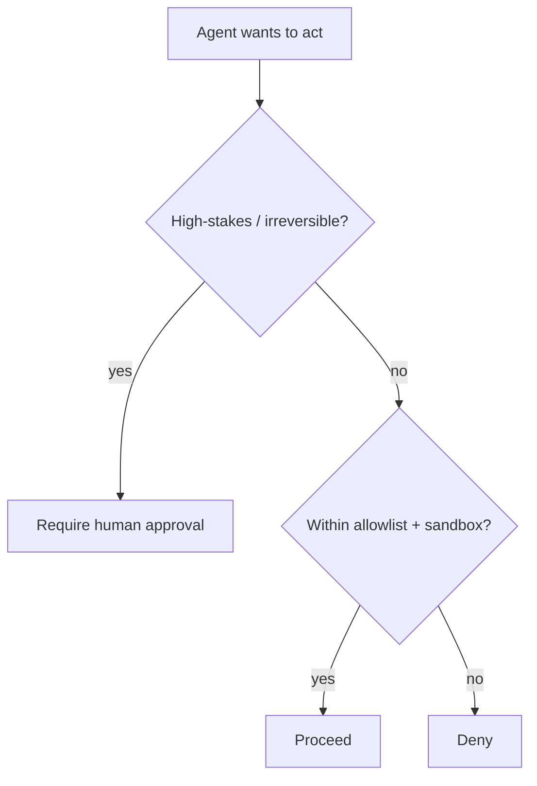

<LevelBadge level="advanced" />

En el momento en que una IA puede **realizar acciones** (llamar herramientas, ejecutar código, acceder a APIs), hereda un modelo de seguridad. El objetivo no es hacer que el modelo sea imposible de engañar — es asegurarse de que **incluso si lo engañan, no pueda causar mucho daño**.

## El principio central: privilegio mínimo

Dale a un agente el acceso **mínimo** que su trabajo requiere, nada más.

- Un resumidor de documentos necesita **lectura**, no escritura ni red.
- Un revisor necesita leer código y publicar un comentario — no hacer push ni desplegar.
- Limita el alcance de las herramientas, las claves de API y el acceso a archivos por tarea. Un agente de alcance reducido que sufre una [inyección](/docs/security/prompt-injection) solo puede causar un daño reducido.

## El problema del diputado confundido

Un agente a menudo actúa **con tu autoridad** (tus tokens, tus sesiones). Si una entrada controlada por un atacante lo dirige, el atacante toma prestados tus privilegios — un "diputado confundido". Defensa: no le entregues al agente autoridad ambiental que no necesita, y exige credenciales explícitas y de alcance limitado para las herramientas sensibles.

## Capas de defensa

1. **Sandbox** para la ejecución de código y el acceso a archivos — contenedores, directorios efímeros, sin acceso al sistema más amplio ni a los secretos.
2. **Listas de permitidos** para la superficie peligrosa: qué comandos, qué dominios, qué rutas. Deniega el resto. (En Claude Code, eso son los [permisos](/docs/claude-code/permissions).)
3. **Humano en el bucle** para acciones irreversibles o de alto riesgo: enviar dinero, correo, eliminar, desplegar, cambiar la configuración de producción.
4. **Separa las zonas de confianza.** No dejes que un mismo agente tenga simultáneamente secretos, lea contenido no confiable y haga llamadas salientes arbitrarias.
5. **Registra y revisa** qué herramientas llamó realmente el agente.

## Las herramientas tienen esquemas — valídalos

Las entradas de herramientas que el modelo produce pueden ser incorrectas o estar manipuladas. **Valida** los argumentos antes de ejecutar, y **devuelve los errores como resultados** para que el agente se recupere en lugar de reintentar a ciegas.

## Siguiente

- [La inyección de prompts explicada](/docs/security/prompt-injection)
- [Blindar las ejecuciones autónomas](/docs/security/hardening-autonomous-runs)
- [Revisar código de terceros](/docs/security/reviewing-third-party-code)
