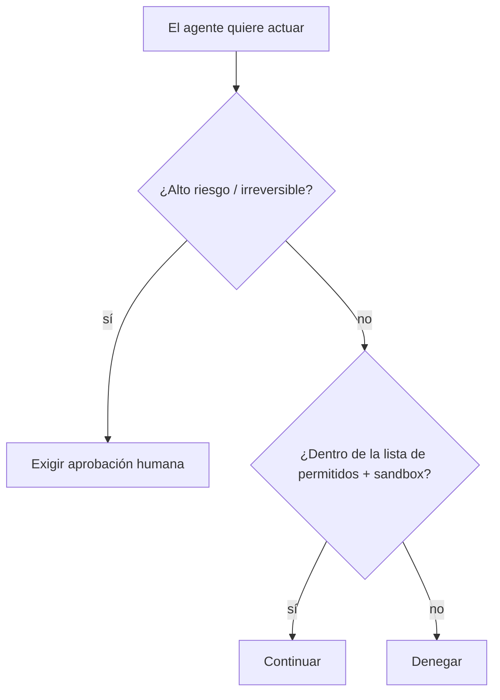

<LevelBadge level="advanced" />

<Callout type="objectives" items={["Aplica el privilegio mínimo — dale a un agente solo el acceso que su trabajo necesita", "Reconoce el problema del diputado confundido: un agente toma prestada tu autoridad", "Superpón las cinco defensas que reducen el radio de impacto cuando se engaña a un agente", "Decide qué acciones exigen un humano en el bucle", "Valida las entradas de las herramientas para que un argumento incorrecto o manipulado no pueda ejecutarse"]} />

En el momento en que una IA puede **realizar acciones** (llamar herramientas, ejecutar código, acceder a APIs), hereda un modelo de seguridad. El objetivo no es hacer que el modelo sea imposible de engañar — es asegurarse de que **incluso si lo engañan, no pueda causar mucho daño**.

## El principio central: privilegio mínimo

Dale a un agente el acceso **mínimo** que su trabajo requiere, nada más.

- Un resumidor de documentos necesita **lectura**, no escritura ni red.
- Un revisor necesita leer código y publicar un comentario — no hacer push ni desplegar.
- Limita el alcance de las herramientas, las claves de API y el acceso a archivos por tarea. Un agente de alcance reducido que sufre una [inyección](/docs/security/prompt-injection) solo puede causar un daño reducido.

## El problema del diputado confundido

Un agente a menudo actúa **con tu autoridad** (tus tokens, tus sesiones). Si una entrada controlada por un atacante lo dirige, el atacante toma prestados tus privilegios — un "diputado confundido". Defensa: no le entregues al agente autoridad ambiental que no necesita, y exige credenciales explícitas y de alcance limitado para las herramientas sensibles.

## Capas de defensa

Apílalas — ninguna por sí sola es suficiente. Cada capa asume que las que están por encima podrían fallar.

<Steps items={[
  {title: "Ejecuta en sandbox el código y el acceso a archivos", body: "Ejecuta el código y las operaciones de archivos en contenedores o directorios efímeros sin acceso al sistema más amplio ni a los secretos. Si se engaña al agente, juega dentro de una caja."},
  {title: "Pon en lista de permitidos la superficie peligrosa", body: "Decide qué comandos, qué dominios y qué rutas están permitidos — deniega el resto. En Claude Code, eso son los permisos (/docs/claude-code/permissions)."},
  {title: "Humano en el bucle para lo de alto riesgo", body: "Exige aprobación explícita para las acciones irreversibles o sensibles: enviar dinero, enviar correo, eliminar, desplegar o cambiar la configuración de producción."},
  {title: "Separa las zonas de confianza", body: "No dejes que un mismo agente tenga simultáneamente secretos, lea contenido no confiable y haga llamadas salientes arbitrarias — esa combinación es la vía de exfiltración."},
  {title: "Registra y revisa las llamadas a herramientas", body: "Registra qué herramientas invocó realmente el agente y con qué argumentos, para que puedas auditar el comportamiento y detectar desviaciones."}
]} />

## Pon la lista de permitidos por escrito

"Poner en lista de permitidos la superficie peligrosa" es fácil de aprobar con la cabeza y fácil de omitir. En Claude Code es concreto: un `settings.json` que permite el conjunto reducido de comandos y dominios que la tarea necesita y deniega el resto. Empieza de forma restrictiva y amplía solo cuando una tarea real quede bloqueada.

<PromptCard title="Un bloque de permisos de privilegio mínimo para Claude Code">{`{
  "permissions": {
    "allow": [
      "Read",
      "Edit",
      "Bash(npm test:*)",
      "Bash(npm run build:*)",
      "Bash(git status)",
      "Bash(git diff:*)"
    ],
    "deny": [
      "Bash(git push:*)",
      "Bash(rm:*)",
      "Bash(curl:*)",
      "Read(./.env)",
      "Read(./secrets/**)"
    ]
  }
}`}</PromptCard>

La lista `deny` gana sobre `allow`, así que bloquear `.env` y `secrets/**` se mantiene incluso si se concede un `Read` amplio. Consulta [permisos](/docs/claude-code/permissions) para la sintaxis completa de las reglas y su precedencia.

## Las herramientas tienen esquemas — valídalos

Las entradas de herramientas que el modelo produce pueden ser incorrectas o estar manipuladas. **Valida** los argumentos antes de ejecutar, y **devuelve los errores como resultados** para que el agente se recupere en lugar de reintentar a ciegas.

<Flashcards title="Repasa los términos clave" cards={[{front: "Privilegio mínimo", back: "Dale a un agente solo el acceso que su trabajo específico necesita — nada más. Un agente de alcance reducido que es engañado solo puede causar un daño reducido."}, {front: "Diputado confundido", back: "Un agente actúa con tu autoridad (tus tokens, tus sesiones). Si una entrada controlada por un atacante lo dirige, el atacante toma prestados tus privilegios."}, {front: "Sandbox", back: "Ejecuta el código y el acceso a archivos en un contenedor aislado o un directorio efímero sin vía hacia el sistema más amplio ni a los secretos, de modo que un agente engañado permanezca encajonado."}, {front: "Zonas de confianza", back: "Mantén los secretos, el contenido no confiable y la red saliente en agentes separados. Un solo agente que tenga los tres es una vía de exfiltración."}, {front: "Humano en el bucle", back: "Una puerta de aprobación humana obligatoria antes de acciones irreversibles o sensibles — enviar dinero, eliminar, desplegar, cambiar la configuración de producción."}]} />

<Quiz title="Ponte a prueba" questions={[
  {
    q: "¿Qué te pide hacer el principio de privilegio mínimo al configurar un agente?",
    options: ["Darle acceso amplio para que nunca se bloquee a mitad de tarea", "Darle solo el acceso que su trabajo específico requiere", "Darle los mismos permisos que el humano que lo ejecuta"],
    answer: 1,
    explain: "El privilegio mínimo significa el acceso mínimo que el trabajo necesita. Un agente de alcance reducido que sufre una inyección solo puede causar un daño reducido."
  },
  {
    q: "¿Por qué un agente que actúa con tus tokens es un riesgo de 'diputado confundido'?",
    options: ["Confunde qué modelo llamar", "Una entrada controlada por un atacante puede dirigirlo a usar tus privilegios", "Nombra diputados a otros agentes sin preguntar"],
    answer: 1,
    explain: "El agente tiene tu autoridad. Si una entrada controlada por un atacante lo dirige, el atacante efectivamente toma prestados tus privilegios — el problema del diputado confundido."
  },
  {
    q: "En un bloque de permisos de Claude Code, ¿qué entrada evita de forma fiable que el agente lea un archivo de secretos?",
    options: ["Una entrada allow para Read", "Una entrada deny para la ruta de secretos, ya que deny gana sobre allow", "Eliminar la herramienta Bash"],
    answer: 1,
    explain: "Deny tiene precedencia sobre allow, así que un deny en secrets/** se mantiene incluso cuando se concede un Read amplio."
  }
]} />

<Callout type="takeaways" items={["Privilegio mínimo primero: limita el alcance de las herramientas, las claves y el acceso a archivos por tarea para que un agente engañado solo pueda causar un daño reducido", "Un agente actúa con tu autoridad — no le entregues privilegios ambientales que no necesita (el problema del diputado confundido)", "Apila las cinco capas: sandbox, lista de permitidos, humano en el bucle, separar zonas de confianza, registrar y revisar", "En Claude Code, las reglas deny vencen a las reglas allow — bloquea explícitamente las rutas .env y secrets", "Valida los argumentos de las herramientas antes de ejecutar, y devuelve los errores como resultados para que el agente se recupere en lugar de reintentar a ciegas"]} />

## Siguiente

- [La inyección de prompts explicada](/docs/security/prompt-injection)
- [Blindar las ejecuciones autónomas](/docs/security/hardening-autonomous-runs)
- [Revisar código de terceros](/docs/security/reviewing-third-party-code)
