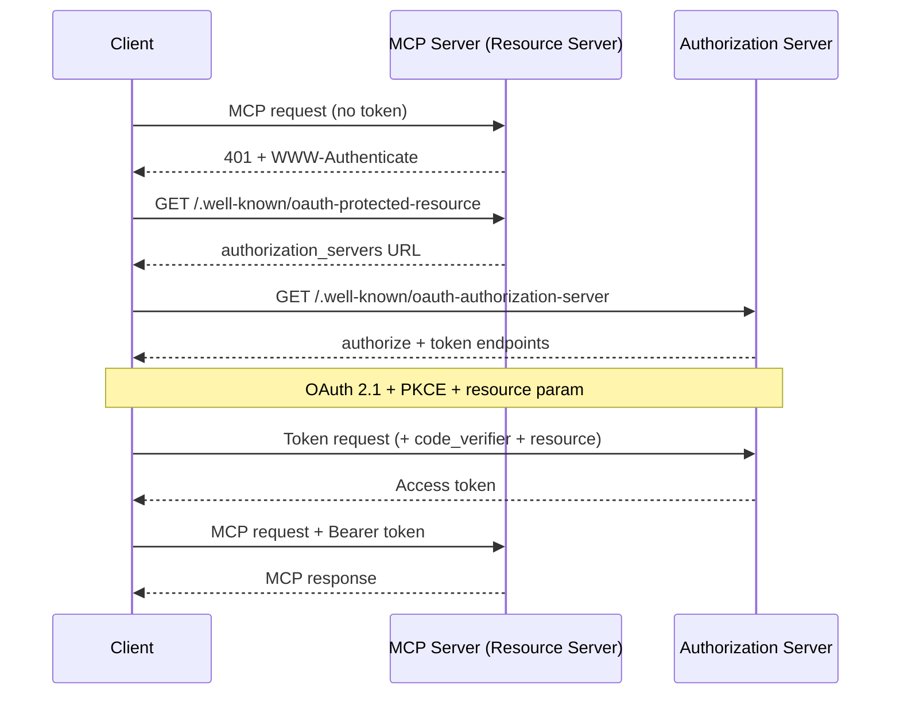
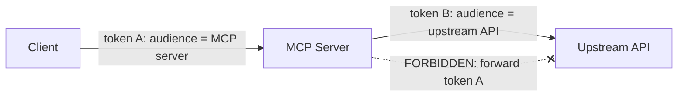

<LevelBadge level="advanced" />

<Callout type="objectives" items={["Entender por qué un servidor MCP remoto (HTTP) es un servidor de recursos OAuth 2.1, y no solo un endpoint con clave de API", "Seguir el handshake de descubrimiento: 401 → Metadatos de recurso protegido → Metadatos del servidor de autorización → token", "Explicar la vinculación de audiencia del token (RFC 8707) y por qué impide que el token de un servicio funcione en otro", "Nombrar la trampa del diputado confundido y la única regla que la cierra: nunca reenvíes el token de un cliente a una API upstream", "Aplicar una breve lista de verificación de endurecimiento antes de exponer un servidor MCP a internet"]} />

[MCP](/docs/claude-code/mcp) pasó de ser una novedad a la forma predeterminada en que los agentes acceden a herramientas, lo que significa que los servidores MCP ahora se sitúan frente a datos reales y acciones reales. Un servidor local que lanzas sobre **STDIO** confía en su entorno: lee las credenciales de variables de entorno y no hay ninguna frontera de red que defender. En el momento en que conviertes ese mismo servidor en **remoto** (HTTP), cualquiera que pueda alcanzar la URL puede intentar llamarlo. Eso lo convierte en un problema de autorización, y la especificación MCP responde con **OAuth 2.1**, no con un esquema de clave de API a medida.

Esta página trata sobre el caso remoto. Si tu servidor es solo STDIO, la especificación dice explícitamente que *no* sigas el flujo OAuth: extrae las credenciales del entorno y continúa.

<VerifyNote lastVerified="2026-07-07" source="https://modelcontextprotocol.io/specification/2025-06-18/basic/authorization" />

## Los tres roles

OAuth divide el problema en tres partes. MCP se mapea sobre ellas de forma limpia:

<Flashcards title="Quién es quién en un flujo OAuth de MCP" cards={[{front: "Servidor MCP = Servidor de recursos", back: "El elemento protegido. Acepta solicitudes que llevan un token de acceso, valida el token y devuelve datos, o un 401 si el token falta o es incorrecto. NO inicia sesión al usuario."}, {front: "Cliente MCP = Cliente OAuth", back: "Tu host de agente (Claude Code, la aplicación de escritorio, tu propio código). Obtiene un token en nombre del usuario y lo adjunta a cada solicitud como una cabecera Bearer."}, {front: "Servidor de autorización (AS)", back: "La parte que realmente habla con el usuario, obtiene el consentimiento y emite tokens. Puede estar alojado junto con el servidor o ser un proveedor de identidad separado. Su funcionamiento interno queda fuera del alcance de MCP."}]} />

El cambio mental clave: **el servidor MCP nunca gestiona el inicio de sesión por sí mismo.** Solo valida tokens que otro emitió. Esa separación es lo que te permite poner un proveedor de identidad estándar frente a un servidor que tú escribiste.

## El handshake de descubrimiento

Un cliente no debería necesitar estar preconfigurado con el lugar donde autenticarse. MCP hace que el descubrimiento sea automático, impulsado por un `401`:

<Steps items={[
  {title: "El cliente llama al servidor sin token", body: "La primera solicitud sale sin credenciales. El servidor la rechaza con HTTP 401 Unauthorized y una cabecera WWW-Authenticate que apunta a su URL de metadatos de recurso."},
  {title: "El cliente obtiene los metadatos de recurso protegido (RFC 9728)", body: "Hace un GET a /.well-known/oauth-protected-resource en el servidor. El campo authorization_servers del documento nombra al menos un servidor de autorización que el cliente puede usar."},
  {title: "El cliente obtiene los metadatos del servidor de autorización (RFC 8414)", body: "Hace un GET a /.well-known/oauth-authorization-server del AS para conocer los endpoints authorize y token y las capacidades soportadas."},
  {title: "Opcional: Registro dinámico de cliente (RFC 7591)", body: "Si el cliente no tiene un client ID para este AS, puede hacer un POST a /register para obtener uno sin intervención humana, algo crucial porque un cliente no puede conocer de antemano cada servidor MCP."},
  {title: "Autorización OAuth 2.1 con PKCE + resource", body: "El cliente genera un verificador/desafío PKCE, abre el navegador en la URL authorize incluyendo el parámetro resource, el usuario da su consentimiento, y el cliente intercambia el código devuelto (con el verificador) por un token de acceso."},
  {title: "El cliente reintenta con el token", body: "Ahora cada solicitud lleva Authorization: Bearer <token>. El servidor lo valida y responde."}
]} />

Fíjate en que **no hay configuración de autenticación fija** en el lado del cliente: el `401` arranca todo. Ese es el objetivo central: un agente puede conectarse a un servidor que nunca ha visto y descubrir cómo autenticarse.

## Vinculación de audiencia: la regla que sostiene todo

Aquí está el modo de fallo que la vinculación de audiencia existe para prevenir. Supongamos que un usuario tiene un token emitido para `calendar.example.com`. Un servidor MCP malicioso (o simplemente descuidado) en `evil.example.com` engaña al cliente para que le envíe *ese* token. Si `evil` lo acepta, ahora puede darse la vuelta y llamar a la API de calendario como el usuario. El token de un servicio funcionó en otro. La frontera de seguridad de OAuth acaba de colapsar.

La solución son los **Resource Indicators (RFC 8707)**:

<Steps items={[
  {title: "El cliente declara el destino", body: "Tanto en la solicitud de autorización como en la solicitud de token, el cliente DEBE incluir un parámetro resource fijado a la URI canónica del servidor MCP que pretende llamar, p. ej. resource=https://mcp.example.com. Lo envía incluso si no está seguro de que el AS lo soporte."},
  {title: "El AS vincula el token a esa audiencia", body: "Cuando es compatible, el AS sella el token de modo que solo sea válido para ese servidor de recursos específico."},
  {title: "El servidor valida la audiencia", body: "Antes de hacer cualquier trabajo, el servidor MCP DEBE verificar que el token fue emitido para ÉL, comprobando el claim de audiencia (RFC 9068). Un token acuñado para cualquier otro recibe un 401, sin más."}
]} />

<PromptCard title="Parámetro resource en la solicitud de autorización (codificado en URL)">{`&resource=https%3A%2F%2Fmcp.example.com`}</PromptCard>

Las URIs canónicas son estrictas: `https://mcp.example.com` y `https://mcp.example.com:8443/mcp` son válidas; `mcp.example.com` (sin esquema) y `https://mcp.example.com#frag` (fragmento) no lo son. Prefiere la forma sin barra final por interoperabilidad.

## El diputado confundido: nunca reenvíes el token

Este es el error que convierte un servidor MCP bienintencionado en el proxy de un atacante. Es el mismo [problema del diputado confundido](/docs/security/securing-agents) de la seguridad de agentes, afinado a una única regla concreta.

Un servidor MCP a menudo necesita llamar a una **API upstream** (GitHub, un servicio de base de datos, otro SaaS). La tentación es tomar el token que el cliente te entregó y reenviarlo upstream. **No lo hagas.** La especificación es tajante: el servidor MCP **NO DEBE** reenviar el token que recibió del cliente.

Por qué es peligroso: el token del cliente fue emitido para *tu* servidor como su audiencia. Si lo reenvías, la API upstream podría confiar en él como si viniera de ti, o asumir que ya lo validaste, y ahora un token con alcance para un salto está haciendo trabajo a dos saltos de distancia, fuera del modelo de consentimiento de nadie.

<Callout type="warning" items={["Si tu servidor MCP llama a una API upstream, actúa como un cliente OAuth SEPARADO frente a esa API y obtiene su PROPIO token del servidor de autorización upstream. Dos tokens independientes, dos audiencias independientes. El token del cliente se detiene en tu puerta."]} />

## Una lista de verificación de endurecimiento previa al despliegue

Antes de que un servidor MCP remoto toque internet público:

<Steps items={[
  {title: "Sirve todo sobre HTTPS", body: "Todos los endpoints del AS DEBEN ser HTTPS. Las URIs de redirección DEBEN ser HTTPS o localhost, nada más."},
  {title: "Valida la audiencia en cada solicitud", body: "Rechaza cualquier token que no haya sido emitido específicamente para este servidor. Esta es la única comprobación que detiene la reutilización de tokens entre servicios."},
  {title: "Exige PKCE", body: "Los clientes DEBEN usar PKCE para que un código de autorización interceptado sea inútil sin el verificador correspondiente."},
  {title: "Fija URIs de redirección exactas", body: "El AS DEBE cotejar las URIs de redirección exactamente contra los valores registrados previamente, y los clientes DEBERÍAN usar y verificar el parámetro state; ambos defienden contra el phishing por redirección abierta."},
  {title: "Tokens de vida corta + rotación de refresco", body: "Emite tokens de acceso de vida corta para limitar el daño de una filtración; para clientes públicos, rota los tokens de refresco. Almacena los tokens de forma segura y nunca los registres en logs."},
  {title: "Nunca pongas tokens en la URL", body: "Los tokens van en la cabecera Authorization, nunca en la cadena de consulta, donde acabarían en logs y referrers."},
  {title: "Añade las bases de la seguridad de agentes", body: "La vinculación de audiencia es la puerta de transporte; aun así aplica el mínimo privilegio, el sandboxing y el humano en el bucle de /docs/security/securing-agents. La autenticación dice QUIÉN; no dice que la solicitud sea segura."}
]} />

## Ponte a prueba

<Quiz title="Ponte a prueba" questions={[
  {
    q: "Un servidor MCP remoto recibe una solicitud sin token de acceso. ¿Qué exige la especificación que haga primero?",
    options: [
      "Pedir al usuario un nombre de usuario y una contraseña",
      "Devolver HTTP 401 con una cabecera WWW-Authenticate que apunte a su URL de metadatos de recurso",
      "Reenviar silenciosamente la solicitud a su API upstream",
      "Emitir un token al cliente él mismo"
    ],
    answer: 1,
    explain: "El servidor es un servidor de recursos, no una página de inicio de sesión. Responde a una solicitud sin token con 401 + WWW-Authenticate, lo que arranca el descubrimiento del servidor de autorización por parte del cliente."
  },
  {
    q: "¿Contra qué protege la vinculación de audiencia del token (RFC 8707)?",
    options: [
      "La validación lenta de tokens",
      "Que un token emitido para un servicio sea aceptado y reutilizado en un servicio diferente",
      "Que los usuarios olviden sus contraseñas",
      "Ventanas de contexto grandes"
    ],
    answer: 1,
    explain: "El parámetro resource vincula un token al servidor específico para el que fue acuñado. El servidor valida entonces el claim de audiencia y rechaza cualquier token emitido para otro, cerrando el agujero de reutilización entre servicios."
  },
  {
    q: "Tu servidor MCP necesita llamar a una API upstream de GitHub. ¿Qué debería hacer con el token de acceso que le envió el cliente?",
    options: [
      "Reenviar ese mismo token a GitHub para ahorrar un viaje de ida y vuelta",
      "Nada con GitHub: obtener su propio token separado como cliente OAuth frente a GitHub, y nunca reenviar el token del cliente",
      "Registrar el token para poder reproducirlo más tarde",
      "Poner el token en la URL de la solicitud a GitHub"
    ],
    answer: 1,
    explain: "Reenviar el token del cliente upstream es la trampa del diputado confundido y está explícitamente prohibido. El servidor actúa como su propio cliente OAuth frente a la API upstream con un token separado vinculado a la audiencia de esa API."
  },
  {
    q: "Para un servidor MCP STDIO (local), ¿cómo dice la especificación que deben gestionarse las credenciales?",
    options: [
      "Ejecutar el flujo completo de navegador OAuth 2.1 en cada lanzamiento",
      "Recuperarlas del entorno: el flujo de autorización OAuth es para transportes HTTP, no STDIO",
      "Codificarlas de forma fija en el cliente",
      "Omitir la autenticación por completo para todos los transportes"
    ],
    answer: 1,
    explain: "La especificación dice que los transportes STDIO NO DEBERÍAN seguir el flujo de autorización HTTP y en su lugar leer las credenciales del entorno. OAuth aquí es específicamente para servidores remotos basados en HTTP."
  }
]} />

## Fuentes y lecturas adicionales

- [Especificación de autorización de MCP (2025-06-18)](https://modelcontextprotocol.io/specification/2025-06-18/basic/authorization) — el flujo normativo, los roles y los requisitos MUST/SHOULD que esta página resume.
- [Buenas prácticas de seguridad de MCP](https://modelcontextprotocol.io/specification/2025-06-18/basic/security_best_practices) — el reenvío de tokens, el diputado confundido y por qué están prohibidos.
- [RFC 8707 — Resource Indicators for OAuth 2.0](https://www.rfc-editor.org/rfc/rfc8707.html) — el parámetro `resource` y la vinculación de audiencia.
- [RFC 9728 — OAuth 2.0 Protected Resource Metadata](https://datatracker.ietf.org/doc/html/rfc9728) — cómo un servidor de recursos anuncia sus servidores de autorización.
- [RFC 8414 — OAuth 2.0 Authorization Server Metadata](https://datatracker.ietf.org/doc/html/rfc8414) y [RFC 7591 — Dynamic Client Registration](https://datatracker.ietf.org/doc/html/rfc7591).
- [Borrador de OAuth 2.1](https://datatracker.ietf.org/doc/html/draft-ietf-oauth-v2-1-13) — PKCE, seguridad de la comunicación y requisitos de manejo de tokens.
- Relacionado en AILmanac: [Protección de agentes y herramientas](/docs/security/securing-agents) · [Inyección de prompts](/docs/security/prompt-injection) · [MCP en Claude Code](/docs/claude-code/mcp).
