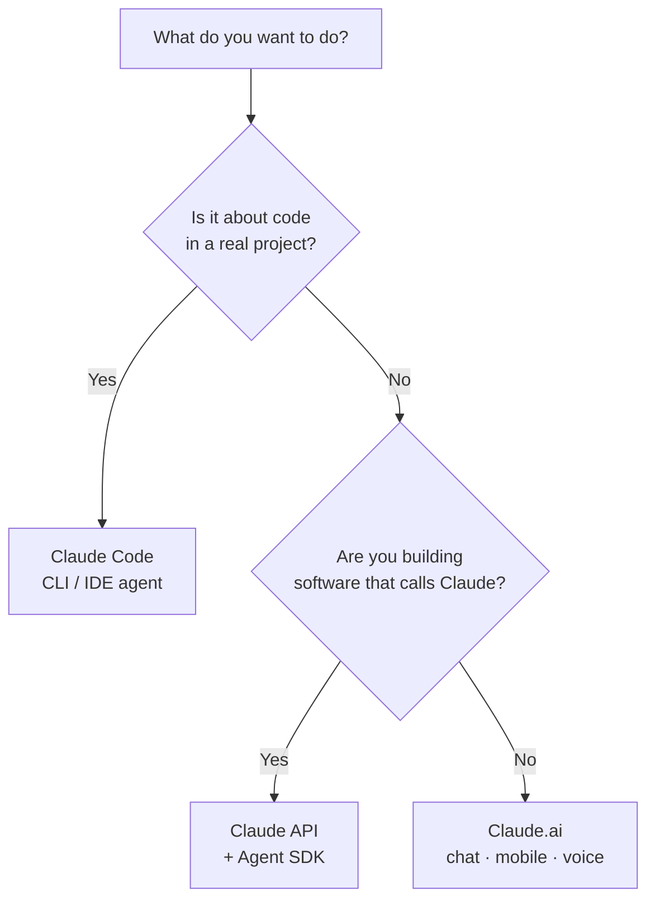

<LevelBadge level="beginner" />

"Claude" viene en unas cuantas variantes. Elige según **lo que intentas hacer**, no según cuál hayas oído mencionar.

## La decisión en 30 segundos

## Claude.ai — las apps de chat

**Para:** redacción, investigación, análisis, aprendizaje, planificación, preguntas del día a día. **Quién:** todo el mundo, sin configuración.

También lo tienes en **móvil** ([iOS/Android](/docs/claude-app/mobile)) y por **[voz](/docs/claude-app/voice-mode)**: ideal para captar ideas sobre la marcha. Potencíalo con [Proyectos](/docs/claude-app/projects), [instrucciones personalizadas](/docs/claude-app/custom-instructions) y [Artefactos](/docs/claude-app/artifacts). → Empieza en [Primeros pasos con Claude.ai](/docs/claude-app/getting-started).

## Claude Code — la herramienta de programación agéntica

**Para:** trabajar *en una base de código*: leer, editar, ejecutar comandos, arreglar pruebas. **Quién:** desarrolladores (y los técnicamente curiosos). Actúa sobre tus archivos con tu permiso. → [Qué es Claude Code](/docs/claude-code/what-is-claude-code).

## La API y el Agent SDK — integra Claude en tu propio software

**Para:** apps, automatizaciones y agentes que llaman a Claude de manera programática. **Quién:** desarrolladores que lanzan un producto o un pipeline. → [Tu primera llamada a la API](/docs/api/first-call).

## Funcionan juntos

No son productos rivales: la mayoría de la gente va graduándose entre ellos:

| Quieres… | Usa |
|---|---|
| Redactar un correo, resumir un PDF, hacer una lluvia de ideas | Claude.ai (o voz/móvil) |
| Refactorizar un módulo, añadir pruebas, arreglar un bug | Claude Code |
| Añadir una función de IA a *tu* app | La API / Agent SDK |

:::tip ¿No estás seguro? Empieza por el chat
[Claude.ai](/docs/claude-app/getting-started) no necesita configuración y te enseña cómo "piensa" Claude. Las habilidades se transfieren a todo lo demás.
:::

## Siguiente

- [Tus primeros 5 minutos](/docs/start-here/your-first-5-minutes)
- [Rutas de aprendizaje](/docs/start-here/learning-paths)
- [Elegir un modelo de Claude](/docs/api/choosing-a-model) (cuando ya estés construyendo)
