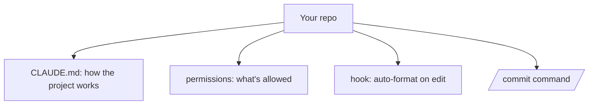

<LevelBadge level="intermediate" />

Convirtamos un checkout recién clonado en una configuración de Claude Code que *conozca tu proyecto y respete tus reglas* — en unos 20 minutos. Encadenaremos las funcionalidades principales con la justificación de cada una.

## El estado final



## Paso 1 — Genera y recorta CLAUDE.md

Ejecuta `/init` para esbozar un [CLAUDE.md](/docs/claude-code/claude-md), y luego **recórtalo** hasta lo que sea cierto: el stack, cómo ejecutar/probar/lintar, las convenciones reales y las salvaguardas ("ejecuta los tests antes de terminar", "no toques `/generated`"). *Por qué:* es la personalización con mayor apalancamiento — Claude lo lee en cada sesión.

Toma un punto de partida en [Plantillas de CLAUDE.md](/docs/templates/claude-md).

## Paso 2 — Configura los permisos

Añade un `.claude/settings.json` ([referencia](/docs/claude-code/settings)) que pre-autorice comandos seguros y repetitivos y deniegue los peligrosos:

```json
{
  "permissions": {
    "allow": ["Read", "Bash(npm run test:*)", "Bash(npm run lint)", "Bash(git diff:*)"],
    "ask": ["Write", "Bash(npm install:*)"],
    "deny": ["Read(./.env)", "Bash(git push --force:*)"]
  }
}
```

*Por qué:* menos interrupciones en acciones seguras, frenos en seco en las arriesgadas. Consulta [Permisos](/docs/claude-code/permissions).

## Paso 3 — Añade un hook de formateo

Formatea automáticamente tras cada edición ([hooks](/docs/claude-code/hooks)):

```json
{ "hooks": { "PostToolUse": [ { "matcher": "Edit|Write",
  "hooks": [ { "type": "command", "command": "npx prettier --write \"$CLAUDE_FILE_PATH\" 2>/dev/null || true" } ] } ] } }
```

*Por qué:* formateo consistente, garantizado — no un "por favor, acuérdate".

## Paso 4 — Añade un comando `/commit`

Coloca la receta `/commit` de la [Biblioteca de comandos de barra](/docs/templates/slash-commands) en `.claude/commands/`. *Por qué:* una sola palabra para un flujo de trabajo repetible.

## Paso 5 — Usa el Modo Plan para la primera tarea real

Da un objetivo real en el [Modo Plan](/docs/claude-code/plan-mode), revisa el plan y luego déjalo ejecutar. *Por qué:* construye confianza separando el pensar del hacer.

## Verifica que funcionó

- Sesión nueva → Claude hace referencia a tus convenciones sin que se lo pidas (CLAUDE.md funciona).
- Editar un archivo → se formatea (el hook funciona).
- Un comando arriesgado → pregunta o se niega (los permisos funcionan).
- `/commit` → un mensaje de Conventional Commit limpio (el comando funciona).

## Siguiente

- [Escribe tu primera Skill](/docs/walkthroughs/first-skill)
- [Recetas de Hooks y settings.json](/docs/templates/hooks-settings)
- [Programación y desarrollo de software](/docs/playbooks/coding)
