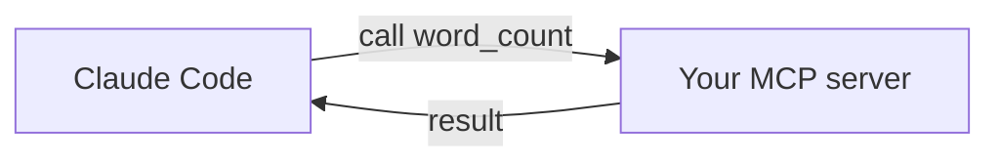

<LevelBadge level="advanced" />

<VerifyNote lastVerified="2026-06-20" source="https://modelcontextprotocol.io">
Las APIs del SDK de MCP y su configuración evolucionan — confírmalo con la documentación oficial de MCP y la documentación de MCP de Claude Code.
</VerifyNote>

Expongamos una herramienta personalizada a Claude construyendo un pequeño servidor [MCP](/docs/claude-code/mcp) y conectándolo. Lo mantendremos mínimo para que el *cableado* quede claro — y luego sustituyes la lógica por la tuya real.

## Qué vamos a construir

Un servidor stdio con una herramienta, `word_count`, que Claude puede llamar. El mismo patrón escala a "consulta mi BD", "abre un ticket", etc.



## Paso 1 — El servidor

`server.py` (Python; hay una versión en TypeScript en [andamiajes de MCP](/docs/templates/mcp-config)):

```python
from mcp.server.fastmcp import FastMCP

mcp = FastMCP("text-tools")

@mcp.tool()
def word_count(text: str) -> int:
    """Count the words in a piece of text."""
    return len(text.split())

if __name__ == "__main__":
    mcp.run()  # stdio transport
```

## Paso 2 — Decláralo

Añade a `.mcp.json` en la raíz de tu repositorio:

```json
{ "mcpServers": {
  "text-tools": { "command": "python", "args": ["server.py"] }
} }
```

## Paso 3 — Conecta y prueba

Inicia Claude Code en el repositorio. Pregunta: *"Usa el servidor text-tools para contar las palabras en: 'the quick brown fox'."* Claude debería llamar a `word_count` e informar `4`. Si no ve la herramienta, comprueba que el servidor arranca limpiamente por sí solo y que la ruta de `.mcp.json` es correcta.

## Paso 4 — Hazlo real

Reemplaza `word_count` por tu capacidad real — una consulta a una BD, una llamada a una API interna, una operación de archivos. Añade validación de entradas y devuelve los errores como resultados.

## Lista de verificación de seguridad

:::warning Un servidor es código + acceso
- **Mínimo privilegio** — solo los datos/acciones que necesita ([Asegurar agentes](/docs/security/securing-agents)).
- **Valida las entradas** que envía el modelo.
- Los datos no confiables que devuelve pueden acarrear [inyección de prompts](/docs/security/prompt-injection).
- **Revisa** cualquier servidor de terceros antes de conectarlo.
:::

## Siguiente

- [Servidores MCP en Claude Code](/docs/claude-code/mcp)
- [Configuración de MCP y andamiajes de servidor](/docs/templates/mcp-config)
- [Uso de herramientas / Function Calling](/docs/api/tool-use)
