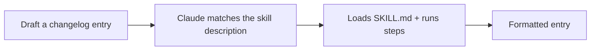

<LevelBadge level="intermediate" />

<VerifyNote lastVerified="2026-06-20" source="https://docs.anthropic.com/en/docs/claude-code/skills">
La estructura y el descubrimiento de las skills pueden cambiar — confírmalo con la documentación oficial de Skills.
</VerifyNote>

Construyamos una [Skill](/docs/claude-code/skills) funcional desde cero y demostremos que se activa. Haremos una pequeña skill de "entrada de changelog" — genérica y reutilizable.

## Paso 1 — Crea la carpeta

```bash
mkdir -p .claude/skills/changelog-entry
```

(Usa `~/.claude/skills/…` para una skill personal disponible en todos los proyectos.)

## Paso 2 — Escribe SKILL.md

`.claude/skills/changelog-entry/SKILL.md`:

```markdown
---
name: changelog-entry
description: Use when the user wants to turn recent git commits into a Keep a Changelog entry.
---

# Changelog Entry

When asked for a changelog entry:
1. Run `git log --oneline -20` to see recent commits.
2. Group them into Added / Changed / Fixed / Removed (Keep a Changelog style).
3. Write concise, user-facing bullets (not raw commit messages).
4. Output only the formatted entry.
```

La **`description` es el disparador** — escríbela como "Use when…" para que Claude la cargue en el momento adecuado.

## Paso 3 — (Opcional) añade un script auxiliar

Las skills pueden incluir scripts. Añade `scripts/recent.sh` y referéncialo desde SKILL.md si quieres una recopilación de datos determinista:

```bash
#!/usr/bin/env bash
git log --oneline -20
```

## Paso 4 — Demuestra que se dispara

Inicia una sesión y di: *"Redacta una entrada de changelog para el trabajo reciente."* Claude debería reconocer la intención, cargar la skill y seguir sus pasos. Si no se activa, probablemente tu `description` no sea lo bastante específica sobre *cuándo* usarla — afínala.



## Paso 5 — Compártela

Empaquétala (junto con otras) en un [plugin](/docs/claude-code/plugins-marketplaces) para que tu equipo la instale en un solo paso — o contribúyela a los [packs de skills](/docs/templates/skills) de AILmanac.

## Trampas comunes

- **Descripción vaga** → nunca se dispara (o se dispara siempre). Sé específico.
- **Demasiado en una sola skill** → mantén un único trabajo claro.
- **Secretos en una skill compartida** → nunca; consulta [Revisar código de terceros](/docs/security/reviewing-third-party-code).

## Siguiente

- [Skills: experiencia bajo demanda](/docs/claude-code/skills)
- [Plantillas de SKILL.md](/docs/templates/skills)
- [Construye y conecta tu primer servidor MCP](/docs/walkthroughs/first-mcp-server)
