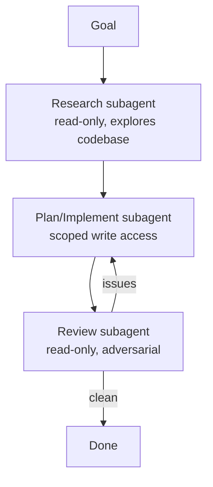

<LevelBadge level="advanced" />

Las tareas grandes salen mejor cuando las divides entre [subagentes](/docs/claude-code/subagents) enfocados en lugar de meterlo todo en un único contexto. Diseñemos un pipeline de investigación → implementación → revisión.

## La forma

Cada subagente tiene su **propio contexto** y un **conjunto de herramientas a medida** — y solo el *resultado* vuelve a la sesión principal, manteniéndola limpia.

## Paso 1 — Define los agentes

A través de la interfaz `/agents`, define tres, cada uno con una `description` ajustada (para que el agente principal delegue correctamente) y herramientas acotadas:

- **researcher** — solo lectura/búsqueda. Mapea el código relevante y devuelve hallazgos.
- **implementer** — puede editar archivos y ejecutar tests; recibe los hallazgos del researcher como entrada.
- **reviewer** — solo lectura, adversarial: busca bugs, casos que faltan y violaciones de convenciones.

## Paso 2 — Orquesta con traspasos

La sesión principal pasa la salida de cada etapa a la siguiente: investigación → implementación (usando la investigación) → revisión (de la implementación). Añade una **puerta de revisión**: si el reviewer encuentra problemas, vuelve al implementer antes de terminar.

## Paso 3 — Sé consciente de cuándo NO hacer esto

:::warning El paralelismo/multi-agente no es gratis
- Las **dependencias secuenciales** (la implementación necesita la investigación) siguen siendo secuenciales — no abras en abanico donde el orden importa.
- Las **escrituras compartidas en archivos** pueden entrar en conflicto — aíslalas con [git worktrees](/docs/claude-code/worktrees) o serialízalas.
- Para tareas pequeñas, el coste de coordinación supera el beneficio. Usa esto para trabajo **considerable y descomponible**.
:::

## Paso 4 — Verifica

Una buena ejecución multi-agente muestra: un contexto principal enfocado (la lectura pesada ocurrió en el researcher), una implementación que refleja la investigación y una revisión que realmente detectó algo (o dio el visto bueno de forma creíble). Si el reviewer es un sello de goma, haz que su prompt sea **adversarial** ("intenta encontrar qué está mal").

## Yendo más allá

El mismo patrón, de forma programática, es [Construir agentes sobre la API](/docs/api/building-agents) y superficies de producto como [Cowork y equipos de agentes](/docs/api/cowork-and-agent-teams).

## Siguiente

- [Subagentes y agentes en paralelo](/docs/claude-code/subagents)
- [Git Worktrees](/docs/claude-code/worktrees)
- [Construir agentes sobre la API](/docs/api/building-agents)
