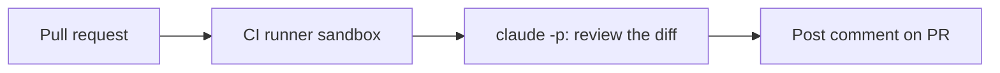

<LevelBadge level="advanced" />

<VerifyNote lastVerified="2026-06-20" source="https://docs.anthropic.com/en/docs/claude-code/sdk">
Los flags de modo headless y los detalles de integración con CI evolucionan — confírmalo con la documentación oficial de Claude Code / Agent SDK.
</VerifyNote>

Una automatización clásica de alto valor: hacer que Claude **revise cada pull request** y publique sus hallazgos como un comentario — ejecutándose en modo [headless](/docs/claude-code/headless-and-agent-sdk) en CI. Aquí tienes la forma, con las salvaguardas que la mantienen segura.

## Qué hace

En cada PR: descarga el diff, pide a Claude que lo revise en busca de bugs/casos límite/problemas de convenciones y publica un comentario. Los humanos siguen decidiendo; Claude solo aporta una primera pasada rápida.



## El flujo de trabajo (esbozo)

```yaml
name: Claude PR review
on: pull_request
permissions:
  contents: read
  pull-requests: write   # to comment — NOT write to code
jobs:
  review:
    runs-on: ubuntu-latest
    steps:
      - uses: actions/checkout@v4
        with: { fetch-depth: 0 }
      - name: Review the diff
        env:
          ANTHROPIC_API_KEY: ${{ secrets.ANTHROPIC_API_KEY }}
        run: |
          git diff origin/${{ github.base_ref }}...HEAD > /tmp/diff.patch
          claude -p "Review this diff for correctness bugs, missing edge cases, and
          security issues. Report ONLY high-confidence findings as a Markdown
          checklist with file:line. Diff:" < /tmp/diff.patch > /tmp/review.md
      # then post /tmp/review.md as a PR comment (e.g. with the gh CLI or an action)
```

(La invocación exacta en modo headless puede diferir — consulta la documentación. El principio es: alimenta el diff, captura el Markdown, publícalo.)

## Las salvaguardas (lee [Endurecer ejecuciones autónomas](/docs/security/hardening-autonomous-runs))

:::warning Mínimo privilegio en CI
- **Solo comentar.** Concede `pull-requests: write`, **no** `contents: write` — el bot no debería hacer push de código.
- **Acota el token**; nunca expongas acceso a despliegues/secretos a un job que lee contenido de PR no confiable.
- **Trata el contenido del PR como no confiable** — puede acarrear [inyección de prompts](/docs/security/prompt-injection); no dejes que el job realice acciones de consecuencia.
- **Limita el coste** — los diffs grandes cuestan [tokens](/docs/api/tokens-and-pricing); considera revisar solo los archivos modificados.
:::

## Hazlo útil, no ruidoso

- Pide **solo hallazgos de alta confianza** — un muro de quisquillosidades se ignora.
- Mantenlo como una **primera pasada**, con los humanos tomando la decisión de fusión.

## Siguiente

- [Modo headless y el Agent SDK](/docs/claude-code/headless-and-agent-sdk)
- [Endurecer ejecuciones autónomas](/docs/security/hardening-autonomous-runs)
- [Programación y desarrollo de software](/docs/playbooks/coding)
