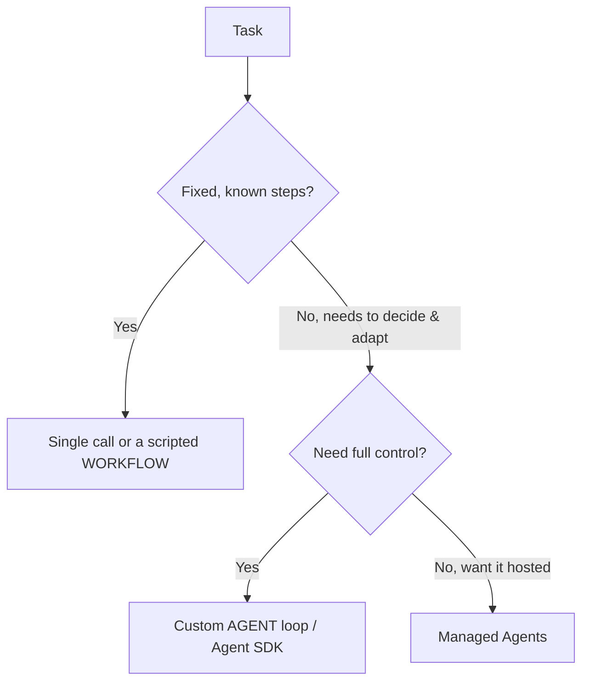

<LevelBadge level="advanced" />

<VerifyNote lastVerified="2026-06-20" source="https://docs.anthropic.com/en/docs/agents-and-tools">
L'outillage pour agents (le SDK Agent, les options managées) évolue rapidement — vérifiez les options actuelles dans la documentation officielle.
</VerifyNote>

Un **agent** est un modèle exécuté dans une boucle : il poursuit un objectif en appelant des [outils](/docs/api/tool-use), en observant les résultats et en décidant de l'étape suivante jusqu'à l'achèvement. Avant d'en construire un, choisissez *la chose la plus simple qui fonctionne*.

## Le test de décision (ne sur-construisez pas)

- **Appel unique** — un seul prompt y répond. La plupart des tâches. Le plus économique, le plus fiable.
- **Workflow** — vous orchestrez une séquence fixe d'appels dans le code (flux de contrôle déterministe). À utiliser lorsque les étapes sont connues.
- **Agent** — le modèle décide des étapes dynamiquement. À n'utiliser que lorsque le chemin ne peut véritablement pas être codé en dur.

> Tournez-vous vers un agent quand l'adaptabilité est l'enjeu — pas parce que ça sonne impressionnant. Un workflow que vous contrôlez est plus facile à tester et à déboguer.

## Concevoir la boucle

Un agent personnalisé minimal :

1. **Prompt système** : l'objectif, les contraintes et les outils disponibles.
2. **Boucle** : envoyer les messages → si `tool_use`, exécuter l'outil, ajouter `tool_result`, recommencer → jusqu'à une réponse finale ou une condition d'arrêt.
3. **Garde-fous** : un plafond d'itérations, un budget de tokens/coût, et la validation des entrées des outils.
4. **Gestion du contexte** : résumer/élaguer à mesure que l'historique grossit (même idée que la [gestion du contexte](/docs/claude-code/context-management)).

Le **[SDK Claude Agent](/docs/claude-code/headless-and-agent-sdk)** vous fournit cette boucle — outils, permissions, gestion du contexte — clé en main, pour que vous n'ayez pas à la bricoler.

## Rendez-le robuste

- **Bornez tout** : itérations, durée, coût. Les agents peuvent boucler.
- **Gérez les échecs d'outils** avec élégance (renvoyez l'erreur comme résultat).
- **Moindre privilège + humain dans la boucle** pour les actions risquées — voir [Sécuriser les agents](/docs/security/securing-agents).
- **Évaluez-le** sur des cas réels avant de lui faire confiance — voir [Évaluations](/docs/foundations/evals).

## Suite

- [Utilisation des outils](/docs/api/tool-use) · [Mode headless et SDK Agent](/docs/claude-code/headless-and-agent-sdk)
- [Agents managés](/docs/api/managed-agents) · [Cowork et équipes d'agents](/docs/api/cowork-and-agent-teams)
- [Sécuriser les agents et les outils](/docs/security/securing-agents)
