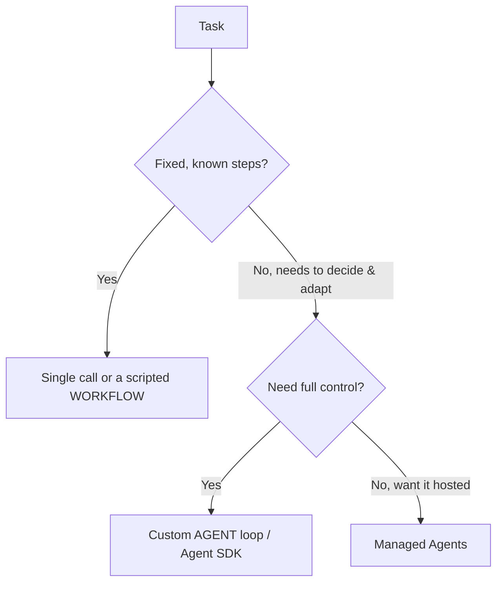

<LevelBadge level="advanced" />

<VerifyNote lastVerified="2026-06-20" source="https://platform.claude.com/docs/en/docs/agents-and-tools">
L'outillage des agents (l'Agent SDK, les options managées) évolue vite — confirmez les options actuelles dans la documentation officielle.
</VerifyNote>

<Callout type="objectives" items={["Définir ce qu'est réellement un agent : un modèle qui tourne dans une boucle", "Appliquer le test de décision pour choisir entre appel unique, workflow ou agent", "Concevoir une boucle d'agent minimale avec les bons garde-fous", "Savoir quand recourir au Claude Agent SDK plutôt que de tout coder à la main", "Rendre un agent robuste : le borner, gérer les échecs, restreindre les privilèges, l'évaluer"]} />

Un **agent** est un modèle qui tourne dans une boucle : il poursuit un objectif en appelant des [outils](/docs/api/tool-use), en observant les résultats et en décidant de l'étape suivante jusqu'à ce que ce soit terminé. Avant d'en construire un, choisissez *la chose la plus simple qui fonctionne*.

## Le test de décision (ne sur-construisez pas)

Toutes les tâches n'ont pas besoin d'un agent. Parcourez d'abord cet arbre — la plupart des tâches s'arrêtent tout en haut.

Trois options, la plus simple d'abord :

- **Appel unique** — un seul prompt y répond. La plupart des tâches. Le moins cher, le plus fiable.
- **Workflow** — vous orchestrez une séquence fixe d'appels dans le code (flux de contrôle déterministe). À utiliser quand les étapes sont connues.
- **Agent** — le modèle décide dynamiquement des étapes. À utiliser uniquement quand le chemin ne peut vraiment pas être codé en dur.

<Callout type="warning">
Recourez à un agent quand l'adaptativité est l'enjeu — pas parce que ça semble impressionnant. Un workflow que vous contrôlez est plus facile à tester et à déboguer.
</Callout>

## Concevoir la boucle

Un agent personnalisé minimal n'a que quatre pièces mobiles. Construisez-les dans cet ordre :

<Steps items={[
  {title: "Prompt système", body: "Énoncez l'objectif, les contraintes et les outils disponibles. C'est ce sur quoi le modèle raisonne à chaque tour."},
  {title: "La boucle", body: "Envoyez les messages → si la réponse est un tool_use, exécutez l'outil, ajoutez un tool_result, puis recommencez → jusqu'à une réponse finale ou une condition d'arrêt."},
  {title: "Garde-fous", body: "Ajoutez un plafond du nombre d'itérations, un budget de tokens/coût, et une validation des entrées des outils avant toute exécution."},
  {title: "Gestion du contexte", body: "Résumez ou élaguez à mesure que l'historique grandit — la même idée que celle abordée dans la Gestion du contexte (/docs/claude-code/context-management)."}
]} />

Le **[Claude Agent SDK](/docs/claude-code/headless-and-agent-sdk)** vous fournit cette boucle — outils, permissions, gestion du contexte — batteries incluses, pour que vous n'ayez pas à la coder à la main.

<Callout type="tip">
Avant d'écrire votre propre boucle, demandez-vous si l'Agent SDK la couvre déjà. Il livre la boucle, les permissions et la gestion du contexte, pour que vous puissiez vous concentrer sur les outils et l'objectif.
</Callout>

## Rendez-le robuste

Une boucle capable d'appeler des outils peut aussi mal se comporter. Quatre habitudes gardent un agent digne de confiance :

- **Bornez tout** : itérations, temps, coût. Les agents peuvent boucler.
- **Gérez les échecs d'outils** avec élégance (renvoyez l'erreur comme résultat).
- **Moindre privilège + humain dans la boucle** pour les actions risquées — voir [Sécuriser les agents](/docs/security/securing-agents).
- **Évaluez-le** sur des cas réels avant de lui faire confiance — voir [Évaluations](/docs/foundations/evals).

<Callout type="takeaways" items={["Un agent est un modèle dans une boucle qui appelle des outils vers un objectif — n'en utilisez un que quand le chemin ne peut pas être codé en dur", "Ordre de décision : appel unique → workflow → agent → agents managés ; privilégiez le plus simple qui fonctionne", "Une boucle minimale = prompt système + boucle tool_use/tool_result + garde-fous + gestion du contexte", "Le Claude Agent SDK livre pour vous la boucle, les outils, les permissions et la gestion du contexte", "Robustesse = borner itérations/temps/coût, gérer les échecs d'outils, moindre privilège + humain dans la boucle, et évaluer avant de faire confiance"]} />

## Testez-vous

<Quiz title="Testez-vous" questions={[
  {
    q: "Qu'est-ce qui décrit le mieux un agent dans ce contexte ?",
    options: [
      "Un prompt unique qui renvoie une réponse complète",
      "Un modèle qui tourne dans une boucle, appelle des outils et décide de l'étape suivante jusqu'à ce que ce soit terminé",
      "Une séquence fixe d'appels API que vous orchestrez dans le code",
      "Un service hébergé qui ne nécessite aucune configuration"
    ],
    answer: 1,
    explain: "Un agent est un modèle qui tourne dans une boucle : il poursuit un objectif en appelant des outils, en observant les résultats et en décidant de l'étape suivante jusqu'à ce que ce soit terminé."
  },
  {
    q: "La tâche a des étapes fixes et connues. Vers quoi devriez-vous vous tourner ?",
    options: [
      "Une boucle d'agent personnalisée, pour un contrôle maximal",
      "Les agents managés, pour que ce soit hébergé",
      "Un appel unique ou un workflow scripté",
      "Une équipe multi-agents"
    ],
    answer: 2,
    explain: "Quand les étapes sont fixes et connues, un appel unique ou un workflow scripté (flux de contrôle déterministe) est le bon choix, le plus simple."
  },
  {
    q: "Quand un agent personnalisé est-il réellement justifié ?",
    options: [
      "Chaque fois que ça semble plus impressionnant qu'un workflow",
      "Quand l'adaptativité est l'enjeu et que le chemin ne peut vraiment pas être codé en dur",
      "Pour toute tâche qui appelle plus d'un outil",
      "Uniquement quand vous ne pouvez pas utiliser l'Agent SDK"
    ],
    answer: 1,
    explain: "Recourez à un agent quand l'adaptativité est l'enjeu — pas parce que ça semble impressionnant. Un workflow que vous contrôlez est plus facile à tester et à déboguer."
  },
  {
    q: "Dans la boucle, que se passe-t-il quand le modèle répond par un tool_use ?",
    options: [
      "Vous arrêtez la boucle et renvoyez la réponse partielle",
      "Vous exécutez l'outil, ajoutez un tool_result et recommencez",
      "Vous jetez le message et renvoyez le prompt système",
      "Vous résumez immédiatement l'historique"
    ],
    answer: 1,
    explain: "La boucle : envoyer les messages → si tool_use, exécuter l'outil, ajouter tool_result, recommencer → jusqu'à une réponse finale ou une condition d'arrêt."
  },
  {
    q: "Lequel n'est PAS un des garde-fous pour rendre un agent robuste ?",
    options: [
      "Un plafond du nombre d'itérations et un budget de tokens/coût",
      "Gérer les échecs d'outils en renvoyant l'erreur comme résultat",
      "Accorder à l'agent tous les privilèges pour qu'il ne soit jamais bloqué",
      "Moindre privilège plus humain dans la boucle pour les actions risquées"
    ],
    answer: 2,
    explain: "Les agents robustes utilisent le moindre privilège plus l'humain dans la boucle pour les actions risquées — l'inverse d'accorder tous les privilèges. Vous bornez aussi itérations/temps/coût, gérez les échecs d'outils avec élégance, et évaluez avant de faire confiance."
  }
]} />

## Ensuite

- [Utilisation des outils](/docs/api/tool-use) · [Headless & Agent SDK](/docs/claude-code/headless-and-agent-sdk)
- [Agents managés](/docs/api/managed-agents) · [Cowork & équipes d'agents](/docs/api/cowork-and-agent-teams)
- [Sécuriser les agents et les outils](/docs/security/securing-agents)
