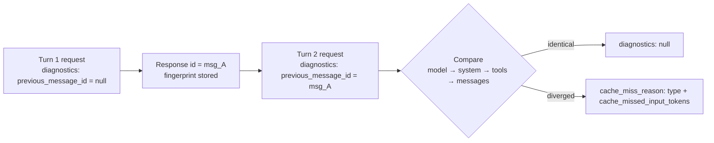

<LevelBadge level="advanced" />

<Callout type="objectives" items={[
  "Diagnostiquer un défaut de cache de prompt à partir de la réponse de l'API, au lieu de comparer les octets du prompt à la main",
  "Brancher l'objet diagnostics dans une requête et faire circuler previous_message_id à travers une boucle de conversation",
  "Lire les six types de cache_miss_reason et appliquer le correctif spécifique que chacun implique",
  "Distinguer un vrai bug d'une entrée de cache expirée en associant les diagnostics à usage",
  "Éviter les trois façons dont cet outil vous induit discrètement en erreur : la divergence la plus précoce uniquement, les comparaisons en attente, et un décompte de tokens qui n'est pas un chiffre de facturation"
]} />

Vous avez mis en place le [prompt caching](/docs/api/prompt-caching), vous l'avez déployé, et `cache_read_input_tokens` vaut **zéro**. Quelque chose a changé dans votre préfixe — mais la réponse ne vous donne aucun indice sur quoi. Le remède traditionnel est sinistre : sérialiser deux requêtes consécutives sur disque, les comparer octet par octet, et traquer un horodatage que quelqu'un a interpolé dans un prompt système il y a six mois.

**Les diagnostics de cache remplacent cela.** Transmettez l'`id` de votre réponse précédente, et l'API compare les deux requêtes et nomme le premier endroit où elles ont divergé — le modèle, le prompt système, les outils ou l'historique des messages — plus une estimation de la quantité de préfixe cacheable que vous avez perdue.

<VerifyNote lastVerified="2026-09-28" source="https://platform.claude.com/docs/en/build-with-claude/cache-diagnostics">
Les diagnostics de cache sont passés en **disponibilité générale sur l'API Claude le 23 septembre 2026** ; l'en-tête bêta `cache-diagnosis-2026-04-07` n'est plus requis, et les requêtes qui l'envoient encore fonctionnent comme avant. La disponibilité, les noms de champs et l'union `cache_miss_reason` sont tous susceptibles de changer — vérifiez dans la documentation officielle des diagnostics de cache.
</VerifyNote>

## Le modèle mental

L'API conserve une petite **empreinte** de chaque requête pour laquelle vous avez activé l'option, indexée par l'`id` de réponse de cette requête. Lors de votre requête suivante, vous renvoyez cet `id`, l'API reconstruit une empreinte pour la nouvelle requête, compare les deux, et signale le **premier point de divergence**.



Trois choses dans ce schéma importent plus que les noms de champs :

1. **L'objet est l'opt-in.** L'API stocke une empreinte *uniquement* pour les requêtes qui incluent `diagnostics`. Omettez-le sur un tour et la recherche du tour suivant échoue.
2. **L'ordre de comparaison est l'ordre du préfixe.** Le modèle, puis le système, puis les outils, puis les messages — le même ordre de gauche à droite dans lequel le cache lui-même est construit.
3. **Il signale une structure, pas un résultat de cache.** Les diagnostics répondent à *« ma requête a-t-elle changé ? »* — une question distincte de *« le cache a-t-il été touché ? »*. Il vous faut les deux lectures pour agir. Voir [Associez-les à usage](#pair-it-with-usage).

<Flashcards title="Vocabulaire des diagnostics de cache" cards={[
  {front:"Empreinte (fingerprint)", back:"Un enregistrement léger que l'API stocke pour toute requête qui inclut l'objet diagnostics. Uniquement des hachages cryptographiques et des estimations de nombre de tokens — jamais le texte brut du prompt. Indexé par l'id de réponse, cantonné à votre organisation et à votre espace de travail, il expire après une courte période."},
  {front:"previous_message_id", back:"L'id de la réponse à laquelle vous voulez comparer la requête actuelle. Passez null au premier tour pour activer l'option alors qu'il n'y a encore rien à comparer."},
  {front:"cache_miss_reason", back:"Une union discriminée sur type. Nomme le premier endroit où les deux requêtes ont divergé — ou explique pourquoi aucune comparaison n'a été produite."},
  {front:"cache_missed_input_tokens", back:"Porté par les quatre types *_changed. Une estimation du nombre de tokens d'entrée situés après le point de divergence — c'est-à-dire la quantité de préfixe cacheable que vous avez perdue."},
  {front:"Divergence la plus précoce uniquement", back:"La réponse nomme la première différence et s'arrête. Une divergence ultérieure peut être masquée derrière elle : le débogage est donc une boucle corriger-puis-remesurer, pas une lecture unique."}
]} />

## Instrumenter une conversation

<Steps items={[
  {title: "Ajoutez l'objet diagnostics à chaque tour", body: "Incluez diagnostics dans chaque requête, pas seulement celle que vous déboguez. L'API ne stocke une empreinte que pour les requêtes qui portent l'objet : un seul tour sans lui brise la chaîne et le tour suivant signale previous_message_not_found."},
  {title: "Passez null au premier tour", body: "Au premier tour, il n'y a rien à comparer. Envoyez previous_message_id à null — cela active l'option et enregistre l'empreinte. Le champ diagnostics de la réponse sera null, ce qui est attendu et non un échec."},
  {title: "Reportez l'id de réponse au tour suivant", body: "À chaque tour ultérieur, définissez previous_message_id avec l'id de la réponse précédente. Dans une boucle, c'est une seule variable que vous réaffectez après chaque appel."},
  {title: "Lisez diagnostics dans la réponse", body: "Sur les appels non streamés, c'est un champ diagnostics de premier niveau sur le Message. Sur les appels en streaming, il arrive dans l'événement message_start et est reporté jusqu'au message final accumulé."},
  {title: "Corrigez la cause signalée, puis mesurez à nouveau", body: "Seule la divergence la plus précoce est signalée. Après l'avoir corrigée, relancez — une deuxième cause a peut-être toujours été tapie derrière la première."}
]} />

La forme de la requête est réduite. Tout le reste de l'appel est inchangé :

<PromptCard title="Tour 2 — comparer avec la réponse précédente">{`curl https://api.anthropic.com/v1/messages \\
  -H "x-api-key: $ANTHROPIC_API_KEY" \\
  -H "anthropic-version: 2023-06-01" \\
  -H "content-type: application/json" \\
  -d '{
    "model": "claude-opus-5-5",
    "max_tokens": 1024,
    "cache_control": {"type": "ephemeral"},
    "system": "You are an AI assistant analyzing a large document. <document>...</document>",
    "messages": [
      {"role": "user", "content": "Summarize section 1."},
      {"role": "assistant", "content": "Section 1 covers..."},
      {"role": "user", "content": "Now summarize section 2."}
    ],
    "diagnostics": {"previous_message_id": "msg_01Xyz..."}
  }' | jq '{id, usage, diagnostics}'`}</PromptCard>

Dans une boucle multi-tours, cela se réduit à une seule variable réaffectée — `prev_id` commence à `None` et devient `r.id` après chaque appel :

```python
messages = []
prev_id = None

for turn, user_message in enumerate(prompts, start=1):
    messages.append({"role": "user", "content": user_message})

    r = client.beta.messages.create(
        model="claude-opus-5-5",
        max_tokens=1024,
        cache_control={"type": "ephemeral"},
        system=SYSTEM,
        messages=messages,
        diagnostics={"previous_message_id": prev_id},
    )

    if r.diagnostics is not None and r.diagnostics.cache_miss_reason is not None:
        print(f"Turn {turn} cache_miss_reason: {r.diagnostics.cache_miss_reason.type}")

    messages.append({"role": "assistant", "content": r.content})
    prev_id = r.id
```

## Lire la réponse

Le champ `diagnostics` a **trois** formes possibles, et confondre les deux premières est la mélecture la plus courante :

| Valeur | Signification |
|---|---|
| `null` | Soit vous n'avez pas envoyé l'objet `diagnostics`, soit `previous_message_id` valait `null` (premier tour), **soit** une comparaison a bien eu lieu et n'a trouvé aucune divergence. |
| `cache_miss_reason` vaut `null` | La comparaison était encore en cours au moment de la sérialisation de la réponse — cela peut arriver quand une réponse démarre très vite. Non concluant ; vérifiez au tour suivant. |
| `cache_miss_reason` est un objet | Un point de divergence, ou une explication de la raison pour laquelle aucune comparaison n'a été produite. |

:::caution `null` est ambigu à dessein
Un champ `diagnostics` à `null` signifie « rien à signaler » — ce qui couvre à la fois *« votre préfixe est identique »* et *« vous n'avez jamais activé l'option »*. Si vous voyez `null` partout alors que vous attendiez un diagnostic, vérifiez que vous envoyez réellement l'objet `diagnostics` sur les **deux** tours avant de conclure que votre prompt est stable.
:::

Un défaut renseigné ressemble à ceci :

```json
{
  "id": "msg_01Xyz...",
  "type": "message",
  "role": "assistant",
  "usage": {
    "input_tokens": 42,
    "cache_read_input_tokens": 0,
    "cache_creation_input_tokens": 41850,
    "output_tokens": 210
  },
  "diagnostics": {
    "cache_miss_reason": {
      "type": "system_changed",
      "cache_missed_input_tokens": 41850
    }
  }
}
```

## Les six raisons, et ce qu'il faut réellement changer

Quatre types nomment un point de divergence. Deux signifient qu'aucune comparaison n'a eu lieu du tout — et les lire comme « mon prompt a changé » vous lancera à la poursuite d'un bug qui n'existe pas.

| `type` | Ce qui a divergé | Le correctif |
|---|---|---|
| `model_changed` | Le `model` diffère de la requête précédente. Le cache est par modèle : un routeur, un test A/B ou un repli qui a changé de modèle en cours de conversation jette tout le préfixe. | Maintenez le modèle constant pendant toute la durée de vie d'une conversation cachée. Si vous avez besoin d'un repli, traitez chaque modèle comme sa propre lignée de cache. |
| `system_changed` | Le paramètre `system` diffère — presque toujours un horodatage, un identifiant de requête, un identifiant de session ou un nom d'utilisateur interpolé dans un prompt par ailleurs stable. | Faites du prompt système une constante stable au niveau des octets. Déplacez chaque valeur dynamique dans le premier message `user` **après** votre point de rupture de cache. |
| `tools_changed` | Le tableau `tools` diffère : un outil a été ajouté, retiré ou réordonné — ou le JSON de `input_schema` a été sérialisé de façon non déterministe entre deux tours. | Envoyez la même liste d'outils dans un ordre fixe à chaque tour, et sérialisez les schémas de façon déterministe (triez les clés des objets). |
| `messages_changed` | Le modèle, le système et les outils correspondent tous, mais une entrée antérieure de `messages` a été modifiée, réordonnée ou supprimée au lieu d'être simplement complétée par ajout. Généralement une troncature de l'historique, ou des tours assistant et des blocs `tool_result` re-sérialisés différemment lors du renvoi. | Traitez l'historique comme **append-only**. Renvoyez le `content` de l'assistant et les résultats d'outils textuellement au lieu de les reconstruire. |
| `previous_message_not_found` | Aucune empreinte stockée pour ce `previous_message_id`. **Ce n'est pas la preuve que votre requête a changé.** La requête précédente a omis l'objet `diagnostics`, s'est exécutée dans un autre espace de travail, ou est trop ancienne. | Envoyez `diagnostics` à chaque tour, et gardez les tours consécutifs rapprochés dans le temps. |
| `unavailable` | Aucun diagnostic n'a été produit. Couvre deux cas distincts : un paramètre affectant le prompt *autre que* le modèle, le système ou les outils différait, ou la conversation est suffisamment longue pour que la divergence se situe au-delà de l'horizon de comparaison. | Maintenez également constants `tool_choice`, `thinking`, `context_management`, `output_config`, `output_format` et l'ensemble de vos en-têtes `anthropic-beta` actifs — ils affectent tous le prompt. |

:::tip `unavailable` est celui que l'on mélit
Cela ne signifie **pas** « la fonctionnalité est cassée ». Le plus souvent, cela signifie que les quatre surfaces comparées correspondaient toutes et que quelque chose d'autre a bougé — l'ensemble des en-têtes bêta est un coupable favori, car il est généralement défini dans une configuration client partagée, loin du site d'appel, et personne n'y pense comme à une partie du prompt.
:::

<a id="pair-it-with-usage"></a>
## Associez-les à usage

Les diagnostics seuls ne sont que la moitié de la lecture. `usage.cache_read_input_tokens` est l'autre moitié, et les deux ensemble vous disent si vous regardez un bug ou de la physique.

| Diagnostics | Tokens lus en cache | Ce que cela signifie vraiment |
|---|---|---|
| `null` | Élevés | Fonctionne comme prévu. Préfixe stable, cache touché. Rien à faire. |
| `null` | Faibles ou nuls | **Ce n'est pas votre bug.** Les requêtes correspondaient ; l'entrée de cache avait simplement expiré. Réduisez l'écart entre les tours, ou passez à la [durée de cache d'une heure](https://platform.claude.com/docs/en/build-with-claude/prompt-caching#1-hour-cache-duration). |
| Un type `*_changed` | Faibles ou nuls | **C'est votre bug.** La requête a changé. Corrigez la cause que nomme le `type`. |
| Un type `*_changed` | Élevés | Rare. Quelque chose a changé tard dans le prompt mais un point de rupture `cache_control` antérieur a tout de même été touché. Cela vaut la peine d'être corrigé, impact faible. |

C'est cette deuxième ligne qui justifie la fonctionnalité. « Les lectures de cache sont à zéro » était auparavant indiscernable de « nous avons un bug de préfixe », et des équipes ont brûlé des jours sur la seconde hypothèse alors que la réponse était la première. Lus ensemble, les diagnostics séparent *votre* erreur de la durée de vie *du cache*.

Cette matrice s'applique aux tours où vous avez passé un véritable `previous_message_id`. Elle ne s'applique **pas** au premier tour (`diagnostics` vaut toujours `null` et les lectures de cache sont normalement nulles parce que le cache est en cours d'écriture), ni quand `cache_miss_reason` vaut `null`, `previous_message_not_found` ou `unavailable` — dans tous ces cas, aucune comparaison n'a été produite.

## Erreurs courantes

- **N'instrumenter que le tour en échec.** L'empreinte vit sur la requête *précédente*. Ajouter `diagnostics` uniquement au tour que vous déboguez garantit un `previous_message_not_found`. Instrumentez toute la boucle.
- **Traiter `cache_missed_input_tokens` comme un chiffre de facturation.** Il est dérivé des **longueurs en octets avant tokenisation**, c'est donc un indicateur d'ordre de grandeur — « vous avez perdu environ 40 k de préfixe », pas « vous avez été facturé 41 850 tokens ». Il peut différer de `usage.input_tokens`, et parfois le dépasser.
- **S'arrêter après un seul correctif.** Seule la divergence la plus précoce est signalée. Corriger `system_changed` peut immédiatement révéler un `tools_changed` qui était là depuis toujours. Remesurez après chaque correctif jusqu'à ce que les diagnostics se taisent.
- **Déboguer entre espaces de travail.** La requête précédente doit avoir été exécutée dans la même organisation *et* le même espace de travail. Comparez l'en-tête de réponse `anthropic-workspace-id` sur les deux réponses avant de faire confiance à un `previous_message_not_found`.
- **S'attendre à en disposer sur Bedrock ou Google Cloud.** Les diagnostics de cache sont **réservés à l'API Claude**. Si vous êtes multi-cloud, instrumentez le chemin API Claude, corrigez le préfixe là, et déployez le correctif partout — les règles de stabilité du préfixe sont identiques même là où le diagnostic n'est pas disponible.
- **Lire une comparaison en attente comme un certificat de bonne santé.** `cache_miss_reason: null` signifie que la comparaison n'était pas terminée au moment de la sérialisation de la réponse. C'est non concluant, pas un feu vert.

## Est-il sûr de le laisser activé ?

En grande partie, oui — et cela change la façon de l'utiliser. Il est **best-effort par conception** : les diagnostics ne bloquent ni ne font jamais échouer votre requête ; quand l'information n'est pas disponible, vous obtenez `unavailable` ou une raison `null` au lieu d'une erreur. L'empreinte stockée ne contient que des hachages cryptographiques et des estimations de nombre de tokens, jamais le texte brut du prompt, et la fonctionnalité est **éligible ZDR (qualifiée)**.

Cela rend raisonnable de laisser `diagnostics` branché en permanence dans un environnement de préproduction, plutôt que de le greffer pendant un incident — c'est la seule façon d'attraper la régression lente où quelqu'un ajoute un horodatage à un prompt système et où votre taux de succès de cache se dégrade en une semaine.

<Quiz title="Vérifiez vos acquis" questions={[
  {q:"Votre réponse du tour 2 revient avec diagnostics à null et cache_read_input_tokens à zéro. Quelle est l'explication la plus probable ?",options:["Un invalidateur silencieux a changé votre prompt système","Les requêtes correspondaient, mais l'entrée de cache avait déjà expiré","La fonctionnalité de diagnostics est indisponible sur votre compte"],answer:1,explain:"Un diagnostics à null avec de faibles lectures de cache signifie que les deux requêtes étaient identiques mais que l'entrée de cache n'était plus disponible. C'est un problème de TTL, pas un bug de préfixe — réduisez l'écart entre les tours ou passez à la durée de cache d'une heure."},
  {q:"Vous obtenez previous_message_not_found. Que cela vous dit-il sur votre prompt ?",options:["Rien — cela signifie qu'aucune empreinte n'a été stockée pour cet id","Que votre historique de messages a été tronqué","Que le modèle a changé entre les tours"],answer:0,explain:"previous_message_not_found n'est pas la preuve que votre requête a changé. Cela signifie qu'aucune empreinte stockée n'existe pour ce previous_message_id — généralement parce que la requête précédente a omis l'objet diagnostics, s'est exécutée dans un autre espace de travail, ou a été envoyée il y a trop longtemps."},
  {q:"Vous corrigez le system_changed signalé et l'exécution suivante signale tools_changed. Que s'est-il passé ?",options:["Votre correctif a introduit un nouveau bug dans le tableau des outils","Seule la divergence la plus précoce est signalée : la divergence des outils était donc masquée derrière celle du système","L'horizon de comparaison a été dépassé"],answer:1,explain:"La réponse ne signale que la divergence la plus précoce. Corriger la première cause expose ce qui était tapi derrière, et c'est pourquoi le débogage du cache est une boucle corriger-puis-remesurer plutôt qu'une lecture unique."},
  {q:"Comment faut-il traiter la valeur de cache_missed_input_tokens ?",options:["Comme le nombre exact de tokens qui vous ont été facturés","Comme un indicateur d'ordre de grandeur de la quantité de préfixe perdue","Comme la taille de votre point de rupture de cache"],answer:1,explain:"Elle est dérivée des longueurs en octets avant tokenisation : elle estime donc la quantité de préfixe cacheable située après le point de divergence. Traitez-la comme un indicateur d'ordre de grandeur, pas comme un chiffre de facturation — elle peut différer de usage.input_tokens et parfois le dépasser."}
]} />

<Callout type="takeaways" items={[
  "Envoyez l'objet diagnostics à chaque tour et reportez l'id de la réponse précédente — l'empreinte n'est stockée que pour les requêtes qui activent l'option.",
  "diagnostics répond à « ma requête a-t-elle changé ? » ; usage.cache_read_input_tokens répond à « le cache a-t-il été touché ? ». Il vous faut les deux pour distinguer un bug de préfixe d'une entrée expirée.",
  "Quatre types *_changed nomment un point de divergence ; previous_message_not_found et unavailable signifient qu'aucune comparaison n'a eu lieu et ne prouvent aucun changement.",
  "Seule la divergence la plus précoce est signalée : corrigez, remesurez et répétez jusqu'à ce que les diagnostics se taisent.",
  "cache_missed_input_tokens est une estimation d'ordre de grandeur dérivée des octets, pas un chiffre de facturation.",
  "API Claude uniquement — pas sur Amazon Bedrock ni Google Cloud — mais les règles de stabilité du préfixe qu'elle enseigne s'appliquent partout."
]} />

## Pour aller plus loin

- [Prompt caching et optimisation des coûts](/docs/api/prompt-caching) — placer correctement le point de rupture dès le départ, pour avoir moins à diagnostiquer.
- [Le prompt caching chez les différents fournisseurs](/docs/models/prompt-caching-across-providers) — les mêmes règles de préfixe sur OpenAI, Gemini et DeepSeek, et le calcul du seuil de rentabilité au-delà duquel le caching est une perte.
- [Tokens, contexte et tarification](/docs/api/tokens-and-pricing) — ce que coûtent réellement les tokens que vous venez d'arrêter de gaspiller.
