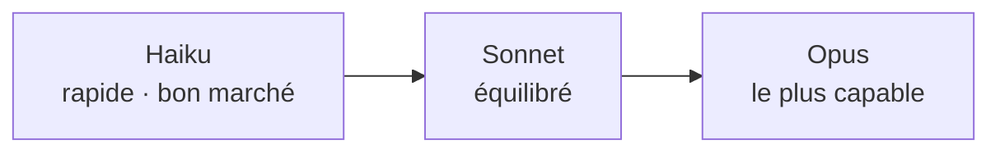

<LevelBadge level="beginner" />

Anthropic propose une famille de modèles à différents points de capacité/coût/vitesse. Bien choisir consiste surtout à faire correspondre le modèle à la tâche — et à ne pas surpayer une capacité dont vous n'avez pas besoin.

<Callout type="objectives" items={[
  "Lire l'échelle Haiku → Sonnet → Opus comme un compromis capacité/coût/vitesse",
  "Partir du bon défaut au lieu de deviner, puis monter ou descendre délibérément",
  "Mélanger les paliers dans un seul système — le plus grand levier de coût que la plupart des gens ne tirent jamais",
  "Rechercher l'identifiant de modèle exact de la bonne façon, pour que les mises à niveau restent un changement d'une ligne",
]} />

## Les modèles actuels

<ModelTable />

## À essayer : quel modèle convient ?

Répondez à trois questions et obtenez une recommandation de départ :

<ModelPicker />

## Le modèle mental : une échelle de capacités

- **Commencez avec Sonnet.** C'est la bête de somme par défaut — un raisonnement et un codage solides à un coût raisonnable. La plupart des tâches devraient débuter ici.
- **Montez à Opus** uniquement quand Sonnet peine et que la qualité importe plus que le coût (raisonnement difficile, agents délicats, code épineux).
- **Descendez à Haiku** pour le travail à fort volume, sensible à la latence ou simple (classification, extraction, routage, sous-agents bon marché).

## Comment choisir concrètement

<Steps items={[
  {title: "Par défaut Sonnet, et expédiez", body: "C'est la bête de somme équilibrée. Commencer ailleurs revient à optimiser avant d'avoir des preuves sur votre tâche réelle."},
  {title: "Vous atteignez un plafond de qualité ? Essayez Opus uniquement sur le sous-ensemble difficile", body: "Ne mettez pas à niveau la charge entière. Trouvez les cas où Sonnet échoue et routez seulement ceux-là vers Opus — vous achetez la qualité sans payer pour elle partout."},
  {title: "Coût ou latence font mal ? Voyez si Haiku est suffisant pour cette étape", body: "Classification, extraction, routage et sous-agents bon marché ont rarement besoin d'un modèle plus gros. Testez plutôt que de présumer."},
  {title: "Mélangez les modèles", body: "Utilisez Haiku pour le pré/post-traitement bon marché et Sonnet/Opus pour le cœur difficile. Ce palier de modèles est l'un des plus grands leviers de coût — voir Coût et latence."},
]} />

Le palier de modèles mérite sa propre lecture : [Coût et latence](/docs/foundations/cost-and-latency).

:::tip Ne choisissez pas à partir des seuls benchmarks
Les benchmarks publics sont un indice de départ, pas un verdict pour *votre* tâche. Lancez une petite [évaluation](/docs/foundations/evals) sur une poignée de vos vraies entrées avec deux modèles — cela prend quelques minutes et vaut mieux que de deviner.
:::

## Trouver l'identifiant de modèle exact

Passez toujours l'identifiant de modèle de l'API actuel (par ex. dans votre appel `messages.create`). Obtenez-le depuis le [tableau des modèles ci-dessus](/docs/whats-new/models-and-pricing) ou la page officielle des modèles — et préférez le lire depuis la configuration plutôt que de le coder en dur à de multiples endroits, afin que les mises à niveau de modèle soient un changement sur une seule ligne.

<Quiz title="Vérifiez-vous" questions={[
  {q: "Vous construisez quelque chose de nouveau et n'avez aucune donnée sur le modèle qui convient. Par où commencez-vous ?", options: ["Opus, puis rétrograder si c'est trop cher", "Sonnet — le défaut équilibré — puis monter ou descendre avec des preuves", "Haiku, puis mettre à niveau chaque fois que la sortie semble faible"], answer: 1, explain: "Sonnet est la bête de somme : raisonnement et codage solides à un coût sensé. Commencez là et expédiez, puis laissez les vrais échecs vous dire s'il faut atteindre Opus ou descendre à Haiku."},
  {q: "Sonnet gère bien 90 % de votre trafic mais échoue sur 10 % difficile. Meilleure décision ?", options: ["Déplacer tout vers Opus", "Router seulement le sous-ensemble difficile vers Opus et laisser le reste sur Sonnet", "Ajouter plus d'exemples et accepter les échecs"], answer: 1, explain: "Mettre à niveau la charge entière fait payer les prix Opus pour les cas déjà gérés par Sonnet. Router seulement le sous-ensemble difficile achète la qualité là où c'est nécessaire — l'essence du palier de modèles."},
  {q: "Un benchmark montre le modèle A battant le modèle B. Que devriez-vous conclure pour votre application ?", options: ["Utiliser le modèle A — les benchmarks tranchent", "Pas grand-chose — lancer une petite évaluation sur vos propres vraies entrées avec les deux", "Utiliser le modèle B, puisque les benchmarks sont toujours truqués"], answer: 1, explain: "Les benchmarks publics sont un indice, pas un verdict pour votre tâche. Une petite évaluation sur une poignée de vos vraies entrées prend quelques minutes et vaut mieux que de deviner."},
  {q: "Pourquoi lire l'identifiant de modèle depuis la configuration au lieu de le coder en dur dans votre codebase ?", options: ["Les chaînes codées en dur sont plus lentes à l'exécution", "Pour qu'une mise à niveau de modèle soit un changement d'une ligne au lieu d'une chasse dans chaque site d'appel", "L'API rejette les identifiants de modèle littéraux"], answer: 1, explain: "Les identifiants de modèle changent à mesure que la gamme évolue. Garder l'identifiant actuel en configuration signifie qu'une mise à niveau touche une seule ligne, et vous cherchez toujours la valeur dans le tableau des modèles vivant."},
]} />

<Callout type="takeaways" items={[
  "Haiku → Sonnet → Opus est une échelle capacité/coût/vitesse — choisissez un barreau, ne devinez pas un modèle.",
  "Par défaut Sonnet et expédiez ; ne montez ou ne descendez qu'avec des preuves issues de votre propre tâche.",
  "Mettez à niveau le sous-ensemble difficile, pas la charge entière — le routage bat les mises à niveau générales.",
  "Mélanger les paliers dans un seul système est l'un des plus grands leviers de coût à votre disposition.",
  "Les benchmarks sont un indice ; une petite évaluation sur vos vraies entrées est le verdict.",
  "Lisez l'identifiant de modèle depuis la configuration et cherchez-le dans le tableau des modèles vivant — ne codez jamais en dur des faits de modèle.",
]} />

## Suite

- [Tokens, contexte et tarification](/docs/api/tokens-and-pricing)
- [Votre premier appel à l'API](/docs/api/first-call)
- [Modèles et tarification actuels](/docs/whats-new/models-and-pricing)
