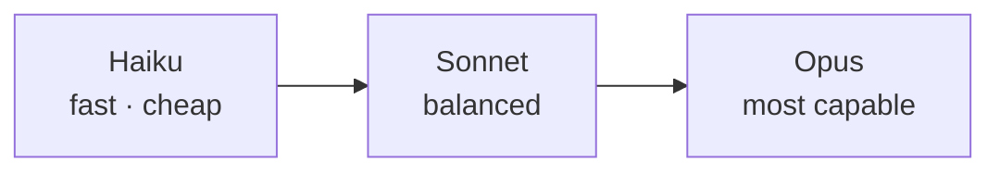

<LevelBadge level="beginner" />

Anthropic propose une famille de modèles à différents points de capacité/coût/vitesse. Bien choisir consiste surtout à faire correspondre le modèle à la tâche — et à ne pas surpayer une capacité dont vous n'avez pas besoin.

## Les modèles actuels

<ModelTable />

## À essayer : quel modèle convient ?

Répondez à trois questions et obtenez une recommandation de départ :

<ModelPicker />

## Le modèle mental : une échelle de capacités

- **Commencez avec Sonnet.** C'est la bête de somme par défaut — un raisonnement et un codage solides à un coût raisonnable. La plupart des tâches devraient débuter ici.
- **Montez à Opus** uniquement quand Sonnet peine et que la qualité importe plus que le coût (raisonnement difficile, agents délicats, code épineux).
- **Descendez à Haiku** pour le travail à fort volume, sensible à la latence ou simple (classification, extraction, routage, sous-agents bon marché).

## Comment choisir concrètement

1. **Par défaut, Sonnet** et expédiez.
2. **Vous atteignez un plafond de qualité ?** Essayez Opus uniquement sur le sous-ensemble difficile.
3. **Le coût ou la latence font mal ?** Voyez si Haiku est suffisant pour cette étape.
4. **Mélangez les modèles.** Utilisez Haiku pour le pré/post-traitement bon marché et Sonnet/Opus pour le cœur difficile. Ce « palier de modèles » est l'un des plus grands leviers de coût — voir [Coût et latence](/docs/foundations/cost-and-latency).

:::tip Ne choisissez pas à partir des seuls benchmarks
Les benchmarks publics sont un indice de départ, pas un verdict pour *votre* tâche. Lancez une petite [évaluation](/docs/foundations/evals) sur une poignée de vos vraies entrées avec deux modèles — cela prend quelques minutes et vaut mieux que de deviner.
:::

## Trouver l'identifiant de modèle exact

Passez toujours l'identifiant de modèle de l'API actuel (par ex. dans votre appel `messages.create`). Obtenez-le depuis le [tableau des modèles ci-dessus](/docs/whats-new/models-and-pricing) ou la page officielle des modèles — et préférez le lire depuis la configuration plutôt que de le coder en dur à de multiples endroits, afin que les mises à niveau de modèle soient un changement sur une seule ligne.

## Suite

- [Tokens, contexte et tarification](/docs/api/tokens-and-pricing)
- [Votre premier appel à l'API](/docs/api/first-call)
- [Modèles et tarification actuels](/docs/whats-new/models-and-pricing)
