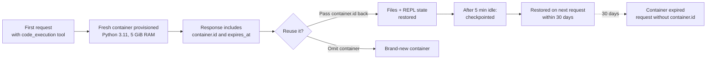

<LevelBadge level="intermediate" />

<Callout type="objectives" items={[
  "Activer le bac à sable avec un seul bloc d'outil et savoir ce que Claude en fait — commandes Bash, modifications de fichiers et (avec les versions plus récentes) un REPL Python persistant",
  "Choisir la bonne version de l'outil — code_execution_20250825 vs 20260120 vs 20260521 — et comprendre exactement ce que chacune débloque",
  "Faire entrer et sortir des fichiers — téléverser avec container_upload, capturer les fichiers générés via le motif OUTPUT_DIR",
  "Réutiliser un conteneur entre plusieurs requêtes pour garder l'état vivant jusqu'à 30 jours, et savoir quand un conteneur neuf est plus sûr",
  "Lire correctement la tarification — 1 550 heures gratuites par mois, puis 0,05 $ par heure-conteneur — et connaître la seule combinaison qui rend tout gratuit",
  "Éviter la confusion multi-environnements quand vous proposez l'exécution de code en parallèle de votre propre outil Bash"
]} />

<VerifyNote lastVerified="2026-08-25" source="https://platform.claude.com/docs/en/agents-and-tools/tool-use/code-execution-tool">
Les chaînes de version de l'outil, la compatibilité des modèles, les limites de ressources et les paliers tarifaires évoluent — revérifiez les noms de champs et les plafonds d'heures gratuites dans la référence officielle avant de concevoir une architecture autour d'un chiffre précis.
</VerifyNote>

L'**outil d'exécution de code** est le bac à sable côté serveur d'Anthropic : ajoutez un bloc JSON à votre tableau `tools` et Claude gagne un shell Bash, un éditeur de fichiers et un interpréteur Python 3.11, tous exécutés dans un conteneur Linux que l'API provisionne pour vous. Vous n'exécutez jamais de commandes et ne renvoyez jamais de blocs `tool_result` — l'API exécute chaque appel et diffuse la sortie dans la même réponse.

C'est la primitive qui sous-tend beaucoup de ce qu'Anthropic livre ensuite : le [programmatic tool calling](/docs/api/programmatic-tool-calling) exécute du Python dans ce même conteneur ; les nouveaux outils [web search](https://platform.claude.com/docs/en/agents-and-tools/tool-use/web-search-tool) et [web fetch](https://platform.claude.com/docs/en/agents-and-tools/tool-use/web-fetch-tool) l'utilisent de façon invisible pour le filtrage dynamique des résultats. Comprendre le bac à sable est payant sur toute la surface de la plateforme.

## Quand y recourir

<Callout type="info" items={[
  "Calculs non triviaux — grands nombres, nombreuses étapes, résultats sensibles à la précision que Claude devinerait sans exécuter",
  "Analyse de données sur des fichiers que vous téléversez — CSV, Excel, JSON, XML, images, PDF",
  "Génération de visualisations, de PDF ou de feuilles de calcul qu'un humain télécharge ensuite",
  "Scripts multi-étapes qui doivent sauvegarder un état intermédiaire et itérer — un REPL Python persistant entre les requêtes",
  "Toute charge de travail qui ferait autrement faire l'aller-retour d'un énorme résultat d'outil jusqu'au modèle — le bac à sable le filtre localement"
]} />

Claude n'exécutera *pas* de code pour de l'arithmétique simple, des faits bien connus, des demandes factuelles ou conversationnelles, ni des conversions d'unités basiques. Si la demande est à la limite, demandez explicitement : **« run code to verify this »**.

## Trois versions de l'outil — ce que chacune apporte

Il existe actuellement trois versions courantes de l'outil. Toutes trois renvoient les mêmes formes de blocs, et aucune ne nécessite d'en-tête `anthropic-beta`.

| Version                     | Ce qu'elle apporte                                                                                                                                                                                                                                              |
| --------------------------- | -------------------------------------------------------------------------------------------------------------------------------------------------------------------------------------------------------------------------------------------------------------- |
| `code_execution_20250825`   | Commandes Bash et opérations sur fichiers (`view`, `create`, `str_replace`). C'est ce qu'utilisent la plupart des exemples.                                                                                                                                      |
| `code_execution_20260120`   | Ajoute la **persistance de l'état du REPL** et la prise en charge du [programmatic tool calling](/docs/api/programmatic-tool-calling) depuis l'intérieur du bac à sable. L'état de l'interpréteur Python (variables, imports) survit aux requêtes qui réutilisent le conteneur.               |
| `code_execution_20260521`   | Même runtime que `20260120`. La description de l'outil divulgue désormais la **limite de 90 secondes de temps réel par cellule Python** dans le programmatic tool calling, afin que Claude puisse budgétiser les cellules longues au lieu d'être coupé en plein calcul.                       |

**Deux règles empiriques :**

- Si vous utilisez les outils web search ou web fetch actuels (`web_search_20260209` / `web_fetch_20260209` ou ultérieurs), vous **devez** être sur `code_execution_20260120` ou ultérieur — c'est la version d'exécution de code requise pour leur filtrage dynamique.
- Claude Haiku 4.5 accepte les nouvelles chaînes de type mais ne prend pas réellement en charge le programmatic tool calling ni la persistance du REPL ; sur Haiku, les versions plus récentes se comportent comme `code_execution_20250825`.

## Déclencher le bac à sable en une requête

<Steps items={[
  {title: "Ajoutez le bloc d'outil", body: "Incluez une entrée dans tools avec type défini à la version que vous voulez et name défini à code_execution. Il n'y a aucun autre paramètre — les deux champs sont fixes."},
  {title: "Envoyez un message qui bénéficie d'un calcul", body: "Demandez à Claude de calculer, d'analyser un fichier, de générer un graphique ou d'exécuter une commande shell. C'est Claude qui décide si la demande justifie une exécution."},
  {title: "Lisez la réponse entrelacée", body: "La réponse mêle des blocs server_tool_use (la commande que Claude a exécutée) à des blocs tool_result correspondants (stdout, stderr, return_code, et tout fichier capturé), suivis de la réponse textuelle de Claude."},
  {title: "Réutilisez éventuellement le conteneur", body: "La réponse inclut un objet container de premier niveau avec un id. Renvoyez cet id à la requête suivante pour garder vivants les fichiers et (avec les versions plus récentes de l'outil) l'état Python."}
]} />

<PromptCard title="Requête cURL minimale — moyenne et écart-type">{`curl https://api.anthropic.com/v1/messages \\
  -H "x-api-key: $ANTHROPIC_API_KEY" \\
  -H "anthropic-version: 2023-06-01" \\
  -H "content-type: application/json" \\
  -d '{
    "model": "claude-opus-5",
    "max_tokens": 4096,
    "messages": [{
      "role": "user",
      "content": "Use the code execution tool to calculate the mean and standard deviation of [1, 2, 3, 4, 5, 6, 7, 8, 9, 10]"
    }],
    "tools": [{
      "type": "code_execution_20250825",
      "name": "code_execution"
    }]
  }'`}</PromptCard>

La réponse entrelace des blocs `server_tool_use` avec des blocs `bash_code_execution_tool_result` (ou `text_editor_code_execution_tool_result`), puis le texte de synthèse de Claude.

## Les sous-outils offerts

Ajouter l'outil d'exécution de code débloque silencieusement deux sous-outils entre lesquels Claude peut choisir à n'importe quel tour :

- **`bash_code_execution`** — exécute n'importe quelle commande shell. Le résultat inclut `stdout`, `stderr`, `return_code`, et une liste `content` de tous les fichiers que la commande a laissés dans `$OUTPUT_DIR`.
- **`text_editor_code_execution`** — consulter, créer et modifier des fichiers (y compris du code source). Commandes prises en charge : `view`, `create`, `str_replace`. Les diffs reviennent sous forme de diff unifié (`old_start`, `new_start`, `lines`).

L'interpréteur Python n'est pas un sous-outil à part entière — Claude écrit du Python avec l'éditeur de fichiers et l'exécute avec une commande Bash. Avec `code_execution_20260120` ou ultérieur plus le programmatic tool calling, l'*état de l'interpréteur* persiste entre les cellules qui réutilisent le conteneur.

## Faire entrer des fichiers dans le conteneur

Téléversez le fichier avec la [Files API](https://platform.claude.com/docs/en/build-with-claude/files), puis référencez-le dans le message avec un bloc de contenu `container_upload`. L'environnement Python sait traiter le CSV, Excel (`.xlsx`, `.xls`), JSON, XML, les images (JPEG/PNG/GIF/WebP) et les formats textuels.

<PromptCard title="Téléverser un CSV et demander à Claude de l'analyser">{`# 1. Upload the file
FILE_ID=$(curl -sS https://api.anthropic.com/v1/files \\
  -H "x-api-key: $ANTHROPIC_API_KEY" \\
  -H "anthropic-version: 2023-06-01" \\
  -F "file=@data.csv" | jq -r '.id')

# 2. Reference it with a container_upload block
curl https://api.anthropic.com/v1/messages \\
  -H "x-api-key: $ANTHROPIC_API_KEY" \\
  -H "anthropic-version: 2023-06-01" \\
  -H "content-type: application/json" \\
  -d '{
    "model": "claude-opus-5",
    "max_tokens": 4096,
    "messages": [{
      "role": "user",
      "content": [
        {"type": "text", "text": "Analyze this CSV data"},
        {"type": "container_upload", "file_id": "'"$FILE_ID"'"}
      ]
    }],
    "tools": [{"type": "code_execution_20250825", "name": "code_execution"}]
  }'`}</PromptCard>

## Faire ressortir des fichiers — le motif `$OUTPUT_DIR`

Voilà le piège que personne ne documente avant qu'il ne morde : **seuls les fichiers situés au premier niveau de `$OUTPUT_DIR` sont capturés et renvoyés sous forme d'entrées `file_id`.** Chaque appel `bash_code_execution` reçoit un répertoire vide neuf disponible en tant que `$OUTPUT_DIR` ; tout ce que Claude écrit ailleurs dans le conteneur y reste et n'est pas restitué à votre client.

Si votre application dépend de la réception d'un fichier précis, soyez explicite dans le prompt et calquez la commande sur ce modèle pour que `ls` confirme la capture dans le même résultat d'outil :

```bash
python /tmp/make_report.py && cp /tmp/report.pdf "$OUTPUT_DIR/" && ls "$OUTPUT_DIR"
```

Claude ne voit pas la liste `content` de la réponse — seulement votre prompt et sa propre sortie standard — c'est donc la ligne `ls` qui lui indique que la copie a réussi.

Une fois capturés, les fichiers sont téléchargeables via la Files API (`client.files.download(file_id)`). Les fichiers que l'exécution de code *crée* via la Files API persistent jusqu'à ce que vous les supprimiez, indépendamment de l'expiration du conteneur à 30 jours.

## Le cycle de vie du conteneur



- **Les conteneurs vivent 30 jours à compter de leur création.** L'horodatage `expires_at` de chaque réponse est une valeur *glissante* plus courte et ne reflète pas la limite dure de 30 jours.
- **Après environ 5 minutes d'inactivité**, le conteneur fait l'objet d'un point de reprise. Envoyer une requête avec son ID dans la fenêtre de 30 jours le restaure.
- **Un conteneur expiré ne peut pas être réutilisé.** Les requêtes qui le référencent renvoient une erreur — renvoyez la requête sans le paramètre `container` pour en obtenir un neuf.

## Spécifications du runtime — ce qu'est réellement le bac à sable

| Propriété           | Valeur                                                                                                       |
| ------------------ | ----------------------------------------------------------------------------------------------------------- |
| Version de Python     | 3.11                                                                                                        |
| Système d'exploitation                 | Linux (x86_64 / AMD64)                                                                                      |
| Mémoire             | 5 Gio de RAM                                                                                                |
| Disque               | 5 Gio d'espace de travail                                                                                             |
| CPU                | 1                                                                                                            |
| Temps d'exécution     | Plafond sur l'invocation entière de l'outil appliqué par l'API ; avec le programmatic tool calling, chaque cellule du REPL ajoute un plafond de 90 secondes de temps réel |
| Internet           | **Complètement désactivé** — aucune requête réseau sortante                                                        |
| Isolation du bac à sable  | Isolation totale de l'hôte et des autres conteneurs                                                            |
| Portée de l'espace de travail    | Les conteneurs sont cantonnés à l'espace de travail de votre clé d'API                                                            |

Les bibliothèques préinstallées comprennent la pile data-science habituelle (pandas, numpy, scipy, scikit-learn, statsmodels), la visualisation (matplotlib, seaborn), le traitement de fichiers (pyarrow, openpyxl, xlsxwriter, xlrd, pillow, python-pptx, python-docx, pypdf, pdfplumber, pypdfium2, pdf2image, pdfkit, tabula-py, reportlab, Img2pdf), les mathématiques (sympy, mpmath), des utilitaires (tqdm, python-dateutil, pytz, joblib), ainsi que des outils en ligne de commande (`unzip`, `unrar`, `7zip`, `bc`, `rg`, `fd`, `sqlite`).

**Il n'y a pas de `pip install`.** Internet étant coupé, Claude ne peut pas récupérer de paquets supplémentaires à l'exécution. Concevez avec ce qui est déjà là.

## Tarification — et la seule combinaison qui la rend gratuite

<VerifyNote lastVerified="2026-08-25" source="https://platform.claude.com/docs/en/agents-and-tools/tool-use/code-execution-tool#usage-and-pricing">
Les plafonds d'heures gratuites et les tarifs horaires peuvent changer — revérifiez toujours la section tarifaire actuelle de la documentation officielle avant d'écrire une alerte budgétaire autour de ces chiffres.
</VerifyNote>

**L'exécution de code est gratuite quand votre requête inclut aussi web search ou web fetch** (`web_search_20260209` ou ultérieur, `web_fetch_20260209` ou ultérieur). Il n'y a aucun frais supplémentaire pour les appels à l'outil d'exécution de code dans ces requêtes au-delà du coût standard des tokens — cela couvre à la fois le filtrage dynamique qu'Anthropic exécute de façon invisible et tout code que Claude écrit directement.

Sans ces outils, l'exécution de code est facturée au temps d'exécution :

- Le temps d'exécution minimum facturé est de **5 minutes** par conteneur.
- Chaque organisation reçoit **1 550 heures gratuites par mois**.
- Au-delà du palier gratuit, l'usage supplémentaire coûte **0,05 $ par heure et par conteneur**.
- Si des fichiers sont joints à la requête, le conteneur est préchargé — le temps d'exécution est facturé même si Claude n'appelle jamais l'outil.

Suivez l'usage avec le compteur `usage.server_tool_use.code_execution_requests` de la réponse.

## Le piège multi-environnements

Si vous exposez aussi votre propre [outil Bash](https://platform.claude.com/docs/en/agents-and-tools/tool-use/bash-tool) ou votre REPL personnalisé, Claude a désormais *deux* environnements d'exécution sous les yeux : le conteneur en bac à sable d'Anthropic et le vôtre, local. L'état n'est pas partagé entre les deux — Claude l'oubliera occasionnellement et se tournera vers le mauvais.

Ajoutez des consignes explicites à votre prompt système quand les deux coexistent :

<PromptCard title="Clarificateur de prompt système pour les configurations multi-environnements">{`When multiple code execution environments are available, be aware that:
- Variables, files, and state do NOT persist between different execution environments.
- Use the code_execution tool for general-purpose computation in Anthropic's sandboxed environment.
- Use client-provided execution tools (e.g., bash) when you need access to the user's local system, files, or data.
- If you need to pass results between environments, explicitly include outputs in subsequent tool calls rather than assuming shared state.`}</PromptCard>

Le même piège se déclenche discrètement quand vous activez web search ou web fetch en parallèle de votre propre outil shell : l'exécution de code automatique provisionnée pour le filtrage dynamique compte comme un *deuxième* environnement, même si vous ne l'avez jamais ajoutée à `tools`.

## Les erreurs que vous verrez vraiment

| Outil        | Code d'erreur                | Signification                                                                    |
| ----------- | ------------------------- | -------------------------------------------------------------------------- |
| Tous         | `unavailable`             | Outil temporairement indisponible — réessayez avec un back-off                         |
| Tous         | `execution_time_exceeded` | L'invocation entière de l'outil a dépassé son temps maximum — bornez vos commandes    |
| Tous         | `invalid_tool_input`      | Paramètres mal formés                                                       |
| Tous         | `too_many_requests`       | Limite de débit — patientez avant de réessayer                                     |
| bash        | `output_file_too_large`   | La sortie de la commande a dépassé le plafond — découpez-la, redirigez-la vers un fichier            |
| text_editor | `file_not_found`          | La cible de consultation ou de modification n'existe pas                                        |

Une référence à un conteneur expiré renvoie une erreur, pas un conteneur neuf — omettez le paramètre `container` et réessayez.

Les réponses de longue durée peuvent inclure une raison d'arrêt `pause_turn`. Renvoyez la réponse telle quelle pour laisser Claude reprendre, ou modifiez-la pour l'interrompre.

## Migration depuis l'ancien outil Python seul

Si vous êtes encore sur l'ancien `code_execution_20250522` (Python seul, exigeant l'en-tête bêta `code-execution-2025-05-22`), la mise à niveau est un diff d'une ligne :

```diff
- "type": "code_execution_20250522"
+ "type": "code_execution_20250825"
```

Les nouvelles versions ajoutent Bash et les opérations sur fichiers par-dessus ce que faisait l'ancien outil — aucun en-tête bêta n'est nécessaire. Si vous analysez les réponses par programme, le type de bloc passe de `code_execution_result` aux formes `bash_code_execution_result` et `text_editor_code_execution_*_result`.

## Testez-vous

<Quiz questions={[
  {
    q: "Vous fournissez code_execution_20250825 et web_search_20260209 dans la même requête. À quoi ressemble la tarification ?",
    options: [
      "Paiement par recherche web + paiement par heure-conteneur d'exécution de code",
      "Exécution de code gratuite (web search est présent) ; vous payez toujours les tokens d'entrée/sortie standard",
      "Recherche web gratuite quand elle est associée à l'exécution de code",
      "Les deux outils gratuits — Anthropic offre la paire en bundle"
    ],
    answer: 1,
    explain: "Quand web_search_20260209 (ou ultérieur) ou web_fetch_20260209 (ou ultérieur) est dans votre requête, les appels à l'outil d'exécution de code n'entraînent aucun frais supplémentaire au-delà du coût standard des tokens — cela couvre à la fois le filtrage dynamique et tout code que Claude exécute directement."
  },
  {
    q: "Claude écrit /tmp/report.pdf pendant un appel bash_code_execution. Votre client extrait les identifiants de fichiers de la réponse — aucun PDF n'apparaît. Pourquoi ?",
    options: [
      "L'API ne capture que les fichiers situés au premier niveau de $OUTPUT_DIR — /tmp est dans le conteneur mais n'est pas renvoyé",
      "Les PDF exigent que la Files API soit activée séparément",
      "Vous devez interroger l'endpoint du conteneur pour récupérer les fichiers générés",
      "Bash ne peut pas produire de PDF — utilisez le sous-outil éditeur de texte"
    ],
    answer: 0,
    explain: "Chaque appel bash_code_execution reçoit un répertoire vide accessible en tant que $OUTPUT_DIR. Seuls les fichiers au premier niveau de ce répertoire sont capturés et renvoyés. Un fichier écrit dans /tmp est toujours dans le conteneur — vous pouvez réutiliser le conteneur et demander à Claude de le copier avec cp dans $OUTPUT_DIR."
  },
  {
    q: "Vous avez besoin que l'état du REPL (les liaisons de variables) persiste entre les requêtes. Quelle version de l'outil configurez-vous ?",
    options: [
      "code_execution_20250522 (ancienne)",
      "code_execution_20250825 — le REPL est toujours persistant",
      "code_execution_20260120 ou ultérieur, et renvoyez container.id à chaque requête ultérieure",
      "N'importe quelle version, du moment que vous définissez l'en-tête anthropic-beta: code-execution-repl"
    ],
    answer: 2,
    explain: "La persistance de l'état du REPL et le programmatic tool calling sont arrivés dans code_execution_20260120 et continuent dans _20260521. La persistance exige aussi de réutiliser le conteneur en renvoyant container.id à la requête suivante. Aucun en-tête bêta n'est nécessaire."
  }
]} />

## Vocabulaire

<Flashcards title="Glossaire de l'exécution de code" cards={[
  {front: "$OUTPUT_DIR", back: "Répertoire vide par commande dont les fichiers de premier niveau sont automatiquement capturés et renvoyés sous forme d'entrées file_id dans le résultat d'outil. Les fichiers écrits ailleurs dans le conteneur restent dans le conteneur."},
  {front: "container_upload", back: "Bloc de contenu qui référence un identifiant de fichier de la Files API, rendant le fichier disponible dans le bac à sable pour ce tour."},
  {front: "container.id", back: "Identifiant de premier niveau renvoyé avec toute réponse ayant utilisé l'exécution de code. Renvoyez-le à la requête suivante pour garder vivants les fichiers (et, sur les versions d'outil plus récentes, l'état du REPL Python) jusqu'à 30 jours."},
  {front: "server_tool_use", back: "Type de bloc dans la réponse qui montre la commande que Claude a demandé à l'API d'exécuter — apparié à un bloc bash_code_execution_tool_result ou text_editor_code_execution_tool_result correspondant."},
  {front: "pause_turn", back: "Raison d'arrêt indiquant que l'API a mis en pause un tour de longue durée. Renvoyez la réponse telle quelle pour laisser Claude continuer, ou modifiez-la pour l'interrompre."},
  {front: "Filtrage dynamique", back: "Usage automatique de l'exécution de code derrière web search / web fetch pour réduire ou transformer les résultats avant qu'ils n'atteignent le contexte. Provisionné par l'API — vous n'ajoutez pas l'outil pour cela."}
]} />

## À retenir

<Callout type="takeaways" items={[
  "Un bloc d'outil, un nom — code_execution_20250825 dans la plupart des cas, 20260120 ou 20260521 quand vous avez besoin de la persistance du REPL ou du programmatic tool calling",
  "La réutilisation du conteneur est le multiplicateur — renvoyez container.id pour garder les fichiers et l'état vivants jusqu'à 30 jours",
  "Fichiers entrants : container_upload avec un id de la Files API. Fichiers sortants : seuls les fichiers au premier niveau de $OUTPUT_DIR sont capturés",
  "Associez web search ou web fetch pour rendre l'exécution de code gratuite au-delà du coût des tokens",
  "Pas d'internet, pas de pip install — concevez autour de l'ensemble de bibliothèques préchargées",
  "Ajoutez des consignes multi-environnements à votre prompt système dès que vous exposez aussi votre propre outil Bash"
]} />

## Pour aller plus loin

- [Programmatic tool calling](/docs/api/programmatic-tool-calling) — appelez vos propres outils depuis Python dans le même conteneur
- [Budgets de tâches](/docs/api/task-budgets) — plafonnez la dépense totale en tokens sur une boucle agentique pour que du code de longue durée ne s'emballe pas
- [Prompt caching](/docs/api/prompt-caching) — réutilisez un préfixe stable pour garder les appels répétés bon marché
- [Outil advisor](/docs/api/advisor-tool) — associez un exécuteur rapide à un conseiller plus intelligent
