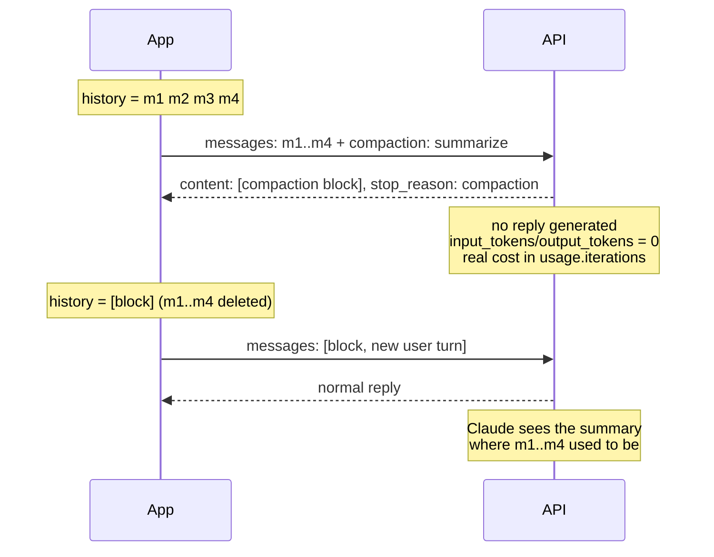

<LevelBadge level="advanced" />

<Callout type="objectives" items={[
  "Distinguer les quatre types de réduction du contexte — édition du contexte, compaction à la demande, keep-tail, en arrière-plan et par seuil — et choisir le bon",
  "Envoyer une requête de compaction et lire le bloc de compaction signé qui revient à la place d'une réponse",
  "Faire la substitution correctement : le bloc en premier, les messages résumés supprimés, l'en-tête beta sur chaque requête ultérieure",
  "Reconnaître les deux erreurs de substitution qui renvoient un HTTP 200 et corrompent silencieusement la conversation",
  "Gérer le cas où aucun résumé ne revient — cinq motifs d'arrêt, chacun avec un correctif différent",
  "Compter ce que coûte réellement la compaction (usage.iterations, pas les champs de tokens de premier niveau)",
  "Savoir ce qu'un résumé ne peut jamais transporter : images, documents, téléversements, URL récupérées et instructions système antérieures"
]} />

<VerifyNote lastVerified="2026-10-02" source="https://platform.claude.com/docs/en/build-with-claude/compaction-on-demand">
La compaction à la demande est en **beta publique** derrière l'en-tête `compact-2026-09-04`, lancée le 14 septembre 2026. La compaction par seuil est une beta distincte (`compact-2026-01-12`). Les en-têtes beta, les noms de champs, les codes d'erreur et la disponibilité par plateforme sont cités depuis la référence officielle et peuvent changer tant que la fonctionnalité est en beta — revérifiez avant de passer en production. Disponibilité au moment de la rédaction : API Claude, Claude Platform sur AWS, Google Cloud et Microsoft Foundry (toutes en beta) ; **non disponible sur Amazon Bedrock**. La prise en charge est une capacité propre à chaque modèle, pas une liste figée — voir [Vérifier la prise en charge au runtime](#vérifier-la-prise-en-charge-au-runtime) et [Modèles et tarifs](/docs/whats-new/models-and-pricing).
</VerifyNote>

Tout agent de longue durée finit par heurter le même mur : la conversation grandit jusqu'à ce que la prochaine requête ne passe plus. Vous avez deux options honnêtes — jeter l'ancien contexte, ou le *compresser*. La compaction est l'option compression, réalisée par le modèle, côté serveur : vous envoyez la conversation avec un paramètre supplémentaire et, au lieu d'une réponse, vous recevez un **bloc de résumé signé** que vous renvoyez à la place des messages qu'il remplace.

La signature est la partie intéressante. Le bloc n'est pas une chaîne que vous avez écrite et injectée — c'est du contenu produit par l'API, qu'elle vérifiera. Modifiez un seul caractère du texte du résumé et la requête suivante échoue avec `compaction_signature_invalid`.

## Quel outil de réduction fait quoi

Quatre fonctionnalités se recoupent ici, et les équipes les confondent constamment. Elles font des travaux différents :

| Fonctionnalité | Qui décide | Ce qu'elle fait | Où atterrit le bloc |
| --- | --- | --- | --- |
| **Édition du contexte** (`clear_tool_uses_20250919`) | Vous, de façon déclarative | **Supprime** purement et simplement les anciens résultats d'outils — aucun résumé | Pas de bloc ; voir [Mémoire et édition du contexte](/docs/api/memory-and-context-editing) |
| **Compaction à la demande** (`compaction`) | Vous, requête par requête | Résume les messages que vous envoyez, dans un appel distinct qui ne renvoie aucune réponse | Vous placez le bloc **en premier** et supprimez ce qu'il remplace |
| **Compaction keep-tail** | Vous, en choisissant une coupure | Comme à la demande, mais les derniers tours restent mot pour mot | Le bloc en premier, les tours conservés après lui |
| **Compaction en arrière-plan** | Vous, de façon asynchrone | Comme à la demande, mais la conversation continue pendant que le résumé est écrit | Le bloc remplace exactement les messages que vous avez envoyés ; les tours ultérieurs restent |
| **Compaction par seuil** (`compact_20260112`) | L'API, à un déclencheur de tokens | Résume le contexte plus ancien *en cours de route pendant une requête ordinaire* | Le bloc **suit** les messages résumés et l'API les retire pour vous |

Deux règles à mémoriser avant d'écrire la moindre ligne de code :

- **L'édition du contexte supprime, la compaction résume.** Pour des exécutions très longues, vous pouvez superposer les deux — mais pas dans la même requête que `compaction` (voir [Limites](#limites-et-interactions)).
- **La compaction à la demande et la compaction par seuil renvoient leurs blocs dans des directions opposées.** À la demande : le bloc passe en premier, vous retirez les anciens messages. Par seuil : le bloc vient en dernier, l'API les retire. Inverser les deux est l'erreur la plus fréquente de toutes.

## Comment fonctionne la substitution



La requête de compaction est **hors du chemin de la conversation** : elle transporte votre historique, elle renvoie un résumé, et elle ne génère aucun tour d'assistant. C'est votre prochaine requête réelle qui poursuit la conversation.

## Vérifier la prise en charge au runtime

La prise en charge de la compaction par un modèle est un indicateur de capacité, pas quelque chose à coder en dur. Appelez l'API Models avec l'en-tête beta et lisez `capabilities.compaction` sur chaque modèle. Cela résiste aux lancements et aux dépréciations de modèles comme une liste copiée ne le fera jamais.

## Lancez votre première requête de compaction

<Steps items={[
  {title: "Ajoutez l'en-tête beta", body: "Envoyez anthropic-beta: compact-2026-09-04 sur la requête de compaction ET sur chaque requête ultérieure qui transporte le bloc renvoyé. Oubliez-le sur une requête ultérieure et vous obtenez une erreur de validation déroutante disant que compaction n'est pas un type de bloc de contenu attendu — le message ne mentionne jamais l'en-tête."},
  {title: "Envoyez la conversation telle qu'elle est, plus le paramètre compaction", body: "Au niveau racine : compaction avec le type 'summarize'. L'API résume chaque message de la requête, exactement une fois, et renvoie le bloc seul."},
  {title: "Envoyez le même prompt système et les mêmes outils que pour le reste de la conversation", body: "Le résumeur les lit. Il n'exécute jamais d'outil. Sur les modèles à thinking préservé, le thinking des tours que vous conservez après le bloc ne reste valide que si le système et les outils correspondent."},
  {title: "Donnez à max_tokens de la vraie marge", body: "max_tokens plafonne tout l'appel de résumé, y compris le thinking que le modèle produit avant d'écrire le résumé. Plusieurs milliers de tokens est le bon ordre de grandeur — 4096 dans les exemples d'Anthropic eux-mêmes."},
  {title: "Compactez AVANT de dépasser la fenêtre", body: "La requête de compaction elle-même doit tenir dans la fenêtre de contexte du modèle. Une conversation déjà trop grosse pour être envoyée est trop grosse pour être compactée."},
  {title: "Vérifiez stop_reason avant de chercher le bloc", body: "Une compaction réussie se termine avec stop_reason 'compaction'. Tout autre motif d'arrêt signifie qu'aucun résumé n'a été produit — et la réponse reste un 200 avec un content vide."}
]} />

<PromptCard title="curl — demander un résumé de la conversation jusqu'ici">{`curl https://api.anthropic.com/v1/messages \\
  -H "x-api-key: $ANTHROPIC_API_KEY" \\
  -H "anthropic-version: 2023-06-01" \\
  -H "anthropic-beta: compact-2026-09-04" \\
  -H "content-type: application/json" \\
  -d '{
    "model": "claude-opus-5-5",
    "max_tokens": 4096,
    "messages": [
      {"role": "user", "content": "I am building a recipe app. Name the main entities."},
      {"role": "assistant", "content": "Recipe, Ingredient, Step, and a RecipeIngredient entry holding quantity and unit."},
      {"role": "user", "content": "Good. Now suggest field names for Recipe."}
    ],
    "compaction": {"type": "summarize"}
  }'`}</PromptCard>

Ce qui revient, c'est un unique bloc de contenu et un motif d'arrêt distinctif :

```json
{
  "content": [
    {
      "type": "compaction",
      "content": "Summary of the conversation: the user is designing the data model for a recipe app...",
      "signature": "EuYBCkQY..."
    }
  ],
  "stop_reason": "compaction",
  "usage": {
    "input_tokens": 0,
    "output_tokens": 0,
    "iterations": [{"type": "compaction", "input_tokens": 144, "output_tokens": 276}]
  }
}
```

Remarquez les zéros. Les champs de tokens de premier niveau sont à zéro *parce qu'aucune réponse n'a été générée* — le coût réel se trouve dans `usage.iterations`. Si votre tableau de bord de coûts ne somme que les champs de premier niveau, la compaction paraîtra gratuite et votre facture dira le contraire.

Le streaming fonctionne, mais il n'y a rien à streamer : vous recevez un `content_block_start` transportant le bloc complet, puis `content_block_stop`, sans aucun événement delta entre les deux (des événements `ping` peuvent arriver autour).

## Poursuivre à partir du résumé

Remplacez les messages que vous avez envoyés par le message assistant renvoyé, en conservant le bloc **octet pour octet** tel que l'API l'a renvoyé — `content`, `signature`, et rien d'ajouté.

<PromptCard title="La requête suivante — le bloc en premier, les anciens messages supprimés">{`{
  "model": "claude-opus-5-5",
  "max_tokens": 2048,
  "messages": [
    {
      "role": "assistant",
      "content": [
        {
          "type": "compaction",
          "content": "Summary of the conversation: the user is designing the data model...",
          "signature": "EuYBCkQY..."
        }
      ]
    },
    {"role": "user", "content": "Now do the same for Ingredient."}
  ]
}`}</PromptCard>

Trois règles gouvernent la substitution :

1. **Le bloc passe en premier dans `messages`** — soit comme message `assistant` à part entière, soit comme premier bloc de contenu du premier message (`user` ou `assistant`, l'un ou l'autre convient).
2. **Les messages résumés sont supprimés.** Si certains d'entre eux restent *devant* le bloc, vous obtenez un 400 avec `compaction_block_misplaced`.
3. **Exactement un bloc `compaction` par requête**, sur chaque requête ultérieure, avec l'en-tête beta.

Deux messages `assistant` consécutifs sont légaux ici — si une réponse est arrivée pendant que le résumé était en cours d'écriture, elle suit simplement le bloc.

### Les deux erreurs qui ne lèvent aucune erreur

<Callout type="warning" items={[
  "Des messages résumés laissés APRÈS le bloc : aucune erreur. L'API les renvoie tranquillement à Claude, donc vous payez le résumé ET l'historique qu'il était censé remplacer.",
  "Bloc omis sur une requête ultérieure : aucune erreur. Claude ne reçoit simplement aucun résumé, et la conversation perd silencieusement tout ce qui précédait la substitution.",
  "Les deux défaillances renvoient un HTTP 200. Rien dans la réponse n'indique que vous vous êtes trompé — faites vos assertions sur la forme de votre historique dans les tests, pas sur les codes de statut."
]} />

### Compacter de nouveau

Pour compacter une conversation qui commence déjà par un bloc, envoyez `compaction` à nouveau. Le nouveau bloc résume l'ancien résumé *et* tout ce qui le suit. À partir de là, n'envoyez que le bloc le plus récent.

## Compacter dans une boucle

La décision du *moment* vous appartient. L'estimation économique de « quelle sera la taille de ma prochaine requête » est `input_tokens + output_tokens` de la dernière réponse — la requête suivante renvoie cette réponse, donc elle compte. Avec le [cache de prompts](/docs/api/prompt-caching) activé, `input_tokens` ne couvre que les tokens situés après le dernier point de rupture de cache : ajoutez donc aussi `cache_read_input_tokens` et `cache_creation_input_tokens`. Ou envoyez les mêmes messages au point de terminaison de comptage de tokens.

<PromptCard title="Python — compacter quand la prochaine requête deviendrait trop grosse">{`from anthropic.types.beta import BetaMessageParam

client = anthropic.Anthropic()
COMPACT_AT_TOKENS = 120_000   # set this near your real input budget
SYSTEM = "You help design a recipe app's data model. Keep answers short."
QUESTIONS = [...]             # your stream of user turns

history: list[BetaMessageParam] = []
for turn, question in enumerate(QUESTIONS, start=1):
    history.append({"role": "user", "content": question})
    response = client.beta.messages.create(
        model="claude-opus-5-5",
        max_tokens=8192,
        system=SYSTEM,
        betas=["compact-2026-09-04"],
        messages=history,
    )
    history.append({"role": "assistant", "content": response.content})

    # The next request resends this reply too, so count it.
    conversation_tokens = response.usage.input_tokens + response.usage.output_tokens
    if conversation_tokens > COMPACT_AT_TOKENS and turn < len(QUESTIONS):
        summary = client.beta.messages.create(
            model="claude-opus-5-5",
            max_tokens=4096,
            system=SYSTEM,                      # same system prompt and tools
            betas=["compact-2026-09-04"],
            messages=history,
            compaction={"type": "summarize"},
        )
        if summary.stop_reason == "compaction":  # check BEFORE reading content
            history = [{"role": "assistant", "content": summary.content}]`}</PromptCard>

Remarquez la forme de la substitution : l'historique est **remplacé**, et non complété. Et la vérification de `stop_reason` vient en premier — quand aucun résumé ne revient, cette boucle conserve son historique complet et réessaie après le tour suivant, ce qui est exactement le bon repli.

En Python, utilisez `client.beta.messages`. Si vous appelez `client.messages` et sérialisez les blocs vous-même, utilisez `to_dict()` ou `model_dump(exclude_none=True)` — un simple `model_dump()` ajoute `citations: null` et `text: null` au bloc, et l'API rejette les champs qu'elle n'a pas renvoyés.

Le tool runner du SDK peut le faire pour vous : appelez `compact_before_next_turn()` (`compactBeforeNextTurn()` en TypeScript, Java et PHP ; `CompactBeforeNextTurn()` en C# et Go) et il envoie la requête de compaction dès que le tour courant et ses appels d'outils sont terminés. Créez le runner avec la beta `compact-2026-09-04` — le runner ne l'ajoute pas.

## Conserver les derniers tours mot pour mot

Il n'existe **aucun paramètre** pour cela, ce qui surprend. La compaction keep-tail est une décision sur ce que vous mettez dans la requête : vous choisissez un point de coupure, vous n'envoyez que les messages les plus anciens pour résumé, et vous placez le bloc renvoyé devant les tours que vous avez conservés.

<Steps items={[
  {title: "Choisissez la coupure", body: "Les messages antérieurs partent dans la requête de compaction ; les messages à partir de la coupure sont conservés dans leur intégralité. Plus vous en conservez, moins vous libérez de place."},
  {title: "Ne séparez jamais un appel d'outil de son résultat", body: "Chaque appel d'outil et son résultat doivent atterrir du même côté. Si les messages que vous envoyez se terminent par un tour d'assistant dont l'appel d'outil n'a pas encore de résultat, l'API rejette la requête de compaction."},
  {title: "Coupez entre une réponse et le message utilisateur suivant", body: "Cette frontière satisfait aussi la condition qui maintient valide le thinking préservé dans les tours conservés. Une coupure à la fin d'une requête que vous avez déjà faite fonctionne également : compactez exactement les messages de cette requête et conservez tout ce qui a suivi."},
  {title: "Reconstruisez l'historique sous la forme bloc + tours conservés", body: "Tout ce qui figure dans les règles de substitution ci-dessus s'applique encore — le bloc en premier, les messages résumés supprimés, l'en-tête beta sur chaque requête."}
]} />

## Compacter en arrière-plan

La compaction en arrière-plan (ou asynchrone) change deux choses dans la boucle : la requête de compaction s'exécute pendant que la conversation continue sur son historique **complet**, et la substitution attend l'arrivée du bloc.

<Steps items={[
  {title: "Notez combien de messages vous avez envoyés", body: "Envoyez la requête de compaction sur une copie de l'historique et retenez le nombre — c'est exactement ce que le bloc remplacera."},
  {title: "Continuez à discuter sur l'historique complet", body: "Ajoutez de nouveaux tours, ne modifiez rien de ce qui est déjà dans l'historique, et ne lancez pas une seconde requête de compaction tant qu'une est en attente."},
  {title: "À l'arrivée, remplacez depuis le début", body: "Quand la réponse revient avec stop_reason 'compaction', retirez exactement ces N messages du début et mettez le message renvoyé à leur place. Tout ce qui a été ajouté depuis reste après lui."},
  {title: "Envoyez l'historique substitué dès la requête suivante", body: "Cela maintient valide le thinking produit pendant que le résumé était en cours d'écriture."},
  {title: "Videz la requête en attente avant de vous arrêter", body: "Si une requête de compaction est encore en vol quand votre boucle se termine, attendez-la et faites la substitution — sinon un résumé que vous avez déjà payé est perdu."}
]} />

Pendant l'exécution de cette requête, vous avez deux requêtes ouvertes en même temps, et la requête de compaction est décomptée de vos limites de débit comme n'importe quelle autre. Lancez-la donc tant que la fenêtre a encore de la place pour les tours qui arriveront entre-temps.

## Compaction par seuil : laisser l'API décider

La compaction par seuil est la variante automatique. Vous la configurez une fois comme une édition `context_management` sur vos requêtes ordinaires, et l'API résume le contexte plus ancien en cours de requête lorsque les tokens d'entrée franchissent votre déclencheur.

| Champ | Signification |
| --- | --- |
| `type` | `"compact_20260112"` |
| `trigger` | `{"type": "input_tokens", "value": N}` — `input_tokens` est le seul type de déclencheur ; `value` doit valoir au moins 50 000 (par défaut 150 000) |
| `pause_after_compaction` | `false` par défaut — mettez-le à vrai pour faire une pause après la génération du résumé au lieu de poursuivre la réponse |
| `instructions` | Prompt de résumé personnalisé, optionnel ; s'il est présent, il remplace entièrement le prompt par défaut |

Renvoyer le bloc est la partie facile, et c'est l'inverse de la compaction à la demande : ajoutez tout le contenu de la réponse, bloc compris, et l'API retire les blocs situés *avant* lui sur les requêtes ultérieures. L'en-tête beta est `compact-2026-01-12`.

Choisissez la compaction par seuil quand vous voulez un comportement « ne plus jamais y penser ». Choisissez la compaction à la demande quand vous voulez qu'elle se produise à une frontière *sémantique* — fin d'une sous-tâche, après un plan validé, avant l'ouverture d'un nouveau fichier — plutôt qu'à un décompte de tokens. Et choisissez-en une seule par requête : `compaction` et `context_management` ne peuvent pas être envoyés ensemble, la compaction par seuil ne peut pas s'exécuter sur une requête transportant un bloc signé à la demande, et le tool runner refuse de compacter tant que son `context_management` contient une édition de compaction.

## Écrire votre propre prompt de résumé

Sans `instructions`, l'API utilise son propre prompt de résumé. Une chaîne `instructions` non vide (jusqu'à 16 384 caractères) **remplace entièrement ce prompt** — elle ne lui est pas ajoutée.

<PromptCard title="instructions — dites ce qui doit survivre, et interdisez les appels d'outils">{`{
  "compaction": {
    "type": "summarize",
    "instructions": "Summarize this design conversation. Preserve every entity and field name agreed so far, every decision marked FINAL, and the user's latest open request. Do not call tools; respond with the summary text only."
  }
}`}</PromptCard>

Deux choses méritent leur place dans toute chaîne `instructions` personnalisée : une liste explicite de ce qui doit être conservé, et « n'appelez pas d'outils ». Un résumeur qui appelle un outil ne produit aucun résumé du tout (voir la section suivante).

## Quand aucun résumé ne revient

Un résumé n'est produit que lorsque l'appel de résumé se termine normalement, avec du texte et sans appel d'outil. Sinon, vous obtenez un **200 avec un `content` vide** — c'est pourquoi `stop_reason` est ce sur quoi il faut brancher. L'appel est facturé dans tous les cas et reporté dans `usage.iterations` (usage à zéro si aucun appel n'a pu être fait). Dans tous les cas, vous pouvez continuer sans résumé et compacter plus tard.

| `stop_reason` | Cause | Correctif |
| --- | --- | --- |
| `"max_tokens"` | Le résumé a été tronqué | Renvoyez avec un `max_tokens` plus grand |
| `"model_context_window_exceeded"` | Pas de place pour le prompt de résumé | Renvoyez avec des `instructions` plus courtes ou moins de messages |
| `"tool_use"` | Le modèle a appelé un outil au lieu de résumer | Renvoyez avec des `instructions` qui interdisent les appels d'outils |
| `"refusal"` | La requête a été refusée — `stop_details` nomme la catégorie de politique | Continuez sans résumé |
| `"end_turn"` | L'appel n'a renvoyé aucun texte | Continuez sans résumé |

## Erreurs

La plupart des 400 portent un message disant ce qu'il faut retirer ou renvoyer ; certaines portent aussi un `error.details.error_code` commençant par `compaction_`.

| Erreur | Cause | Correctif |
| --- | --- | --- |
| 529 `overloaded_error` + `compaction_unavailable` | Problème serveur transitoire lors de la production ou de la lecture d'un bloc | Réessayez |
| 400 `compaction_block_misplaced` | Des messages résumés restent devant le bloc | Retirez-les pour que le bloc vienne en premier |
| 400 `compaction_signature_invalid` / `compaction_content_mismatch` | Le `signature` ou le `content` du bloc a été modifié après son renvoi | Envoyez le bloc exactement tel qu'il a été renvoyé |
| 400 `compaction_nothing_to_summarize` | `messages` ne contient aucun contenu `user` ni `assistant` | Envoyez au moins un message |
| 400 (message seulement) | Plus d'un bloc `compaction` dans la requête | N'en envoyez qu'un — le plus récent |
| 400 (message seulement) | Le dernier tour `assistant` se termine par un appel d'outil sans résultat | Envoyez les résultats d'outils de ce tour, puis compactez |
| 400 (message seulement) | `stop_sequences`, `output_config.format` de sortie structurée, ou `tool_choice` de type `any`/`tool` envoyés sur une requête de compaction | Retirez-les — ils ne feraient rien sur un appel de résumé |
| 400 erreur de validation nommant un champ supplémentaire, p. ex. `compaction.citations: Extra inputs are not permitted` | Le bloc a été re-sérialisé avec des champs que l'API n'a jamais renvoyés | Sérialisez avec `to_dict()` / `model_dump(exclude_none=True)` |
| 400 « `compaction` requires `anthropic-beta: compact-2026-09-04` » | En-tête beta manquant sur la requête de compaction | Ajoutez l'en-tête |
| 400 erreur de validation disant que `compaction` n'est pas un type de bloc de contenu attendu | En-tête beta manquant sur une requête *ultérieure* transportant le bloc — le message ne mentionne pas l'en-tête | Ajoutez l'en-tête à chaque requête transportant le bloc |

## Limites et interactions

- **Un seul mécanisme de réduction par requête.** `compaction` et `context_management` ne peuvent pas être combinés.
- **Budgets de tâche.** N'envoyez pas `output_config.task_budget.remaining` avec `compaction` ni sur des requêtes transportant le bloc — cela renvoie un 400. Voir [Budgets de tâche](/docs/api/task-budgets).
- **Cache de prompts.** Un `cache_control` sur le bloc place un point de rupture juste après le résumé — généralement exactement là où vous en voulez un, puisque le résumé est désormais un préfixe stable. Renvoyer le bloc sur les requêtes ultérieures n'ajoute aucun coût de compaction.
- **Le comptage de tokens** ignore totalement le paramètre `compaction`.
- **Les messages système antérieurs se dissolvent.** Un message `role: "system"` en milieu de conversation situé dans la plage résumée est résumé comme n'importe quoi d'autre : ses instructions cessent donc de s'appliquer dès que le bloc les remplace. Si une instruction compte toujours, réénoncez-la dans un nouveau message `role: "system"` juste après votre prochain nouveau tour `user`, et gardez-la dans l'historique à partir de là.
- **Certains contenus ne peuvent pas survivre du tout à un résumé.** Les images, les documents, les blocs `container_upload` et les URL récupérées à l'intérieur des messages résumés sont **perdus** — le résumé est du texte. Réénoncez ou re-téléversez tout ce dont un tour ultérieur a encore besoin.

<Callout type="tip" items={["Traitez la frontière de compaction comme un point de contrôle sur lequel vous pouvez raisonner : journalisez le texte du résumé du bloc à côté du nombre de messages qu'il a remplacés. Quand un agent se comporte ensuite comme s'il avait oublié quelque chose, ce journal vous dit d'un coup d'œil si le fait a été résumé au point de disparaître ou n'a jamais été capturé.","La compaction est un outil de fenêtre de contexte, pas un outil de coût. Elle réduit les tokens que vous renvoyez à chaque tour ultérieur, mais l'appel de résumé lui-même est facturé — sur une conversation courte, vous pouvez facilement dépenser plus que vous n'économisez.","Si vous faites aussi de l'élagage côté client, décidez quelle couche possède quel contenu : l'édition du contexte pour les résultats d'outils périmés, la compaction pour le récit. Deux mécanismes se disputant les mêmes messages, c'est ainsi que des résumés finissent par décrire des choses que le modèle ne peut plus voir."]} />

## Erreurs fréquentes

- **Lire `content[0]` avant de vérifier `stop_reason`.** Cinq motifs d'arrêt différents renvoient un `content` vide avec un 200. C'est la source numéro un d'`IndexError` dans le code de compaction.
- **Sommer les champs de tokens de premier niveau.** Ils sont à zéro sur une réponse de compaction. Le coût est dans `usage.iterations`.
- **Re-sérialiser le bloc.** Tout champ que vous ajoutez et que l'API n'a pas renvoyé (`citations: null` est le classique) est rejeté.
- **Compacter trop tard.** La requête de compaction doit elle-même tenir dans la fenêtre de contexte. « Compacter quand la requête échoue » n'est pas une stratégie.
- **Conserver une fin qui sépare un appel d'outil de son résultat.** Rejeté d'emblée — choisissez vos coupures aux frontières des messages utilisateur.
- **Supposer que les images survivent.** Elles ne survivent pas. Ni les téléversements, ni les pages récupérées.

## Testez-vous

<Quiz questions={[
  {
    q: "Votre requête de compaction renvoie un HTTP 200, mais response.content est une liste vide. Que s'est-il passé ?",
    options: [
      "La conversation était trop courte pour être résumée — rien à faire",
      "Aucun résumé n'a été produit ; stop_reason vous dit laquelle des cinq causes c'était, et vous pouvez continuer sans résumé",
      "L'en-tête beta était manquant",
      "La vérification de la signature a échoué"
    ],
    answer: 1,
    explain: "Un résumé n'est produit que lorsque l'appel de résumé se termine normalement, avec du texte et sans appel d'outil. Sinon, la réponse reste un 200 avec un content vide, et stop_reason vaut max_tokens, model_context_window_exceeded, tool_use, refusal ou end_turn. Branchez toujours sur stop_reason avant de lire content."
  },
  {
    q: "Après une compaction à la demande, où va le bloc dans messages — et qu'advient-il des messages qu'il a résumés ?",
    options: [
      "En dernier, et l'API retire les messages résumés pour vous",
      "En premier, et vous devez retirer vous-même les messages résumés",
      "N'importe où, du moment qu'il y a exactement un bloc",
      "En premier, et vous devriez conserver les messages résumés pour l'auditabilité"
    ],
    answer: 1,
    explain: "Compaction à la demande : le bloc passe en premier et vous supprimez ce qu'il remplace — laisser des messages résumés devant lui renvoie un 400 compaction_block_misplaced, et les laisser après lui les renvoie silencieusement à Claude. La compaction par seuil est celle qui fonctionne en sens inverse : son bloc suit les messages résumés et l'API les retire pour vous."
  },
  {
    q: "Une conversation contenait une capture d'écran à laquelle l'agent continue de se référer. Vous compactez. Que doit faire votre code ?",
    options: [
      "Rien — le résumé décrit l'image suffisamment bien",
      "Rien — les blocs image sont préservés à travers la compaction",
      "Re-téléverser ou réénoncer l'image, car les images, les documents, les blocs container_upload et les URL récupérées ne survivent pas à un résumé",
      "Définir instructions pour préserver le contenu de l'image"
    ],
    answer: 2,
    explain: "Le bloc de compaction est du texte plus une signature. Les images, les documents, les blocs container_upload et les URL récupérées à l'intérieur des messages résumés sont perdus dès que le bloc les remplace — réénoncez ou re-téléversez tout ce dont un tour ultérieur a encore besoin. Aucune chaîne instructions ne change cela."
  }
]} />

## Vocabulaire

<Flashcards title="Glossaire de la compaction" cards={[
  {front: "bloc de compaction", back: "Le bloc de contenu que l'API renvoie à la place d'une réponse. Deux champs comptent : content (le texte du résumé, lisible) et signature (vérifiée à chaque requête ultérieure). Renvoyez-le octet pour octet."},
  {front: "stop_reason: compaction", back: "Le seul motif d'arrêt qui signifie qu'un résumé a été produit. Vérifiez-le avant de lire content — cinq autres motifs d'arrêt renvoient un 200 avec un content vide."},
  {front: "compact-2026-09-04", back: "En-tête beta pour la compaction à la demande. Requis sur la requête de compaction ET sur chaque requête ultérieure qui transporte le bloc."},
  {front: "compact_20260112", back: "Le type d'édition context_management pour la compaction PAR SEUIL (en-tête compact-2026-01-12). Se déclenche sur input_tokens, minimum 50 000, par défaut 150 000."},
  {front: "usage.iterations", back: "Là où le coût réel d'un appel de compaction est reporté, sous forme d'une entrée 'compaction'. Les input_tokens et output_tokens de premier niveau sont à zéro parce qu'aucune réponse n'a été générée."},
  {front: "compaction_block_misplaced", back: "Erreur 400 : des messages résumés sont encore devant le bloc. Le bloc doit venir en premier dans messages."},
  {front: "Compaction keep-tail", back: "Aucun paramètre — vous choisissez un point de coupure, n'envoyez que les messages les plus anciens pour résumé, et placez le bloc devant les tours que vous avez conservés. Ne séparez jamais un appel d'outil de son résultat."},
  {front: "Compaction en arrière-plan", back: "Exécutez la requête de compaction sur un instantané pendant que la conversation continue sur son historique complet, puis remplacez exactement les messages que vous avez envoyés, en gardant tout ce qui a été ajouté depuis."}
]} />

## À retenir

<Callout type="takeaways" items={[
  "La compaction échange un appel de résumé contre un historique plus court — l'API résume les messages que vous envoyez et renvoie un unique bloc SIGNÉ à utiliser à leur place",
  "À la demande : le bloc en premier, vous supprimez ce qu'il remplace. Par seuil : le bloc en dernier, l'API supprime pour vous. Confondre les deux est le bug le plus fréquent",
  "Branchez sur stop_reason, jamais sur le statut HTTP — un résumé qui échoue est un 200 avec un content vide, et il en va de même pour les deux erreurs de substitution",
  "Le coût se trouve dans usage.iterations ; les champs de tokens de premier niveau sont à zéro. La compaction économise des tokens renvoyés, pas nécessairement de l'argent",
  "Compactez AVANT que la fenêtre soit pleine — la requête de compaction doit elle aussi tenir",
  "Les images, les documents, les téléversements, les URL récupérées et les instructions système antérieures ne survivent pas à un résumé. Réénoncez ce qui compte encore",
  "Un seul mécanisme par requête : compaction et context_management ne peuvent pas être combinés, et un bloc signé bloque la compaction par seuil"
]} />

## Suite

- [Mémoire et édition du contexte](/docs/api/memory-and-context-editing) — le frère jumeau fondé sur la suppression, et comment le superposer à la compaction
- [Budgets de tâche](/docs/api/task-budgets) — le plafond de tokens indicatif qui couvre toute une boucle agentique, y compris à travers la compaction
- [Cache de prompts](/docs/api/prompt-caching) — pourquoi un bloc de compaction fait un point de rupture de cache particulièrement bon
- [Ingénierie du contexte](/docs/frontiers/context-engineering) — compaction, prise de notes et récupération juste-à-temps comme une seule discipline
