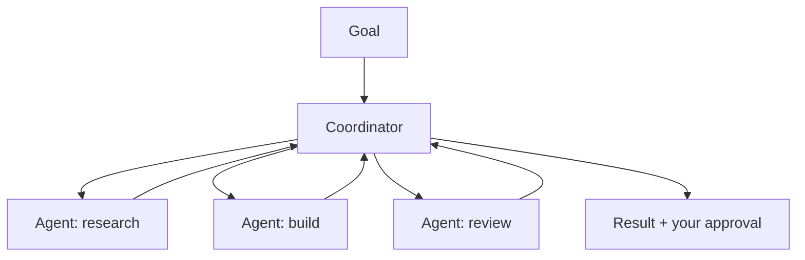

<LevelBadge level="advanced" />

<VerifyNote lastVerified="2026-06-20" source="https://docs.anthropic.com">
Cowork et les équipes d'agents sont des surfaces 2026 en évolution rapide — les noms, la disponibilité et les capacités changent souvent. Vérifiez les détails actuels dans la documentation/les annonces officielles d'Anthropic.
</VerifyNote>

Au-delà d'un agent unique, Anthropic déploie des surfaces de **niveau produit** permettant aux agents d'effectuer un travail soutenu et collaboratif : **Cowork** (un espace de travail bureautique agentique) et les **équipes d'agents** (plusieurs agents collaborant). Cette page est une carte de haut niveau — vérifiez les spécificités dans la documentation officielle, car elles évoluent rapidement.

## Claude Cowork

Voyez-le comme un **espace de travail où un agent réalise un véritable travail en plusieurs étapes** à vos côtés — opérant sur des fichiers et des outils sur un horizon plus long qu'un simple tour de conversation, sous votre supervision. C'est le cousin grand public/pro de la construction d'un agent sur l'API : la boucle est fournie, vous dirigez les objectifs.

## Équipes d'agents

Quand un seul agent ne suffit pas, **plusieurs agents collaborent** — se répartissant un objectif, chacun avec un rôle et des outils, se coordonnant vers un résultat. Conceptuellement, cela reflète les [sous-agents](/docs/claude-code/subagents) de Claude Code, mais en tant que surface produit pour une collaboration soutenue et multi-agents plutôt qu'une seule sous-tâche déléguée.

## Comment cela se rattache au reste du site

- Le construire vous-même, par programmation → [Construire des agents](/docs/api/building-agents) + le [SDK Agent](/docs/claude-code/headless-and-agent-sdk).
- La délégation au sein d'une session de codage → [Sous-agents](/docs/claude-code/subagents).
- Boucle/état/planification hébergés → [Agents managés](/docs/api/managed-agents).

## La constante : la supervision

:::warning Plus d'autonomie, plus de prudence
Le travail multi-agents sur un long horizon amplifie à la fois la valeur *et* le risque. Gardez les humains dans la boucle sur les actions à conséquences, restreignez étroitement l'accès aux outils, et vérifiez les sorties — voir [Usage responsable](/docs/security/responsible-use) et [Sécuriser les agents](/docs/security/securing-agents).
:::

## Suite

- [Sous-agents et agents parallèles](/docs/claude-code/subagents)
- [Agents managés](/docs/api/managed-agents)
- [Usage responsable, éthique et vérification](/docs/security/responsible-use)
