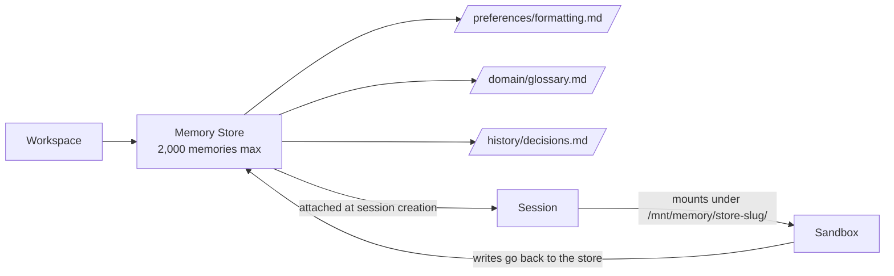

<LevelBadge level="advanced" />

<Callout type="objectives" items={["Ce qu'est un Memory Store — et en quoi il diffère de l'ancien outil memory côté client", "Comment les stores se montent dans le sandbox de session à /mnt/memory/ et comment l'agent les utilise", "La règle de header bêta qui fait tomber les gens (agent-memory-2026-07-22 vs managed-agents-2026-04-01)", "Le cycle de vie complet : create → seed → attach → read/write → audit versions → redact", "Les limites concrètes : 8 stores par session, 2 000 mémoires par store, 100 kB par mémoire"]} />

<VerifyNote lastVerified="2026-07-30" source="https://platform.claude.com/docs/en/managed-agents/memory">
Les Memory Stores sont en **bêta publique** depuis le 22 juillet 2026. Endpoints, chaînes de headers et limites changent pendant la bêta — confirmez contre la référence officielle avant de livrer.
</VerifyNote>

Si vous avez construit avec les [Managed Agents](/docs/api/managed-agents), vous savez que chaque session démarre avec un contexte frais par défaut. Quand la session se termine, ce que l'agent a appris part avec. Les **Memory Stores** sont le correctif first-party : collections côté serveur, versionnées, de documents texte qui persistent entre sessions et se montent dans le sandbox de l'agent comme un répertoire ordinaire qu'il peut lire et écrire avec ses outils de fichiers.

## Memory Stores vs l'outil memory côté client

Il y a maintenant **deux primitives « memory » différentes** dans la plateforme Claude. Ne les confondez pas.

| | **Memory Stores** (cette page) | **Outil memory côté client** ([page séparée](/docs/api/memory-and-context-editing)) |
|---|---|---|
| **Où vit la mémoire** | Hébergé Anthropic, scope workspace | Votre propre stockage (Redis, Postgres, fichiers…) |
| **Qui fait tourner la boucle** | Managed Agents | Vous (Messages API + boucle d'outils) |
| **Header bêta** | `agent-memory-2026-07-22` | `context-management-2025-06-27` (outil memory) |
| **Comment l'agent la lit** | Montée à `/mnt/memory/` comme fichiers | Appels d'outils (`view`, `str_replace`, `create`…) |
| **Piste d'audit** | Versions immuables, endpoint redact | Ce que vous construisez |

Même *idée* (état persistant) ; *primitive* différente. Tout ce qui suit concerne les **Memory Stores** — la version côté serveur, pour Managed Agents uniquement.

## Le modèle mental

Un store est un dossier de petits fichiers Markdown/texte (mémoires), scopé à votre workspace. Quand vous l'attachez à une session, il apparaît comme un montage à l'intérieur du sandbox, et Claude le lit et l'écrit avec le [toolset agent](https://platform.claude.com/docs/en/managed-agents/tools) standard — les mêmes outils qu'il utilise pour le reste du système de fichiers.

Deux corollaires importants :

- Une **note sur chaque montage** (nom, chemin de montage, mode d'accès, description et toutes `instructions` par session) est automatiquement insérée dans le prompt système. L'agent sait que le montage existe sans que vous le lui disiez.
- Les écritures **hors** du chemin de montage — n'importe où ailleurs sous `/mnt/memory/` — atterrissent dans un scratch local au conteneur et sont perdues à la fin de la session. Seules les écritures vers le chemin de montage persistent.

## La règle du header bêta (le piège)

C'est là où les gens perdent 20 minutes.

<Callout type="warning" items={["Les endpoints memory-store utilisent anthropic-beta: agent-memory-2026-07-22 — rien d'autre.", "Les endpoints de session (y compris attacher un memory store à une session) utilisent encore managed-agents-2026-04-01.", "Envoyer les deux sur une requête memory-store retourne HTTP 400. Si votre code définit les headers bêta explicitement, remplacez — n'ajoutez pas."]} />

Si vous utilisez le SDK officiel, il définit le bon header automatiquement. Si vous êtes sur du HTTP brut, séparez vos sites d'appel :

| Appel | Header |
|---|---|
| `POST /v1/memory_stores` (create) | `agent-memory-2026-07-22` |
| `POST /v1/memory_stores/{id}/memories` (create/list/update/delete une mémoire) | `agent-memory-2026-07-22` |
| `POST /v1/memory_stores/{id}/memory_versions/…/redact` | `agent-memory-2026-07-22` |
| `POST /v1/sessions` — attacher un store dans `resources[]` | `managed-agents-2026-04-01` |

## Le cycle de vie

<Steps items={[{title: "1. Créer le store", body: "POST /v1/memory_stores avec un nom et une description. La description est passée à l'agent, donc elle doit se lire comme un brief : 'Préférences par utilisateur et contexte projet'."}, {title: "2. L'amorcer (optionnel)", body: "Pré-chargez du matériel de référence avec memories.create à des chemins comme /formatting_standards.md. Idéal pour de la connaissance partagée en lecture seule que chaque session doit voir."}, {title: "3. Attacher à la création de session", body: "Mettez une entrée resources[] avec type: memory_store, memory_store_id, access, et instructions optionnelles sur POST /v1/sessions. Les stores ne peuvent être attachés qu'à la création de session — pas ajoutés ou retirés en cours de session."}, {title: "4. Laisser l'agent lire/écrire dessus", body: "Le store se monte à /mnt/memory/[store-slug]/ (lisez le mount_path exact depuis la réponse). Les outils de fichiers ordinaires de l'agent font le reste, et leurs appels apparaissent comme événements agent.tool_use/agent.tool_result dans le stream."}, {title: "5. Auditer et rédacter", body: "Chaque écriture crée une version de mémoire immuable. Utilisez memory_versions pour inspecter l'historique, rollback en réécrivant un contenu antérieur, ou grattez du contenu sensible hors de l'historique avec l'endpoint redact."}]} />

## Créer un store et une première mémoire

Le nom et la description du store sont ce que l'agent voit — écrivez-les comme vous écririez un README de dossier.

<PromptCard title="Créer le store (curl, HTTP brut)">{`curl -s https://api.anthropic.com/v1/memory_stores \\
  -H "x-api-key: $ANTHROPIC_API_KEY" \\
  -H "anthropic-version: 2023-06-01" \\
  -H "anthropic-beta: agent-memory-2026-07-22" \\
  -H "content-type: application/json" \\
  -d '{"name": "User Preferences", "description": "Per-user preferences and project context."}'
# -> {"id": "memstore_01Hx...", ...}`}</PromptCard>

<PromptCard title="Amorcer une mémoire">{`curl -s "https://api.anthropic.com/v1/memory_stores/$store_id/memories" \\
  -H "x-api-key: $ANTHROPIC_API_KEY" \\
  -H "anthropic-version: 2023-06-01" \\
  -H "anthropic-beta: agent-memory-2026-07-22" \\
  -H "content-type: application/json" \\
  -d '{"path": "/formatting_standards.md", "content": "All reports use GAAP formatting. Dates are ISO-8601."}'`}</PromptCard>

## Attacher un store à une session

Notez que le header repasse à `managed-agents-2026-04-01` — les endpoints de session, y compris attach, utilisent le header Managed Agents.

<PromptCard title="Attacher à la création de session (read_write)">{`curl -s https://api.anthropic.com/v1/sessions \\
  -H "x-api-key: $ANTHROPIC_API_KEY" \\
  -H "anthropic-version: 2023-06-01" \\
  -H "anthropic-beta: managed-agents-2026-04-01" \\
  -H "content-type: application/json" \\
  -d '{
    "agent": "$AGENT_ID",
    "environment_id": "$ENVIRONMENT_ID",
    "resources": [{
      "type": "memory_store",
      "memory_store_id": "$STORE_ID",
      "access": "read_write",
      "instructions": "User preferences and project context. Check before starting any task."
    }]
  }'`}</PromptCard>

Le champ `instructions` est plafonné à 4 096 caractères et montré à l'agent aux côtés du `name` et de la `description` du store.

## Modes d'accès et le risque d'injection

`access` vaut `read_write` par défaut. C'est le bon choix quand l'agent doit *apprendre* de la session. C'est le **mauvais** choix pour un store que vous ne voulez pas laisser modifier par qui (ou quoi) que ce soit.

<Callout type="warning" items={["Un store read_write est en aval de tout risque d'injection de prompt dans la session. Si l'agent traite des entrées non fiables (prompts utilisateur, pages récupérées, sortie d'outil tiers), une injection réussie peut écrire du contenu malicieux dans le store. Les sessions ultérieures le lisent alors comme mémoire de confiance.", "Règle du pouce : matériel de référence partagé (standards, glossaires, docs de domaine) s'attache en read_only. Seul l'état par utilisateur ou par session qui doit grandir s'attache en read_write.", "Attachez les deux si nécessaire : un store référence read_only plus un store scratch read_write. Jusqu'à 8 par session."]} />

## Les limites concrètes

Toutes des docs officielles, toutes bonnes à mémoriser :

| Limite | Valeur |
|---|---|
| Memory stores par session | **8** |
| Mémoires par store | **2 000** |
| Octets par mémoire | **100 kB** (~25k tokens) |
| Longueur `instructions` (par attach) | **4 096 caractères** |
| Rétention des versions | **30 jours** (versions récentes toujours gardées) |

Quand un store atteint 2 000 mémoires, les écritures suivantes — appels API directs *et* les propres écritures de fichiers de l'agent — commencent à échouer. Le correctif recommandé des docs n'est pas « un seul store géant » : utilisez **beaucoup de petits stores focalisés** (un par utilisateur, un pour la référence partagée, un par projet), élaguez les entrées obsolètes avec `memories.delete`, ou lancez une [session de rêve](https://platform.claude.com/docs/en/managed-agents/dreams) pour consolider.

## Piste d'audit, versions et rollback

Chaque écriture sur une mémoire crée une **version de mémoire** immuable (`memver_...`). Les versions appartiennent au store, pas à la mémoire, donc elles survivent même après que la mémoire elle-même est supprimée — la piste d'audit reste complète.

Patterns pratiques :

- **Inspection point-in-time :** `GET /v1/memory_stores/{id}/memory_versions?memory_id=…` pour voir qui a changé quoi, plus récent d'abord.
- **Rollback :** il n'y a pas d'endpoint restore dédié. Récupérez la version que vous voulez et réécrivez son `content` avec `memories.update` (ou `memories.create` si la mémoire parente est partie).
- **Éditions concurrentes sûres :** passez une précondition `content_sha256` sur `memories.update`. Si le hash de tête ne matche plus, votre update est rejetée et vous relisez avant de retry — concurrence optimiste classique.

## Conformité : rédiger une version

Quand une PII, un secret ou une demande de suppression utilisateur nécessite que le contenu *disparaisse de l'historique*, utilisez redact. Ça gratte le contenu mais préserve la piste d'audit (qui a fait quoi, quand).

<Callout type="tip" items={["Vous ne pouvez pas rédiger la tête courante d'une mémoire vivante. Écrivez d'abord une nouvelle version (ou supprimez la mémoire), puis rédigez l'ancienne version.", "Parce que les versions survivent à leur mémoire parente, supprimer la mémoire n'efface pas automatiquement l'historique — vous rédigez encore par version.", "La rétention des versions est de 30 jours minimum. Si vous avez besoin d'une rétention plus longue pour conformité, exportez les versions via l'API avant qu'elles vieillissent."]} />

## Erreurs courantes

<Callout type="tip" items={["Envoyer les deux headers bêta sur un appel memory-store — vous obtenez HTTP 400. Remplacez, n'ajoutez pas.", "Essayer d'ajouter ou retirer un store d'une session en cours — pas supporté. Attach se passe à la création de session, point.", "Attacher un store référence partagé en read_write — une injection plus tard, vos standards sont corrompus pour chaque session future.", "Un store géant au lieu de beaucoup de focalisés — vous atteindrez le plafond des 2 000 et bloquerez les écritures ultérieures.", "Écrire à /mnt/memory/scratch/ en espérant que ça persiste — tout hors du chemin de montage est local au conteneur et s'évapore à la fin de session."]} />

## Vérifiez-vous

<Quiz title="Vérifiez-vous" questions={[{q: "Vous envoyez une requête create memory-store avec les deux anthropic-beta: agent-memory-2026-07-22 et anthropic-beta: managed-agents-2026-04-01. Que se passe-t-il ?", options: ["Les deux headers sont acceptés", "La requête retourne HTTP 400 — les endpoints memory store doivent utiliser agent-memory-2026-07-22 seul", "Le header le plus récent gagne silencieusement", "Le SDK retire l'ancien header automatiquement même sur HTTP brut"], answer: 1, explain: "Les docs sont explicites : ne combinez pas les deux sur les endpoints memory-store — envoyer les deux retourne un 400. Les endpoints de session (y compris attach) utilisent encore managed-agents-2026-04-01."}, {q: "Où un memory store apparaît-il à l'intérieur du sandbox de session ?", options: ["/etc/memory/[store-id]", "/mnt/memory/[store-slug]/, où le slug du store est le nom d'affichage assaini", "/tmp/memory-[store-id]", "Ça n'apparaît pas — l'agent doit appeler une API pour le lire"], answer: 1, explain: "Le store se monte sous /mnt/memory/ à un slug du nom du store. Lisez toujours le mount_path exact depuis la ressource memory-store de la session plutôt que le construire."}, {q: "Votre agent traite des emails d'utilisateurs externes. Quel mode d'accès est le plus sûr pour un store partagé 'standards & glossaire' ?", options: ["read_write, pour que l'agent puisse améliorer le glossaire au fil du temps", "read_only, parce qu'une injection de prompt pourrait sinon empoisonner le matériel de référence partagé", "read_write avec un prompt système strict", "Ça n'a pas d'importance — les modes d'accès sont indicatifs"], answer: 1, explain: "L'accès est imposé au niveau du système de fichiers. Les stores read_only rejettent les écritures même sous une injection de prompt réussie, protégeant la référence partagée d'être empoisonnée pour les sessions futures."}, {q: "Vous devez supprimer un secret leaké de l'historique. Quelle séquence marche ?", options: ["Supprimer la mémoire — l'historique est supprimé avec elle", "Rédiger directement la version tête courante", "Écrire une nouvelle version (ou supprimer la mémoire), puis rédiger l'ancienne version", "Archiver le store"], answer: 2, explain: "Vous ne pouvez pas rédiger la tête courante d'une mémoire vivante. Écrivez d'abord une nouvelle version (ou supprimez la mémoire), puis appelez redact sur l'ancienne version — les versions survivent à leur parent."}, {q: "Quels sont le plafond de taille par mémoire et le nombre de mémoires par store ?", options: ["10 kB par mémoire, 200 mémoires par store", "100 kB par mémoire, 2 000 mémoires par store", "1 MB par mémoire, 500 mémoires par store", "Il n'y a pas de limites explicites pendant la bêta"], answer: 1, explain: "100 kB (~25k tokens) par mémoire et 2 000 mémoires par store. Les docs recommandent beaucoup de petits fichiers focalisés, pas quelques grands."}]} />

<Callout type="takeaways" items={["Les Memory Stores sont la primitive de mémoire persistante côté serveur pour Managed Agents — différente de l'outil memory côté client.", "La règle du header : agent-memory-2026-07-22 sur les endpoints memory-store, managed-agents-2026-04-01 sur les endpoints de session. Jamais les deux.", "Les stores s'attachent à la création de session et se montent à /mnt/memory/[store-slug]/ ; ajout/retrait en cours de session pas supporté.", "Défaut read_only pour la référence partagée ; seule la croissance par utilisateur ou par session doit être read_write.", "Chaque écriture crée une version immuable ; rollback est 'récupérer + réécrire' ; redact gratte l'historique pour la conformité."]} />

## Suite

- [Managed Agents](/docs/api/managed-agents) — le concept parent : agents, sessions, environnements, vaults, déploiements
- [Building Agents on the API](/docs/api/building-agents) — si vous roulez votre propre boucle
- [Memory Tool & Context Editing (côté client)](/docs/api/memory-and-context-editing) — l'*autre* primitive memory
- [Prompt Injection](/docs/security/prompt-injection) — pourquoi `read_only` compte sur les stores partagés
- [Agent Memory Architectures](/docs/frontiers/agent-memory-architectures) — les patterns de conception derrière les systèmes de mémoire persistante
