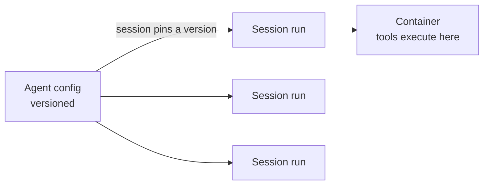

<LevelBadge level="advanced" />

<VerifyNote lastVerified="2026-07-21" source="https://platform.claude.com/docs/en/managed-agents/overview">
Les capacités et la disponibilité des agents gérés évoluent — l'API est en bêta. Confirmez les endpoints, les noms de champs et l'accès dans la documentation officielle avant de construire dessus.
</VerifyNote>

<Callout type="objectives" items={["Comprendre ce qu'une boucle d'agent gérée (hébergée par Anthropic) prend en charge à votre place", "Distinguer les deux objets centraux : un Agent versionné vs une Session par exécution", "Injecter des secrets en toute sécurité avec les Vaults — sans que le modèle ne les voie jamais", "Placer un agent sur une planification cron avec les Déploiements planifiés — sans planificateur à héberger", "Savoir quand le mode géré l'emporte sur une boucle personnalisée, et les garde-fous qui s'appliquent toujours"]} />

Si [construire votre propre boucle d'agent](/docs/api/building-agents) représente plus d'infrastructure que vous ne voulez en gérer, un agent **géré** (hébergé par Anthropic) exécute la boucle à votre place — vous vous concentrez ainsi sur le *travail* de l'agent, et non sur la plomberie des sessions, les nouvelles tentatives, l'état et la planification.

## Les deux objets : Agent vs Session

C'est le modèle mental dont tout le reste découle. Ils sont séparés intentionnellement.

- Un **Agent** est une *configuration persistée et versionnée* — modèle, prompt système, outils, serveurs MCP et skills. Vous le créez une fois. Chaque mise à jour crée une nouvelle version immuable.
- Une **Session** est une *instance d'exécution* — une exécution qui pointe vers un agent par son ID. La configuration vit sur l'agent, jamais sur la session.

<Callout type="tip">
Les sessions sont **épinglées** (pin) à la version de l'agent avec laquelle elles ont été créées : les sessions en cours conservent leur version, les nouvelles sessions obtiennent la dernière. C'est ainsi que vous déployez des changements de configuration sans casser le travail en cours.
</Callout>

## Ce que le mode « géré » vous apporte

Plutôt que de coder et d'héberger la boucle à la main, vous obtenez des blocs de construction hébergés :

- **Sessions** — des exécutions persistantes que vous créez par exécution et que vous reprenez ; diffusez les événements via SSE.
- **Environnements** — l'infrastructure de conteneurs, soit `cloud` (hébergé par Anthropic), soit `self_hosted` (les outils s'exécutent dans votre propre VPC). Un conteneur par session est l'espace de travail de l'agent.
- **Stores de mémoire** — un état persistant entre les sessions, avec versionnement et rédaction (redaction), sans que vous ayez à câbler une base de données.
- **Vaults** — des secrets pour l'authentification MCP et d'autres services.
- **Déploiements planifiés** — des agents qui s'exécutent selon une planification cron, sans surveillance.

<PromptCard title="Créez un agent (config versionnée), puis exécutez une session contre lui">{`# 1. Create the agent once
POST /v1/agents        -> returns $AGENT_ID
# 2. Each execution is a session pinned to that agent
POST /v1/sessions      { "agent": "$AGENT_ID" }`}</PromptCard>

## Vaults : des secrets que le modèle ne voit jamais

Un agent autonome a souvent besoin d'une clé API — mais le *modèle* ne devrait jamais la lire. Les identifiants de Vault (`mcp_oauth`, `static_bearer`, `environment_variable`) sont substitués à la sortie (egress) : un identifiant `environment_variable` est injecté dans le sandbox au moment de l'exécution et n'est *jamais visible* par le modèle.

<Callout type="warning">
C'est le schéma sûr pour donner à un agent un accès puissant. Ne collez pas de clés dans le prompt système ou un message — elles deviennent partie du contexte que le modèle (et vos logs) peuvent voir. Mettez-les dans un vault.
</Callout>

## Déploiements planifiés : un agent sur un cron

Un **déploiement** attache une planification cron à un agent. Quand la planification se déclenche, il démarre une session fraîche et accomplit sa tâche — aucun planificateur à construire ou héberger de votre côté. Idéal pour une synchronisation de données nocturne, un scan de conformité hebdomadaire ou un digest quotidien.

<Steps items={[
  {title: "Définir la planification", body: "POST /v1/deployments avec agent, environment_id, initial_events (doit inclure un user.message), et un schedule : une expression cron POSIX plus un fuseau horaire IANA."},
  {title: "Chaque déclenchement = une exécution", body: "Chaque tentative de déclenchement crée un enregistrement d'exécution (préfixe drun_). Le succès porte un session_id ; l'échec porte un error.type (par ex. environment_archived, session_rate_limited). Listez les exécutions via GET /v1/deployment_runs?deployment_id=..."},
  {title: "Contrôler le cycle de vie", body: "La mise en pause supprime les déclenchements futurs (les exécutions manuelles fonctionnent toujours) ; la reprise repart à la prochaine occurrence et ne rattrape PAS les déclenchements manqués ; l'archivage est terminal."},
  {title: "Déclencher à la demande", body: "POST /v1/deployments/{id}/run démarre une session immédiatement — même en pause — avec trigger_context.type: manual."}
]} />

<PromptCard title="Un scan de conformité hebdomadaire, le vendredi à 20h00 heure de New York">{`POST /v1/deployments
{
  "name": "Weekly compliance scan",
  "agent": "$AGENT_ID",
  "environment_id": "$ENVIRONMENT_ID",
  "initial_events": [
    {"type": "user.message", "content": [{"type": "text", "text": "Run the compliance scan and summarize findings."}]}
  ],
  "schedule": {"type": "cron", "expression": "0 20 * * 5", "timezone": "America/New_York"}
}`}</PromptCard>

<Callout type="tip">
Le cron est `minute hour day-of-month month day-of-week`, avec une granularité à la minute. Le DST utilise une sémantique d'horloge murale : une heure qui n'existe pas lors du passage à l'heure d'été est ignorée ; une heure qui se produit deux fois lors du passage à l'heure d'hiver se déclenche deux fois. Choisissez un fuseau horaire et une heure qui évitent ces bords pour tout ce qui est sensible.
</Callout>

## Quand choisir le mode géré vs personnalisé

| Choisissez le mode **géré** quand… | Choisissez une **boucle / SDK personnalisé** quand… |
|---|---|
| Vous voulez que l'hébergement, l'état, la planification et les secrets soient pris en charge | Vous avez besoin d'un contrôle total sur la boucle et les outils |
| Vous prototypez rapidement | Vous avez des besoins stricts d'infra/conformité personnalisés |
| La simplicité opérationnelle compte plus que le contrôle | Vous intégrez en profondeur dans votre propre stack |

C'est un spectre — appel unique → workflow → agent personnalisé (SDK) → géré. Commencez aussi simplement que la tâche le permet ; montez en complexité seulement quand vous en avez besoin.

## Les mêmes garde-fous s'appliquent

Géré ou non, un agent autonome effectue toujours des actions. Conservez le **moindre privilège**, des **coûts/itérations bornés** et une **approbation humaine pour les étapes risquées** — voir [Sécuriser les agents](/docs/security/securing-agents) et [Durcir les exécutions autonomes](/docs/security/hardening-autonomous-runs).

<Callout type="takeaways" items={["Les agents gérés prennent en charge la boucle, les sessions, les environnements, la mémoire, les vaults et la planification afin que vous vous concentriez sur le travail", "Un Agent est une config versionnée ; une Session est une exécution unique épinglée à une version — la config vit sur l'agent, pas sur la session", "Les identifiants de Vault environment_variable sont injectés à l'exécution et jamais visibles par le modèle — la façon sûre de donner des secrets à un agent", "Un déploiement planifié est une expression cron + un fuseau horaire IANA ; chaque déclenchement crée une exécution, et la reprise ne rattrape pas les déclenchements manqués", "Le mode géré se situe à l'extrémité hébergée de appel unique -> workflow -> personnalisé -> géré ; les garde-fous d'autonomie s'appliquent toujours"]} />

## Auto-évaluation

<Quiz title="Auto-évaluation" questions={[
  {
    q: "Quelle est la différence entre un Agent et une Session ?",
    options: [
      "Ce sont deux noms pour le même objet",
      "Un Agent est une configuration versionnée ; une Session est une exécution unique épinglée à une version d'agent",
      "Une Session contient le modèle et le prompt système ; un Agent n'est qu'un ID",
      "Un Agent exécute les outils ; une Session stocke les secrets"
    ],
    answer: 1,
    explain: "Un Agent est la config persistée et versionnée (modèle, prompt, outils, MCP, skills). Une Session est une instance par exécution qui référence l'agent et s'épingle à sa version à la création."
  },
  {
    q: "Comment devriez-vous donner à un agent géré une clé API dont il a besoin ?",
    options: [
      "La mettre dans le prompt système pour que l'agent puisse la lire",
      "La passer dans le premier message utilisateur de la session",
      "La stocker comme identifiant de vault, injecté à l'exécution et jamais visible par le modèle",
      "La coder en dur dans la définition de l'outil"
    ],
    answer: 2,
    explain: "Les identifiants de Vault (par ex. un type environment_variable) sont substitués à la sortie et jamais visibles par le modèle — les clés dans le prompt ou un message deviennent partie du contexte visible."
  },
  {
    q: "Un déploiement planifié a été mis en pause pendant deux jours puis repris. Qu'arrive-t-il aux déclenchements qui se seraient produits pendant la pause ?",
    options: [
      "Ils sont rattrapés — chaque exécution manquée s'exécute à la reprise",
      "Ils ne sont pas rattrapés ; le déploiement reprend simplement à la prochaine occurrence planifiée",
      "Le déploiement est archivé automatiquement",
      "Toutes les exécutions manquées sont mises en file et exécutées à une minute d'intervalle"
    ],
    answer: 1,
    explain: "La reprise repart à la prochaine occurrence et ne rattrape pas les déclenchements manqués. (Vous pouvez toujours forcer une exécution à tout moment avec le déclenchement manuel, même en pause.)"
  }
]} />

## Suite

- [Construire des agents sur l'API](/docs/api/building-agents)
- [Cowork et équipes d'agents](/docs/api/cowork-and-agent-teams)
- [Mode headless et le SDK Agent](/docs/claude-code/headless-and-agent-sdk)
- [Sécuriser les agents](/docs/security/securing-agents)
