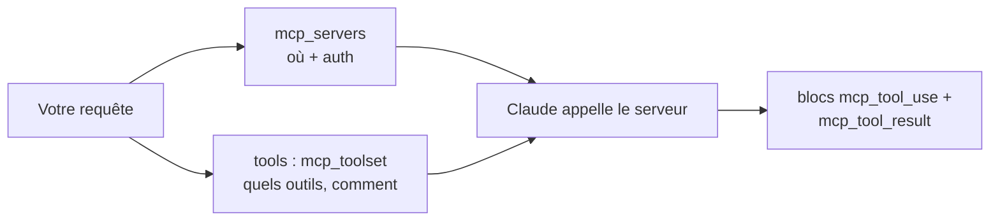

<LevelBadge level="advanced" />

Le **Model Context Protocol (MCP)** est le standard ouvert pour connecter l'IA à des outils et données externes. Sur l'API, vous n'avez pas besoin d'exécuter vous-même un client MCP : le **connecteur MCP** vous permet de nommer un serveur distant dans votre requête et Claude appelle ses outils au sein de la boucle d'agent normale. Deux champs de requête remplacent toute une couche d'intégration.

<Callout type="objectives" items={[
  "Quand le connecteur MCP bat la définition manuelle des outils — et quand non",
  "La forme exacte de la requête : mcp_servers pour la connexion, mcp_toolset pour la politique",
  "Allowlist, denylist et configuration par outil — et comment les trois couches de config fusionnent",
  "Les blocs de réponse que vous devez gérer : mcp_tool_use et mcp_tool_result",
  "Les vraies limites : HTTPS uniquement, outils uniquement, lacunes de plateforme, et pas de couverture ZDR",
]} />

<VerifyNote lastVerified="2026-07-20" source="https://platform.claude.com/docs/en/agents-and-tools/mcp-connector">
Le connecteur est en beta et l'en-tête a déjà changé une fois : la version actuelle est `mcp-client-2025-11-20`, et `mcp-client-2025-04-04` est **déprécié**. Les noms de champs, la disponibilité par plateforme et le statut beta évoluent — vérifiez sur la page officielle et sur [modelcontextprotocol.io](https://modelcontextprotocol.io) avant de déployer.
</VerifyNote>

## MCP vs outils définis à la main

| | [Utilisation des outils](/docs/api/tool-use) (personnalisée) | Connecteur MCP |
|---|---|---|
| Vous définissez | Le schéma de chaque outil, et vous l'exécutez | Une connexion à un serveur qui *publie* des outils |
| Qui exécute l'outil | Votre code, dans votre boucle | Le côté Anthropic appelle le serveur distant |
| Idéal pour | Quelques fonctions sur mesure dans votre application | Réutiliser des intégrations existantes (GitHub, BD, navigateurs, SaaS) |
| Authentification | Votre code | Un jeton OAuth Bearer que vous fournissez par serveur |

Ils coexistent. Définissez directement vos outils propres à l'application, et intégrez des capacités prêtes à l'emploi via MCP.



## La forme de la requête

Deux morceaux, délibérément séparés : **`mcp_servers`** dit *où se trouve le serveur et comment s'authentifier* ; l'entrée **`mcp_toolset`** dans le tableau `tools` dit *lesquels de ses outils vous êtes prêt à exposer et comment*.

<Steps items={[
  {title: "Envoyez l'en-tête beta", body: "anthropic-beta: mcp-client-2025-11-20 — sans lui, le champ mcp_servers n'est pas accepté. Dans les SDK, c'est la liste betas sur un appel beta.messages.create."},
  {title: "Déclarez le serveur dans mcp_servers", body: "Donnez-lui type url, une url https et un nom unique. Ajoutez authorization_token si le serveur requiert OAuth — vous exécutez le flux OAuth vous-même et transmettez le jeton d'accès résultant."},
  {title: "Ajoutez un mcp_toolset correspondant dans tools", body: "Fixez mcp_server_name au nom que vous venez d'utiliser. Sans configuration supplémentaire, chaque outil de ce serveur est activé avec les défauts."},
  {title: "Gérez les nouveaux blocs de réponse", body: "La réponse de Claude peut contenir des blocs de contenu mcp_tool_use et mcp_tool_result. Affichez-les ou journalisez-les comme des blocs d'outil — ne présumez pas que la réponse est du texte brut."},
]} />

<PromptCard title="Appel minimal du connecteur MCP (cURL)">{`curl https://api.anthropic.com/v1/messages \\
  -H "Content-Type: application/json" \\
  -H "X-API-Key: $ANTHROPIC_API_KEY" \\
  -H "anthropic-version: 2023-06-01" \\
  -H "anthropic-beta: mcp-client-2025-11-20" \\
  -d '{
    "model": "MODEL_ID",
    "max_tokens": 1000,
    "messages": [{"role": "user", "content": "What tools do you have available?"}],
    "mcp_servers": [
      {"type": "url", "url": "https://example.com/sse", "name": "example-mcp", "authorization_token": "YOUR_TOKEN"}
    ],
    "tools": [
      {"type": "mcp_toolset", "mcp_server_name": "example-mcp"}
    ]
  }'`}</PromptCard>

:::tip Ne codez jamais le modèle en dur
`MODEL_ID` ci-dessus est un placeholder à dessein. Lisez l'ID actuel depuis [Modèles et tarification actuels](/docs/whats-new/models-and-pricing) et gardez-le en configuration, pour qu'une mise à niveau de modèle soit un changement d'une ligne.
:::

L'API impose un appariement strict : chaque serveur de `mcp_servers` doit être référencé par **exactement un** toolset, et le `mcp_server_name` de chaque toolset doit correspondre à un serveur déclaré. Les incohérences sont des erreurs de validation, pas des no-ops silencieux.

## Choisir ce que Claude peut réellement faire

C'est la partie que la plupart des intégrations ratent. Un toolset prend un `default_config` appliqué à chaque outil, plus des `configs` avec des overrides par outil. Précédence, du plus fort au plus faible : **`configs` par outil → `default_config` du set → défauts du système**.

**Denylist** — activez tout, puis désactivez les dangereux. Raisonnable quand vous voulez de la largeur mais pas d'écritures destructives :

```json
{
  "type": "mcp_toolset",
  "mcp_server_name": "calendar-mcp",
  "configs": {
    "delete_all_events": { "enabled": false },
    "share_calendar_publicly": { "enabled": false }
  }
}
```

**Allowlist** — désactivez par défaut, puis nommez les survivants. C'est la posture du moindre privilège, celle à privilégier par défaut :

```json
{
  "type": "mcp_toolset",
  "mcp_server_name": "calendar-mcp",
  "default_config": { "enabled": false },
  "configs": {
    "search_events": { "enabled": true },
    "create_event": { "enabled": true }
  }
}
```

:::warning Une denylist ne bloque que ce que vous avez pensé
Les serveurs peuvent ajouter des outils. Une denylist accorde silencieusement chaque outil livré après votre écriture ; une allowlist les *ignore* silencieusement. Pour tout ce qui touche des données clients ou de l'argent, allowlist. Notez aussi que nommer dans `configs` un outil qui n'existe pas sur le serveur journalise un avertissement backend mais n'**erreure pas** — donc une faute de frappe dans une allowlist désactive silencieusement l'outil que vous vouliez activer. Vérifiez contre la liste vivante des outils du serveur.
:::

## Gardez les schémas hors de votre contexte

La description de chaque outil activé est envoyée avec la requête, donc un gros catalogue taxe chaque tour. La réponse du connecteur est `defer_loading: true` : la description reste hors du contexte initial, et Claude la tire à la demande via le Tool Search Tool.

```json
{
  "type": "mcp_toolset",
  "mcp_server_name": "calendar-mcp",
  "default_config": { "defer_loading": true },
  "configs": {
    "search_events": { "defer_loading": false }
  }
}
```

Lisez cela comme : *différer tout sauf l'outil par lequel cette tâche commence*. Un toolset accepte aussi `cache_control`, de sorte qu'un catalogue stable peut s'installer derrière un point de rupture de [cache de prompts](/docs/api/prompt-caching) au lieu d'être refacturé à chaque tour. Pour les chiffres derrière cela — et pourquoi le différement des outils a *amélioré* la précision de sélection au lieu de la baisser — voir [La taxe MCP sur les tokens](/docs/claude-code/mcp-token-cost). Quand ce sont les *résultats* plutôt que les définitions qui inondent votre contexte, tournez-vous plutôt vers l'[Appel d'outils programmatique](/docs/api/programmatic-tool-calling).

## Ce qui revient

Deux types de blocs de contenu que vous devez gérer :

```json
{ "type": "mcp_tool_use", "id": "mcptoolu_...", "name": "echo",
  "server_name": "example-mcp", "input": { "param1": "value1" } }

{ "type": "mcp_tool_result", "tool_use_id": "mcptoolu_...", "is_error": false,
  "content": [ { "type": "text", "text": "Hello" } ] }
```

Notez `server_name` sur le bloc d'utilisation : avec plusieurs serveurs connectés, c'est ainsi que vous attribuez un appel — essentiel pour la journalisation et pour déboguer quelle intégration s'est mal comportée. Et `is_error` est un champ, pas une exception : un outil MCP en échec revient comme un *résultat*, donc votre boucle doit l'inspecter plutôt que présumer le succès.

## Les limites qui piquent

<Callout type="warning" items={[
  "Outils uniquement. De la spécification MCP, le connecteur ne supporte actuellement que les appels d'outils — pas les prompts ni les ressources. Besoin de ceux-ci ? Exécutez votre propre client et utilisez les helpers MCP du SDK.",
  "HTTPS distant uniquement. Le serveur doit être accessible publiquement via HTTP (transports Streamable HTTP ou SSE). Un serveur stdio local ne peut pas être connecté ainsi — c'est ce que font Claude Code et les applications de bureau.",
  "Lacunes de plateforme. Disponible sur l'API Claude, la Claude Platform sur AWS et Microsoft Foundry (déploiements Hosted-on-Anthropic). Pas actuellement sur Amazon Bedrock ni Google Cloud.",
  "Pas de zéro rétention de données. Les données échangées avec les serveurs MCP — définitions d'outils et résultats d'exécution — relèvent de la rétention standard, pas de ZDR.",
  "Vous portez l'OAuth. L'API prend un authorization_token ; l'obtenir et le rafraîchir avant expiration est votre travail.",
]} />

## Un même standard, trois surfaces

- **API** (cette page) — serveurs distants par URL, via le connecteur.
- **[Claude Code](/docs/claude-code/mcp)** — serveurs locaux et distants dans vos sessions de développement.
- **[Les applications](/docs/claude-app/connectors)** — MCP alimente les Connecteurs.

Apprenez le protocole une fois ; il se transpose. Seul le câblage diffère.

## Confiance

:::warning Un serveur MCP, c'est du code plus des accès
Ne connectez que des serveurs auxquels vous faites confiance, restreignez-les au moindre privilège avec une allowlist, et rappelez-vous que le contenu qu'un serveur renvoie est une entrée non fiable pouvant véhiculer de l'[injection de prompt](/docs/security/prompt-injection). Examinez les serveurs tiers avant de les câbler — [Examiner le code tiers](/docs/security/reviewing-third-party-code) et [Sécuriser les serveurs MCP](/docs/security/securing-mcp-servers).
:::

<Flashcards title="Vocabulaire du connecteur MCP" cards={[
  {front: "Connecteur MCP", back: "Appeler un serveur MCP distant directement depuis la Messages API, sans client MCP à vous."},
  {front: "mcp_servers", back: "Champ de requête contenant la connexion : type, url https, nom unique, authorization_token optionnel."},
  {front: "mcp_toolset", back: "Une entrée dans le tableau tools qui dit lesquels des outils d'un serveur sont activés et comment. Pointe vers un serveur via mcp_server_name."},
  {front: "default_config vs configs", back: "Défauts pour tout le set vs overrides par outil. configs l'emporte sur default_config, qui l'emporte sur les défauts du système."},
  {front: "defer_loading", back: "Garde la description d'un outil hors du contexte initial jusqu'à ce que Claude la cherche — le remède contre un catalogue d'outils gonflé."},
  {front: "is_error sur un résultat d'outil", back: "Un outil MCP en échec renvoie un bloc de résultat avec is_error true — pas une exception. Inspectez-le dans votre boucle."},
]} />

<Quiz title="Vérifiez-vous" questions={[
  {q: "Vous voulez que Claude n'utilise que search_events et create_event depuis un serveur calendrier. Quelle est la forme correcte du toolset ?", options: ["Les lister dans un tableau allowed_tools sur la définition du serveur", "Fixer default_config.enabled à false, puis activer ces deux-là dans configs", "Fixer defer_loading à true sur tous les autres outils"], answer: 1, explain: "allowed_tools appartient à l'en-tête déprécié mcp-client-2025-04-04. Dans la version actuelle, vous faites une allowlist en désactivant par défaut dans default_config et en activant des outils spécifiques dans configs. defer_loading affecte le coût du contexte, pas la permission."},
  {q: "Un appel d'outil MCP échoue. Où cela apparaît-il ?", options: ["Comme une erreur HTTP sur la requête Messages", "Comme un bloc de contenu mcp_tool_result avec is_error à true", "La réponse omet silencieusement l'appel d'outil"], answer: 1, explain: "Les échecs reviennent dans la réponse sous forme d'un bloc de résultat avec is_error true. Du code qui présume le succès affichera joyeusement un appel en échec comme un fait."},
  {q: "Vous avez besoin que Claude lise des ressources MCP depuis un serveur stdio local. Le connecteur peut-il le faire ?", options: ["Oui — fixez type à stdio dans mcp_servers", "Non — le connecteur est HTTPS-distant et appels d'outils uniquement ; exécutez votre propre client avec les helpers MCP du SDK", "Oui, mais seulement sur Bedrock"], answer: 1, explain: "Le connecteur supporte les appels d'outils contre des serveurs HTTPS accessibles publiquement. Les serveurs stdio locaux, les prompts MCP et les ressources MCP requièrent un client à vous, que les SDK fournissent via des helpers."},
  {q: "Votre catalogue d'outils s'étend sur quatre serveurs et domine la fenêtre de contexte à chaque tour. Le premier geste le moins cher ?", options: ["Passer à un modèle à plus grand contexte", "Fixer default_config.defer_loading à true et ne pas différer seulement les outils par lesquels une tâche commence", "Répartir le travail sur quatre requêtes séparées"], answer: 1, explain: "Le chargement différé garde les descriptions hors du contexte jusqu'à ce que Claude les cherche. Cela réduit la taxe de schéma par tour sans perdre de capacité — et tend à améliorer la sélection d'outils, parce que moins d'outils encombrent le contexte."},
]} />

<Callout type="takeaways" items={[
  "Le connecteur remplace un client MCP par deux champs de requête — mais seulement pour des serveurs HTTPS distants, et seulement pour les appels d'outils.",
  "mcp_servers est la connexion ; le mcp_toolset dans tools est la politique. Chaque serveur doit s'apparier avec exactement un toolset.",
  "Allowlist (default_config.enabled false, plus configs explicites) bat denylist : les outils ajoutés au serveur plus tard sont ignorés, pas accordés.",
  "defer_loading et cache_control sont vos leviers quand les schémas d'outils commencent à manger la fenêtre de contexte.",
  "Gérez les blocs mcp_tool_use et mcp_tool_result — y compris is_error, qui est un champ, pas une exception.",
  "Vérifiez l'en-tête beta avant de déployer : mcp-client-2025-11-20 est actuel, mcp-client-2025-04-04 est déprécié.",
]} />

## Sources et lectures complémentaires

- [Connecteur MCP — docs Anthropic](https://platform.claude.com/docs/en/agents-and-tools/mcp-connector) — la référence de champs faisant autorité et le guide de migration.
- [Spécification du Model Context Protocol](https://modelcontextprotocol.io) — le standard ouvert lui-même, y compris l'autorisation.

## Suite

- [Utilisation des outils / appel de fonctions](/docs/api/tool-use)
- [Construire des agents sur l'API](/docs/api/building-agents)
- [La taxe MCP sur les tokens](/docs/claude-code/mcp-token-cost)
- [Construisez et branchez votre premier serveur MCP](/docs/walkthroughs/first-mcp-server)
- [MCP Config Builder](/docs/tools/mcp-config-builder)
