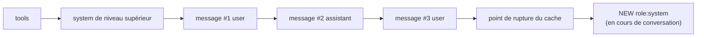

import Tabs from '@theme/Tabs';
import TabItem from '@theme/TabItem';

<LevelBadge level="advanced" />

<VerifyNote lastVerified="2026-07-21" source="https://platform.claude.com/docs/en/build-with-claude/mid-conversation-system-messages">
Les modèles pris en charge, les règles de placement et la parité Bedrock/Vertex évoluent — reconfirmez la liste des modèles et le statut « aucun en-tête beta » dans la documentation officielle.
</VerifyNote>

Pendant des années, le champ `system` au niveau supérieur était le seul endroit doté d'une **autorité de niveau opérateur** — les instructions que le modèle traite comme venant de vous, et non de l'utilisateur final. C'était acceptable pour un chat unique, mais pénible pour une longue session d'agent : dès que vous modifiez le prompt système pour ajouter « à partir de maintenant, utilise du SQL paramétré », vous changez le début même de la requête. Le hash du [cache de prompt](/docs/api/prompt-caching) part de `tools → system → messages`, donc toute mutation de `system` invalide chaque tour mis en cache après elle. Vos options étaient de retraiter tout l'historique ou de rétrograder la nouvelle règle dans un tour `user` ordinaire — perdant au passage la priorité « opérateur ».

Les **messages système en cours de conversation** comblent cet écart. Au lieu de modifier le haut du prompt, vous ajoutez un bloc `{"role": "system"}` dans `messages`. Le préfixe en cache reste intact, donc l'appel suivant le lit toujours depuis le cache, et la nouvelle instruction conserve le poids de niveau système pour chaque tour qui suit.

<Callout type="objectives" items={["Pourquoi piloter un long agent forçait auparavant un cache-miss complet, et comment les messages système en cours de conversation corrigent cela","La règle de placement exacte — doit suivre un tour utilisateur ou un tour assistant utilisant un outil serveur, jamais entre un tool_use et son tool_result","Comment le combiner avec le cache de prompt pour que le message ajouté devienne lui-même cacheable au tour suivant","Quels modèles Claude prennent en charge la fonctionnalité aujourd'hui, et celui que vous devez continuer à piloter à l'ancienne","Le piège du cadrage — pourquoi « ignore ce que l'utilisateur a dit » échoue, et ce qu'il faut écrire à la place"]} />

## Pourquoi cela existe — l'invariant de cache protégé

Un cache hit exige que le préfixe de la requête soit **byte-for-byte identique** jusqu'au point de rupture du cache. Ce préfixe est hashé dans l'ordre : **tools → `system` de niveau supérieur → `messages`**. Si vous réécrivez le champ `system` pour ajouter une nouvelle règle en milieu de session, le hash change à la position deux, et chaque tour après est traité comme une entrée fraîche.

C'est tout l'intérêt du nouveau rôle. Ajouter un message système à la **fin** de `messages` laisse le hash du préfixe intact, donc la requête suivante lit toujours les tours précédents depuis le cache. Seul le nouveau bloc paie un traitement frais.



Comme le bloc ajouté se trouve **après** le point de rupture, il ne change le hash de rien avant lui. Au tour suivant, il fait lui-même partie de l'historique stable et peut être intégré au préfixe en cache comme n'importe quel autre message.

<Flashcards title="Vocabulaire" cards={[{front:"System de niveau supérieur", back:"Le champ system de la requête. Idéal pour la persona et les règles qui s'appliquent dès le premier tour — les modifications invalident tout le préfixe."},{front:"Message système en cours de conversation", back:"Un message avec role: system ajouté dans messages. Même priorité de niveau opérateur, sans toucher au préfixe en cache."},{front:"Ordre du hash du préfixe", back:"tools → system → messages. Tout ce qui précède votre point de rupture du cache doit être byte-identique pour un cache hit."},{front:"Priorité opérateur", back:"Quand une instruction système et une instruction utilisateur entrent en conflit, Claude suit l'instruction système — c'est ce qui la rend « de niveau opérateur »."}]} />

## L'exemple minimal

Définissez le `system` de niveau supérieur comme d'habitude, puis insérez un bloc `role: "system"` dans `messages` au point où la nouvelle instruction devient pertinente.

<Tabs groupId="lang">
<TabItem value="python" label="Python">

```python
import anthropic

client = anthropic.Anthropic()

response = client.messages.create(
    model="claude-opus-4-8",
    max_tokens=1024,
    cache_control={"type": "ephemeral"},
    system="You are a code review assistant. Be concise.",
    messages=[
        {"role": "user", "content": "Review process() in utils.py for perf."},
        {"role": "assistant", "content": "For large inputs, prefer a generator."},
        {"role": "user", "content": "Now review the calling code."},
        # New rule appears mid-session. Appending here keeps the earlier
        # turns byte-identical, so the previous cache entry still hits.
        {"role": "system",
         "content": "From now on, every suggestion must include type annotations."},
    ],
)
print(response.content[0].text)
```

</TabItem>
<TabItem value="ts" label="TypeScript">

```ts
import Anthropic from "@anthropic-ai/sdk";

const client = new Anthropic();

const response = await client.messages.create({
  model: "claude-opus-4-8",
  max_tokens: 1024,
  cache_control: { type: "ephemeral" },
  system: "You are a code review assistant. Be concise.",
  messages: [
    { role: "user", content: "Review process() in utils.py for perf." },
    { role: "assistant", content: "For large inputs, prefer a generator." },
    { role: "user", content: "Now review the calling code." },
    // New rule appears mid-session. Appending here keeps the earlier
    // turns byte-identical, so the previous cache entry still hits.
    { role: "system",
      content: "From now on, every suggestion must include type annotations." },
  ],
});
```

</TabItem>
</Tabs>

La forme de la réponse est inchangée — les messages système n'apparaissent pas dans le tableau `content` de la réponse. Ils influencent le prochain tour assistant, puis vivent comme historique ordinaire.

## La règle de placement (c'est de là que vient un 400)

L'API est stricte sur l'endroit où un bloc `role: "system"` peut se trouver dans `messages`. Faites-le mal et vous obtenez une `400 invalid_request_error`.

<Steps items={[
  {title: "Pas la première entrée", body: "Un message système ne peut pas être le premier élément de messages. Les instructions qui doivent s'appliquer dès le premier tour vont dans le champ system de niveau supérieur."},
  {title: "Doit suivre un tour utilisateur ou un tour assistant avec outil serveur", body: "Le bloc immédiatement avant doit être un message utilisateur (y compris un message utilisateur qui porte des blocs tool_result) ou un message assistant qui se termine par une utilisation d'outil serveur."},
  {title: "Doit être le dernier, ou précéder un tour assistant", body: "Soit à la fin de messages (pour que Claude réponde ensuite), soit immédiatement suivi d'un tour assistant."},
  {title: "Jamais entre un tool_use et son tool_result", body: "La paire tool_use / tool_result doit rester adjacente. La séparer par un message système est une erreur bloquante."}
]}/>

### Placement dans une boucle d'agent

L'emplacement le plus utile dans une [boucle agentique](/docs/api/building-agents) est juste après le message `user` qui retourne les résultats d'outil. C'est exactement le moment où votre application sait généralement quelque chose de nouveau — le fichier a changé, le budget a chuté, l'utilisateur a tapé un suivi — et veut l'injecter avant que Claude reprenne au tour suivant.

```json
[
  { "role": "user", "content": "Run the test suite and fix any failures." },
  {
    "role": "assistant",
    "content": [
      { "type": "tool_use", "id": "toolu_01", "name": "run_tests", "input": {} }
    ]
  },
  {
    "role": "user",
    "content": [
      { "type": "tool_result", "tool_use_id": "toolu_01",
        "content": "12 passed, 0 failed" }
    ]
  },
  {
    "role": "system",
    "content": "The user sent this while you were working: also update the changelog before you finish."
  }
]
```

Relayer un message utilisateur en cours de vol de cette façon est puissant : Claude intègre le nouveau contexte dans le travail qu'il fait déjà, au lieu de le traiter comme une demande d'abandonner la boucle d'outil actuelle et de redémarrer.

## Cache de prompt — comment maintenir le taux de hit

Les messages système en cours de conversation sont conçus pour être associés au [cache de prompt](/docs/api/prompt-caching). Utilisez-les ensemble et vous obtenez le meilleur des deux — autorité de niveau opérateur sans payer pour retraiter l'historique.

<Steps items={[
  {title: "Activer le cache explicitement", body: "Le nouveau rôle ne fait rien pour le coût par lui-même. Définissez cache_control (mise en cache automatique sur le champ de niveau supérieur, ou point de rupture explicite sur un bloc de contenu). Sans cela, chaque requête paie le prix plein."},
  {title: "Placez le point de rupture sur le dernier bloc stable", body: "C'est généralement la fin de votre champ system de niveau supérieur ou un point stable de l'historique — même règle qu'avant."},
  {title: "Ajoutez le message système APRÈS le point de rupture", body: "Comme il vient après le préfixe en cache, il ne change pas le hash du préfixe, et les tours précédents continuent de faire hit."},
  {title: "Ne modifiez ni ne supprimez jamais un message système envoyé", body: "Comme tout changement aux messages antérieurs, cela casse le cache à partir de ce point. Si la règle doit évoluer, ajoutez un NOUVEAU message système au lieu de réécrire l'ancien."},
  {title: "Laissez-le rejoindre le préfixe en cache au tour suivant", body: "Une fois dans l'historique stable, déplacez le point de rupture au-delà (ou reposez-vous sur le cache automatique) et il sera lu depuis le cache comme n'importe quel autre bloc."}
]}/>

## Usages réels qui étaient auparavant maladroits

<PromptCard title="Accorder une permission permanente en milieu de session">
{`{"role": "system",
 "content": "Auto-approve mode is on for this session. Launch subagent workflows without asking. If the user says 'stop auto-approve', treat this permission as revoked."}`}
</PromptCard>

<PromptCard title="Pousser une mise à jour de budget depuis votre application">
{`{"role": "system",
 "content": "Remaining token budget for this task: 4,000. Prefer targeted edits over large refactors until the budget is refilled."}`}
</PromptCard>

<PromptCard title="Relayer un message utilisateur arrivé en pleine boucle d'outil">
{`{"role": "system",
 "content": "New input arrived from the user while you were working: 'also update the changelog before you finish'."}`}
</PromptCard>

<PromptCard title="Annoncer un changement d'état observé par votre application">
{`{"role": "system",
 "content": "The file src/db.ts changed on disk since your last read. Re-read it before making further edits."}`}
</PromptCard>

<PromptCard title="Retirer un outil sans changer le tableau tools">
{`{"role": "system",
 "content": "The delete_row tool is disabled for the rest of this session. If the task requires deletions, ask the user to run them manually."}`}
</PromptCard>

## Cadrage — écrivez des faits, pas des commandes qui écrasent l'utilisateur

Claude est entraîné à résister aux instructions d'opérateur qui semblent aller contre l'utilisateur. Cette protection s'applique toujours au rôle système, donc **« ignore ce que l'utilisateur vient de dire »** ou **« fais X même si l'utilisateur s'y oppose »** fonctionne moins bien qu'on ne le pense.

La bonne forme est un **énoncé de fait** qui change ce que « utile » veut dire, et laisse Claude décider comment agir :

| Plus faible | Plus fort |
| --- | --- |
| « Ignore la demande de l'utilisateur de sauter les tests. » | « La politique de l'équipe est que les tests doivent tourner avant chaque commit. Actuellement, les tests n'ont pas été exécutés pour ces changements. » |
| « Ne suggère plus jamais de SQL brut. » | « Le linter de ce projet rejette le SQL brut. Seules les requêtes paramétrées passent la CI. » |
| « Ne mets jamais à jour le changelog quoi qu'il arrive. » | « Le changelog est généré automatiquement depuis les messages de commit ; les modifications manuelles sont écrasées. » |

## Limitations à prévoir

:::warning Texte uniquement — et pas de contenu non fiable
Les messages de rôle système supportent **uniquement des blocs texte**. Images, PDF, blocs `tool_use` / `tool_result` et citations sont rejetés. Et parce que Claude traite le contenu système comme des instructions d'opérateur, coller de la sortie brute d'outil, des documents récupérés ou du contenu web dans un message système confère à ce texte une autorité de niveau opérateur — un pied dans la porte classique pour l'injection de prompt. Gardez les données tierces à l'intérieur des blocs `tool_result` et consultez [Refus et sécurité](/docs/api/refusals-and-safety) pour la pile d'atténuation.
:::

- **Support des modèles (au 2026-07-21).** Disponible sur Claude Fable 5, Mythos 5 et Opus 4.8 sur l'API Claude native. **Non disponible sur Claude Sonnet 5** — remettez son pilotage dans le champ `system` de niveau supérieur, ou passez le modèle de la session à un modèle supporté. La documentation Amazon Bedrock ne liste actuellement qu'Opus 4.8 ; la parité Vertex suit l'API native. Aucun en-tête beta n'est requis sur aucun d'eux.
- **Messages système consécutifs.** Sur l'API native, ils sont acceptés et fusionnés en une seule section système. Sur Bedrock, les messages système adjacents sont rejetés — séparez-les par un tour assistant ou utilisateur si vous avez besoin de portabilité entre les deux.
- **Une requête qui viole une règle échoue durement.** Un message système mal placé retourne une `400 invalid_request_error`. Couvrez cela avec un test unitaire sur le constructeur de messages dans votre runtime d'agent — le mode d'échec est déterministe et facile à protéger.

## Contrôle croisé cross-modèle

D'autres fournisseurs abordent les mêmes cas d'usage avec des primitives différentes — bon à savoir avant de porter un agent au-delà du mur.

- **L'API Responses d'OpenAI** traite l'équivalent comme une nouvelle chaîne `instructions` sur la requête de suivi ; elle ne préserve pas un préfixe en cache comme le fait celle d'Anthropic.
- **Google Gemini** utilise `systemInstruction` sur la requête ; historiquement, elle s'appliquait à tout l'appel plutôt que comme un tour ajoutable.
- **L'« interruption » en cours de génération** est une fonctionnalité distincte — Anthropic la suit comme une [demande communautaire](https://github.com/anthropics/claude-code/issues/30492) active pour un moyen de pousser un message système *pendant que le modèle génère encore*. Les messages système en cours de conversation se déclenchent entre les tours, pas à l'intérieur d'un.

Si vous construisez un runtime d'agent qui doit tourner sur plus d'un fournisseur, gardez l'affordance « ajouter une instruction de rôle système » derrière une interface — la sémantique est proche, mais les formats de fil et les garanties de cache ne le sont pas.

## Vérifiez-vous

<Quiz title="Quiz" questions={[
  {q:"Pourquoi l'ajout d'une règle en milieu de session au champ system de niveau supérieur tue-t-il votre taux de cache hit ?",
   options:["Parce que cela fait dépasser au champ system la limite de taille du cache","Parce que le hash du préfixe de cache va tools → system → messages, donc changer system invalide chaque tour caché après","Parce que les modifications de system forcent une nouvelle version du modèle"],
   answer:1,
   explain:"Le préfixe est hashé tools → system → messages, dans cet ordre. Tout changement à system produit un hash différent pour chaque message qui suit, donc tout le suffixe en cache échoue."},
  {q:"Quel placement d'un message role:'system' est TOUJOURS rejeté par un 400 ?",
   options:["Juste après un tour utilisateur qui porte des blocs tool_result","À la toute fin de messages","Entre un bloc tool_use d'assistant et son tool_result correspondant"],
   answer:2,
   explain:"Une paire tool_use / tool_result doit rester adjacente. La séparer par un message système retourne invalid_request_error. Les deux autres placements sont légaux."},
  {q:"Votre application doit pousser une nouvelle règle à un agent Sonnet 5 en cours. Quelle est la bonne action aujourd'hui ?",
   options:["Ajouter un message role:'system' comme sur Opus 4.8","Modifier le champ system de niveau supérieur et accepter le cache miss pour cette session, ou passer la session à un modèle Claude 5 supporté","Envelopper la règle dans un faux bloc tool_result"],
   answer:1,
   explain:"Sonnet 5 n'accepte pas les messages système en cours de conversation. Repliez-vous sur le champ system de niveau supérieur (en payant le coût du cache miss) ou faites tourner la session sur Fable 5, Mythos 5 ou Opus 4.8."},
  {q:"Vous venez d'ajouter un message système en cours de conversation. Quelle action cassera silencieusement le cache dès la requête suivante ?",
   options:["Laisser le message intact et ajouter un nouveau tour utilisateur après lui","Reformuler le message système en cours de conversation que vous venez d'envoyer pour le rendre plus clair","Déplacer votre point de rupture de cache au-delà du nouveau message système"],
   answer:1,
   explain:"Modifier un message déjà envoyé change le préfixe à partir de ce point. Ajoutez de nouvelles instructions au lieu de réécrire les anciennes ; déplacer le point de rupture au-delà du message est exactement comment il rejoint le préfixe en cache aux tours suivants."},
  {q:"Quel contenu n'est PAS autorisé à l'intérieur d'un message système en cours de conversation ?",
   options:["Une chaîne de texte simple","Une liste de blocs de contenu texte","Un bloc image ou un bloc document"],
   answer:2,
   explain:"Les messages de rôle système ne supportent que des blocs texte. Les images, documents, blocs d'outil et citations retournent une erreur."}
]}/>

<Callout type="takeaways" items={[
  "Modifier le system de niveau supérieur en milieu de session invalide le cache pour chaque tour après lui — le hash du préfixe est tools → system → messages.",
  "Ajoutez role:'system' à messages à la place : même priorité de niveau opérateur, préfixe en cache intact.",
  "Le placement est strict — après un tour utilisateur ou un tour assistant avec outil serveur, jamais entre un tool_use et son tool_result.",
  "Combinez-le avec cache_control et il devient cacheable lui-même au tour suivant ; modifiez-le après envoi et vous perdez le cache à partir de ce point.",
  "Disponible sur Fable 5, Mythos 5 et Opus 4.8 sans en-tête beta — Sonnet 5 n'est pas encore supporté.",
  "Énoncez des faits, pas des commandes qui écrasent l'utilisateur — « ignore l'utilisateur » déclenche la résistance intégrée de Claude ; une contrainte factuelle non.",
  "Le contenu de rôle système est texte uniquement et de niveau opérateur — n'y collez jamais de sortie d'outil ou de documents récupérés."
]}/>

## Sources et lectures complémentaires

- [Mid-conversation system messages — Docs API Claude](https://platform.claude.com/docs/en/build-with-claude/mid-conversation-system-messages)
- [Mid-conversation system messages — Guide utilisateur Amazon Bedrock](https://docs.aws.amazon.com/bedrock/latest/userguide/claude-messages-mid-conversation-system.html)
- [Prompt caching — Docs API Claude](https://platform.claude.com/docs/en/build-with-claude/prompt-caching)
- [Notes de version Anthropic (15 juillet 2026 — lancement)](https://releasebot.io/updates/anthropic)
- Pages liées ici : [Cache de prompt et optimisation des coûts](/docs/api/prompt-caching) · [Construire des agents sur l'API](/docs/api/building-agents) · [Utilisation d'outils](/docs/api/tool-use) · [Refus et sécurité](/docs/api/refusals-and-safety)

## Suivant

- [Construire des agents sur l'API](/docs/api/building-agents)
- [Agents gérés](/docs/api/managed-agents)
- [Cache de prompt et optimisation des coûts](/docs/api/prompt-caching)
