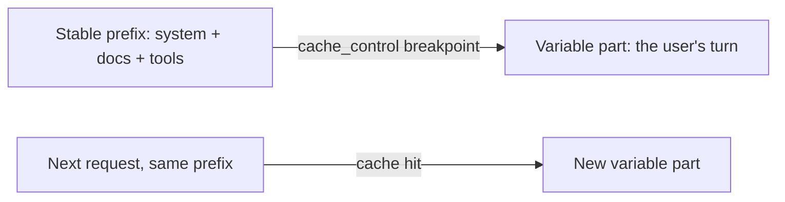

import Tabs from '@theme/Tabs';
import TabItem from '@theme/TabItem';

<LevelBadge level="advanced" />

<VerifyNote lastVerified="2026-06-21" source="https://platform.claude.com/docs/en/docs/build-with-claude/prompt-caching">
Les mécanismes du cache, l'éligibilité et la tarification des tokens mis en cache vs frais changent — confirmez-les dans la documentation officielle sur la mise en cache des prompts.
</VerifyNote>

Si beaucoup de vos requêtes partagent un gros bloc invariable — un long prompt système, un document volumineux, un catalogue d'outils — la **mise en cache des prompts** permet à l'API de réutiliser le préfixe déjà traité au lieu de le relire à chaque appel. Cela réduit à la fois le **coût** et la **latence** sur la partie mise en cache.

<Callout type="objectives" items={["Le modèle mental : un point de rupture de cache après un préfixe stable, réutilisé d'un appel à l'autre","Comment marquer le point de rupture en Python et TypeScript avec cache_control","L'invariant unique qui fait ou défait tout — le préfixe doit être identique octet pour octet","Comment lire les champs usage pour confirmer que vous obtenez bien des hits de cache","Où la mise en cache paie le plus, et comment la combiner avec le traitement par lots et le bon dimensionnement"]} />

## Comment ça marche (le modèle mental)

Vous marquez un **point de rupture de cache** après le préfixe stable. Au premier appel, il est traité et mis en cache ; les appels suivants qui partagent **exactement le même préfixe** touchent le cache et le paient bien moins cher.



<Flashcards title="Vocabulaire de la mise en cache" cards={[{front:"Point de rupture de cache","back":"Le marqueur cache_control placé après le préfixe stable. Tout jusqu'au bloc marqué inclus est mis en cache."},{front:"Écriture de cache","back":"Le petit surcoût du premier appel pour peupler le cache."},{front:"Lecture de cache","back":"Chaque appel ultérieur avec le même préfixe le relit à une fraction du prix d'entrée."},{front:"Invalidateur silencieux","back":"Une valeur changeante près du haut du prompt (horodatage, nom d'utilisateur, liste d'outils réordonnée) qui modifie le préfixe et fait discrètement chuter le taux de hits à zéro."}]} />

## Marquer le point de rupture (copier-coller)

Ajoutez `cache_control` au **dernier bloc stable** — ici, un grand prompt système. Le tour de l'utilisateur vient après et varie librement ; tout jusqu'au bloc marqué inclus est mis en cache.

<Steps items={[{title: "Identifier le préfixe stable", body: "Trouvez le gros bloc invariable — un long prompt système, un document volumineux ou un catalogue d'outils réutilisé sur de nombreuses requêtes."},{title: "Attacher cache_control à son dernier bloc", body: "Marquez le dernier bloc stable avec cache_control de type ephemeral, pour que le préfixe jusqu'à lui inclus soit mis en cache."},{title: "Laisser suivre la partie variable", body: "Placez le tour de l'utilisateur après le bloc marqué — il varie librement à chaque appel et est facturé au plein tarif."},{title: "Confirmer le hit", body: "Lisez cache_read_input_tokens dans le usage de la réponse. Supérieur à zéro signifie que vous avez obtenu un hit de cache."}]} />

<Tabs groupId="lang">
<TabItem value="python" label="Python">

```python
import anthropic

client = anthropic.Anthropic()

message = client.messages.create(
    model="claude-sonnet-5",
    max_tokens=1024,
    system=[
        {
            "type": "text",
            "text": LARGE_STABLE_PROMPT,  # long, unchanging — the cached prefix
            "cache_control": {"type": "ephemeral"},
        }
    ],
    messages=[{"role": "user", "content": "Summarize the key points."}],  # varies per call
)

print(message.usage.cache_read_input_tokens)  # > 0 means you got a hit
```

</TabItem>
<TabItem value="ts" label="TypeScript">

```ts
import Anthropic from "@anthropic-ai/sdk";

const client = new Anthropic();

const message = await client.messages.create({
  model: "claude-sonnet-5",
  max_tokens: 1024,
  system: [
    {
      type: "text",
      text: LARGE_STABLE_PROMPT, // long, unchanging — the cached prefix
      cache_control: { type: "ephemeral" },
    },
  ],
  messages: [{ role: "user", content: "Summarize the key points." }], // varies per call
});

console.log(message.usage.cache_read_input_tokens); // > 0 means you got a hit
```

</TabItem>
</Tabs>

Le premier appel paie un petit surcoût d'**écriture** pour peupler le cache ; chaque appel ultérieur avec le même préfixe le relit à une fraction du prix d'entrée. Le préfixe doit être assez long pour être éligible — quelques milliers de tokens, selon le modèle — sinon il ne sera silencieusement pas mis en cache.

## L'invariant qui fait ou défait tout

:::warning La mise en cache est exacte au préfixe
Un hit de cache exige que le préfixe mis en cache soit **identique octet pour octet**. Le bug le plus courant : un *invalidateur silencieux* près du haut du prompt — un horodatage, un nom d'utilisateur changeant, une liste d'outils réordonnée — qui modifie le préfixe et fait discrètement chuter votre taux de hits à zéro.
:::

**Mettez tout ce qui est stable en premier, tout ce qui est variable en dernier,** et gardez le préfixe vraiment constant.

## Vérifier que ça marche vraiment

Ne présumez pas — relisez-le depuis le `usage` de la réponse :

- **`cache_creation_input_tokens`** — tokens écrits dans le cache lors de cet appel (la première requête).
- **`cache_read_input_tokens`** — tokens servis depuis le cache (les économies).
- **`input_tokens`** — le reste non mis en cache, facturé au plein tarif.

Si `cache_read_input_tokens` reste à **zéro** sur des requêtes répétées censées partager un préfixe, un invalidateur silencieux est à l'œuvre — comparez les octets du prompt rendu entre deux appels pour le trouver.

## Où ça paie le plus

- Les longs **prompts système** réutilisés entre utilisateurs.
- Le **RAG / Q&R sur documents** où le même texte source est interrogé de façon répétée.
- Les **agents** avec un catalogue d'outils et des instructions fixes sur de nombreux tours.

Combinez la mise en cache avec le **traitement par lots** pour les charges hors ligne, et avec le bon dimensionnement du modèle ([Choisir un modèle](/docs/api/choosing-a-model)) pour les plus grosses économies combinées — voir [Coût et latence](/docs/foundations/cost-and-latency).

<Quiz title="Testez-vous" questions={[{q:"Qu'exige un hit de cache du préfixe mis en cache ?",options:["Qu'il fasse au moins un token de long","Qu'il soit identique octet pour octet au préfixe précédent","Qu'il vienne après le tour de l'utilisateur"],answer:1,explain:"Un hit de cache exige que le préfixe mis en cache soit identique octet pour octet. Tout changement — un horodatage, une liste d'outils réordonnée — l'invalide."},{q:"Quel champ usage vous indique que des tokens ont été servis depuis le cache (vos économies) ?",options:["input_tokens","cache_creation_input_tokens","cache_read_input_tokens"],answer:2,explain:"cache_read_input_tokens correspond aux tokens servis depuis le cache. cache_creation_input_tokens est ce qui a été écrit au premier appel ; input_tokens est le reste non mis en cache facturé au plein tarif."},{q:"Où le contenu variable, propre à chaque appel, doit-il aller par rapport au point de rupture de cache ?",options:["Avant le préfixe stable","En dernier — après le bloc marqué","Entrelacé dans tout le prompt système"],answer:1,explain:"Mettez tout ce qui est stable en premier et tout ce qui est variable en dernier. Le tour de l'utilisateur vient après le bloc marqué et varie librement à chaque appel."}]} />

<Callout type="takeaways" items={["Marquez un point de rupture de cache après le préfixe stable ; le premier appel l'écrit, les appels suivants le relisent à bas prix.","Un hit de cache nécessite un préfixe identique octet pour octet — gardez le contenu stable en premier, le contenu variable en dernier.","Les invalidateurs silencieux près du haut du prompt (horodatages, noms, outils réordonnés) font discrètement chuter le taux de hits à zéro.","Vérifiez avec usage : cache_read_input_tokens > 0 signifie un hit ; zéro sur des requêtes répétées signifie qu'un invalidateur est à l'œuvre.","La mise en cache paie le plus pour les prompts système réutilisés, le RAG et les agents ; combinez-la avec le traitement par lots et le bon dimensionnement du modèle."]} />

## Ensuite

- [Tokens, contexte et tarification](/docs/api/tokens-and-pricing)
- [Streaming & multi-tours](/docs/api/streaming)
- [Construire des agents sur l'API](/docs/api/building-agents)
