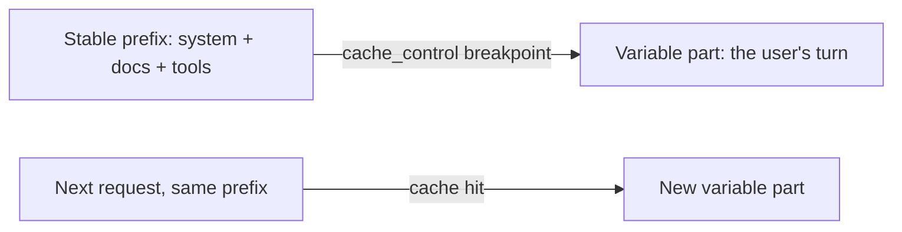

import Tabs from '@theme/Tabs';
import TabItem from '@theme/TabItem';

<LevelBadge level="advanced" />

<VerifyNote lastVerified="2026-06-21" source="https://docs.anthropic.com/en/docs/build-with-claude/prompt-caching">
La mécanique du cache, les conditions d'éligibilité et la tarification des tokens mis en cache par rapport aux tokens frais évoluent — vérifiez dans la documentation officielle sur la mise en cache des prompts.
</VerifyNote>

Si beaucoup de vos requêtes partagent une portion volumineuse et invariable — un long system prompt, un gros document, un catalogue d'outils — la **mise en cache des prompts** permet à l'API de réutiliser le préfixe déjà traité au lieu de le relire à chaque appel. Cela réduit à la fois le **coût** et la **latence** sur la partie mise en cache.

## Comment ça marche (le modèle mental)

Vous marquez un **point de rupture du cache** (cache breakpoint) après le préfixe stable. Au premier appel, il est traité et mis en cache ; les appels suivants qui partagent le **même préfixe exact** atteignent le cache et le paient bien moins cher.



## Marquer le point de rupture (copier-coller)

Ajoutez `cache_control` au **dernier bloc stable** — ici, un long system prompt. Le tour de l'utilisateur vient après et varie librement ; tout ce qui précède le bloc marqué, ce bloc inclus, est mis en cache.

<Tabs groupId="lang">
<TabItem value="python" label="Python">

```python
import anthropic

client = anthropic.Anthropic()

message = client.messages.create(
    model="claude-sonnet-4-6",
    max_tokens=1024,
    system=[
        {
            "type": "text",
            "text": LARGE_STABLE_PROMPT,  # long, unchanging — the cached prefix
            "cache_control": {"type": "ephemeral"},
        }
    ],
    messages=[{"role": "user", "content": "Summarize the key points."}],  # varies per call
)

print(message.usage.cache_read_input_tokens)  # > 0 means you got a hit
```

</TabItem>
<TabItem value="ts" label="TypeScript">

```ts
import Anthropic from "@anthropic-ai/sdk";

const client = new Anthropic();

const message = await client.messages.create({
  model: "claude-sonnet-4-6",
  max_tokens: 1024,
  system: [
    {
      type: "text",
      text: LARGE_STABLE_PROMPT, // long, unchanging — the cached prefix
      cache_control: { type: "ephemeral" },
    },
  ],
  messages: [{ role: "user", content: "Summarize the key points." }], // varies per call
});

console.log(message.usage.cache_read_input_tokens); // > 0 means you got a hit
```

</TabItem>
</Tabs>

Le premier appel paie une petite prime d'**écriture** pour remplir le cache ; chaque appel ultérieur partageant le même préfixe le relit à une fraction du prix d'entrée. Le préfixe doit être assez long pour être éligible — quelques milliers de tokens, selon le modèle — sinon il ne sera tout simplement pas mis en cache, sans le moindre avertissement.

## L'invariant qui fait tout réussir ou tout échouer

:::warning Le cache exige un préfixe exact
Un succès de cache (cache hit) requiert que le préfixe mis en cache soit **identique octet par octet**. Le bug le plus courant : un *invalidateur silencieux* près du haut du prompt — un horodatage, un nom d'utilisateur qui change, une liste d'outils réordonnée — qui modifie le préfixe et fait silencieusement chuter votre taux de succès à zéro.
:::

**Placez tout ce qui est stable en premier, tout ce qui est variable en dernier,** et gardez le préfixe réellement constant.

## Vérifier que ça fonctionne réellement

Ne présumez pas — relisez-le dans le champ `usage` de la réponse :

- **`cache_creation_input_tokens`** — tokens écrits dans le cache lors de cet appel (la première requête).
- **`cache_read_input_tokens`** — tokens servis depuis le cache (l'économie réalisée).
- **`input_tokens`** — le reste non mis en cache, facturé au plein tarif.

Si `cache_read_input_tokens` reste à **zéro** sur des requêtes répétées censées partager un préfixe, un invalidateur silencieux est à l'œuvre — comparez les octets du prompt rendu entre deux appels pour le repérer.

## Là où c'est le plus rentable

- Les longs **system prompts** réutilisés entre plusieurs utilisateurs.
- Le **RAG / les questions-réponses sur documents** où le même texte source est interrogé à répétition.
- Les **agents** dotés d'un catalogue d'outils et d'instructions fixes sur de nombreux tours.

Associez la mise en cache au **traitement par lots** (batching) pour les charges hors ligne, et au dimensionnement adéquat du modèle ([Choisir un modèle](/docs/api/choosing-a-model)) pour les plus fortes économies combinées — voir [Coût et latence](/docs/foundations/cost-and-latency).

## Suite

- [Tokens, contexte et tarification](/docs/api/tokens-and-pricing)
- [Streaming et multi-tours](/docs/api/streaming)
- [Construire des agents sur l'API](/docs/api/building-agents)
