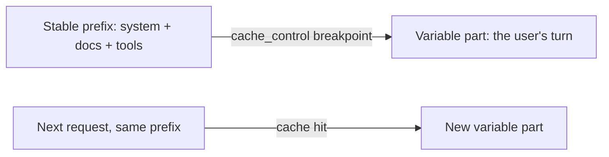

<LevelBadge level="advanced" />

<VerifyNote lastVerified="2026-06-20" source="https://docs.anthropic.com/en/docs/build-with-claude/prompt-caching">
Le fonctionnement du cache, son éligibilité et la tarification des tokens en cache par rapport aux tokens neufs changent — vérifiez dans la documentation officielle sur la mise en cache des prompts.
</VerifyNote>

Si bon nombre de vos requêtes partagent une portion volumineuse et invariable — un long prompt système, un gros document, un catalogue d'outils — la **mise en cache des prompts** permet à l'API de réutiliser le préfixe déjà traité au lieu de le relire à chaque appel. Cela réduit à la fois le **coût** et la **latence** sur la partie mise en cache.

## Comment ça marche (le modèle mental)

Vous placez un **point de rupture du cache** après le préfixe stable. Au premier appel, il est traité et mis en cache ; les appels suivants qui partagent le **même préfixe exact** atteignent le cache et le paient bien moins cher.

## L'invariant qui fait toute la différence

:::warning Le cache exige un préfixe exact
Un succès de cache requiert que le préfixe mis en cache soit **identique octet par octet**. Le bug le plus courant : un *invalidateur silencieux* près du haut du prompt — un horodatage, un nom d'utilisateur qui change, une liste d'outils réordonnée — qui modifie le préfixe et fait silencieusement chuter votre taux de succès à zéro.
:::

**Placez tout ce qui est stable en premier, tout ce qui est variable en dernier,** et gardez le préfixe réellement constant.

## Là où c'est le plus rentable

- Les longs **prompts système** réutilisés entre plusieurs utilisateurs.
- Le **RAG / les questions-réponses sur documents** où le même texte source est interrogé à répétition.
- Les **agents** dotés d'un catalogue d'outils et d'instructions fixes sur de nombreux tours.

Associez la mise en cache au **traitement par lots** pour les charges hors ligne, et au dimensionnement adéquat du modèle ([Choisir un modèle](/docs/api/choosing-a-model)) pour les plus fortes économies combinées — voir [Coût et latence](/docs/foundations/cost-and-latency).

## Suite

- [Tokens, contexte et tarification](/docs/api/tokens-and-pricing)
- [Streaming et multi-tours](/docs/api/streaming)
- [Construire des agents sur l'API](/docs/api/building-agents)
