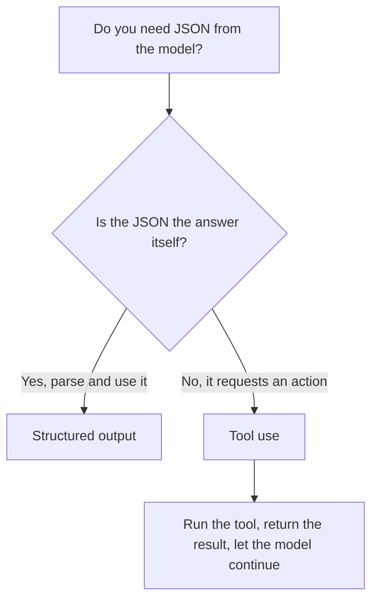

<LevelBadge level="intermediate" />

<VerifyNote lastVerified="2026-06-20" source="https://docs.anthropic.com/en/docs/build-with-claude/structured-outputs">
Le mécanisme exact d'application d'un schéma évolue — vérifiez l'approche actuelle (configuration de sortie / assistants d'analyse) dans la documentation officielle.
</VerifyNote>

Lorsque la sortie de Claude alimente d'autres logiciels, vous avez besoin d'une **structure fiable** — du JSON valide correspondant à une forme connue, à chaque fois. Ne vous fiez pas à « réponds en JSON » en espérant que ça passe ; utilisez la prise en charge de la sortie structurée de la plateforme.

## La méthode fiable

Fournissez un **JSON Schema** pour la sortie et laissez l'API/le SDK l'appliquer, puis analysez le résultat en un objet typé (par ex. Pydantic en Python, Zod en TypeScript). Les assistants d'analyse du SDK vous remettent un résultat typé au lieu d'une chaîne que vous devez `JSON.parse` puis valider vous-même.

```python
# Conceptual shape — see the official docs for the current API surface.
from pydantic import BaseModel

class Ticket(BaseModel):
    title: str
    priority: str   # "low" | "medium" | "high"
    tags: list[str]

# Request the model to return data conforming to Ticket's JSON schema,
# then parse the response into a Ticket instance.
```

## Pourquoi ne pas simplement demander du JSON dans le prompt ?

Vous *pouvez* demander du JSON dans le prompt, et pour les cas simples cela fonctionne — mais cela peut dériver : de la prose parasite, une virgule en trop, un champ manquant. La sortie contrainte par un schéma élimine cette catégorie de bug, ce qui compte dès lors qu'un système en aval en dépend.

## Sortie structurée vs. utilisation des outils

Les deux fonctionnalités fournissent au modèle un **JSON Schema**, elles se ressemblent donc — et les gens choisissent la mauvaise. La différence tient à l'*intention*, pas au mécanisme :

| | **Sortie structurée** | **[Utilisation des outils](/docs/api/tool-use)** |
|---|---|---|
| Ce que vous voulez | La **réponse finale**, dans une forme fixe | Que le modèle **invoque une capacité** (appeler une fonction, récupérer des données, effectuer une action) |
| Qui la consomme | Votre code, directement | Votre code exécute l'outil, puis renvoie le résultat au modèle |
| Forme du tour | Une réponse, terminé | Une boucle : le modèle demande, vous exécutez, le modèle continue |
| Usage typique | Extraction, classification, analyse | Agents, recherches en direct, effets de bord |

Une règle empirique rapide :



Si le JSON *est* le livrable, utilisez la sortie structurée. Si le JSON est le modèle demandant à votre code de *faire* quelque chose, c'est l'utilisation des outils. Les agents utilisent souvent les deux : des outils pour agir, la sortie structurée pour renvoyer un résultat final propre.

## Conseils

- **Gardez des schémas serrés.** Utilisez des énumérations pour les choix fixes ; marquez les champs obligatoires.
- **Décrivez les champs.** Les descriptions de champs guident le modèle comme des mini-prompts.
- **Validez quand même** à la frontière — une analyse défensive est une assurance bon marché.
- Pour les tâches d'**extraction**, sortie structurée + schéma clair surpasse le format libre à chaque fois.

## Suite

- [Utilisation des outils / appel de fonctions](/docs/api/tool-use) — les outils utilisent aussi des schémas JSON
- [Votre premier appel à l'API](/docs/api/first-call)
- [Modèles de prompts réutilisables](/docs/templates/prompts)
