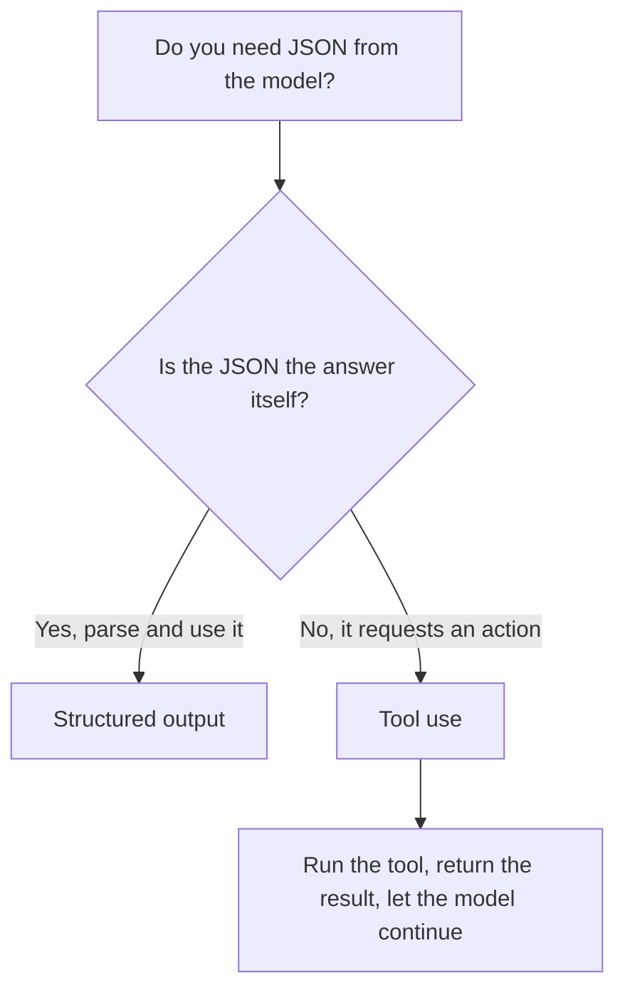

<LevelBadge level="intermediate" />

<VerifyNote lastVerified="2026-06-20" source="https://platform.claude.com/docs/en/docs/build-with-claude/structured-outputs">
Le mécanisme exact d'application d'un schéma évolue — confirmez l'approche actuelle (config de sortie / assistants d'analyse) dans la documentation officielle.
</VerifyNote>

<Callout type="objectives" items={["Expliquer pourquoi une sortie contrainte par un schéma vaut mieux que demander du JSON en espérant", "Fournir un JSON Schema et analyser la réponse en un objet typé (Pydantic / Zod)", "Distinguer la sortie structurée de l'utilisation d'outils par l'intention, pas par le mécanisme", "Appliquer les quatre conseils pour des schémas serrés et fiables", "Choisir le bon outil avec une règle empirique à une question"]} />

Quand la sortie de Claude alimente d'autres logiciels, il vous faut une **structure fiable** — du JSON valide correspondant à une forme connue, à chaque fois. Ne comptez pas sur « réponds en JSON » en espérant ; utilisez la prise en charge de la sortie structurée de la plateforme.

Cette leçon vous mène de *pourquoi le « prie pour que ça marche » échoue* à *comment appliquer un schéma et l'analyser en un objet typé* — et comment distinguer la sortie structurée de l'utilisation d'outils quand elles semblent identiques. Parcourez-la de haut en bas, puis testez-vous avec le quiz vers la fin.

## La méthode fiable

Fournissez un **JSON Schema** pour la sortie et laissez l'API/le SDK l'appliquer, puis analysez-la en un objet typé (p. ex. Pydantic en Python, Zod en TypeScript). Les assistants d'analyse du SDK vous rendent un résultat typé au lieu d'une chaîne que vous devez `JSON.parse` et valider vous-même.

<Steps items={[
  {title: "Définir la forme", body: "Modélisez la sortie dont vous avez besoin comme un JSON Schema — en Python via un BaseModel Pydantic, en TypeScript via un schéma Zod."},
  {title: "Demander une sortie conforme au schéma", body: "Demandez au modèle de renvoyer des données conformes à ce schéma, pour que l'API/le SDK l'applique au lieu de laisser au hasard."},
  {title: "Analyser en un objet typé", body: "Utilisez les assistants d'analyse du SDK pour obtenir directement un résultat typé — pas de JSON.parse manuel plus une validation codée à la main."}
]} />

```python
# Conceptual shape — see the official docs for the current API surface.
from pydantic import BaseModel

class Ticket(BaseModel):
    title: str
    priority: str   # "low" | "medium" | "high"
    tags: list[str]

# Request the model to return data conforming to Ticket's JSON schema,
# then parse the response into a Ticket instance.
```

Vous voulez une requête concrète à adapter ? Voici la forme de ce que vous confiez au modèle — remplacez le modèle par votre propre schéma.

<PromptCard title="Demander une sortie conforme au schéma">{`Return the data conforming to this JSON Schema:

{
  "title": "string",
  "priority": "low | medium | high",
  "tags": ["string"]
}

Do not include any prose outside the JSON.`}</PromptCard>

## Pourquoi ne pas simplement demander du JSON ?

Vous *pouvez* demander du JSON dans le prompt, et pour les cas simples ça marche — mais ça peut dériver : de la prose parasite, une virgule finale, un champ manquant. La sortie contrainte par un schéma supprime cette classe de bugs, ce qui compte dès qu'un système en aval en dépend.

<Callout type="warning" items={["Le JSON demandé au prompt marche dans les démos et casse en production : la panne n'apparaît que lorsqu'un système en aval l'analyse.", "Trois dérives classiques à surveiller : de la prose parasite autour du JSON, une virgule finale, un champ requis manquant."]} />

## Sortie structurée vs. utilisation d'outils

Les deux fonctionnalités confient au modèle un **JSON Schema**, elles se ressemblent donc — et les gens choisissent la mauvaise. La différence est l'*intention*, pas le mécanisme :

| | **Sortie structurée** | **[Utilisation d'outils](/docs/api/tool-use)** |
|---|---|---|
| Ce que vous voulez | La **réponse finale**, dans une forme fixe | Que le modèle **invoque une capacité** (appeler une fonction, récupérer des données, effectuer une action) |
| Qui la consomme | Votre code, directement | Votre code exécute l'outil, puis renvoie le résultat au modèle |
| Forme du tour | Une réponse, terminé | Une boucle : le modèle demande, vous exécutez, le modèle continue |
| Usage typique | Extraction, classification, analyse | Agents, recherches en direct, effets de bord |

Une règle empirique rapide :



Si le JSON *est* le livrable, utilisez la sortie structurée. Si le JSON est le modèle qui demande à votre code de *faire* quelque chose, c'est de l'utilisation d'outils. Les agents utilisent souvent les deux : des outils pour agir, une sortie structurée pour renvoyer un résultat final propre.

## Conseils

<Callout type="tip" items={["Gardez les schémas serrés — utilisez des enums pour les choix fixes ; marquez les champs requis.", "Décrivez les champs — les descriptions de champs guident le modèle comme des mini-prompts.", "Validez quand même à la frontière — l'analyse défensive est une assurance bon marché.", "Pour les tâches d'extraction, une sortie structurée + un schéma clair vaut mieux que le format libre à chaque fois."]} />

<Callout type="takeaways" items={["Confiez à l'API/au SDK un JSON Schema et analysez-le en un objet typé — ne priez pas pour que ça marche.", "Demander du JSON au prompt peut dériver (prose parasite, virgule finale, champ manquant) ; l'application d'un schéma supprime cette classe de bugs.", "Sortie structurée vs. utilisation d'outils diffèrent par l'intention : le JSON EST la réponse vs. le JSON demande une action.", "Des schémas serrés, des champs décrits et une validation à la frontière rendent l'extraction et la classification fiables."]} />

## Ancrez les termes

<Flashcards cards={[
  {front: "Sortie structurée", back: "Vous confiez à l'API/au SDK un JSON Schema pour la réponse finale et analysez la réponse en un objet typé (Pydantic / Zod). Le JSON EST le livrable."},
  {front: "Utilisation d'outils", back: "Vous confiez au modèle un JSON Schema pour qu'il puisse invoquer une capacité. Votre code exécute l'outil, puis renvoie le résultat — une boucle, pas une réponse unique."},
  {front: "JSON Schema", back: "La forme sur laquelle reposent les deux fonctionnalités. En Python vous la modélisez avec un BaseModel Pydantic ; en TypeScript avec un schéma Zod."},
  {front: "Assistants d'analyse", back: "Des assistants du SDK qui renvoient directement un résultat typé, pour que vous évitiez le JSON.parse manuel plus une validation codée à la main."},
  {front: "Règle empirique à une question", back: "Le JSON est-il la réponse elle-même ? Oui → sortie structurée. Non, il demande une action → utilisation d'outils."}
]} />

<Quiz title="Testez-vous" questions={[
  {
    q: "Quelle est la méthode fiable pour obtenir du JSON structuré de Claude ?",
    options: [
      "Demander « réponds en JSON » dans le prompt et réessayer en cas d'échec",
      "Fournir un JSON Schema, laisser l'API/le SDK l'appliquer, puis analyser en un objet typé",
      "Générer du texte libre et écrire une regex pour extraire les champs"
    ],
    answer: 1,
    explain: "Fournissez un JSON Schema et laissez l'API/le SDK l'appliquer, puis analysez en un objet typé comme Pydantic (Python) ou Zod (TypeScript)."
  },
  {
    q: "Pourquoi demander du JSON au prompt est-il risqué dès qu'un système en aval en dépend ?",
    options: [
      "C'est plus lent que l'application d'un schéma",
      "Ça peut dériver — prose parasite, virgule finale ou champ manquant",
      "Ça coûte plus de tokens que l'utilisation d'outils"
    ],
    answer: 1,
    explain: "Le JSON demandé au prompt marche pour les cas simples mais peut dériver ; la sortie contrainte par un schéma supprime cette classe de bugs."
  },
  {
    q: "Qu'est-ce qui distingue réellement la sortie structurée de l'utilisation d'outils ?",
    options: [
      "La sortie structurée utilise un JSON Schema ; l'utilisation d'outils non",
      "L'intention : la sortie structurée est la réponse finale dans une forme fixe, l'utilisation d'outils invoque une capacité",
      "L'utilisation d'outils est pour Python et la sortie structurée pour TypeScript"
    ],
    answer: 1,
    explain: "Les deux confient au modèle un JSON Schema, elles se ressemblent donc. La différence est l'intention, pas le mécanisme — la réponse finale vs. l'invocation d'une capacité."
  },
  {
    q: "Quel est un bon conseil pour concevoir des schémas ?",
    options: [
      "Laisser les champs optionnels et éviter les enums pour la flexibilité",
      "Utiliser des enums pour les choix fixes, marquer les champs requis, et valider quand même à la frontière",
      "Faire confiance au schéma et ne jamais valider la sortie analysée"
    ],
    answer: 1,
    explain: "Gardez les schémas serrés (enums, champs requis), décrivez les champs comme des mini-prompts, et validez quand même à la frontière comme assurance bon marché."
  }
]} />

## Ensuite

- [Utilisation des outils / appel de fonctions](/docs/api/tool-use) — les outils utilisent aussi des schémas JSON
- [Votre premier appel à l'API](/docs/api/first-call)
- [Modèles de prompts réutilisables](/docs/templates/prompts)
