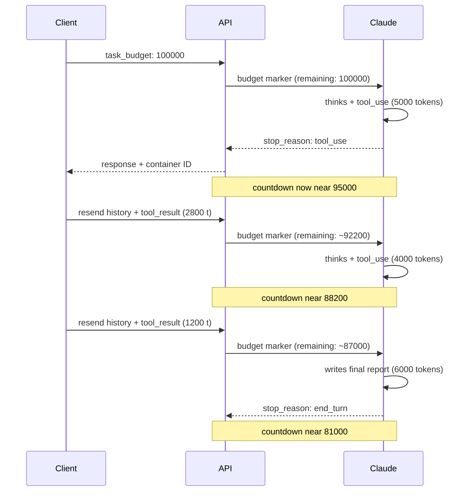

<LevelBadge level="advanced" />

<Callout type="objectives" items={[
  "Comprendre ce qu'est un task budget — un décompte de tokens consultatif, visible par le modèle, sur toute une boucle agentique",
  "Configurer task_budget correctement — dans output_config, avec l'en-tête bêta task-budgets-2026-03-13, sur un modèle pris en charge",
  "Savoir ce qui se déduit réellement du budget (les tokens que Claude voit à ce tour) par opposition à ce qui ne compte pas (la charge répétée de l'historique renvoyé)",
  "Choisir une taille de budget qui aide plutôt qu'elle ne déclenche un comportement proche du refus — mesurer d'abord, puis régler généreusement",
  "Reporter un budget à travers la compaction avec le champ remaining, et éviter le piège d'invalidation de la mise en cache des prompts",
  "Distinguer task budgets, session budgets, effort et max_tokens — quatre leviers, quatre rôles différents"
]} />

<VerifyNote lastVerified="2026-08-25" source="https://platform.claude.com/docs/en/build-with-claude/task-budgets">
Les task budgets sont en **bêta publique** — l'en-tête bêta (`task-budgets-2026-03-13`), la liste des modèles pris en charge, le minimum de 20 000 tokens et les noms exacts des champs de `output_config.task_budget` sont cités de la référence officielle et peuvent évoluer tant que la fonctionnalité est en bêta. Revérifiez avant la mise en production.
</VerifyNote>

Les agents à long horizon consomment des tokens de façons difficiles à prédire de l'extérieur. Une seule requête qui se déploie en une douzaine de tours de réflexion et d'appels d'outils peut discrètement coûter 10× ce que coûte votre tour habituel. Les **task budgets** sont la réponse d'Anthropic : donnez à Claude un plafond de tokens consultatif pour toute la boucle agentique et laissez le modèle *s'autoréguler* — doser sa réflexion, prioriser ses actions et conclure par un résumé à mesure que le budget s'épuise, au lieu de se faire couper au milieu d'un appel d'outil par `max_tokens`.

Deux choses distinguent les task budgets de tous les autres leviers de coût que vous connaissez peut-être déjà :

- **Le décompte est visible par le modèle.** Claude voit un marqueur « tokens restants » injecté côté serveur et ajuste son comportement en conséquence. Votre client ne voit jamais ce marqueur dans un champ d'usage.
- **Il est consultatif, pas imposé.** Les task budgets sont un indice souple ; le plafond dur reste `max_tokens`. C'est une fonctionnalité — Claude peut occasionnellement dépasser le budget si interrompre une action en cours serait plus perturbant que de la terminer.

## Comment fonctionne le décompte du budget

Le décompte reflète les tokens que **Claude a traités dans cette boucle** — réflexion, appels d'outils, résultats d'outils et sortie — pas la taille de la charge utile de votre requête. Quand votre client renvoie toute la conversation à chaque tour, la *charge utile* croît de façon monotone mais le *budget* ne se décrémente que de ce qui est nouveau pour Claude à ce tour.

<Callout type="warning" items={[
  "Le décompte n'est visible que par le modèle. Les réponses de l'API n'incluent pas de champ de budget restant — pas d'entrée task_budget dans usage, pas d'accesseur SDK pour cela. Pour suivre la dépense côté client, additionnez output_tokens sur les requêtes de votre boucle.",
  "Si votre client envoie tout l'historique à chaque relance ET décrémente remaining en même temps, le modèle voit un budget sous-évalué et conclut plus tôt que le budget ne le permet réellement. Fixez un budget généreux et laissez le modèle s'autoréguler contre le décompte côté serveur."
]} />

## Lancez votre première requête budgétée

<Steps items={[
  {title: "Inclure l'en-tête bêta", body: "Ajoutez anthropic-beta: task-budgets-2026-03-13 à la requête. Sans lui, output_config.task_budget est ignoré."},
  {title: "Choisir un modèle pris en charge", body: "Actuellement : Claude Opus 5, Fable 5, Mythos 5, Opus 4.8, Opus 4.7. Sonnet 5, Sonnet 4.6, Haiku 4.5 et l'ancien Opus 4.6 ne sont PAS pris en charge."},
  {title: "Définir task_budget dans output_config", body: "L'objet a trois champs — type (toujours tokens), total (le plafond en tokens) et remaining (optionnel, pour reporter un budget à travers la compaction). Le total minimum est de 20 000 tokens ; en dessous, l'API renvoie une erreur 400."},
  {title: "Garder max_tokens généreux", body: "task_budget couvre toute la boucle agentique ; max_tokens est le plafond dur par requête. Aux niveaux d'effort high ou xhigh, gardez max_tokens à 64k ou plus pour que Claude ait de la place pour réfléchir et agir à chaque requête."}
]} />

<PromptCard title="Requête minimale — budgéter un agent de revue de code à 64k tokens">{`curl https://api.anthropic.com/v1/messages \\
  -H "x-api-key: $ANTHROPIC_API_KEY" \\
  -H "anthropic-version: 2023-06-01" \\
  -H "anthropic-beta: task-budgets-2026-03-13" \\
  -H "content-type: application/json" \\
  -d '{
    "model": "claude-opus-5",
    "max_tokens": 128000,
    "stream": true,
    "messages": [{
      "role": "user",
      "content": "Review the codebase and propose a refactor plan."
    }],
    "output_config": {
      "effort": "high",
      "task_budget": {"type": "tokens", "total": 64000}
    }
  }'`}</PromptCard>

## Quels modèles le prennent réellement en charge

| Modèle            | Prise en charge                                            |
| ----------------- | ---------------------------------------------------------- |
| Claude Opus 5     | Bêta — définir `task-budgets-2026-03-13`                   |
| Claude Fable 5    | Bêta — définir `task-budgets-2026-03-13`                   |
| Claude Mythos 5   | Bêta — définir `task-budgets-2026-03-13`                   |
| Claude Sonnet 5   | Non pris en charge                                         |
| Claude Opus 4.8   | Bêta — définir `task-budgets-2026-03-13`                   |
| Claude Opus 4.7   | Bêta — définir `task-budgets-2026-03-13`                   |
| Claude Opus 4.6   | Non pris en charge                                         |
| Claude Sonnet 4.6 | Non pris en charge                                         |
| Claude Haiku 4.5  | Non pris en charge                                         |

Les task budgets ne sont **pas** pris en charge sur [Claude Code](/docs/claude-code/what-is-claude-code) ni sur les surfaces Cowork — utilisez-les directement via l'API Messages sur l'un des modèles pris en charge. S'il vous faut plutôt un plafond dur en dollars sur une session Managed Agents, c'est une fonctionnalité distincte : [Budgets de session Managed Agents](/docs/api/managed-agents-session-budgets).

## Choisir un budget — mesurez d'abord, ne devinez pas

Le bon budget dépend de la quantité de travail que fait actuellement votre boucle. La recommandation d'Anthropic elle-même : **mesurez d'abord, puis réglez.**

<Steps items={[
  {title: "Faire tourner un échantillon représentatif SANS task_budget", body: "Pour chaque tâche de l'échantillon, additionnez usage.output_tokens sur toutes les requêtes de la boucle, plus la taille en tokens de tous les résultats d'outils que vous avez ajoutés entre les requêtes. C'est le total que le modèle a vu."},
  {title: "Prendre le p99 de votre distribution par tâche", body: "Commencez là. L'objectif est de donner à Claude assez de marge pour que les exécutions budgétées ne sous-performent pas soudainement votre référence actuelle."},
  {title: "Ajuster à la hausse ou à la baisse depuis le p99", body: "Si Claude conclut systématiquement trop tôt, augmentez le budget. Si les tâches consomment régulièrement bien moins, plafonnez plus bas pour imposer de la discipline. Ne descendez jamais sous le minimum de 20 000 tokens — l'API renvoie une erreur 400."}
]} />

<Callout type="warning" items={[
  "Un budget trop petit pour la tâche peut provoquer un comportement proche du refus. Quand Claude voit un budget clairement insuffisant pour le travail (disons 20 000 tokens pour une tâche de codage agentique de plusieurs heures), il peut refuser de tenter la tâche, en réduire agressivement le périmètre, ou s'arrêter tôt avec un résultat partiel — plutôt que d'entamer un travail qu'il ne peut pas finir.",
  "Si vous observez des refus inattendus ou des arrêts prématurés après avoir ajouté un budget, augmentez le budget avant de déboguer d'autres paramètres. Dimensionnez contre votre distribution réelle de longueur de tâche, pas contre une valeur par défaut fixe."
]} />

## Reporter un budget à travers la compaction

Si votre boucle compacte ou réécrit le contexte entre les requêtes — par exemple en résumant les tours antérieurs pour réduire la charge utile — le serveur n'a **aucune mémoire du budget dépensé avant la compaction**. Passez `remaining` sur la requête suivante pour que le décompte reprenne là où vous l'avez laissé :

<PromptCard title="Python — reporter remaining à travers la compaction">{`# Tokens spent before compaction, tracked client-side
tokens_spent_so_far = 45000

output_config = {
    "effort": "high",
    "task_budget": {
        "type": "tokens",
        "total": 128000,
        "remaining": 128000 - tokens_spent_so_far,
    },
}`}</PromptCard>

**Pour les boucles qui renvoient tout l'historique non compacté à chaque tour, omettez `remaining`** et laissez le serveur suivre le décompte. Le définir manuellement quand ce n'est pas nécessaire invite une dérive entre ce que votre client croit avoir dépensé et ce que Claude a réellement vu.

## Interactions avec les autres paramètres

| Interagit avec       | Comment l'interaction se joue                                                                                                                                                                                                                                                                                                  |
| -------------------- | ------------------------------------------------------------------------------------------------------------------------------------------------------------------------------------------------------------------------------------------------------------------------------------------------------------------------------- |
| `max_tokens`         | **Orthogonal.** `max_tokens` est un plafond dur par requête ; `task_budget` est un plafond consultatif sur toute la boucle. Aucun des deux n'a besoin d'être inférieur ou égal à l'autre. Combinez-les : `task_budget` donne à Claude une cible sur laquelle se cadencer, `max_tokens` empêche une génération incontrôlée sur une requête donnée. |
| [Effort](/docs/api/effort-tuning) | **Complémentaire.** L'effort contrôle la profondeur du raisonnement de Claude à chaque étape (ampleur de la réflexion). Les task budgets contrôlent la quantité totale de travail que la boucle peut accomplir (ampleur de l'itération). Réglez les deux ensemble.                                             |
| [Réflexion adaptative](https://platform.claude.com/docs/en/build-with-claude/thinking) | Les task budgets **incluent** les tokens de réflexion dans le décompte, donc la réflexion adaptative se réduit naturellement à mesure que le budget s'épuise.                                                                                                                                  |
| [Mise en cache des prompts](/docs/api/prompt-caching) | **Piège d'invalidation du cache.** Le marqueur de décompte du budget est injecté à chaque tour et ne correspond pas d'une requête à l'autre. Si votre client décrémente `task_budget.remaining` à chaque relance, la valeur modifiée invalide tout préfixe de cache qui la contient. Fixez le budget une seule fois sur la requête initiale et laissez le modèle s'autoréguler. |

## Task budget face aux autres budgets

Ailmanac couvre déjà trois fonctionnalités en forme de « budget ». Elles ne sont pas interchangeables.

| Fonctionnalité                                                                    | Unité           | Portée                              | Application                                | En-tête nécessaire                             |
| -------------------------------------------------------------------------------- | --------------- | ----------------------------------- | ------------------------------------------ | ---------------------------------------------- |
| **Task budgets** (cette page)                                                    | Tokens          | Une boucle agentique (possiblement plusieurs requêtes) | **Consultative** — indice souple au modèle | `anthropic-beta: task-budgets-2026-03-13`      |
| **`max_tokens`**                                                                 | Tokens          | Une requête                         | **Dure** — tronque avec `stop_reason: max_tokens` | Aucun                                          |
| **`output_config.effort`**                                                       | Niveau d'effort | Profondeur par étape                | Consultative (contrôlée par le modèle)     | Aucun                                          |
| [**Budgets de session Managed Agents**](/docs/api/managed-agents-session-budgets) | Cents US        | Toute une session Managed Agents    | **Dure** — le serveur met en pause à `budget_reached` | En-têtes bêta Managed Agents                   |

Voyez les choses ainsi : `max_tokens` est un fusible (il saute à un point fixe), le task budget est un coach qui souffle le score à Claude (il ajuste son jeu), l'effort est le style de jeu, et le budget de session est le comptable qui fait respecter le plafond de masse salariale. Utilisez les quatre ensemble quand il vous faut des agents bornés, autorégulés et plafonnés en dollars.

## Testez-vous

<Quiz questions={[
  {
    q: "Vous fixez task_budget.total à 100000 sur un agent d'audit de code. Pendant l'exécution, la charge utile cumulée de votre client atteint 250000 tokens sur l'ensemble des requêtes parce que vous renvoyez tout l'historique à chaque tour. Que fait le décompte que Claude voit à la fin ?",
    options: [
      "Il est tombé à zéro et l'exécution a été coupée — vous avez dépassé le budget",
      "Il ne se décrémente que de ce que Claude traite réellement à ce tour, pas de la taille de la charge utile renvoyée — tout l'historique compte une seule fois",
      "Il correspond à la taille de votre charge utile — 250000 dépasse 100000 donc Claude a refusé",
      "Il ne se décrémente que sur les tokens de sortie, donc il a à peine bougé"
    ],
    answer: 1,
    explain: "Le task budget compte ce que Claude voit à chaque tour — réflexion, appels d'outils, résultats d'outils et texte — pas la taille de la charge utile de la requête. L'historique répété sur les requêtes de relance est compté une seule fois ; le contenu nouveau (comme de nouveaux résultats d'outils) se déduit du budget à mesure qu'il apparaît."
  },
  {
    q: "Vous compactez le contexte entre les requêtes. Pour être sûr que le décompte ne se réinitialise pas, que faites-vous ?",
    options: [
      "Rien — le serveur suit le budget automatiquement à travers la compaction",
      "Augmenter max_tokens sur la requête de relance",
      "Passer task_budget.remaining sur la requête suivante, fixé au total moins ce que vous avez déjà suivi côté client",
      "Définir un nouveau task_budget.total égal au montant restant"
    ],
    answer: 2,
    explain: "Quand vous compactez ou réécrivez le contexte, le serveur n'a aucune mémoire de la dépense de budget d'avant la compaction. Passez le champ remaining sur la requête suivante, fixé à (total - tokens_spent_so_far), suivi côté client."
  },
  {
    q: "Vous fixez task_budget.total à 20000 pour une longue tâche de codage agentique, et Claude refuse soudainement ou s'arrête tôt avec un résultat partiel. Quel est le correctif ?",
    options: [
      "Ajouter anthropic-beta: task-budgets-strict-2026-03-13 pour forcer la conformité",
      "Augmenter le budget — 20k est la valeur minimale acceptée, et un budget clairement insuffisant pour la tâche peut provoquer un comportement proche du refus",
      "Baisser max_tokens pour l'aligner sur le budget",
      "Passer à Sonnet 5, qui gère mieux les petits budgets"
    ],
    answer: 1,
    explain: "Un budget trop petit pour la tâche déclenche un comportement proche du refus — Claude peut refuser de tenter un travail qu'il ne peut pas finir. Augmentez d'abord le budget ; mesurez votre distribution réelle de longueur de tâche et dimensionnez sur le p99 plutôt que sur une valeur par défaut fixe. (Par ailleurs : Sonnet 5 ne prend pas du tout en charge les task budgets.)"
  }
]} />

## Vocabulaire

<Flashcards title="Glossaire des task budgets" cards={[
  {front: "task_budget", back: "Objet dans output_config avec les champs type ('tokens'), total (plafond) et remaining optionnel (pour reporter à travers la compaction). Le total minimum est de 20 000."},
  {front: "task-budgets-2026-03-13", back: "L'en-tête anthropic-beta requis pour activer la fonctionnalité. Sans lui, output_config.task_budget est ignoré."},
  {front: "Marqueur de décompte", back: "Marqueur injecté côté serveur que Claude voit à chaque tour, indiquant les tokens restants dans la boucle agentique en cours. Jamais exposé dans l'objet usage de la réponse."},
  {front: "Consultatif, pas imposé", back: "Les task budgets sont un indice souple — Claude peut occasionnellement dépasser pour éviter d'interrompre une action en cours. Le plafond dur reste max_tokens."},
  {front: "remaining", back: "Champ optionnel pour reporter un budget à travers la compaction. À omettre sur les boucles qui renvoient tout l'historique non compacté — laissez le serveur suivre."},
  {front: "Comportement proche du refus", back: "Quand Claude voit un budget clairement trop petit pour la tâche, il peut refuser, réduire le périmètre ou s'arrêter tôt. Corrigez en augmentant le budget avant de déboguer d'autres paramètres."}
]} />

## À retenir

<Callout type="takeaways" items={[
  "Les task budgets sont un décompte de tokens VISIBLE PAR LE MODÈLE et CONSULTATIF sur toute la boucle agentique — Claude s'autorégule contre lui",
  "Activez-les avec l'en-tête bêta task-budgets-2026-03-13 sur un modèle pris en charge — Opus 5, Fable 5, Mythos 5, Opus 4.8 ou Opus 4.7. Sonnet, Haiku et Claude Code ne le prennent pas en charge",
  "Le décompte compte les tokens QUE CLAUDE VOIT à ce tour — pas la taille de la charge utile renvoyée — donc l'historique répété n'est pas facturé deux fois",
  "Mesurez d'abord (le p99 de votre distribution de tokens par tâche), puis réglez généreusement. Des budgets sous-dimensionnés provoquent un comportement proche du refus",
  "Utilisez remaining pour reporter le budget à travers la compaction ; omettez-le quand vous renvoyez un historique non compacté et laissez le serveur suivre",
  "Associez-le à max_tokens pour un fusible dur et à l'effort pour régler la profondeur par étape — quatre leviers qui remplissent quatre rôles différents"
]} />

## Pour aller plus loin

- [Réglage de l'effort](/docs/api/effort-tuning) — les cinq niveaux d'effort et leur interaction avec les task budgets
- [Budgets de session Managed Agents](/docs/api/managed-agents-session-budgets) — plafonds durs en dollars sur une session, imposés par la plateforme
- [Mise en cache des prompts](/docs/api/prompt-caching) — comment le piège d'invalidation du cache se manifeste avec des valeurs de budget mutantes
- [Outil d'exécution de code](/docs/api/code-execution) — le runtime en bac à sable sur lequel s'appuient souvent les agents longs
- [Construire des agents sur Claude](/docs/api/building-agents) — le cycle de vie complet de la boucle agentique que ces budgets façonnent
