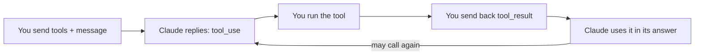

import Tabs from '@theme/Tabs';
import TabItem from '@theme/TabItem';

<LevelBadge level="intermediate" />

<VerifyNote lastVerified="2026-06-20" source="https://platform.claude.com/docs/en/docs/build-with-claude/tool-use">
Les formes des requêtes/réponses d'utilisation des outils sont stables mais évoluent — vérifiez les champs dans la documentation officielle sur l'utilisation des outils.
</VerifyNote>

L'**utilisation des outils** permet à Claude d'appeler des fonctions que *vous* définissez — une recherche, une calculatrice, votre base de données, n'importe quelle API — et d'en utiliser les résultats. C'est le fondement de chaque [agent](/docs/api/building-agents).

## La boucle



1. Vous incluez une liste de **définitions d'outils** (nom, description, entrée au format JSON Schema).
2. Si Claude décide d'en utiliser un, il renvoie un bloc `tool_use` (avec les arguments) et s'arrête.
3. **Vous exécutez** l'outil et renvoyez la sortie sous forme de `tool_result`.
4. Claude poursuit, en appelant éventuellement d'autres outils, jusqu'à ce qu'il réponde.

## Définir un outil (Python)

```python
tools = [{
    "name": "get_weather",
    "description": "Get current weather for a city.",
    "input_schema": {
        "type": "object",
        "properties": {"city": {"type": "string"}},
        "required": ["city"],
    },
}]

msg = client.messages.create(
    model="claude-sonnet-4-6", max_tokens=1024,
    tools=tools,
    messages=[{"role": "user", "content": "What's the weather in Rome?"}],
)
# If msg.stop_reason == "tool_use": run the tool, then send a tool_result back.
```

## Conseils

- **Les descriptions sont des prompts.** Une `description` d'outil claire et une documentation des paramètres améliorent énormément le moment et la manière dont Claude l'appelle.
- **Validez les entrées** que vous recevez avant l'exécution — ne leur faites jamais aveuglément confiance.
- **Renvoyez les erreurs comme résultats.** Si un outil échoue, envoyez un `tool_result` décrivant l'erreur afin que Claude puisse s'en remettre.
- **Outils côté serveur.** Anthropic propose aussi des outils intégrés (par ex. recherche web, exécution de code, utilisation de l'ordinateur) — consultez la documentation pour le menu actuel.

:::warning Outils = actions = risque
Un outil qui entreprend de vraies actions hérite d'un modèle de sécurité. Appliquez le moindre privilège et gardez un humain dans la boucle pour les appels risqués — voir [Sécuriser les agents et les outils](/docs/security/securing-agents).
:::

## Suite

- [Construire des agents sur l'API](/docs/api/building-agents)
- [Sortie structurée](/docs/api/structured-output)
- [MCP et connexion aux outils](/docs/api/mcp)
