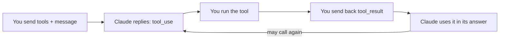

import Tabs from '@theme/Tabs';
import TabItem from '@theme/TabItem';

<LevelBadge level="intermediate" />

<VerifyNote lastVerified="2026-06-20" source="https://platform.claude.com/docs/en/docs/build-with-claude/tool-use">
Les formes des requêtes/réponses de l'utilisation des outils sont stables mais évoluent — confirmez les champs dans la documentation officielle sur l'utilisation des outils.
</VerifyNote>

L'**utilisation des outils** permet à Claude d'appeler des fonctions que *vous* définissez — une recherche, une calculatrice, votre base de données, n'importe quelle API — et d'en utiliser les résultats. C'est le fondement de chaque [agent](/docs/api/building-agents).

<Callout type="objectives" items={["Comment fonctionne la boucle agentique en quatre étapes, des définitions d'outils à la réponse finale","Comment définir un outil en Python avec un nom, une description et une entrée en JSON-Schema","Pourquoi les descriptions d'outils agissent comme des prompts qui façonnent quand et comment Claude les appelle","Comment valider les entrées, renvoyer les erreurs sous forme de résultats et utiliser les outils côté serveur en toute sécurité"]} />

## La boucle

L'utilisation des outils est une conversation, pas un appel unique. Vous tendez à Claude un menu d'outils ; Claude en choisit un et s'arrête ; vous l'exécutez et rendez compte ; Claude intègre le résultat dans sa réponse — en répétant au besoin.

<Steps items={[{title: "Envoyer le menu", body: "Vous incluez une liste de définitions d'outils — chacune avec un nom, une description et une entrée en JSON-Schema."}, {title: "Claude choisit un outil", body: "Si Claude décide d'en utiliser un, il renvoie un bloc tool_use avec des arguments et s'arrête."}, {title: "Vous exécutez", body: "Vous exécutez l'outil vous-même et renvoyez la sortie sous forme de tool_result."}, {title: "Claude continue", body: "Claude continue, appelant éventuellement d'autres outils, jusqu'à ce qu'il réponde."}]} />

## Définir un outil (Python)

Une définition d'outil n'est qu'un nom, une description en langage clair et un JSON-Schema pour l'entrée. Passez-la dans `tools`, puis vérifiez `stop_reason` pour savoir quand Claude veut agir.

<PromptCard title="Outil get_weather + premier appel">{`tools = [{
    "name": "get_weather",
    "description": "Get current weather for a city.",
    "input_schema": {
        "type": "object",
        "properties": {"city": {"type": "string"}},
        "required": ["city"],
    },
}]

msg = client.messages.create(
    model="claude-sonnet-5", max_tokens=1024,
    tools=tools,
    messages=[{"role": "user", "content": "What's the weather in Rome?"}],
)
# If msg.stop_reason == "tool_use": run the tool, then send a tool_result back.`}</PromptCard>

## Astuces

De petits choix dans la façon dont vous définissez et traitez les outils font une grande différence de fiabilité.

- **Les descriptions sont des prompts.** Une `description` d'outil claire et une documentation des paramètres améliorent énormément quand/comment Claude l'appelle.
- **Validez les entrées** que vous recevez avant d'exécuter — ne leur faites jamais aveuglément confiance.
- **Renvoyez les erreurs sous forme de résultats.** Si un outil échoue, envoyez un `tool_result` décrivant l'erreur pour que Claude puisse récupérer.
- **Outils côté serveur.** Anthropic propose aussi des outils intégrés (par ex. recherche web, exécution de code, utilisation de l'ordinateur) — consultez la documentation pour le menu actuel.

:::warning Outils = actions = risque
Un outil qui prend des actions réelles hérite d'un modèle de sécurité. Appliquez le moindre privilège et gardez un humain dans la boucle pour les appels risqués — voir [Sécuriser les agents & les outils](/docs/security/securing-agents).
:::

<Flashcards title="Vocabulaire de l'utilisation des outils" cards={[{front: "bloc tool_use", back: "Ce que Claude renvoie lorsqu'il décide d'appeler un outil — inclut les arguments — après quoi il s'arrête et vous attend."}, {front: "tool_result", back: "Le message que vous renvoyez portant la sortie de l'outil (ou une description d'erreur pour que Claude puisse récupérer)."}, {front: "input_schema", back: "Le JSON-Schema décrivant les entrées d'un outil : types, propriétés et champs requis."}, {front: "Outils côté serveur", back: "Outils intégrés proposés par Anthropic, par ex. recherche web, exécution de code, utilisation de l'ordinateur — consultez la documentation pour le menu actuel."}]} />

<Quiz title="Vérifiez vos acquis" questions={[{q: "Après que Claude renvoie un bloc tool_use, qui exécute l'outil ?", options: ["Claude l'exécute automatiquement sur les serveurs d'Anthropic", "Vous l'exécutez et renvoyez la sortie sous forme de tool_result", "Le JSON-Schema l'exécute"], answer: 1, explain: "Claude renvoie un bloc tool_use et s'arrête ; vous exécutez l'outil et renvoyez le résultat sous forme de tool_result."}, {q: "Un outil que vous avez défini échoue à l'exécution. Quelle est la démarche recommandée ?", options: ["Réessayer silencieusement jusqu'à réussite", "Envoyer un tool_result décrivant l'erreur pour que Claude puisse récupérer", "Arrêter la conversation"], answer: 1, explain: "Renvoyez les erreurs sous forme de résultats — un tool_result décrivant l'échec permet à Claude de récupérer."}, {q: "Pourquoi une description d'outil claire compte-t-elle autant ?", options: ["Elle sert uniquement de documentation et Claude l'ignore", "Les descriptions sont des prompts — elles façonnent quand et comment Claude appelle l'outil", "Elle change les règles de validation du JSON-Schema"], answer: 1, explain: "Les descriptions sont des prompts : une description claire et une documentation des paramètres améliorent énormément quand et comment Claude appelle un outil."}]} />

<Callout type="takeaways" items={["L'utilisation des outils est une boucle : envoyez les définitions d'outils, Claude renvoie un bloc tool_use et s'arrête, vous exécutez et renvoyez un tool_result, Claude continue jusqu'à répondre.","Une définition d'outil est un nom, une description et une entrée en JSON-Schema — passez-la dans tools et vérifiez stop_reason == tool_use.","Les descriptions sont des prompts ; validez les entrées avant d'exécuter ; renvoyez les échecs sous forme d'erreurs tool_result pour que Claude puisse récupérer.","Anthropic propose aussi des outils côté serveur, et tout outil qui prend des actions réelles exige le moindre privilège plus un humain dans la boucle."]} />

## Suite

- [Construire des agents sur l'API](/docs/api/building-agents)
- [Sortie structurée](/docs/api/structured-output)
- [MCP & connexion aux outils](/docs/api/mcp)
