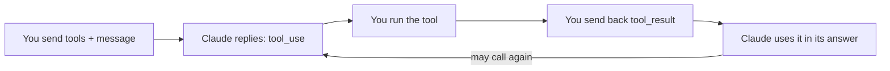

<LevelBadge level="intermediate" />

L'**utilisation des outils** permet à Claude d'appeler des fonctions que *vous* définissez — une recherche, une calculatrice, votre base de données, n'importe quelle API — et d'en utiliser les résultats. C'est le fondement de chaque [agent](/docs/api/building-agents).

La plupart des tutoriels sur l'utilisation des outils s'arrêtent après la boucle en quatre étapes. La boucle est la partie facile. Ce qui casse réellement les intégrations en production est plus étroit et moins discuté : les formes de message qui renvoient `400`, le champ d'erreur qui permet à Claude de récupérer au lieu de s'excuser, et le fait que **forcer un appel d'outil ne fonctionne plus sur les modèles Claude les plus récents**. Cette page couvre tout cela.

<Callout type="objectives" items={["Comment fonctionne la boucle agentique en quatre étapes, des définitions d'outils à la réponse finale","Comment écrire une définition d'outil — et des descriptions qui orientent réellement le moment où Claude l'appelle","Les trois règles de forme de message qui renvoient une 400, et le texte d'erreur qui vous dit laquelle vous avez enfreinte","Pourquoi tool_choice \"any\" et \"tool\" échouent désormais sur les modèles les plus récents, et les deux remplacements","Comment garantir des entrées d'outil valides vis-à-vis du schéma avec strict: true","Pourquoi les résultats d'outils sont l'endroit le plus probable par lequel une injection de prompt atteint votre agent"]} />

<VerifyNote lastVerified="2026-09-29" source="https://platform.claude.com/docs/en/agents-and-tools/tool-use/define-tools">
Les champs de définition d'outil, la matrice de prise en charge de `tool_choice`, les règles de
formatage de `tool_result`, le comportement de `is_error` et la sémantique de `strict: true`
vérifiés le 29 septembre 2026 auprès des pages « Define tools », « Handle tool calls » et « Strict
tool use » d'Anthropic. La prise en charge de l'usage forcé d'outil change à chaque version des
modèles — revérifiez la matrice de prise en charge sur la page Define tools avant de vous y fier, et
consultez [Modèles et tarifs actuels](/docs/whats-new/models-and-pricing) pour la gamme actuelle.
</VerifyNote>

## La boucle

L'utilisation des outils est une conversation, pas un appel unique. Vous tendez à Claude un menu d'outils ; Claude en choisit un et s'arrête ; vous l'exécutez et rendez compte ; Claude intègre le résultat dans sa réponse — en répétant au besoin.


```mermaid
flowchart LR
  A[You send tools + message] --> B[Claude replies: tool_use]
  B --> C[You run the tool]
  C --> D[You send back tool_result]
  D --> E[Claude uses it in its answer]
  E -->|may call again| B
```

<Steps items={[{title: "Envoyer le menu", body: "Vous incluez une liste de définitions d'outils — chacune avec un nom, une description et une entrée en JSON-Schema."}, {title: "Claude choisit un outil", body: "Si Claude décide d'en utiliser un, la réponse revient avec stop_reason \"tool_use\" et un ou plusieurs blocs tool_use, chacun portant un id, un name et un objet input."}, {title: "Vous exécutez", body: "Vous exécutez l'outil vous-même et renvoyez la sortie sous forme de tool_result qui référence l'id du tool_use."}, {title: "Claude continue", body: "Claude continue, appelant éventuellement d'autres outils, jusqu'à ce qu'il réponde avec un stop_reason normal."}]} />

Notez le pluriel à l'étape 2 : Claude peut renvoyer **plusieurs blocs `tool_use` dans une seule réponse**. Aiguillez sur le champ `type` de chaque bloc plutôt que de présumer `content[0]` — une réponse commence généralement par un bloc `text`, et sur les modèles les plus récents elle peut commencer par des blocs `thinking` à la place.

## Définir un outil

Une définition d'outil est un nom, une description en langage clair et un JSON Schema pour l'entrée.

| Champ | Requis | Notes |
| --- | --- | --- |
| `name` | oui | Doit correspondre à la regex `^[a-zA-Z0-9_-]{1,128}$` |
| `description` | oui | Ce qu'il fait, quand l'utiliser, quand *ne pas* l'utiliser. Visez 3–4 phrases au minimum |
| `input_schema` | oui | Un objet JSON Schema décrivant les paramètres |
| `input_examples` | non | Un tableau d'objets d'entrée d'exemple, chacun valide vis-à-vis du schéma |
| `strict` | non | Mettez `true` pour imposer des entrées valides vis-à-vis du schéma — voir ci-dessous |
| `cache_control` | non | Met la définition en cache à travers les tours (voir [Mise en cache des prompts](/docs/api/prompt-caching)) |

<PromptCard title="Outil get_weather + premier appel (Python)">{`tools = [{
    "name": "get_weather",
    "description": (
        "Get the current weather for a city. Use this when the user asks about "
        "present conditions or temperature in a named place. Returns temperature "
        "in the requested unit plus a one-word sky condition. It does NOT return "
        "forecasts — use get_forecast for anything in the future."
    ),
    "input_schema": {
        "type": "object",
        "properties": {
            "city": {"type": "string", "description": "City and region, e.g. 'Rome, IT'"},
            "unit": {"type": "string", "enum": ["celsius", "fahrenheit"]},
        },
        "required": ["city"],
        "additionalProperties": False,
    },
}]

msg = client.messages.create(
    model="claude-opus-5-5", max_tokens=1024,
    tools=tools,
    messages=[{"role": "user", "content": "What's the weather in Rome?"}],
)

if msg.stop_reason == "tool_use":
    for block in msg.content:            # iterate — never index content[0]
        if block.type == "tool_use":
            result = run_tool(block.name, block.input)
            # send back a tool_result carrying block.id`}</PromptCard>

### Les descriptions sont des prompts

Le champ `description` est de loin le levier le plus puissant sur la qualité de l'utilisation des outils — il est lu par le modèle, pas par vos collègues. Les recommandations d'Anthropic sont sans ambiguïté sur ce qui distingue une bonne description :

- **Dites quand *ne pas* l'utiliser.** La plupart des mauvaises sélections sont un outil appelé pour un travail qui appartient à un outil voisin.
- **Consolidez plutôt que de multiplier.** Au lieu de `create_pr`, `review_pr`, `merge_pr`, livrez un seul outil avec un paramètre `action`. Moins d'outils, plus larges, réduisent l'ambiguïté de sélection.
- **Préfixez par service.** `github_list_prs` et `slack_send_message` battent `list_prs` et `send_message` dès que votre surface d'outils grandit.
- **Renvoyez des résultats à fort signal.** Des identifiants stables et sémantiques (slugs, UUID) et seulement les champs dont Claude a besoin pour choisir l'étape suivante. Une sortie d'outil boursouflée brûle du contexte et enterre le signal.
- **Pour les entrées délicates, ajoutez `input_examples`.** Les exemples validés par le schéma coûtent environ 20–50 tokens chacun pour des objets simples et 100–200 pour des objets imbriqués complexes, et un exemple invalide renvoie une 400.

## Traiter la réponse : les trois règles qui renvoient une 400

C'est là que du code qui marchait casse généralement. Un `tool_result` est un message `user` ordinaire, mais trois règles de placement sont imposées par l'API.

<Steps items={[{title: "Les résultats doivent suivre immédiatement leur tool_use", body: "Aucun message ne peut se placer entre le message tool_use de l'assistant et votre message tool_result. Enfreignez cette règle et l'API signale : tool_use ids were found without tool_result blocks immediately after."}, {title: "Les blocs tool_result viennent EN PREMIER dans le tableau content", body: "Tout texte que vous ajoutez doit venir APRÈS chaque tool_result. Un bloc text avant un tool_result est une 400."}, {title: "Si un appel d'outil côté serveur est encore non résolu, n'envoyez QUE des blocs tool_result", body: "Quand le même tour de l'assistant a aussi appelé un outil côté serveur qui n'a pas encore de résultat, ajouter du texte à la fin termine le tour prématurément et la requête échoue avec une 400 qui nomme l'outil côté serveur non résolu."}]} />

```json
// ❌ 400 — text before tool_result
{"role": "user", "content": [
  {"type": "text", "text": "Here are the results:"},
  {"type": "tool_result", "tool_use_id": "toolu_01", "content": "15 degrees"}
]}

// ✅ correct — results first, text after (client tools only)
{"role": "user", "content": [
  {"type": "tool_result", "tool_use_id": "toolu_01", "content": "15 degrees"},
  {"type": "text", "text": "What should I do next?"}
]}
```

Le `content` d'un `tool_result` peut être une simple chaîne, ou une liste de blocs `text`, `image`, `document` ou `search_result`. Il peut aussi être entièrement omis pour un outil qui ne renvoie rien.

### Renvoyez les échecs sous forme de résultats, pas d'exceptions

Quand un outil lève une exception, n'interrompez pas la boucle — rendez l'échec avec `is_error` :

```json
{"role": "user", "content": [{
  "type": "tool_result",
  "tool_use_id": "toolu_01A09q90qw90lq917835lq9",
  "content": "Rate limit exceeded. Retry after 60 seconds.",
  "is_error": true
}]}
```

Rédigez le message pour un lecteur qui doit décider quoi faire ensuite. `"failed"` ne dit rien à Claude ; `"Rate limit exceeded. Retry after 60 seconds."` lui dit d'attendre plutôt que de réessayer immédiatement. Quand un appel d'outil est invalide ou qu'un paramètre manque, Claude réessaie typiquement deux à trois fois avec des corrections avant d'abandonner et de s'excuser auprès de l'utilisateur — une erreur instructive fait donc souvent la différence entre une récupération et une impasse.

## Garantir des entrées valides vis-à-vis du schéma : `strict: true`

Définir `strict: true` sur une définition d'outil contraint l'échantillonnage de tokens du modèle à une sortie valide vis-à-vis du schéma (échantillonnage contraint par grammaire). L'`input` de chaque bloc `tool_use` correspond alors de façon prouvable à votre `input_schema`, et le `name` est toujours un outil réel — pas de `"2"` là où vous attendiez `2`, pas de champ requis manquant, pas de couche valider-puis-réessayer.

<PromptCard title="Définition d'outil stricte">{`{
  "name": "search_flights",
  "description": "Search bookable flights for a route and date.",
  "strict": true,
  "input_schema": {
    "type": "object",
    "properties": {
      "destination": {"type": "string"},
      "departure_date": {"type": "string", "format": "date"},
      "passengers": {"type": "integer", "enum": [1, 2, 3, 4, 5, 6]}
    },
    "required": ["destination", "departure_date"],
    "additionalProperties": false
  }
}`}</PromptCard>

Trois réserves à connaître avant de l'activer partout :

- Le schéma doit rester dans le sous-ensemble de JSON Schema pris en charge — le même que celui utilisé par la [Sortie structurée](/docs/api/structured-output).
- Les entrées de **toolset** computer use et browser use rejettent `strict: true` ; une requête qui le définit sur l'une ou l'autre est rejetée.
- Les schémas compilés sont mis en cache séparément du contenu des messages pendant jusqu'à 24 heures. Les recommandations d'Anthropic sont explicites : **ne mettez pas d'informations de santé protégées dans les schémas** — ni dans les noms de propriétés, ni dans les valeurs `enum`, ni dans les valeurs `const`, ni dans les regex `pattern`. Les informations de santé protégées (PHI) appartiennent au contenu des messages, qui porte les garanties HIPAA que les schémas mis en cache n'ont pas.

## `tool_choice` — et pourquoi forcer un outil échoue désormais

`tool_choice` contrôle si Claude *peut*, *doit* ou *ne peut pas* appeler un outil. Il prend quatre valeurs :

| Valeur | Signification |
| --- | --- |
| `auto` | Claude décide. La valeur par défaut dès que `tools` est présent |
| `any` | Claude doit appeler l'un de vos outils, mais choisit lequel |
| `tool` | Claude doit appeler l'outil nommé |
| `none` | Claude ne peut appeler aucun outil. La valeur par défaut quand aucun `tools` n'est présent |

Voici la partie qui manque actuellement à tous les autres guides sur l'utilisation des outils. **`any` et `tool` ne sont pas universellement pris en charge, et sur les modèles les plus récents ils renvoient une 400.**

| Modèle ou réglage | Restriction | À utiliser à la place |
| --- | --- | --- |
| Raisonnement étendu manuel (`thinking` de type `enabled`) | `any` et `tool` renvoient une erreur | `auto` ou `none`. Le raisonnement adaptatif à lui seul ne bloque *pas* l'usage forcé d'outil |
| Claude Opus 5.5, Sonnet 5.5, Fable 5.1, Mythos 5.1 | `any` et `tool` renvoient une 400, quels que soient les réglages de raisonnement | `auto` plus `strict: true`, ou la [Sortie structurée](/docs/api/structured-output). `none` fonctionne toujours |

L'erreur est explicite :

```text
tool_choice: type "tool" and "any" are not supported for this model.
```

La même validation s'applique au point de terminaison de comptage de tokens, donc une requête qui passe le comptage de tokens ne vous surprendra pas plus tard.

### Que faire à la place

Démêler les deux motivations rend la migration évidente, car l'usage forcé d'outil faisait deux travaux sans rapport :

- **« J'ai besoin de JSON valide vis-à-vis du schéma. »** Cela n'a jamais vraiment eu à voir avec le fait de forcer un appel. Gardez `tool_choice` sur `auto` et définissez `strict: true`, ou déplacez le schéma vers la [Sortie structurée](/docs/api/structured-output) si vous voulez une réponse plutôt qu'un appel.
- **« J'ai besoin qu'il appelle l'outil, pas qu'il me fasse la conversation. »** Dites-le dans le prompt. Indiquer quand l'outil s'applique — « Use `get_weather` for any question about present conditions » — orientera toujours l'outil que `auto` choisit.

Abandonner l'usage forcé d'outil a un bonus : `any` et `tool` fonctionnaient en préremplissant le message de l'assistant, ce qui supprimait tout préambule en langage naturel avant les blocs `tool_use`. Sous `auto`, Claude peut expliquer ce qu'il est sur le point de faire — ce qui est généralement ce que vous voulez dans un agent destiné aux utilisateurs.

:::tip Piège de mise en cache
Changer `tool_choice` en cours de conversation **invalide les blocs de message mis en cache**. Les définitions d'outils et les prompts système restent en cache, mais le contenu des messages doit être retraité. Si vous basculiez `tool_choice` à chaque tour, cela vous coûtait silencieusement — voir [Mise en cache des prompts](/docs/api/prompt-caching).
:::

## Outils client vs. outils côté serveur

Tous les outils n'ont pas besoin d'un gestionnaire dans votre base de code.

- **Outils client** — les vôtres. Vous définissez le schéma, vous exécutez, vous renvoyez un `tool_result`. La boucle ci-dessus.
- **Outils client à schéma Anthropic** — bash, éditeur de texte, mémoire. Le schéma est prédéfini, mais c'est toujours *votre* application qui les exécute.
- **Outils côté serveur** — recherche web, web fetch, exécution de code, recherche d'outils. Ils tournent sur l'infrastructure d'Anthropic sans aucun code de gestionnaire de votre côté, et les erreurs sont traitées de façon transparente : vous ne renvoyez jamais `is_error` pour un outil côté serveur.
- **Toolsets client** — computer use et browser use sont une entrée unique sans `name` qui déclare un ensemble fixe d'outils membres. Leurs blocs `tool_use` portent un champ `toolset_name` supplémentaire (`"computer"` ou `"browser"`), et le `name` est le membre appelé, comme `screenshot` ou `navigate`. **Aiguillez sur les deux champs**, et renvoyez `toolset_name` dans le résultat — un résultat de membre qui l'omet est rejeté.

## Erreurs fréquentes

- **Indexer `content[0]`** au lieu d'itérer et d'aiguiller sur `type`. Les réponses commencent couramment par un bloc `text`, et sur les modèles les plus récents par des blocs `thinking`.
- **Ne traiter qu'un seul `tool_use` par réponse.** Claude peut appeler plusieurs outils dans un tour ; une boucle qui répond au premier et laisse tomber les autres laisse des ids `tool_use` sans résultats, ce qui est une 400 à la requête suivante.
- **Mettre votre commentaire avant les résultats.** Les blocs `tool_result` viennent en premier, toujours.
- **Avaler les exceptions d'outil.** Une exception dans votre gestionnaire met fin à la boucle ; un résultat avec `is_error` permet à Claude de s'adapter.
- **Se rabattre sur `tool_choice: "any"` par habitude.** Sur les modèles phares actuels c'est une 400 — et `strict: true` était de toute façon la meilleure réponse.
- **Considérer la sortie d'outil comme fiable.** Voir ci-dessous.

:::warning Les résultats d'outils sont la plus grande surface d'injection de votre agent
Les résultats d'outils portent couramment du contenu que vous ne contrôlez pas : pages web, e-mails entrants, fichiers envoyés par les utilisateurs, API tierces. Un attaquant capable d'influencer n'importe lequel d'entre eux peut y intégrer des instructions visant votre modèle — c'est l'injection de prompt indirecte. Gardez le contenu non fiable **à l'intérieur des blocs `tool_result`**, jamais inséré dans le prompt `system` ni dans un simple bloc `text` utilisateur, et lisez [L'injection de prompt expliquée](/docs/security/prompt-injection) et [Sécuriser les agents et les outils](/docs/security/securing-agents). Un outil qui prend des actions réelles hérite aussi d'un modèle de sécurité : moindre privilège, et un humain dans la boucle pour tout ce qui est irréversible.
:::

<Flashcards title="Vocabulaire de l'utilisation des outils" cards={[{front: "bloc tool_use", back: "Ce que Claude renvoie lorsqu'il décide d'appeler un outil — porte id, name et input — après quoi il s'arrête et vous attend. Une réponse peut en contenir plusieurs."}, {front: "tool_result", back: "Un bloc de message utilisateur portant la sortie d'un outil, rattaché à l'id du tool_use. Doit venir en premier dans le tableau content, immédiatement après le message tool_use de l'assistant."}, {front: "is_error", back: "Booléen optionnel sur un tool_result qui marque l'appel comme échoué. Claude lit le message et s'adapte — en réessayant généralement deux à trois fois avant de s'excuser."}, {front: "strict: true", back: "Échantillonnage contraint par grammaire sur une définition d'outil : l'entrée de l'outil correspond de façon prouvable à votre input_schema. Exige additionalProperties false ; rejeté sur les entrées de toolset computer/browser ; gardez les informations de santé protégées hors du schéma."}, {front: "tool_choice", back: "auto | any | tool | none. auto est la valeur par défaut quand tools est présent ; none sinon. any et tool renvoient une 400 sur Opus 5.5, Sonnet 5.5, Fable 5.1 et Mythos 5.1."}, {front: "toolset_name", back: "Champ supplémentaire sur les blocs membres de computer use et browser use (\"computer\" ou \"browser\"). Aiguillez dessus en plus de name, et renvoyez-le dans le résultat, sinon le résultat est rejeté."}]} />

<Quiz title="Vérifiez vos acquis" questions={[{q: "Vous définissez tool_choice à {\"type\": \"tool\", \"name\": \"get_weather\"} sur claude-opus-5-5. Que se passe-t-il ?", options: ["Claude est forcé d'appeler get_weather", "La requête renvoie une 400 — l'usage forcé d'outil n'est pas pris en charge sur ce modèle", "Claude ignore tool_choice et répond en texte"], answer: 1, explain: "Sur Opus 5.5, Sonnet 5.5, Fable 5.1 et Mythos 5.1, les types tool_choice \"any\" et \"tool\" renvoient une 400 quels que soient les réglages de raisonnement. Utilisez auto avec strict: true, ou la sortie structurée."}, {q: "Votre message utilisateur contient un bloc text expliquant les résultats, suivi de deux blocs tool_result. Que fait l'API ?", options: ["Elle l'accepte — l'ordre n'a pas d'importance", "Elle renvoie une 400 : les blocs tool_result doivent venir en premier, le texte après", "Elle supprime silencieusement le bloc text"], answer: 1, explain: "Les blocs tool_result doivent venir EN PREMIER dans le tableau content ; tout texte doit venir après eux tous."}, {q: "Un outil que vous avez défini lève une erreur de connexion à l'exécution. Quelle est la démarche recommandée ?", options: ["Lever l'exception et mettre fin à la conversation", "Réessayer silencieusement jusqu'à réussite", "Envoyer un tool_result avec is_error à true et un message instructif comme 'Rate limit exceeded. Retry after 60 seconds.'"], answer: 2, explain: "Renvoyez l'échec sous forme de tool_result avec is_error à true. Un message instructif dit à Claude quoi faire ensuite ; un 'failed' générique ne lui dit rien."}, {q: "Pourquoi le contenu web non fiable devrait-il rester à l'intérieur d'un bloc tool_result plutôt que d'être collé dans le prompt système ?", options: ["Les blocs tool_result coûtent moins de tokens", "Cela limite l'injection de prompt indirecte — le contenu d'un tool_result est cadré comme des données, pas comme des instructions", "Le prompt système a une limite de longueur"], answer: 1, explain: "Les résultats d'outils portent du contenu que vous ne contrôlez pas. Le garder dans des blocs tool_result plutôt que dans le prompt système ou du texte utilisateur simple est l'encapsulage recommandé par Anthropic contre l'injection de prompt indirecte."}]} />

<Callout type="takeaways" items={["L'utilisation des outils est une boucle : envoyez les définitions d'outils, Claude renvoie un ou plusieurs blocs tool_use et s'arrête, vous exécutez et renvoyez des tool_results, Claude continue. Itérez sur les blocs de contenu par type — n'indexez jamais content[0].","Trois règles de placement causent la plupart des 400 : les résultats doivent suivre immédiatement leur tool_use, les blocs tool_result viennent en premier dans le tableau content, et un appel d'outil côté serveur non résolu signifie uniquement des résultats.","L'usage forcé d'outil a disparu sur les modèles les plus récents : tool_choice \"any\" et \"tool\" renvoient une 400 sur Opus 5.5, Sonnet 5.5, Fable 5.1 et Mythos 5.1. Utilisez auto avec strict: true, ou la sortie structurée, et orientez la sélection d'outil depuis le prompt.","strict: true garantit des entrées valides vis-à-vis du schéma via un échantillonnage contraint par grammaire — mais gardez les informations de santé protégées hors des schémas et ne le définissez pas sur les entrées de toolset computer/browser.","Renvoyez les échecs sous forme de tool_results avec is_error et un message instructif pour que Claude puisse s'adapter au lieu de s'excuser.","Les résultats d'outils sont le chemin le plus probable pour qu'une injection de prompt indirecte atteigne votre agent — gardez le contenu non fiable à l'intérieur, appliquez le moindre privilège, et conditionnez les actions irréversibles à un humain."]} />

## Suite

- [Appel d'outils par programme](/docs/api/programmatic-tool-calling) — laissez Claude appeler ces mêmes outils depuis du Python dans un bac à sable, réduisant les allers-retours et gardant les résultats intermédiaires hors du contexte
- [Sortie structurée](/docs/api/structured-output) — l'autre moitié du remplacement de l'usage forcé d'outil, quand vous voulez une réponse JSON plutôt qu'un appel
- [Construire des agents sur l'API](/docs/api/building-agents) — enveloppez la boucle dans un véritable agent
- [Claude Opus 5.5 : le guide de terrain](/docs/models/opus-5-5-field-guide) — toute l'histoire de la migration derrière la suppression de l'usage forcé d'outil
- [MCP et connexion aux outils](/docs/api/mcp) — obtenez des outils depuis un serveur au lieu de les définir vous-même
