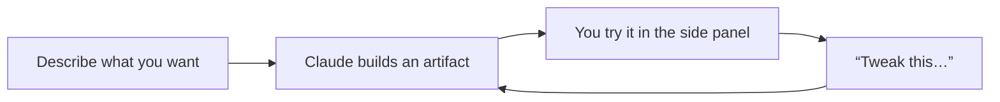

<LevelBadge level="beginner" />

<VerifyNote lastVerified="2026-06-20" source="https://www.anthropic.com">
Les capacités des artifacts (interactivité, persistance, ce qu'ils peuvent appeler) évoluent rapidement — confirmez le comportement actuel dans l'application ou le centre d'aide.
</VerifyNote>

Les **Artifacts** sont des sorties que Claude affiche dans un **panneau latéral** à côté de la conversation — un document, un graphique, une application fonctionnelle, un schéma — que vous pouvez voir, utiliser et faire évoluer, distinctement du texte de la conversation.

## Ce que vous pouvez créer

- **Mini-applications et outils web** — une calculatrice, un quiz, un formulaire, une petite démo interactive.
- **Documents** — des rédactions structurées que vous pouvez affiner et exporter.
- **Visuels** — graphiques, schémas et tableaux de bord de données simples.
- **Du code** que vous pouvez lire et exécuter.

## Pourquoi c'est puissant pour les non-développeurs

Vous pouvez créer quelque chose d'*utilisable* — « fais-moi une calculatrice de pourboire pour un dîner de groupe », « un tableau de bord à partir de ce CSV » — en le décrivant, puis l'affiner par la conversation (« ajoute un champ frais de service », « agrandis les boutons »). C'est l'exemple le plus clair de **construire avec l'IA sans écrire de code soi-même**.

## Comment travailler avec les Artifacts

1. **Demandez la chose**, avec des précisions (objectif, entrées, apparence).
2. **Itérez en langage naturel** — Claude met à jour le même artifact.
3. **Utilisez-le** dans le panneau ; **exportez / partagez** lorsque c'est pris en charge.

## Conseils

- **Soyez concret** sur les entrées / sorties et le public — comme pour un bon [prompting](/docs/prompting/basics).
- **Itérez petit.** Un changement à la fois est plus facile à réussir.
- **Vérifiez toute logique / tout chiffre** qu'un artifact calcule pour les usages importants ([Hallucinations](/docs/foundations/hallucinations)).

## Suite

- [Générer de vrais fichiers (docx/pptx/xlsx/pdf)](/docs/claude-app/generating-files)
- [Premiers pas avec Claude.ai](/docs/claude-app/getting-started)
- [Playbook d'analyse de données](/docs/playbooks/data-analysis)
