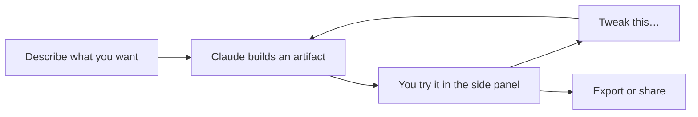

<LevelBadge level="beginner" />

<VerifyNote lastVerified="2026-09-25" source="https://support.claude.com/en/articles/17153992-what-are-artifacts-and-how-do-i-use-them">
Les artifacts sont disponibles sur les offres **Free, Pro, Max, Team et Enterprise**. Les trois *templates* — **Claude Docs**, **Claude Slides** et **Claude Design** — sont **en bêta sur les offres payantes uniquement** : activés par défaut sur Pro, Max et Team, et désactivés sur Enterprise jusqu'à ce qu'un propriétaire les active un par un. Les capacités évoluent vite ici — confirmez le comportement actuel dans le Centre d'aide.
</VerifyNote>

Les **artifacts** sont des sorties que Claude affiche dans un **panneau latéral** à côté de la conversation — un document, une présentation, un graphique, une application fonctionnelle — que vous pouvez voir, utiliser et faire évoluer, séparément du texte de la conversation.

Depuis la [fusion de septembre 2026](/docs/claude-app/one-claude-docs-and-slides), le panneau est aussi l'endroit où vivent les trois **templates**. Cela fait de l'« artifact » le conteneur et du « template » la forme de départ.

<Callout type="objectives" items={[
  "Savoir ce que le panneau artifacts peut produire, et quelles sorties sont de simples artifacts par opposition aux templates en bêta",
  "Choisir entre un Doc, une présentation, un design, une application exécutable et un fichier téléchargeable — sans tâtonner",
  "Faire évoluer un artifact en langage naturel au lieu de tout redemander depuis zéro",
  "Savoir quels artifacts vous pouvez exporter, dans quels formats et sur quelles offres"
]} />

## Ce que vous pouvez créer

| Sortie | Ce que c'est | Offre |
| --- | --- | --- |
| **Mini-applications et outils web** | Une calculatrice, un quiz, un formulaire, une petite démo interactive | Toutes les offres |
| **Graphiques et schémas** | Des visuels et de simples tableaux de bord de données | Toutes les offres |
| **Code** | Quelque chose que vous pouvez lire et exécuter | Toutes les offres |
| **Claude Docs** | Un document vivant, multi-onglets, que vous co-éditez avec Claude et votre équipe | Payant, bêta |
| **Claude Slides** | Une présentation construite depuis vos notes ou la conversation, projetable sur place | Payant, bêta |
| **Claude Design** | Visuels, maquettes, prototypes et landing pages conformes à votre design system | Payant, bêta |

Les exports diffèrent selon le type : les Docs partent vers **Word, PDF, Markdown et Google Docs** ; les Slides vers **PowerPoint et PDF** ; les Designs en **.zip, PDF, PowerPoint ou HTML autonome**.

## Pourquoi c'est puissant pour les non-développeurs

Vous pouvez créer quelque chose d'*utilisable* — « fais-moi une calculatrice de pourboire pour un dîner de groupe », « un tableau de bord à partir de ce CSV » — en le décrivant, puis l'affiner par la conversation (« ajoute un champ frais de service », « agrandis les boutons »). C'est l'exemple le plus clair de **construire avec l'IA sans écrire de code soi-même**.

## Comment travailler avec les artifacts

<Steps items={[
  {title: "Demandez la chose, avec des précisions", body: "Énoncez l'objectif, les entrées, le public et l'apparence. Le flou est la raison principale pour laquelle un premier artifact rate sa cible — la même règle que pour le prompting ordinaire."},
  {title: "Ou choisissez la forme vous-même", body: "Sélectionnez Output dans la zone de message et choisissez un template, ou lancez-en un depuis l'onglet Artifacts. Faites-le quand Claude produit systématiquement une forme différente de celle que vous aviez en tête."},
  {title: "Itérez en langage naturel", body: "Claude met à jour le même artifact au lieu d'en créer un nouveau. Un changement à la fois est bien plus facile à réussir qu'une liste de cinq."},
  {title: "Utilisez-le, puis exportez ou partagez", body: "Essayez-le dans le panneau. Docs, Slides et Designs ont chacun leurs propres formats d'export ; les règles de partage dépendent de votre offre."}
]} />

```mermaid
flowchart LR
  A[Describe what you want] --> B[Claude builds an artifact]
  B --> C[You try it in the side panel]
  C --> D["Tweak this…"] --> B
  C --> E[Export or share]
```

<PromptCard title="Un brief d'artifact précis vaut mieux qu'un brief vague">{`Build me an interactive artifact: a tip calculator for a group dinner.

Inputs: bill total, number of people, tip percentage (slider, 0-30%,
default 18), and a toggle for "service charge already included".
Output: tip amount, total, and per-person share, updating live.

Audience: my friends on their phones — big tap targets, works at
375px wide, no explanation text.`}</PromptCard>

## Conseils

- **Soyez concret** sur les entrées / sorties et le public — comme pour un bon [prompting](/docs/prompting/basics).
- **Itérez petit.** Un changement à la fois est plus facile à réussir.
- **Vérifiez toute logique / tout chiffre** qu'un artifact calcule pour les usages importants ([Hallucinations](/docs/foundations/hallucinations)).
- **Les graphiques à l'intérieur d'un Doc ne se rafraîchissent pas tout seuls.** Changez les données et le graphique garde les anciennes valeurs jusqu'à ce que vous demandiez à Claude de le reconstruire.

## Quiz

<Quiz questions={[
  {q: "Vous êtes sur l'offre Free et vous demandez à Claude de transformer une conversation en document multi-onglets partageable. Qu'obtenez-vous ?", options: ["Un Claude Doc — les artifacts sont sur toutes les offres", "Un Claude Doc, mais en lecture seule", "Pas de Claude Doc — les templates sont en bêta sur les offres payantes uniquement ; vous pouvez tout de même obtenir un artifact simple ou un fichier téléchargeable", "Rien, les artifacts exigent une offre payante"], answer: 2, explain: "Les artifacts eux-mêmes sont disponibles sur Free, Pro, Max, Team et Enterprise. Les trois templates — Docs, Slides et Design — sont en bêta sur les offres payantes uniquement. Sur Free, vous pouvez tout de même obtenir des artifacts simples et des fichiers générés."},
  {q: "Claude a construit un artifact presque bon, mais les boutons sont trop petits. Quel est le geste efficace ?", options: ["Démarrer une nouvelle conversation avec une spécification plus complète", "Demander le changement en langage naturel — Claude met à jour le même artifact", "L'exporter et le modifier à la main", "Demander cinq correctifs d'un coup pour économiser des tours"], answer: 1, explain: "Itérer par la conversation met à jour le même artifact, ce qui est tout l'intérêt du panneau. Et un changement à la fois aboutit plus fiablement qu'un lot de cinq."}
]} />

<Callout type="takeaways" items={[
  "Artifact = le conteneur du panneau latéral ; template = la forme de départ (Docs, Slides, Design).",
  "Les artifacts simples fonctionnent sur toutes les offres ; les trois templates sont en bêta sur les offres payantes, et désactivés par défaut sur Enterprise.",
  "Itérez en langage naturel sur le même artifact — ne redémarrez pas la conversation.",
  "Vérifiez toujours les chiffres calculés, et reconstruisez les graphiques après un changement de données."
]} />

## Suite

- [One Claude : la fusion, Claude Docs et Claude Slides](/docs/claude-app/one-claude-docs-and-slides) — les templates en détail, et leurs limites
- [Générer de vrais fichiers (docx/pptx/xlsx/pdf)](/docs/claude-app/generating-files) — quand vous voulez un téléchargement à la place
- [Playbook d'analyse de données](/docs/playbooks/data-analysis)
