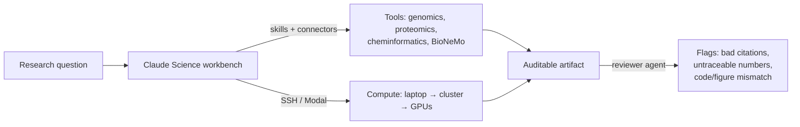

<LevelBadge level="advanced" />

<VerifyNote lastVerified="2026-07-13" source="https://www.anthropic.com/news/claude-science-ai-workbench">
Claude Science est en bêta. Les compétences intégrées, les modèles connectés, les options de calcul et la disponibilité par plan évoluent vite — vérifiez les détails actuels dans l’application et dans l’annonce officielle avant de vous y fier.
</VerifyNote>

<Callout type="objectives" items={["Comprendre ce qu’est Claude Science — et le problème précis qu’il résout, hors de portée d’une fenêtre de chat", "Découvrir ses trois piliers : outils intégrés, artefacts auditables et calcul managé", "Voir comment l’agent réviseur détecte automatiquement les chiffres non traçables et les figures incohérentes", "Savoir quand recourir à Claude Science plutôt qu’à Claude classique ou à Claude Code", "Le situer dans le paysage plus large de l’IA pour la science, sans surestimer ce qu’un modèle peut vérifier"]} />

La plupart des travaux scientifiques menés avec un chatbot généraliste achoppent au même endroit : le modèle raisonne bien, mais les *outils, les données et le calcul* se trouvent ailleurs — un cluster, un notebook, un navigateur de génome, un modèle de repliement. Vous recopiez les résultats à la main dans les deux sens, et personne ne peut ensuite reconstituer exactement comment une figure a été produite. **Claude Science** (bêta, lancé le **30 juin 2026**) est la tentative d’Anthropic de refermer cette faille : un *atelier* IA où le raisonnement, les outils, le calcul et la provenance vivent au même endroit.

C’est une application à part entière — pas un prompt que l’on colle dans un chat. Voyez-la comme [Claude Code](/docs/claude-code/what-is-claude-code) orienté vers les workflows de paillasse et de biologie computationnelle plutôt que vers des dépôts logiciels.

## Le problème visé

Un chercheur qui fait tourner, disons, un pipeline d’ARN sur cellule unique jongle avec : une source de données, un outil de contrôle qualité, une bibliothèque de tracés, un modèle de repliement sur GPU et un gestionnaire de citations — plus la charge mentale consistant à se rappeler quelle version de quel script a produit quelle figure il y a trois semaines. Les assistants généralistes aident sur *une* étape et perdent le fil sur le reste.

<Callout type="tip">
L’unité de valeur en science n’est pas une bonne réponse — c’est une réponse **reproductible**. Claude Science est construit autour de cela : ses sorties sont conçues pour qu’un réviseur (humain ou agent) puisse remonter de chaque chiffre au code et à l’environnement qui l’ont produit.
</Callout>

## Les trois piliers

### 1. Outils intégrés — l’environnement est pré-câblé

Claude Science est livré avec **plus de 60 compétences et connecteurs sélectionnés**, préconfigurés pour la génomique, la cellule unique, la protéomique, la biologie structurale et la chémoinformatique. Point crucial : il se connecte nativement aux modèles **NVIDIA BioNeMo** — dont **Evo 2** (modèle de fondation génomique), **Boltz-2** (prédiction de structure/affinité) et **OpenFold3** (repliement des protéines) — de sorte que le repliement ou la prédiction d’affinité devient une étape de votre workflow, et non un portail séparé.

C’est la même machinerie de [compétences et connecteurs](/docs/claude-code/skills) que vous connaissez peut-être de Claude Code, sélectionnée pour une pile scientifique au lieu d’une pile logicielle.

### 2. Artefacts auditables — la provenance par défaut, pas après coup

Chaque sortie porte sa lignée complète :

- le **code et l’environnement exacts** qui l’ont produite,
- une **description en langage clair** de la façon dont elle a été créée, et
- l’**historique complet des messages** qui la sous-tend.

Par-dessus cela, un **agent réviseur** signale automatiquement les **citations incorrectes, les chiffres non traçables et les figures qui ne correspondent pas au code sous-jacent**. Ce dernier point est le garde-fou le moins évident : un graphique d’apparence plausible dont les données ne proviennent pas réellement du code de l’artefact est détecté.

<Callout type="warning">
L’agent réviseur réduit une classe d’erreurs — il ne rend pas les sorties *correctes*. Il signale les citations qu’il ne peut pas vérifier et les chiffres qu’il ne peut pas tracer ; il ne peut se porter garant ni du design expérimental, ni de la validité biologique, ni du fait que la bonne question a été posée. Provenance ≠ vérité. La science reste votre responsabilité.
</Callout>

### 3. Calcul managé — de votre portable à des centaines de GPU

Claude Science **gère le calcul sur votre portable, votre cluster ou des GPU à la demande**, en passant à l’échelle **d’un seul GPU à des centaines selon les besoins**. Il fonctionne avec l’infrastructure existante — clusters HPC via **SSH**, ou comptes **Modal** — de sorte que les travaux lourds s’exécutent là où vos données et vos allocations se trouvent déjà, sans que vous ayez à écrire l’orchestration à la main.

## Visualisation scientifique native

Les résultats s’affichent **dans l’interface**, et non sous forme de fichiers à télécharger puis à ouvrir ailleurs : **structures protéiques 3D, pistes de navigateur de génome et structures chimiques** s’affichent nativement. Vous inspectez un repliement ou un locus là même où vous avez raisonné dessus — l’idée d’[artefact](/docs/claude-app/artifacts), étendue aux objets scientifiques.

## Un workflow type

<Steps items={[{title: "Poser la question", body: "Formulez la question biologique et orientez Claude Science vers votre source de données via un connecteur."}, {title: "Le laisser assembler le pipeline", body: "Il sélectionne les compétences (contrôle qualité, alignement, repliement) et propose des étapes — relisez avant de lancer des calculs lourds."}, {title: "Exécuter là où vivent les données", body: "Déportez l’étape coûteuse sur votre cluster HPC via SSH ou sur des GPU à la demande ; les étapes légères restent en local."}, {title: "Inspecter nativement", body: "Visualisez la structure 3D, la piste génomique ou la structure chimique en ligne, sans exporter au préalable."}, {title: "Livrer un artefact auditable", body: "La sortie regroupe le code, l’environnement, la méthode en langage clair et l’historique des messages — et l’agent réviseur signale tout ce qui n’est pas traçable."}]} />

<PromptCard title="Une première demande concrète dans Claude Science">{`Load the connected single-cell dataset, run standard QC (filter low-count cells and high-mito), and show a UMAP colored by cluster. Keep every step in an auditable artifact I can hand to a reviewer.`}</PromptCard>

<PromptCard title="Envoyer l’étape lourde sur du vrai calcul">{`Predict the structure of this sequence with the connected folding model, run it on my HPC cluster over SSH, and render the 3D structure inline when it finishes.`}</PromptCard>

## Quand l’utiliser (et quand s’abstenir)

| Utilisez Claude Science quand… | Tournez-vous ailleurs quand… |
|---|---|
| Vous avez besoin de résultats scientifiques reproductibles et révisables | Vous voulez une réponse ponctuelle et rapide → [Claude](/docs/claude-app/getting-started) classique |
| Votre travail couvre des outils de génomique / protéomique / chémoinformatique | Vous développez du logiciel → [Claude Code](/docs/claude-code/what-is-claude-code) |
| Les calculs lourds doivent tourner sur votre cluster ou sur des GPU à la demande | Vous n’avez ni connecteurs de données ni calcul à brancher |
| La provenance (code + environnement + historique) compte vraiment pour la revue | Vous êtes sur le plan Free, ou sur Windows (voir disponibilité) |

## Disponibilité et limites

- **Plans :** bêta pour les utilisateurs **Claude Pro, Max, Team et Enterprise**. (Pas de niveau Free.)
- **Plateformes :** **macOS et Linux** — notez qu’il n’y a pas de client Windows au lancement.
- **Statut :** bêta — attendez-vous à ce que la liste des compétences intégrées, les modèles connectés et les options de calcul évoluent.

<Callout type="tip">
Claude Science est propre à Claude, mais le *schéma* est général au secteur : les assistants se dotent de couches d’intégration d’outils, de provenance et de calcul afin d’accomplir un vrai travail, et non seulement de le décrire. Guettez des mouvements « atelier » équivalents chez d’autres laboratoires d’IA — le niveau d’exigence en reproductibilité fixé par Claude Science est un bon étalon pour les juger.
</Callout>

<Flashcards title="Vocabulaire de Claude Science" cards={[{front: "Claude Science", back: "L’atelier IA bêta d’Anthropic pour les scientifiques : outils de recherche intégrés, artefacts auditables, visualisation native et calcul managé dans une seule application."}, {front: "Artefact auditable", back: "Une sortie accompagnée du code exact, de son environnement, d’une méthode en langage clair et de l’historique complet des messages — pour que tout résultat puisse être relié à la façon dont il a été produit."}, {front: "Agent réviseur", back: "Une vérification automatique qui signale les citations incorrectes, les chiffres non traçables et les figures qui ne correspondent pas au code sous-jacent. Il réduit les erreurs ; il ne garantit pas la justesse."}, {front: "BioNeMo", back: "La collection de modèles de fondation en biologie de NVIDIA. Claude Science se connecte nativement à Evo 2, Boltz-2 et OpenFold3."}, {front: "Calcul managé", back: "Claude Science exécute les travaux sur votre portable, votre cluster HPC (via SSH) ou des GPU à la demande (p. ex. Modal), en passant d’un GPU à des centaines."}, {front: "Chémoinformatique", back: "Analyse computationnelle des structures et propriétés chimiques — l’un des domaines pour lesquels Claude Science pré-câble des compétences, aux côtés de la génomique, de la cellule unique, de la protéomique et de la biologie structurale."}]} />

<Quiz title="Testez-vous" questions={[{q: "Quel est l’objectif de conception le plus distinctif de Claude Science par rapport à un chatbot généraliste ?", options: ["Des réponses plus rapides", "La reproductibilité — chaque résultat remonte au code et à l’environnement qui l’ont produit", "Une fenêtre de contexte plus grande"], answer: 1, explain: "Ses sorties sont des artefacts auditables (code + environnement + méthode en langage clair + historique des messages), conçus pour qu’un réviseur puisse tracer chaque chiffre. Cette approche « provenance d’abord » est le différenciateur central."}, {q: "L’agent réviseur signale une figure dont les chiffres ne correspondent pas au code de l’artefact. Qu’a-t-il prouvé ?", options: ["Que la science est fausse", "Que le résultat est correct", "Que la figure n’est pas traçable — un problème de provenance, pas un verdict sur la biologie"], answer: 2, explain: "Le réviseur détecte les chiffres non traçables, les citations erronées et les incohérences code/figure. Il réduit une classe d’erreurs mais ne peut pas confirmer que la science sous-jacente est valide — la provenance n’est pas la vérité."}, {q: "Vous devez replier une protéine sur l’allocation HPC de votre labo depuis l’atelier. Claude Science peut…", options: ["Seulement s’exécuter sur le cloud d’Anthropic", "Exécuter le travail sur votre cluster via SSH (ou sur des GPU à la demande), en passant à l’échelle selon les besoins", "Ne pas faire de calcul du tout"], answer: 1, explain: "Claude Science gère le calcul sur votre portable, votre cluster (via SSH) ou des GPU à la demande (p. ex. Modal), d’un seul GPU à des centaines."}, {q: "Quel utilisateur ne peut pas utiliser Claude Science au lancement ?", options: ["Un utilisateur Max sur macOS", "Un utilisateur Enterprise sur Linux", "Un utilisateur du plan Free sur Windows"], answer: 2, explain: "C’est une bêta pour Pro, Max, Team et Enterprise (pas de niveau Free) et elle est livrée uniquement sur macOS et Linux — un utilisateur Free/Windows est donc exclu à double titre."}]} />

<Callout type="takeaways" items={["Claude Science est une application bêta à part entière — un atelier IA pour les scientifiques, pas un prompt à coller dans un chat.", "Ses trois piliers : des outils pré-câblés (plus de 60 compétences, BioNeMo natif — Evo 2, Boltz-2, OpenFold3), des artefacts auditables et un calcul managé.", "Les artefacts auditables regroupent code + environnement + méthode + historique des messages ; un agent réviseur signale les chiffres non traçables, les citations erronées et les incohérences code/figure.", "Le calcul s’exécute là où vivent vos données : portable, HPC via SSH ou GPU à la demande, en passant d’un GPU à des centaines.", "Bêta pour Pro/Max/Team/Enterprise, sur macOS et Linux uniquement ; la provenance réduit les erreurs mais ne certifie jamais que la science est correcte."]} />

## Sources et lectures complémentaires

- [Claude Science, un atelier IA pour les scientifiques — Anthropic](https://www.anthropic.com/news/claude-science-ai-workbench) — l’annonce de lancement (30 juin 2026) ; source pour les plus de 60 compétences, les connexions BioNeMo, la structure des artefacts auditables, l’agent réviseur, les options de calcul et la disponibilité.
- [NVIDIA BioNeMo](https://www.nvidia.com/en-us/clara/bionemo/) — la plateforme de modèles de fondation en biologie derrière Evo 2, Boltz-2 et OpenFold3.
- [Modal](https://modal.com/) — l’un des back-ends de calcul à la demande que Claude Science peut utiliser.
- À lire aussi sur AILmanac : [Claude Code](/docs/claude-code/what-is-claude-code), [Compétences](/docs/claude-code/skills), [Artefacts](/docs/claude-app/artifacts) et [Agents managés](/docs/api/managed-agents).
