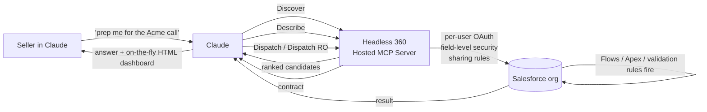

<LevelBadge level="intermediate" />

<VerifyNote lastVerified="2026-09-01" source="https://www.salesforce.com/news/press-releases/2026/08/26/salesforce-and-anthropic-announce-claudeforce/">
Claudeforce a été annoncé le **26 août 2026** ; **Salesforce dans Claude** est aujourd'hui en **pilote sélectif**, avec une **bêta ouverte prévue pour septembre 2026**. La surface MCP à 4 outils Headless 360 est une API publiée par Salesforce (Bêta, juillet 2026). Le nombre de skills, les tarifs et le périmètre exact des volets Slack/Agentforce bougent chaque semaine — vérifiez dans la documentation Salesforce Developers liée avant d'engager une org.
</VerifyNote>

Le **26 août 2026**, Salesforce et Anthropic ont co-annoncé **Claudeforce**, un partenariat en quatre volets. La première brique livrée est **Salesforce dans Claude** — un plugin qui permet à une conversation Claude de raisonner sur des données CRM en direct et d'agir de façon gouvernée, avec **37 skills de vente prêtes à l'emploi** (seules ~8 nommées publiquement au lancement), une bêta ouverte prévue pour septembre 2026 et — c'est la partie que la presse saute — une **surface MCP étonnamment réduite** en dessous.

La plupart des articles ne sont que des communiqués de presse recoupés. Cette page est le guide de terrain pratique : l'architecture qui rend 37 skills possibles à partir de seulement **4 outils MCP**, les **deux modèles d'authentification très différents** livrés avec le plugin, et les **pièges de gouvernance** qui mordront les RevOps s'ils traitent le tout comme une énième extension Chrome.

<Callout type="objectives" items={[
  "Comprendre ce qui sort réellement dans la bêta ouverte de septembre 2026 — les quatre volets de Claudeforce, et lequel est « Salesforce dans Claude »",
  "Voir pourquoi le plugin n'a besoin que de 4 outils MCP (Discover / Describe / Dispatch / Dispatch Read-Only) pour exposer toute la surface de l'API Salesforce",
  "Distinguer les deux routes d'authentification — OAuth par utilisateur (Claude) vs utilisateur d'intégration en client credentials (Slack) — et choisir correctement pour votre org",
  "Classer les 37 skills par niveau d'autorité (lecture seule / recommandation / écriture) avant d'en activer une seule",
  "Éviter les quatre pièges : profils surprovisionnés, effets de bord d'automatisation oubliés, collision avec la mise à niveau Winter '27, et serveurs MCP en shadow IT"
]} />

## Ce que Claudeforce est vraiment (et ne l'est pas)

Claudeforce est un partenariat en quatre volets, pas un produit. Un seul volet — **Salesforce dans Claude** — ouvre en septembre 2026. Confondre les volets, c'est ainsi que les équipes RevOps finissent par cadrer le mauvais pilote.

<Steps items={[
  {title: "Volet 1 — Salesforce dans Claude (bêta ouverte sept. 2026)", body: "Un plugin Salesforce qui tourne À L'INTÉRIEUR de l'application Claude. Les commerciaux restent dans Claude ; Claude atteint leur org via le Hosted MCP de Salesforce. C'est le volet dont traite cette page."},
  {title: "Volet 2 — Claude à l'intérieur des produits Salesforce", body: "La direction inverse : les modèles d'Anthropic disponibles comme citoyens de première classe dans tout Agentforce (Atlas Reasoning Engine, Agentforce Vibes, Agentforce Coworker, Agent Builder). UX différente, surface d'administration différente, calendrier de déploiement différent."},
  {title: "Volet 3 — Claude comme modèle par défaut dans Slack", body: "Les fonctionnalités Slack AI (résumés de huddles, récapitulatifs de canaux, rédaction de messages) commencent à utiliser Claude comme modèle par défaut. Gouverné différemment — voir la route d'authentification Slack plus bas."},
  {title: "Volet 4 — Adoption commerciale croisée", body: "Salesforce devient un gros client d'Anthropic ; Anthropic devient un gros client de Salesforce. Intéressant pour les achats, sans importance pour la configuration technique."}
]} />

Le reste de cette page porte sur le volet 1 : **Salesforce dans Claude**.

## L'architecture à 4 outils qui passe à l'échelle de 37 skills

La seule chose non évidente à propos de Claudeforce, c'est que le plugin n'enregistre **pas** un outil par capacité. Le **[serveur Hosted MCP Headless 360](https://developer.salesforce.com/docs/platform/hosted-mcp-servers/guide/headless-360-mcp.html)** de Salesforce (Bêta, juillet 2026) expose exactement **quatre outils MCP**, et Claude atteint chaque skill en les composant.

<Steps items={[
  {title: "Discover", body: "Recherche sémantique dans un index vectoriel de toutes les API et skills de l'org connectée. Claude transmet son interprétation de votre demande ; Discover renvoie une liste classée d'opérations candidates. C'est la raison pour laquelle « trouve-moi le truc de santé du deal pour ce compte » ne nécessite pas 200 outils pré-enregistrés qui encombrent le contexte."},
  {title: "Describe", body: "Pour un candidat choisi, Describe renvoie le contrat technique : paramètres, dépendances, étapes ordonnées, effets de bord. Claude s'en sert pour vérifier que Discover a fait remonter la bonne chose avant de s'engager à exécuter quoi que ce soit."},
  {title: "Dispatch", body: "Exécute l'opération choisie. Route vers le bon endpoint. Applique les garde-fous d'accès utilisateur avant que l'appel n'atteigne Salesforce. C'est le chemin d'écriture — règles de validation, Flows, triggers Apex et limites du gouverneur CPU se déclenchent normalement en aval de Dispatch."},
  {title: "Dispatch Read-Only", body: "Variante GET uniquement. Même flux de découverte, mêmes contrôles d'accès, mais l'outil est physiquement incapable de muter. C'est le défaut sûr pour un pilote, et l'outil auquel se lient les skills en lecture seule."}
]} />

Deux implications que la plupart des articles de lancement manquent :

- **La surface d'outils reste petite et stable**, mais le **catalogue de skills grandit indépendamment** du côté de Salesforce — Claude n'a pas besoin d'un nouvel enregistrement d'outil pour atteindre une nouvelle skill.
- **La sécurité au niveau des champs, les permissions d'objet et les règles de partage s'appliquent à chaque appel d'outil** — l'application se fait dans l'org, pas dans Claude. Si un utilisateur ne peut pas voir un champ dans l'interface Salesforce, Discover ne le fera pas remonter et Dispatch le refuserait de toute façon.

## Les deux routes d'authentification — et pourquoi la différence compte

Claudeforce est livré avec **deux modèles OAuth** agrafés à un plugin d'apparence identique, et leurs postures de sécurité sont très différentes. Se tromper ici, c'est donner par accident à chaque commercial de l'org les permissions effectives d'un seul utilisateur d'intégration.

<Steps items={[
  {title: "Route A — Salesforce dans Claude (OAuth par utilisateur)", body: "Utilise les External Client Apps Salesforce avec le scope mcp_api. Un seul admin réalise la connexion unique au niveau de l'org ; chaque commercial s'autorise ensuite en son propre nom. Chaque appel d'outil Claude s'exécute en tant que l'individu demandeur, avec SON profil, ses ensembles d'autorisations, ses règles de partage et sa sécurité au niveau des champs. C'est la posture correcte pour tout ce qui est visible par l'utilisateur."},
  {title: "Route B — Claude dans Slack (client credentials)", body: "Utilise le flux OAuth 2.0 client credentials avec un utilisateur d'intégration dédié. Les bundles d'accès partagent UNE seule identité d'agent entre les utilisateurs. Chaque requête s'exécute en tant que ce même utilisateur d'intégration — ce qui signifie que les permissions de cet utilisateur deviennent le plafond effectif pour tout le monde. Pratique, mais la mauvaise forme dès qu'il y a des exigences d'isolation des données par utilisateur."}
]} />

<Callout type="warning" items={[
  "Si vous provisionnez l'utilisateur d'intégration Slack avec un profil sales-ops large pour que « ça marche tout simplement », chaque utilisateur Slack routé par lui hérite de cet accès effectif. Restreignez le profil de l'utilisateur d'intégration au périmètre le plus étroit dont Slack a réellement besoin, puis ajoutez des capacités avec des ensembles d'autorisations — même principe que pour n'importe quel compte de service partagé."
]} />

## Les 37 skills, classées par niveau d'autorité

Salesforce n'a nommé qu'une poignée de skills au lancement ; d'autres arriveront d'ici fin 2026. Ce sur quoi vous pouvez planifier dès maintenant, c'est que chaque skill se range dans un des **trois niveaux d'autorité**, et que l'interface les fait paraître identiques. C'est à vous de classer.

| Skill nommée (août 2026) | Niveau d'autorité | Route Dispatch approximative |
| --- | --- | --- |
| Briefing quotidien | Lecture seule | Dispatch RO |
| Revue de pipeline | Lecture seule | Dispatch RO |
| Récit de prévisions | Lecture seule | Dispatch RO |
| Préparation de réunion | Lecture seule | Dispatch RO |
| Revue de santé du deal | Lecture seule | Dispatch RO |
| Analyse gagné/perdu | Lecture seule | Dispatch RO |
| Hygiène Salesforce | Recommandation | Dispatch RO → brouillons |
| Journalisation d'activité | Écriture | Dispatch (POST/PATCH) |

Les ~29 skills restantes ne sont pas publiées au lancement ; le même tri s'applique à mesure qu'elles arrivent :

<Steps items={[
  {title: "Lecture seule (Dispatch RO uniquement)", body: "Analyse, résume, récupère. Ne peut pas muter. Activez librement pour la cohorte pilote. Le mode de défaillance est « mauvaise réponse », pas « mauvaise écriture »."},
  {title: "Recommandation (Dispatch RO + brouillons)", body: "Analyse ET propose des changements, mais laisse la mutation réelle sous forme de brouillon pour un humain. Activez après que le palier lecture seule se comporte bien. Le mode de défaillance est un mauvais brouillon qu'un commercial pourrait approuver sans le lire — mesurez le taux de correction, pas seulement la vitesse."},
  {title: "Écriture (Dispatch POST/PATCH/DELETE)", body: "Mute directement les données CRM. Chaque écriture passe par les règles de validation, les Flows, les triggers Apex et les limites du gouverneur CPU de l'org, EXACTEMENT comme si un humain avait cliqué sur Enregistrer. Activez en dernier, skill par skill, avec un cadrage de profil par utilisateur, et seulement après avoir mesuré la précision du palier recommandation pendant au moins 4 semaines."}
]} />

## Mettre en place un pilote — la checklist RevOps

<Steps items={[
  {title: "1. Auditez les profils que vous êtes sur le point d'exposer", body: "Tout profil surprovisionné qui était inoffensif derrière une interface lente devient réellement risqué derrière un agent rapide. Avant de piloter, faites un audit des permissions des utilisateurs que vous allez inviter : quels objets, quels champs, quel partage par type d'enregistrement. Le plugin appliquera fidèlement ce que disent ces profils — y compris tout surprovisionnement historique que personne n'avait remarqué."},
  {title: "2. Rattachez les utilisateurs pilotes à un ensemble d'autorisations verrouillé", body: "Créez un ensemble d'autorisations Pilote Claudeforce : objets spécifiques, champs spécifiques, lecture seule pour commencer. Attribuez-le en plus de leur profil normal afin de pouvoir le retirer proprement à la fin du pilote sans toucher à l'accès de base."},
  {title: "3. Commencez par Dispatch Read-Only partout", body: "N'activez que les skills en lecture seule pour les deux premiers sprints. Cela vous permet de mesurer la précision sans surface de rollback. Surveillez les noms de champs hallucinés ou les mauvaises recherches d'enregistrements — ce sont les modes de défaillance qui survivent jusqu'au palier écriture."},
  {title: "4. Choisissez TROIS workflows couvrant les trois niveaux d'autorité pour le pilote du palier écriture", body: "Un en lecture seule, un en recommandation, un en écriture. Des profils de risque différents révèlent des lacunes de gouvernance différentes, et un pilote par palier coûte moins cher qu'un pilote par skill."},
  {title: "5. Versionnez votre base d'API", body: "Salesforce dans Claude exige l'API v67.0+ ; Winter '27 introduit la v68.0. Si votre org se met à niveau automatiquement vers Winter '27 pendant la fenêtre de bêta (sept.–oct. 2026), verrouillez explicitement la version d'API du plugin pour qu'une mise à niveau de plateforme ne change pas la sémantique en plein pilote."},
  {title: "6. Interdisez les connexions MCP détenues par les équipes pendant la bêta", body: "Si des équipes individuelles montent leurs propres Hosted MCP Servers pour « aller plus vite », vous avez réinventé le shadow IT avec un plus joli emballage. Centralisez la gouvernance MCP chez les mêmes admins qui possèdent les applications connectées et les profils."}
]} />

<PromptCard title="Modèle de prompt commercial : briefing pipeline du lundi sans risque (palier lecture seule)">{`You are preparing my Monday pipeline briefing from Salesforce.

Every Monday at 07:00 local:

1. Use the "Pipeline review" skill on my named accounts (owner = me,
   stage != Closed Lost, close date in current quarter).
2. Use the "Deal-health review" skill on the top 10 by amount.
3. Use the "Meeting preparation" skill for accounts I have a meeting
   with in the next 5 business days.

Constraints (do NOT violate):
- Read-only pass only. If any skill proposes a write (update stage,
  log activity, change amount) STOP and surface it as a draft in
  the output — do NOT dispatch it.
- Do not log activities on my behalf. Do not update fields.
- If a skill returns a field you cannot see under my profile, do
  not guess the value — flag it as "hidden by permissions".

Produce a single briefing:
- 3-bullet TL;DR
- "Pipeline movement since last Monday" (opportunity-level, cite
  the Salesforce record IDs)
- "Deals I should touch this week" (with why, from deal-health)
- "Meetings this week" (with prep pack from meeting-preparation)
- "Proposed writes (NOT DISPATCHED)" — every draft change the agent
  wanted to make, so I can review in one place.`}</PromptCard>

Deux choses que ce prompt fait et que la plupart des articles « copiez ce modèle » ne font pas :

- Il **épingle le pilote en lecture seule** avec un invariant explicite « si la skill propose une écriture, STOP ». Dans une session Claude planifiée ou de longue durée, vous ne pouvez pas répondre à un « vous êtes sûr ? » de relance — les invariants doivent vivre dans le prompt.
- Il demande au modèle de **faire remonter au même endroit chaque écriture qu'il voulait faire**, afin que vous puissiez mesurer la précision au palier recommandation d'une skill avant de la promouvoir au palier écriture. C'est la façon la moins chère de mériter la promotion.

## Les quatre pièges qui vous mordront

<Steps items={[
  {title: "1. Les profils surprovisionnés deviennent un rayon d'explosion bien réel", body: "Le même ensemble d'autorisations qui passait à peu près bien derrière une interface est réellement dangereux derrière un agent capable de Dispatch 30 écritures/minute. Correctif : audit des profils AVANT le pilote, pas après."},
  {title: "2. Les effets de bord d'automatisation se déclenchent à chaque écriture Dispatch", body: "Dispatch PATCH est une écriture Salesforce normale. Chaque règle de validation, Flow, Process Builder, trigger Apex et limite du gouverneur de temps CPU se déclenche exactement comme lors d'un clic humain. Une skill bien intentionnée qui tourne en boucle peut faire sauter les limites CPU ou déclencher en cascade des e-mails pilotés par un Flow. Correctif : instrumentez votre automatisation sur l'org pilote avant d'activer les skills du palier écriture."},
  {title: "3. Winter '27 arrive pendant la bêta ouverte", body: "Les mises à niveau de production Winter '27 (sept.–oct. 2026) entrent en collision avec la bêta ouverte de Claudeforce. Si une skill casse au milieu de la fenêtre, vous déboguerez DEUX changements de plateforme simultanés. Correctif : épinglez la version d'API du plugin, et planifiez la mise à niveau Winter '27 de la cohorte pilote EN DEHORS de la fenêtre de bêta si vous pouvez."},
  {title: "4. Route Slack ≠ route Claude", body: "Parce que Slack utilise client credentials avec un utilisateur d'intégration, donner « l'accès Slack à Claudeforce » n'a pas la même forme de gouvernance que donner le plugin à des utilisateurs individuels dans Claude. Traitez-les comme deux déploiements distincts avec deux pistes d'audit distinctes."}
]} />

## Où se situe Claudeforce par rapport à Agentforce

Salesforce livre **Agentforce** depuis 2024 et Claude est L'UN de ses modèles de fondation depuis fin 2025. Claudeforce ne remplace pas Agentforce — il ajoute une **nouvelle surface** (l'application Claude) et **formalise** Claude sur quatre couches d'Agentforce (Atlas Reasoning Engine, Agentforce Vibes, Agentforce Coworker, Agent Builder). L'optionalité de modèle reste : Agent Builder propose toujours Amazon Nova aux côtés de Claude.

Table de décision approximative pour les équipes qui hésitent entre les deux :

| Vous voulez... | Optez pour |
| --- | --- |
| Donner aux commerciaux une interface de chat qui raisonne sur le CRM en direct | Salesforce dans Claude (le plugin) |
| Intégrer des fonctionnalités d'IA DANS votre interface Salesforce (enregistrements, vues de liste, boutons) | Agentforce |
| Construire un agent personnalisé avec outils, mémoire, politiques d'escalade | Agent Builder (dans Salesforce) |
| Automatiser de bout en bout du travail CRM back-office répétable | Agentforce Coworker |
| Utiliser Claude pour écrire du code Salesforce (Apex, LWC) | Agentforce Vibes |

Si plus d'une ligne s'applique, le mauvais choix est d'en prendre une et de la forcer — Claudeforce est conçu pour que le plugin, Agentforce et Agent Builder soient complémentaires, et les utilisateurs peuvent circuler entre eux au sein de la même org.

## Quand NE PAS utiliser Salesforce dans Claude

- **Vous avez besoin d'une intégration machine-à-machine.** Le plugin est une surface de chat avec humain dans la boucle. Pour des écritures CRM non surveillées à l'échelle, câblez le [serveur MCP Headless 360](https://developer.salesforce.com/docs/platform/hosted-mcp-servers/guide/headless-360-mcp.html) directement dans les [Managed Agents](/docs/api/managed-agents), sans l'application Claude au milieu.
- **Vous livrez déjà une expérience Agentforce que vos commerciaux connaissent.** Ajouter une deuxième surface fragmente votre formation et double le travail de gouvernance. Choisissez celle dans laquelle votre équipe vit.
- **Vous n'avez aucun admin Salesforce pour gouverner tout ça.** Le plugin rend l'org plus puissante et plus accessible — c'est une mauvaise combinaison sans quelqu'un qui possède les profils, les ensembles d'autorisations et les connexions MCP.
- **Votre posture de conformité interdit l'inférence sur les données clients.** Même si le plugin route l'inférence via Amazon Bedrock à l'intérieur du Salesforce Trust Boundary, le contenu des prompts et les données renvoyées quittent tout de même la couche de stockage. Lisez votre DPA avant de piloter.

## Quiz

<Quiz questions={[
  {q: "Combien d'outils MCP le serveur Headless 360 expose-t-il à Claude, quel que soit le nombre de « skills » présentes au catalogue ?", options: ["37 — un par skill prête à l'emploi", "Des centaines — un par opération de l'API Salesforce", "4 — Discover, Describe, Dispatch, Dispatch Read-Only", "1 — un outil « salesforce » générique"], answer: 2, explain: "Salesforce garde délibérément la surface MCP minuscule et stable à quatre outils (Discover / Describe / Dispatch / Dispatch RO). Les nouvelles skills arrivent dans le catalogue derrière ces quatre outils ; le modèle n'a pas besoin d'un nouvel enregistrement d'outil pour chacune. C'est ce qui permet au même plugin de passer de 37 skills au lancement à des centaines plus tard sans polluer la fenêtre de contexte de Claude."},
  {q: "Vous donnez à un commercial un ensemble d'autorisations avec accès en modification sur Opportunity.Amount et vous activez une skill du palier écriture. Le commercial demande à Claude d'augmenter trois opportunités de 10 %. Que se déclenche du côté de l'org ?", options: ["Seulement l'UPDATE brut — Claude contourne l'automatisation de l'org pour la vitesse", "L'UPDATE plus toutes les règles de validation, les Flows et les triggers Apex sur Opportunity, exactement comme un clic dans l'interface", "Rien — les écritures sont mises en file et appliquées dans un batch nocturne", "L'automatisation est désactivée par défaut quand l'appelant est un agent"], answer: 1, explain: "Dispatch PATCH est une écriture Salesforce normale. Les règles de validation, les Flows, Process Builder, les triggers Apex et les limites du gouverneur CPU se déclenchent tous. C'est pourquoi « auditer l'automatisation » figure sur la checklist de pré-pilote — un agent qui fait 30 écritures/minute peut discrètement faire sauter une limite du gouverneur ou déclencher en cascade un e-mail piloté par un Flow auquel vous ne vous attendiez pas."},
  {q: "Votre directeur financier demande « l'intégration Claude dans Slack est-elle gouvernée de la même façon que Salesforce dans Claude ? » Quelle est la bonne réponse ?", options: ["Oui — même OAuth, même application par utilisateur", "Non — Slack utilise client credentials avec un utilisateur d'intégration, donc chaque requête s'exécute en tant que cet unique utilisateur, pas par commercial", "Oui — les deux passent par le Salesforce Trust Boundary donc cela n'a pas d'importance", "Non — Slack n'a pas d'authentification, c'est en lecture seule"], answer: 1, explain: "Salesforce dans Claude utilise OAuth par utilisateur via les External Client Apps (scope mcp_api) — chaque appel s'exécute en tant que l'individu demandeur. La route Slack utilise OAuth 2.0 client credentials avec un utilisateur d'intégration dédié, donc chaque requête via Slack s'exécute en tant que cet utilisateur d'intégration. C'est une forme de gouvernance différente qui nécessite un déploiement et une piste d'audit séparés."},
  {q: "Vous planifiez votre pilote Claudeforce pour début octobre 2026. Quel est le risque de calendrier plateforme spécifique à anticiper ?", options: ["Une échéance ferme à laquelle le pilote doit s'arrêter", "Les mises à niveau de production Winter '27 arrivent entre sept. et oct. 2026, pouvant changer la sémantique de l'API en plein pilote", "Anthropic qui arrête Claude Opus 4.8", "Un changement de tarif sur Sonnet 5 effectif au 1er septembre"], answer: 1, explain: "Les mises à niveau Winter '27 (sept.–oct. 2026) entrent en collision avec la fenêtre de bêta ouverte. Épinglez explicitement la version d'API du plugin et, si vous pouvez, planifiez la mise à niveau Winter '27 de la cohorte pilote en dehors de la fenêtre de bêta — sinon une skill cassée aura deux causes racines possibles à désambiguïser. (Le changement de prix de Sonnet 5 au 1er septembre a été ANNULÉ ; 2 $/10 $ est désormais permanent.)"}
]} />

## Sources et lectures complémentaires

- Salesforce — [Salesforce et Anthropic annoncent Claudeforce](https://www.salesforce.com/news/press-releases/2026/08/26/salesforce-and-anthropic-announce-claudeforce/) (communiqué de presse de lancement, 26 août 2026)
- Salesforce Developers — [Headless 360 (Bêta) — référence des Hosted MCP Servers](https://developer.salesforce.com/docs/platform/hosted-mcp-servers/guide/headless-360-mcp.html) (architecture canonique à 4 outils)
- Salesforce Developers — [Référence des Standard Servers](https://developer.salesforce.com/docs/platform/hosted-mcp-servers/guide/servers-reference.html) (authentification par utilisateur, application de la sécurité au niveau des champs)
- Blog Salesforce Developers — [Annonce de la bêta du serveur MCP Headless 360](https://developer.salesforce.com/blogs/2026/07/announcing-the-headless-360-mcp-server-beta) (lancement de l'architecture, juillet 2026)
- Anthropic — [Tarification permanente de Claude Sonnet 5](https://www.anthropic.com/news/claude-sonnet-5) (10 août 2026, 2 $/10 $ confirmés comme permanents — la hausse du 1er septembre a été annulée)
- À lire aussi sur AILmanac : [Connecteurs (MCP) dans les applications](/docs/claude-app/connectors) · [Tâches planifiées Cowork](/docs/claude-app/cowork-scheduled-tasks) · [Standard ouvert Skill.md](/docs/models/skill-md-open-standard) · [Managed Agents](/docs/api/managed-agents) · [Restrictions de domaine des Managed Agents](/docs/api/managed-agents-domain-restrictions) · [Sécuriser les serveurs MCP](/docs/security/securing-mcp-servers) · [Empoisonnement d'outils MCP et rug pulls](/docs/security/mcp-tool-poisoning-and-rug-pulls)

## Suite

- [Connecteurs (MCP) dans les applications](/docs/claude-app/connectors) — le concept général que ce plugin spécialise
- [Sécuriser les serveurs MCP](/docs/security/securing-mcp-servers) — les patterns de sécurité à appliquer avant d'ouvrir le pilote
- [Managed Agents](/docs/api/managed-agents) — l'alternative côté API quand vous voulez tout ceci sans l'application Claude dans la boucle
