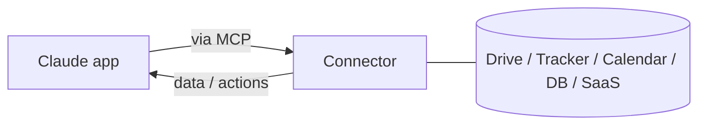

<LevelBadge level="intermediate" />

<VerifyNote lastVerified="2026-06-20" source="https://docs.anthropic.com">
Les connecteurs disponibles, ainsi que leur disponibilité selon la formule, changent fréquemment — confirmez les options actuelles dans l'application ou le centre d'aide.
</VerifyNote>

Les **connecteurs** permettent aux applications Claude d'aller **au-delà de la conversation** — vers vos outils et vos données (espaces de stockage, suivis de tickets, agendas, bases de données, et plus encore) — afin que Claude puisse répondre à partir de systèmes réels, et agir sur eux. En coulisses, ils reposent sur le protocole ouvert **[Model Context Protocol (MCP)](/docs/claude-code/mcp)**.

## Ce qu'ils font

Sans connecteurs, Claude ne connaît que ce qui figure dans la conversation. Avec un connecteur, il peut (avec votre permission) extraire des informations pertinentes d'un service connecté — par exemple trouver un document, lire des tickets récents, consulter un agenda — et les utiliser dans sa réponse.

## Le même standard, partout

Les connecteurs sont la forme **orientée application** de MCP. Le même protocole alimente [MCP dans Claude Code](/docs/claude-code/mcp) et [sur l'API](/docs/api/mcp). Apprenez le concept une fois ; il s'applique à toutes les surfaces.

## Configurer et utiliser

1. **Connectez** le service (autorisez via OAuth, lorsque c'est pris en charge).
2. **Accordez le moindre privilège** — uniquement l'accès dont la tâche a besoin.
3. **Demandez naturellement** — « trouve mon document de planification du T3 et résume-en les risques ».

## Sécurité

:::warning Un connecteur, c'est un accès + (parfois) des actions
- N'autorisez que les services et les portées auxquels vous faites confiance.
- Le contenu extrait de sources externes peut véhiculer une [injection de prompt](/docs/security/prompt-injection) — soyez prudent lorsqu'un connecteur lit du contenu non fiable.
- Examinez ce qu'un connecteur tiers peut faire avant de l'activer ([Examiner le code tiers](/docs/security/reviewing-third-party-code)).
:::

## Suite

- [Serveurs MCP dans Claude Code](/docs/claude-code/mcp)
- [MCP et connexion aux outils (API)](/docs/api/mcp)
- [L'IA dans vos outils existants](/docs/claude-app/ai-in-your-tools)
