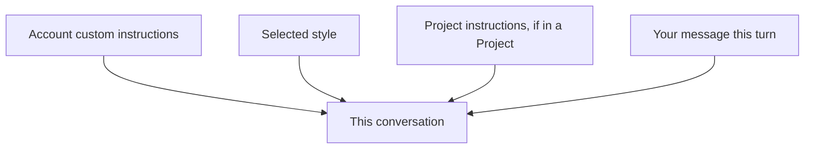

<LevelBadge level="beginner" />

<VerifyNote lastVerified="2026-06-20" source="https://www.anthropic.com">
Les noms et emplacements exacts des instructions personnalisées et des styles dans les applications Claude changent — confirmez dans l'application ou le centre d'aide.
</VerifyNote>

Fatigué de répéter « sois concis » ou « je suis infirmier, explique en conséquence » à chaque conversation ? Les **instructions personnalisées** et les **styles** vous permettent de définir vos préférences par défaut une seule fois et de les appliquer partout.

## Les instructions personnalisées = votre prompt système personnel

Définissez des faits permanents et des préférences — qui vous êtes, ce que vous faites, comment vous aimez les réponses — et Claude les applique à toutes vos conversations. C'est la version grand public d'un [prompt système](/docs/foundations/roles) (et le cousin de [CLAUDE.md](/docs/claude-code/claude-md) pour les développeurs).

Bonnes choses à inclure :
- **Du contexte sur vous** (« je gère une petite boulangerie » ; « je code en Python »).
- **Des préférences de sortie** (« privilégie par défaut des réponses en puces courtes » ; « montre toujours ton raisonnement »).
- **Des règles strictes** (« n'utilise jamais d'emoji » ; « unités métriques »).

## Les styles = des préréglages de présentation

Les **styles** modifient le ton / le format (concis, formel, explicatif, etc.) et peuvent être changés pour chaque conversation. Utilisez un style lorsque vous voulez une *voix différente pour cette conversation* sans réécrire vos instructions permanentes.

## Comment ils se cumulent

En cas de conflit, le contexte le plus spécifique / le plus récent l'emporte généralement — ainsi, les instructions d'un [Projet](/docs/claude-app/projects) ou une demande explicite dans votre message peuvent remplacer vos préférences globales par défaut. Gardez-les cohérentes pour éviter les surprises.

## Conseils

- **Gardez les instructions courtes et justes** — comme pour CLAUDE.md, le superflu et les règles obsolètes nuisent.
- **Ne mettez pas de secrets** dans les instructions personnalisées.
- **Revoyez-les** de temps en temps, à mesure que vos besoins évoluent.

## Suite

- [Rôles système, utilisateur et assistant](/docs/foundations/roles)
- [Projets : des espaces de travail persistants](/docs/claude-app/projects)
- [CLAUDE.md et fichiers de mémoire](/docs/claude-code/claude-md)
