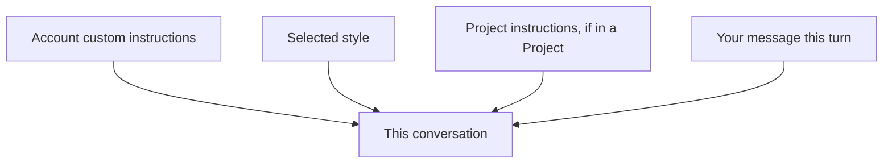

<LevelBadge level="beginner" />

<Callout type="objectives" items={[
  "Distinguer les instructions personnalisées des styles — et savoir lequel utiliser",
  "Rédiger en trois lignes un premier jeu d'instructions permanentes qui vaille la peine d'être conservé",
  "Comprendre l'ordre de cumul lorsque quatre couches d'instructions se contredisent",
  "Éviter les deux erreurs qui rendent des instructions permanentes pires que pas d'instructions du tout",
]} />

<VerifyNote lastVerified="2026-08-02" source="https://www.anthropic.com">
Les noms et emplacements exacts des instructions personnalisées et des styles dans les applications Claude changent — confirmez dans l'application ou le centre d'aide.
</VerifyNote>

Fatigué de répéter « sois concis » ou « je suis infirmier, explique en conséquence » à chaque conversation ? Les **instructions personnalisées** et les **styles** vous permettent de définir vos préférences par défaut une seule fois et de les appliquer partout.

## Les instructions personnalisées = votre prompt système personnel

Définissez des faits permanents et des préférences — qui vous êtes, ce que vous faites, comment vous aimez les réponses — et Claude les applique à toutes vos conversations. C'est la version grand public d'un [prompt système](/docs/foundations/roles) (et le cousin de [CLAUDE.md](/docs/claude-code/claude-md) pour les développeurs).

Bonnes choses à inclure :
- **Du contexte sur vous** (« je gère une petite boulangerie » ; « je code en Python »).
- **Des préférences de sortie** (« privilégie par défaut des réponses en puces courtes » ; « montre toujours ton raisonnement »).
- **Des règles strictes** (« n'utilise jamais d'emoji » ; « unités métriques »).

<Steps items={[
  {title: "Écrivez l'unique phrase sur vous que vous retapez sans cesse", body: "Votre rôle, votre domaine et tout ce qui change la bonne réponse — « je suis infirmier de secteur au Royaume-Uni » ou « j'écris des services en Python 3.12 »."},
  {title: "Ajoutez votre format de sortie par défaut", body: "Une ligne : puces courtes, pas de préambule, unités métriques. C'est la partie qui rapporte à chaque tour de conversation."},
  {title: "Ajoutez au maximum deux règles strictes", body: "Des règles que vous feriez appliquer à chaque fois, comme « n'utilise jamais d'emoji ». Un long règlement est plus difficile à respecter pour Claude qu'un règlement court."},
  {title: "Arrêtez-vous là et utilisez-le pendant une semaine", body: "N'ajoutez une règle que lorsque vous vous surprenez à taper deux fois la même correction. Des instructions dont vous ne vous souvenez pas sont des instructions que vous ne pouvez pas déboguer."},
]} />

<PromptCard title="Un jeu de départ d'instructions personnalisées">{`I'm a district nurse in the UK. I read fast and act on summaries.

Default to short bullet answers with no preamble. Metric units. Flag anything
that is clinical guidance I should confirm against current NHS sources.

Never use emoji.`}</PromptCard>

## Les styles = des préréglages de présentation

Les **styles** modifient le ton / le format (concis, formel, explicatif, etc.) et peuvent être changés pour chaque conversation. Utilisez un style lorsque vous voulez une *voix différente pour cette conversation* sans réécrire vos instructions permanentes.

## Comment ils se cumulent

```mermaid
flowchart TD
  A[Account custom instructions] --> C[This conversation]
  B[Selected style] --> C
  D[Project instructions, if in a Project] --> C
  E[Your message this turn] --> C
```

En cas de conflit, le contexte le plus spécifique / le plus récent l'emporte généralement — ainsi, les instructions d'un [Projet](/docs/claude-app/projects) ou une demande explicite dans votre message peuvent remplacer vos préférences globales par défaut. Gardez-les cohérentes pour éviter les surprises.

## Conseils

- **Gardez les instructions courtes et justes** — comme pour CLAUDE.md, le superflu et les règles obsolètes nuisent.
- **Ne mettez pas de secrets** dans les instructions personnalisées.
- **Revoyez-les** de temps en temps, à mesure que vos besoins évoluent.

<Flashcards title="Quatre couches, quatre rôles" cards={[
  {front: "Instructions personnalisées", back: "Des faits permanents et des préférences valables pour tout le compte. S'appliquent à chaque conversation. L'équivalent grand public d'un prompt système."},
  {front: "Styles", back: "Des préréglages de présentation — ton et format — que l'on peut changer pour chaque conversation. À utiliser lorsque vous voulez une voix différente pour cette conversation seulement."},
  {front: "Instructions de Projet", back: "Des instructions limitées à un seul espace de travail Projet, aux côtés de ses fichiers. Plus spécifiques que les préférences par défaut de votre compte, elles tendent donc à l'emporter."},
  {front: "CLAUDE.md", back: "Le cousin côté développeur : un fichier d'instructions de projet permanentes que Claude Code lit. Même discipline — court, juste, tenu à jour."},
  {front: "La règle de cumul", back: "Le contexte le plus spécifique ou le plus récent tend à l'emporter en cas de conflit. Gardez les couches cohérentes pour ne jamais avoir à deviner laquelle s'est appliquée."},
]} />

<Quiz title="Vérifiez vos acquis" questions={[
  {q: "Vous voulez un ton formel pour une seule conversation, sans toucher à vos préférences par défaut. Qu'utilisez-vous ?", options: ["Les instructions personnalisées", "Un style", "Les instructions de Projet", "CLAUDE.md"], answer: 1, explain: "Les styles modifient le ton et le format et peuvent être changés pour chaque conversation — exactement le cas d'une voix différente dans une seule conversation."},
  {q: "Les instructions de votre compte disent « utilise toujours des puces », mais les instructions d'un Projet demandent de la prose. Que se passe-t-il généralement dans ce Projet ?", options: ["Les instructions du compte l'emportent parce qu'elles sont globales", "Les instructions du Projet tendent à l'emporter parce qu'elles sont plus spécifiques", "Claude refuse et vous demande de choisir", "Les deux sont ignorées"], answer: 1, explain: "Le contexte le plus spécifique ou le plus récent tend à l'emporter : les instructions d'un Projet peuvent donc remplacer vos préférences globales par défaut — raison pour laquelle il importe de garder les couches cohérentes."},
  {q: "Lequel de ces éléments n'a PAS sa place dans les instructions personnalisées ?", options: ["Votre rôle et votre domaine", "Votre format de sortie par défaut", "Une clé d'API que vous réutilisez souvent", "Une règle stricte comme « unités métriques »"], answer: 2, explain: "Ne mettez pas de secrets dans les instructions personnalisées — ils voyagent avec chaque conversation."},
]} />

<Callout type="takeaways" items={[
  "Les instructions personnalisées sont des préférences permanentes par défaut ; les styles sont une voix propre à une conversation. Choisissez le plus restreint des deux.",
  "Trois lignes — qui vous êtes, votre format de sortie par défaut, une ou deux règles strictes — valent mieux qu'un long règlement.",
  "Quatre couches alimentent chaque conversation : les instructions du compte, le style, les instructions de Projet et votre message de ce tour.",
  "Le contexte le plus spécifique ou le plus récent tend à l'emporter en cas de conflit : gardez donc les couches cohérentes.",
  "Ne mettez jamais de secrets dans des instructions permanentes, et élaguez les règles obsolètes à mesure que vos besoins évoluent.",
]} />

## Suite

- [Rôles système, utilisateur et assistant](/docs/foundations/roles)
- [Projets : des espaces de travail persistants](/docs/claude-app/projects)
- [CLAUDE.md et fichiers de mémoire](/docs/claude-code/claude-md)
